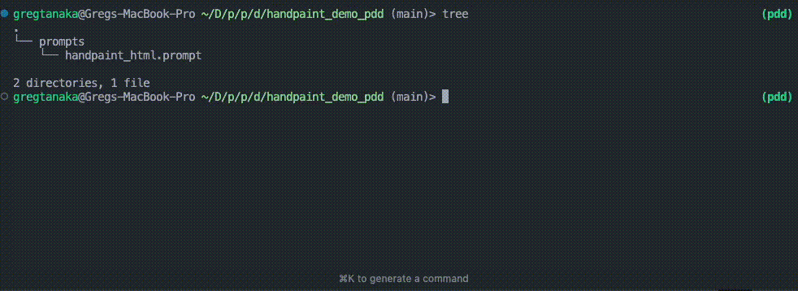
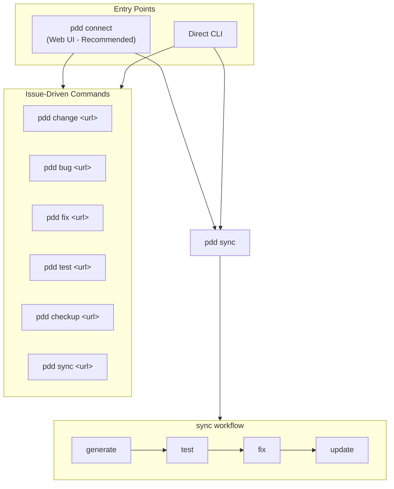

# PDD (Prompt-Driven Development) Command Line Interface

 [](https://discord.gg/Yp4RTh8bG7)

## Introduction

PDD (Prompt-Driven Development) is a toolkit for AI-powered code generation and maintenance.

**Getting started is simple:**

```bash
# Install and run
uv tool install pdd-cli
pdd setup
pdd connect
```

This launches a web interface at `localhost:9876` where you can:
- Implement GitHub issues automatically
- Generate and test code from prompts
- Manage your PDD projects visually

<p align="center">
  
</p>

For CLI users, PDD also offers powerful **agentic commands** that implement GitHub issues automatically:
- `pdd change <issue-url>` - Implement feature requests (12-step workflow)
- `pdd bug <issue-url>` - Create failing tests for bugs
- `pdd fix <issue-url>` - Fix the failing tests
- `pdd generate <issue-url>` - Generate architecture.json from a PRD issue (11-step workflow)
- `pdd test <issue-url>` - Generate UI tests from issue descriptions (9-step workflow)

For prompt-based workflows, the **`sync`** command automates the complete development cycle with intelligent decision-making, real-time visual feedback, and sophisticated state management.

## Whitepaper

For a detailed explanation of the concepts, architecture, and benefits of Prompt-Driven Development, please refer to our full whitepaper. This document provides an in-depth look at the PDD philosophy, its advantages over traditional development, and includes benchmarks and case studies.

[Read the Full Whitepaper with Benchmarks](docs/whitepaper_with_benchmarks/whitepaper_w_benchmarks.md)

Also see the Prompt‑Driven Development Doctrine for core principles and practices: [docs/prompt-driven-development-doctrine.md](docs/prompt-driven-development-doctrine.md)

## Installation

### Prerequisites for macOS

On macOS, you'll need to install some prerequisites before installing PDD:

1. **Install Xcode Command Line Tools** (required for Python compilation):
   ```bash
   xcode-select --install
   ```

2. **Install Homebrew** (recommended package manager for macOS):
   ```bash
   /bin/bash -c "$(curl -fsSL https://raw.githubusercontent.com/Homebrew/install/HEAD/install.sh)"
   ```
   
   After installation, add Homebrew to your PATH:
   ```bash
   echo 'eval "$(/opt/homebrew/bin/brew shellenv)"' >> ~/.zprofile && eval "$(/opt/homebrew/bin/brew shellenv)"
   ```

3. **Install Python** (if not already installed):
   ```bash
   # Check if Python is installed
   python3 --version
   
   # If Python is not found, install it via Homebrew
   brew install python
   ```
   
   **Note**: Recent versions of macOS no longer ship with Python pre-installed. PDD requires Python 3.8 or higher. The `brew install python` command installs the latest Python 3 version.

### Recommended Method: uv

We recommend installing PDD using the [uv package manager](https://github.com/astral-sh/uv) for better dependency management and automatic environment configuration:

```bash
# Install uv if you haven't already 
curl -LsSf https://astral.sh/uv/install.sh | sh

# Install PDD using uv tool install
uv tool install pdd-cli
```

This installation method ensures:
- Faster installations with optimized dependency resolution
- Automatic environment setup without manual configuration
- Proper handling of the PDD_PATH environment variable
- Better isolation from other Python packages

The PDD CLI will be available immediately after installation without requiring any additional environment configuration.

Verify installation:
```bash
pdd --version
```

With the CLI on your `PATH`, continue with:
```bash
pdd setup
```
The command detects agentic CLI tools, scans for API keys, configures models, and seeds local configuration files.
If you postpone this step, the CLI detects the missing setup artifacts the first time you run another command and shows a reminder banner so you can complete it later (the banner is suppressed once `~/.pdd/api-env` exists or when your project already provides credentials via `.env` or `.pdd/`).

### Alternative: pip Installation

If you prefer using pip, you can install PDD with:
```bash
pip install pdd-cli
```


## Advanced Installation Options

### Virtual Environment Installation
```bash
# Create virtual environment
python -m venv pdd-env

# Activate environment
# On Windows:
pdd-env\Scripts\activate
# On Unix/MacOS:
source pdd-env/bin/activate

# Install PDD
pip install pdd-cli
```


## Getting Started

### Option 1: Web Interface (Recommended)

The easiest way to use PDD is through the web interface:

```bash
# 1. Install PDD
curl -LsSf https://astral.sh/uv/install.sh | sh
uv tool install pdd-cli

# 2. Run setup (API keys, shell completion)
pdd setup

# 3. Launch the web interface
pdd connect
```

This opens a browser-based interface where you can:
- **Run Commands**: Execute `pdd change`, `pdd bug`, `pdd fix`, `pdd sync` etc. visually
- **Browse Files**: View and edit prompts, code, and tests in your project
- **Remote Access**: Access your session from any browser via PDD Cloud (use `--local-only` to disable)

### Option 2: Issue-Driven CLI

For CLI enthusiasts, implement GitHub issues directly:

**Prerequisites:**
1. **GitHub CLI** - Required for issue access:
   ```bash
   brew install gh && gh auth login
   ```

2. **One Agentic CLI** - Required to run the workflows (install at least one):
   - **Claude Code**: `npm install -g @anthropic-ai/claude-code` (requires `ANTHROPIC_API_KEY`)
   - **Gemini CLI**: `npm install -g @google/gemini-cli` (requires `GOOGLE_API_KEY` or `GEMINI_API_KEY`)
   - **Codex CLI**: `npm install -g @openai/codex` (requires `OPENAI_API_KEY`)

**Usage:**
```bash
# Implement a feature request
pdd change https://github.com/owner/repo/issues/123

# Or fix a bug
pdd bug https://github.com/owner/repo/issues/456
pdd fix https://github.com/owner/repo/issues/456
```

### Option 3: Manual Prompt Workflow

For learning PDD fundamentals or working with existing prompt files:

```bash
cd your-project
pdd sync module_name  # Full automated workflow
```

See the [Hello Example](#-quickstart-hello-example) below for a step-by-step introduction.

---

## 🚀 Quickstart (Hello Example)

If you want to understand PDD fundamentals, follow this manual example to see it in action.

1. **Install prerequisites** (macOS/Linux):
   ```bash
   xcode-select --install      # macOS only
   curl -LsSf https://astral.sh/uv/install.sh | sh
   uv tool install pdd-cli
   pdd --version
   ```

2. **Clone repo**

   ```bash
     # Clone the repository (if not already done)
    git clone https://github.com/promptdriven/pdd.git
    cd pdd/examples/hello
   ```

3. **Set one API key** (choose your provider):
   ```bash
   export GEMINI_API_KEY="your-gemini-key"
   # OR
   export OPENAI_API_KEY="your-openai-key"
   ```

### Post-Installation Setup (Required first step after installation)

Run the comprehensive setup wizard:
```bash
pdd setup
```

The setup wizard runs these steps:
  1.  Detects agentic CLI tools (Claude, Gemini, Codex) and offers installation and API key configuration if needed
  2. Scans for API keys across `.env`, and `~/.pdd/api-env.*`, and the shell environment; prompts to add one if none are found
  3. Configures models from a reference CSV `data/llm_model.csv` of top models (ELO ≥ 1400) across all LiteLLM-supported providers  based on your available keys
  4. Optionally creates a `.pddrc` project config
  5. Tests the first available model with a real LLM call 
  6. Prints a structured summary (CLIs, keys, models, test result)

The wizard can be re-run at any time to update keys, add providers, or reconfigure settings.

> **Important:** After setup completes, source the API environment file so your keys take effect in the current terminal session:
> ```bash
> source ~/.pdd/api-env.zsh   # or api-env.bash, depending on your shell
> ```
> New terminal windows will load keys automatically.

If you skip this step, the first regular pdd command you run will detect the missing setup files and print a reminder banner so you can finish onboarding later.

5. **Run Hello**:
   ```bash
   cd ../hello
   pdd --force generate hello_python.prompt
   python3 hello.py
   ```

    ✅ Expected output:
    ```
    hello
    ```


## Cloud vs Local Execution

PDD commands can be run either in the cloud or locally. By default, all commands run in the cloud mode, which provides several advantages:

- No need to manage API keys locally
- Access to more powerful models
- Shared examples and improvements across the PDD community
- Automatic updates and improvements
- Better cost optimization

### Cloud Authentication

When running in cloud mode (default), PDD uses GitHub Single Sign-On (SSO) for authentication. On first use, you'll be prompted to authenticate:

1. PDD will open your default browser to the GitHub login page
2. Log in with your GitHub account
3. Authorize PDD Cloud to access your GitHub profile
4. Once authenticated, you can return to your terminal to continue using PDD

The authentication token is securely stored locally and automatically refreshed as needed.

### Local Mode Requirements

When running in local mode with the `--local` flag, you'll need to set up API keys for the language models:

```bash
# For OpenAI
export OPENAI_API_KEY=your_api_key_here

# For Anthropic
export ANTHROPIC_API_KEY=your_api_key_here

# For other supported providers (LiteLLM supports multiple LLM providers)
export PROVIDER_API_KEY=your_api_key_here
```

Add these to your `.bashrc`, `.zshrc`, or equivalent for persistence.

PDD's local mode uses LiteLLM (version 1.75.5 or higher) for interacting with language models, providing:

- Support for multiple model providers (OpenAI, Anthropic, Google/Vertex AI, and more)
- Automatic model selection based on strength settings
- Response caching for improved performance
- Smart token usage tracking and cost estimation
- Interactive API key acquisition when keys are missing

When keys are missing, PDD will prompt for them interactively and securely store them in your local `.env` file.

### Local Model Configuration

PDD uses a CSV file to configure model selection and capabilities. This configuration is loaded from:

1. User-specific configuration: `~/.pdd/llm_model.csv` (takes precedence if it exists)
2. Project-specific configuration: `<PROJECT_ROOT>/.pdd/llm_model.csv`
3. Package default: Bundled with PDD installation (fallback when no local configurations exist)

The CSV includes columns for:
- `provider`: The LLM provider (e.g., "openai", "anthropic", "google")
- `model`: The LiteLLM model identifier (e.g., "gpt-4", "claude-3-opus-20240229")
- `input`/`output`: Costs per million tokens
- `coding_arena_elo`: ELO rating for coding ability
- `api_key`: The environment variable name for the required API key
- `structured_output`: Whether the model supports structured JSON output
- `reasoning_type`: Support for reasoning capabilities ("none", "budget", or "effort")

For a concrete, up-to-date reference of supported models and example rows, see the bundled CSV in this repository: [pdd/data/llm_model.csv](pdd/data/llm_model.csv).

For proper model identifiers to use in your custom configuration, refer to the [LiteLLM Model List](https://docs.litellm.ai/docs/providers) documentation. LiteLLM typically uses model identifiers in the format `provider/model_name` (e.g., "openai/gpt-4", "anthropic/claude-3-opus-20240229").

## Troubleshooting Common Installation Issues

1. **Command not found**
   ```bash
   # Add to PATH if needed
   export PATH="$HOME/.local/bin:$PATH"
   ```

2. **Permission errors**
   ```bash
   # Install with user permissions
   pip install --user pdd-cli
   ```

3. **macOS-specific issues**
   - **Xcode Command Line Tools not found**: Run `xcode-select --install` to install the required development tools
   - **Homebrew not found**: Install Homebrew using the command in the prerequisites section above
   - **Python not found or wrong version**: Install Python 3 via Homebrew: `brew install python`
   - **Permission denied during compilation**: Ensure Xcode Command Line Tools are properly installed and you have write permissions to the installation directory
   - **uv installation fails**: Try installing uv through Homebrew: `brew install uv`
   - **Python version conflicts**: If you have multiple Python versions, ensure `python3` points to Python 3.8+: `which python3 && python3 --version`

## Version

Current version: 0.0.155

To check your installed version, run:
```
pdd --version
```
PDD includes an auto-update feature to ensure you always have access to the latest features and security patches. You can control this behavior using an environment variable (see "Auto-Update Control" section below).

## Supported Programming Languages

PDD supports a wide range of programming languages, including but not limited to:
- Python
- JavaScript
- TypeScript
- Java
- C++
- Ruby
- Go

The specific language is often determined by the prompt file's naming convention or specified in the command options.

## Prompt File Naming Convention

Prompt files in PDD follow this specific naming format:
```
<basename>_<language>.prompt
```
Where:
- `<basename>` is the base name of the file or project
- `<language>` is the programming language or context of the prompt file

Examples:
- `factorial_calculator_python.prompt` (basename: factorial_calculator, language: python)
- `responsive_layout_css.prompt` (basename: responsive_layout, language: css)
- `data_processing_pipeline_python.prompt` (basename: data_processing_pipeline, language: python)

## Prompt-Driven Development Philosophy

### Core Concepts

Prompt-Driven Development (PDD) inverts traditional software development by treating prompts as the primary artifact - not code. This paradigm shift has profound implications:

1. **Prompts as Source of Truth**: 
   In traditional development, source code is the ground truth that defines system behavior. In PDD, the prompts are authoritative, with code being a generated artifact.

2. **Natural Language Over Code**:
   Prompts are written primarily in natural language, making them more accessible to non-programmers and clearer in expressing intent.

3. **Regenerative Development**:
   When changes are needed, you modify the prompt and regenerate code, rather than directly editing the code. This maintains the conceptual integrity between requirements and implementation.

4. **Intent Preservation**:
   Prompts capture the "why" behind code in addition to the "what" - preserving design rationale in a way that comments often fail to do.

### Mental Model

To work effectively with PDD, adopt these mental shifts:

1. **Prompt-First Thinking**:
   Always start by defining what you want in a prompt before generating any code.

2. **Bidirectional Flow**:
   - Prompt → Code: The primary direction (generation)
   - Code → Prompt: Secondary but crucial (keeping prompts in sync with code changes)

3. **Modular Prompts**:
   Just as you modularize code, you should modularize prompts into self-contained units that can be composed.

4. **Integration via Examples**:
   Modules integrate through their examples, which serve as interfaces, allowing for token-efficient references.

### PDD Workflows: Conceptual Understanding

Each workflow in PDD addresses a fundamental development need:

1. **Initial Development Workflow**
   - **Purpose**: Creating functionality from scratch
   - **Conceptual Flow**: Define dependencies → Generate implementation → Create interfaces → Ensure runtime functionality → Verify correctness
   
   This workflow embodies the prompt-to-code pipeline, moving from concept to tested implementation.

2. **Code-to-Prompt Update Workflow**
   - **Purpose**: Maintaining prompt as source of truth when code changes
   - **Conceptual Flow**: Sync code changes to prompt → Identify impacts → Propagate changes
   
   This workflow ensures the information flow from code back to prompts, preserving prompts as the source of truth.

3. **Debugging Workflows**
   - **Purpose**: Resolving different types of issues
   - **Conceptual Types**:
     - **Context Issues**: Addressing misunderstandings in prompt interpretation
     - **Runtime Issues**: Fixing execution failures
     - **Logical Issues**: Correcting incorrect behavior
     - **Traceability Issues**: Connecting code problems back to prompt sections
   
   These workflows recognize that different errors require different resolution approaches.

4. **Refactoring Workflow**
   - **Purpose**: Improving prompt organization and reusability
   - **Conceptual Flow**: Extract functionality → Ensure dependencies → Create interfaces
   
   This workflow parallels code refactoring but operates at the prompt level.

5. **Multi-Prompt Architecture Workflow**
   - **Purpose**: Coordinating systems with multiple prompts
   - **Conceptual Flow**: Detect conflicts → Resolve incompatibilities → Regenerate code → Update interfaces → Verify system
   
   This workflow addresses the complexity of managing multiple interdependent prompts.

6. **Enhancement Phase**: Use Feature Enhancement when adding capabilities to existing modules.

### Workflow Selection Principles

The choice of workflow should be guided by your current development phase:

1. **Creation Phase**: Use Initial Development when building new functionality.

2. **Maintenance Phase**: Use Code-to-Prompt Update when existing code changes.

3. **Problem-Solving Phase**: Choose the appropriate Debugging workflow based on the issue type:
   - Preprocess → Generate for prompt interpretation issues
   - Crash for runtime errors
   - Bug → Fix for logical errors
   - Trace for locating problematic prompt sections

4. **Restructuring Phase**: Use Refactoring when prompts grow too large or complex.

5. **System Design Phase**: Use Multi-Prompt Architecture when coordinating multiple components.

6. **Enhancement Phase**: Use Feature Enhancement when adding capabilities to existing modules.

### PDD Design Patterns

Effective PDD employs these recurring patterns:

1. **Dependency Injection via Auto-deps**:
   Automatically including relevant dependencies in prompts.

2. **Interface Extraction via Example**:
   Creating minimal reference implementations for reuse.

3. **Bidirectional Traceability**:
   Maintaining connections between prompt sections and generated code.

4. **Test-Driven Prompt Fixing**:
   Using tests to guide prompt improvements when fixing issues.

5. **Hierarchical Prompt Organization**:
   Structuring prompts from high-level architecture to detailed implementations.

## Basic Usage

```
pdd [GLOBAL OPTIONS] COMMAND [OPTIONS] [ARGS]...
```

## Command Overview

Here is a brief overview of the main commands provided by PDD. Click the command name to jump to its detailed section:

### Command Relationships

The following diagram shows how PDD commands interact:



**Key concepts:**
- **Entry points**: Use `pdd connect` (web UI) or run commands directly via CLI
- **Issue-driven**: `change`, `bug`, `fix <url>`, `checkup`, `sync <url>` automate GitHub issue workflows
- **`pdd sync`**: Orchestrates generate → test → fix → update for prompt-based development (also accepts issue URLs for multi-module sync)

### Getting Started
- **[`connect`](#18-connect)**: **[RECOMMENDED]** Launch web interface for visual PDD interaction
- **[`setup`](#post-installation-setup-required-first-step-after-installation)**: Configure API keys and shell completion

### Agentic Commands (Issue-Driven)
- **[`change`](#8-change)**: Implement feature requests from GitHub issues (12-step workflow)
- **[`bug`](#14-bug)**: Analyze bugs and create failing tests from GitHub issues
- **[`checkup`](#17-checkup)**: Run automated project health check from a GitHub issue (8-step workflow)
- **[`fix`](#6-fix)**: Fix failing tests (supports issue-driven and manual modes)
- **[`sync`](#1-sync)**: Multi-module parallel sync from a GitHub issue (when passed a URL instead of basename)
- **[`test`](#4-test)**: Generate UI tests from GitHub issues (9-step workflow in agentic mode)

### Core Commands (Prompt-Based)
- **[`sync`](#1-sync)**: **[PRIMARY FOR PROMPT WORKFLOWS]** Automated prompt-to-code cycle
- **[`generate`](#2-generate)**: Creates runnable code from a prompt file; supports parameterized prompts via `-e/--env`
- **[`example`](#3-example)**: Generates a compact example showing how to use functionality defined in a prompt
- **[`test`](#4-test)**: Generates or enhances unit tests for a code file and its prompt
- **[`update`](#9-update)**: Updates the original prompt file based on modified code
- **[`verify`](#16-verify)**: Verifies functional correctness by running a program and judging output against intent
- **[`crash`](#12-crash)**: Fixes errors in a code module and its calling program that caused a crash

### Prompt Management
- **[`preprocess`](#5-preprocess)**: Preprocesses prompt files, handling includes, comments, and other directives
- **[`split`](#7-split)**: Splits large prompt files into smaller, more manageable ones
- **[`auto-deps`](#15-auto-deps)**: Analyzes and inserts needed dependencies into a prompt file
- **[`detect`](#10-detect)**: Analyzes prompts to determine which ones need changes based on a description
- **[`conflicts`](#11-conflicts)**: Finds and suggests resolutions for conflicts between two prompt files
- **[`trace`](#13-trace)**: Finds the corresponding line number in a prompt file for a given code line

### Utility Commands
- **[`auth`](#18-auth)**: Manages authentication with PDD Cloud
- **[`sessions`](#19-pdd-sessions---manage-remote-sessions)**: Manage remote sessions for `connect`

## Global Options

These options can be used with any command:

- `--force`: Skip all interactive prompts (file overwrites, API key requests). Useful for CI/automation.
- `--strength FLOAT`: Set the strength of the AI model (0.0 to 1.0, default is 0.5).
  - 0.0: Cheapest available model
  - 0.5: Default base model
  - 1.0: Most powerful model (highest ELO rating)
- `--time FLOAT`: Controls the reasoning allocation for LLM models supporting reasoning capabilities (0.0 to 1.0, default is 0.25).
  - For models with specific reasoning token limits (e.g., 64k), a value of `1.0` utilizes the maximum available tokens.
  - For models with discrete effort levels, `1.0` corresponds to the highest effort level.
  - Values between 0.0 and 1.0 scale the allocation proportionally.
- `--temperature FLOAT`: Set the temperature of the AI model (default is 0.0).
- `--verbose`: Increase output verbosity for more detailed information.
- `--quiet`: Decrease output verbosity for minimal information.
- `--output-cost PATH_TO_CSV_FILE`: Enable cost tracking and output a CSV file with usage details.
- `--review-examples`: Review and optionally exclude few-shot examples before command execution.
- `--local`: Run commands locally instead of in the cloud.
- `--core-dump`: Capture a debug bundle for this run so it can be replayed and analyzed later.
- `report-core`: Report a bug by creating a GitHub issue with the core dump file.
- `--context CONTEXT_NAME`: Override automatic context detection and use the specified context from `.pddrc`.
- `--list-contexts`: List all available contexts defined in `.pddrc` and exit.

### Core Dump Debug Bundles

If something goes wrong and you want the PDD team to be able to reproduce it, you can run any command with a core dump enabled:

```bash
pdd --core-dump sync factorial_calculator
pdd --core-dump crash prompts/calc_python.prompt src/calc.py examples/run_calc.py crash_errors.log
```

When `--core-dump` is set, PDD:

- Captures the full CLI command and arguments
- Records relevant logs and internal trace information for that run
- Bundles the prompt(s), generated code, and key metadata needed to replay the issue

At the end of the run, PDD prints the path to the core dump bundle.  
Attach that bundle when you open a GitHub issue or send a bug report so maintainers can quickly reproduce and diagnose your problem.

#### `report-core` Command

The `report-core` command helps you report a bug by creating a GitHub issue with the core dump file. It simplifies the reporting process by automatically collecting relevant files and information.

**Usage:**
```bash
pdd report-core [OPTIONS] [CORE_FILE]
```

**Arguments:**
- `CORE_FILE`: The path to the core dump file (e.g., `.pdd/core_dumps/pdd-core-....json`). If omitted, the most recent core dump is used.

**Options:**
- `--api`: Create the issue directly via the GitHub API instead of opening a browser. This enables automatic Gist creation for attached files.
- `--repo OWNER/REPO`: Override the target repository (default: `promptdriven/pdd`).
- `--description`, `-d TEXT`: A short description of what went wrong.

**Authentication:**

To use the `--api` flag, you need to be authenticated with GitHub. PDD checks for credentials in the following order:

1.  **GitHub CLI**: `gh auth token` (recommended)
2.  **Environment Variables**: `GITHUB_TOKEN` or `GH_TOKEN`
3.  **Legacy**: `PDD_GITHUB_TOKEN`

**File Tracking & Gists:**

When using `--api`, PDD will:
1.  Collect all relevant files (prompts, code, tests, configs, meta files).
2.  Create a **private GitHub Gist** containing these files.
3.  Link the Gist in the created issue.

This ensures that all necessary context is available for debugging while keeping the issue body clean. If you don't use `--api`, files will be truncated to fit within the URL length limits of the browser-based submission.

---

### Context Selection Flags

- `--list-contexts` reads the nearest `.pddrc` (searching upward from the current directory), prints the available contexts one per line, and exits immediately with status 0. No auto‑update checks or subcommands run when this flag is present.
- `--context CONTEXT_NAME` is validated early against the same `.pddrc` source of truth. If the name is unknown, the CLI raises a `UsageError` and exits with code 2 before running auto‑update or subcommands.
- Precedence for configuration is: CLI options > `.pddrc` context > environment variables > defaults. See Configuration for details.

## Auto-Update Control

PDD automatically updates itself to ensure you have the latest features and security patches. However, you can control this behavior using the `PDD_AUTO_UPDATE` environment variable:

```bash
# Disable auto-updates
export PDD_AUTO_UPDATE=false

# Enable auto-updates (default behavior)
export PDD_AUTO_UPDATE=true
```

For persistent settings, add this environment variable to your shell's configuration file (e.g., `.bashrc` or `.zshrc`).

This is particularly useful in:
- Production environments where version stability is crucial
- CI/CD pipelines where consistent behavior is required
- Version-sensitive projects that require specific PDD versions

## AI Model Information

PDD uses a large language model to generate and manipulate code. The `--strength` and `--temperature` options allow you to control the model's output:

- Strength: Determines how powerful/expensive a model should be used. Higher values (closer to 1.0) result in high performance models with better capabilities (selected by ELO rating), while lower values (closer to 0.0) select more cost-effective models.
- Temperature: Controls the randomness of the output. Higher values increase diversity but may lead to less coherent results, while lower values produce more focused and deterministic outputs.
- Time: (Optional, controlled by `--time FLOAT`) For models supporting reasoning, this scales the allocated reasoning resources (e.g., tokens or effort level) between minimum (0.0) and maximum (1.0), with a default of 0.25.

When running in local mode, PDD uses LiteLLM to select and interact with language models based on a configuration file that includes:
- Input and output costs per million tokens
- ELO ratings for coding ability
- Required API key environment variables
- Structured output capability flags
- Reasoning capabilities (budget-based or effort-based)

## Output Cost Tracking

PDD includes a feature for tracking and reporting the cost of operations. When enabled, it generates a CSV file with usage details for each command execution.

### Usage

To enable cost tracking, use the `--output-cost` option with any command:

```
pdd --output-cost PATH_TO_CSV_FILE [COMMAND] [OPTIONS] [ARGS]...
```

The `PATH_TO_CSV_FILE` should be the desired location and filename for the CSV output.

### Cost Calculation and Presentation

PDD calculates costs based on the AI model usage for each operation. Costs are presented in USD (United States Dollars) and are calculated using the following factors:

1. Model strength: Higher strength settings generally result in higher costs.
2. Input size: Larger inputs (e.g., longer prompts or code files) typically incur higher costs.
3. Operation complexity: Some operations (like `fix` and `crash` with multiple iterations) may be more costly than simpler operations.

The exact cost per operation is determined by the LiteLLM integration using the provider's current pricing model. PDD uses an internal pricing table that is regularly updated to reflect the most current rates.

### CSV Output

The generated CSV file includes the following columns:
- timestamp: The date and time of the command execution
- model: The AI model used for the operation
- command: The PDD command that was executed
- cost: The estimated cost of the operation in USD (e.g., 0.05 for 5 cents). This will be zero for local models or operations that do not use a LLM.
- input_files: A list of input files involved in the operation
- output_files: A list of output files generated or modified by the operation

This comprehensive output allows for detailed tracking of not only the cost and type of operations but also the specific files involved in each PDD command execution.

### Environment Variable

You can set a default location for the cost output CSV file using the environment variable:

- **`PDD_OUTPUT_COST_PATH`**: Default path for the cost tracking CSV file.

If this environment variable is set, the CSV file will be saved to the specified path by default, unless overridden by the `--output-cost` option. For example, if `PDD_OUTPUT_COST_PATH=/path/to/cost/reports/`, the CSV file will be saved in that directory with a default filename.

### Cost Budgeting

For commands that support it (like the `fix` command), you can set a maximum budget using the `--budget` option. This helps prevent unexpected high costs, especially for operations that might involve multiple AI model calls.

Example:
```
pdd [GLOBAL OPTIONS] fix --budget 5.0 [OTHER OPTIONS] [ARGS]...
```
This sets a maximum budget of $5.00 for the fix operation.

## Commands

Here are the main commands provided by PDD:

### 1. sync

**[PRIMARY COMMAND]** Automatically execute the complete PDD workflow loop for a given basename. This command implements the entire synchronized cycle from the whitepaper, intelligently determining what steps are needed and executing them in the correct order with real-time visual feedback and sophisticated state management.

```bash
# Single-module sync
pdd [GLOBAL OPTIONS] sync [OPTIONS] BASENAME

# Agentic multi-module sync from a GitHub issue
pdd [GLOBAL OPTIONS] sync [OPTIONS] GITHUB_ISSUE_URL
```

Important: Sync frequently overwrites generated files to keep outputs up to date. In most real runs, include the global `--force` flag to allow overwrites without interactive confirmation:

```
pdd --force sync BASENAME
```

Arguments:
- `BASENAME`: The base name for the prompt file (e.g., "factorial_calculator" for "factorial_calculator_python.prompt")

Options:
- `--max-attempts INT`: Maximum number of fix attempts in any iterative loop (default is 3)
- `--budget FLOAT`: Maximum total cost allowed for the entire sync process (default is $20.0)
- `--skip-verify`: Skip the functional verification step
- `--skip-tests`: Skip unit test generation and fixing
- `--target-coverage FLOAT`: Desired code coverage percentage (default is 90.0)
- `--dry-run`: Display real-time sync analysis for this basename instead of running sync operations. This performs the same state analysis as a normal sync run but without acquiring exclusive locks or executing any operations, allowing inspection even when another sync process is active.
- `--no-steer`: Disable interactive steering of sync operations.
- `--steer-timeout FLOAT`: Timeout in seconds for steering prompts (default: 8.0).

**Real-time Progress Animation**:
The sync command provides live visual feedback showing:
- Current operation being executed (auto-deps, generate, example, crash, verify, test, fix, update)
- File status indicators with color coding:
  - Green: File exists and up-to-date
  - Yellow: File being processed
  - Red: File has errors or missing
  - Blue: File analysis in progress
- Running cost totals and time elapsed
- Progress through the workflow steps

**Language Detection**:
The sync command automatically detects the programming language by scanning for existing prompt files matching the pattern `{basename}_{language}.prompt` in the prompts directory. For example:
- `factorial_calculator_python.prompt` → generates `factorial_calculator.py`
- `factorial_calculator_typescript.prompt` → generates `factorial_calculator.ts`
- `factorial_calculator_javascript.prompt` → generates `factorial_calculator.js`

If multiple development language prompt files exist for the same basename, sync will process all of them.

**Language Filtering**: The sync command only processes development languages (python, javascript, typescript, java, cpp, etc.) and excludes runtime languages (LLM). Files ending in `_llm.prompt` are used for internal processing only and cannot form valid development units since they lack associated code, examples, and tests required for the sync workflow.

**Advanced Configuration Integration**:
- **Automatic Context Detection**: Detects project structure and applies appropriate settings from `.pddrc`
- **Configuration Hierarchy**: CLI options > .pddrc context > environment variables > defaults
- **Multi-language Support**: Automatically processes all language variants of a basename
- **Intelligent Path Resolution**: Uses sophisticated directory management for complex project structures
- Context-specific settings include output paths, default language, model parameters, coverage targets, and budgets

**Workflow Logic**:

The sync command automatically detects what files exist and executes the appropriate workflow:

1. **auto-deps**: Find and inject relevant dependencies into the prompt if needed
2. **generate**: Create or update the code module from the prompt
3. **example**: Generate usage example if it doesn't exist or is outdated
4. **crash**: Fix any runtime errors to make code executable
5. **verify**: Run functional verification against prompt intent (unless --skip-verify)
6. **test**: Generate comprehensive unit tests if they don't exist (unless --skip-tests)
7. **fix**: Resolve any bugs found by unit tests
8. **update**: Back-propagate any learnings to the prompt file

**Advanced Decision Making**:
- **Fingerprint-based Change Detection**: Uses content hashes and timestamps to precisely detect what changed
- **LLM-powered Conflict Resolution**: For complex scenarios with multiple file changes, uses AI to determine the best approach
- **Persistent State Tracking**: Maintains sync history and learns from previous operations
- **Smart Lock Management**: Prevents concurrent sync operations with automatic stale lock cleanup
- Detects which files already exist and are up-to-date
- Skips unnecessary steps (e.g., won't regenerate code if prompt hasn't changed)
- Uses git integration to detect changes and determine incremental vs full regeneration
- Accumulates tests over time rather than replacing them (in a single test file per target)
- Automatically handles dependencies between steps

**Robust State Management**:
- **Fingerprint Files**: Maintains `.pdd/meta/{basename}_{language}.json` with operation history
- **Run Reports**: Tracks test results, coverage, and execution status  
- **Lock Management**: Prevents race conditions with file-descriptor based locking
- **Git Integration**: Leverages version control for change detection and rollback safety

**The `.pdd` Directory**:
PDD uses a `.pdd` directory in your project root to store various metadata and configuration files:
- `.pdd/meta/` - Contains fingerprint files, run reports, and sync logs
- `.pdd/locks/` - Stores lock files to prevent concurrent operations
- `.pdd/llm_model.csv` - Project-specific LLM model configuration (optional)

This directory should typically be added to version control (except for lock files), as it contains important project state information.

**Environment Variables**:
All existing PDD output path environment variables are respected, allowing the sync command to save files in the appropriate locations for your project structure.

**Sync State Analysis**:
The sync command maintains detailed decision-making logs which you can view using the `--dry-run` option:

```bash
# View current sync state analysis (non-blocking)
pdd sync --dry-run calculator

# View detailed LLM reasoning for complex scenarios
pdd --verbose sync --dry-run calculator
```

**Analysis Contents Include**:
- Current file state and fingerprint comparisons
- Real-time decision reasoning (heuristic-based vs LLM-powered analysis)
- Operation recommendations with confidence levels
- Estimated costs for recommended operations
- Lock status and potential conflicts
- State management details

The `--dry-run` option performs live analysis of the current project state, making it safe to run even when another sync operation is in progress. This differs from viewing historical logs - it shows what sync would decide to do right now based on current file states.

Use `--verbose` with `--dry-run` to see detailed LLM reasoning for complex multi-file change scenarios and advanced state analysis.

**When to use**: This is the recommended starting point for most PDD workflows. Use sync when you want to ensure all artifacts (code, examples, tests) are up-to-date and synchronized with your prompt files. The command embodies the PDD philosophy by treating the workflow as a batch process that developers can launch and return to later, freeing them from constant supervision.

Examples:
```bash
# Complete workflow with progress animation and intelligent decision-making
pdd --force sync factorial_calculator

# Advanced sync with higher budget, custom coverage, and full visual feedback
pdd --force sync --budget 15.0 --target-coverage 95.0 data_processor

# Quick sync with animation showing real-time status updates
pdd --force sync --skip-verify --budget 5.0 web_scraper

# Multi-language sync with fingerprint-based change detection
pdd --force sync multi_language_module

# View comprehensive sync analysis with decision analysis
pdd sync --dry-run factorial_calculator

# View detailed sync analysis with LLM reasoning for complex conflict resolution
pdd --verbose sync --dry-run factorial_calculator

# Monitor what sync would do without executing (with state analysis)
pdd sync --dry-run calculator

# Context-aware examples with automatic configuration detection
cd backend && pdd --force sync calculator     # Uses backend context settings with animation
cd frontend && pdd --force sync dashboard     # Uses frontend context with real-time feedback
pdd --context backend --force sync calculator # Explicit context override with visual progress
```

**Agentic Multi-Module Sync (GitHub Issue Mode)**:

When a GitHub issue URL is passed instead of a basename, sync enters agentic mode:
1. **Module Identification**: Fetches the issue content and uses an LLM to identify which modules need syncing
2. **Dependency Validation**: Validates architecture.json dependencies and applies corrections if needed
3. **Parallel Execution**: Dispatches parallel sync via `AsyncSyncRunner` with dependency-aware scheduling (max 4 concurrent workers)
4. **Live Progress**: Posts and updates a GitHub comment with real-time module sync status

```bash
# Sync modules identified from a GitHub issue (parallel, dependency-aware)
pdd sync https://github.com/myorg/myrepo/issues/100

# With additional timeout for large modules
pdd sync --timeout-adder 60 https://github.com/myorg/myrepo/issues/100
```

Options (agentic mode):
- `--timeout-adder FLOAT`: Add additional seconds to each module's timeout (default: 0.0)
- `--no-github-state`: Disable GitHub state persistence, use local-only

**Cross-Machine Resume**: Workflow state is stored in a hidden GitHub comment, enabling resume from any machine. Use `--no-github-state` to disable.

### 2. generate

Create runnable code from a prompt file. This command produces the full implementation code that fulfills all requirements in the prompt. When changes are detected between the current prompt and its last committed version, it can automatically perform incremental updates rather than full regeneration.

```bash
# Basic usage
pdd [GLOBAL OPTIONS] generate [OPTIONS] PROMPT_FILE
```

Arguments:
- `PROMPT_FILE`: The filename of the prompt file used to generate the code.

Options:
- `--output LOCATION`: Specify where to save the generated code. Supports `${VAR}`/`$VAR` expansion from `-e/--env`. The default file name is `<basename>.<language_file_extension>`. If an environment variable `PDD_GENERATE_OUTPUT_PATH` is set, the file will be saved in that path unless overridden by this option.
- `--original-prompt FILENAME`: The original prompt file used to generate the existing code. If not specified, the command automatically uses the last committed version of the prompt file from git.
- `--incremental`: Force incremental patching even if changes are significant. This option is only valid when an output location is specified and the file exists.
- `--unit-test FILENAME`: Path to a unit test file. If provided, automatic test discovery is disabled and only the content of this file is included in the prompt, instructing the model to generate code that passes the specified tests.
- `--exclude-tests`: Do not automatically include test files found in the default tests directory.

**Parameter Variables (-e/--env)**:
Pass key=value pairs to parameterize a prompt so one prompt can generate multiple variants (e.g., multiple files) by invoking `generate` repeatedly with different values.

- Syntax: `-e KEY=VALUE` or `--env KEY=VALUE` (repeatable).
- Docker-style env fallback: `-e KEY` reads `VALUE` from the current process environment variable `KEY`.
- Scope: Applies to `generate`.
- Precedence: Values passed with `-e/--env` override same‑named OS environment variables during template expansion for this command.

**Templating**:
Prompt files and `--output` values may reference variables using `$VAR` or `${VAR}`. Only variables explicitly provided via `-e/--env` (or via env fallback with `-e KEY`) are substituted; all other dollar-prefixed text is left unchanged. No escaping is required for ordinary `$` usage.

- In prompt content: `$VAR` and `${VAR}` are replaced only when `VAR` was provided.
- In output path: When using `--output`, PDD also expands `$VAR`/`${VAR}` using the same variable set.
- Unknowns: Placeholders without a provided value are left unchanged. If you pass `-e KEY` (no value) and `KEY` exists in the OS environment, that environment value is used.

Examples:
```
# Basic parameterized generation (Python module)
pdd generate -e MODULE=orders --output 'src/${MODULE}.py' prompts/module_python.prompt

# Generate multiple files from the same prompt
pdd generate -e MODULE=orders   --output 'src/${MODULE}.py' prompts/module_python.prompt
pdd generate -e MODULE=payments --output 'src/${MODULE}.py' prompts/module_python.prompt
pdd generate -e MODULE=customers --output 'src/${MODULE}.py' prompts/module_python.prompt

# Multiple variables
pdd generate -e MODULE=orders -e PACKAGE=core --output 'src/${PACKAGE}/${MODULE}.py' prompts/module_python.prompt

# Docker-style env fallback (reads MODULE from your shell env)
export MODULE=orders
pdd generate -e MODULE --output 'src/${MODULE}.py' prompts/module_python.prompt
```

Shell quoting options:
- Quote `KEY=VALUE` if the value contains spaces or shell-special characters: `-e "DISPLAY_NAME=Order Processor"`.
- PDD-side expansion (portable): prevent shell expansion and let PDD expand using `-e/--env` — e.g., `--output 'src/${MODULE}.py'`.
- Shell-side expansion (familiar): set an env var and let the shell expand `--output`, while still passing `-e KEY` so prompts get the same value — e.g.,
  - `export MODULE=orders && pdd generate -e MODULE --output "src/$MODULE.py" prompts/module_python.prompt`
  - Or inline for POSIX shells: `MODULE=orders pdd generate -e MODULE --output "src/$MODULE.py" prompts/module_python.prompt`
  - Note: PowerShell/Windows shells differ; PDD-side expansion is more portable across shells.

**Git Integration**:
- When the command detects changes between the current prompt and its last committed version, it automatically considers incremental generation if the output file exists.
- If incremental generation is performed, both the current prompt and code files are staged with `git add` (if not already committed/added) to ensure you can roll back if needed.
- Full regeneration always happens for new files (when there's no existing output file to update) or when the existing output file is deleted.

**When to use**: Choose this command when implementing new functionality from scratch or updating existing code based on prompt changes. The command will automatically detect changes and determine whether to use incremental patching or full regeneration based on the significance of the changes.

Examples:
```
# Basic generation with automatic git-based change detection
# (incremental if output file exists, full generation if it doesn't)
pdd [GLOBAL OPTIONS] generate --output src/calculator.py calculator_python.prompt 

# Force incremental patching (requires output file to exist)
pdd [GLOBAL OPTIONS] generate --incremental --output src/calculator.py calculator_python.prompt

# Force full regeneration (just delete the output file first)
rm src/calculator.py  # Delete the file
pdd [GLOBAL OPTIONS] generate --output src/calculator.py calculator_python.prompt

# Specify a different original prompt (bypassing git detection)
pdd [GLOBAL OPTIONS] generate --output src/calculator.py  --original-prompt old_calculator_python.prompt calculator_python.prompt
```

**Agentic Architecture Mode:**

When the positional argument is a GitHub issue URL instead of a prompt file, `generate` enters agentic architecture mode. The issue body serves as the PRD (Product Requirements Document), and an 11-step agentic workflow generates `architecture.json`, `.pddrc`, and prompt files automatically.

```bash
pdd generate https://github.com/owner/repo/issues/42
```

The 11-step workflow:

**Analysis & Generation (Steps 1-8):**
1. **Analyze PRD**: Extract features, tech stack, and requirements from the issue content
2. **Deep Analysis**: Feature decomposition, module boundaries, shared concerns
3. **Research**: Web search for tech stack documentation and best practices
4. **Design**: Module breakdown with dependency graph and priority ordering
5. **Research Dependencies**: Find relevant API docs and code examples per module
6. **Generate**: Produce complete `architecture.json` and scaffolding files
7. **Generate .pddrc**: Create project configuration with context-specific paths
8. **Generate Prompts**: Create prompt files for each module in `architecture.json`

**Validation (Steps 9-11):**
9. **Completeness Validation**: Verify all modules have prompts and dependencies
10. **Sync Validation**: Run `pdd sync --dry-run` on each module to catch path issues
11. **Dependency Validation**: Preprocess prompts to verify `<include>` tags resolve

Each validation step retries up to 3 times with automatic fixes before proceeding.

**Options:**
- `--skip-prompts`: Skip prompt file generation (steps 8-11), only generate `architecture.json` and `.pddrc`

Prerequisites:
- `gh` CLI must be installed and authenticated
- The issue must contain a PRD describing the project scope

**Workflow Resumption**: Re-running `pdd generate <issue-url>` resumes from the last completed step. State is persisted to GitHub issue comments for cross-machine resume.

**Hard Stops**: The workflow stops if the PRD content is insufficient, the tech stack is ambiguous, or clarification is needed. Address the issue and re-run.

Example:
```bash
pdd generate https://github.com/myorg/myrepo/issues/42
# Generates: architecture.json, architecture_diagram.html, .pddrc, prompts/*.prompt

# Skip prompt generation (faster, just architecture)
pdd generate --skip-prompts https://github.com/myorg/myrepo/issues/42
# Generates: architecture.json, architecture_diagram.html, .pddrc
```

#### Prompt Templates

Templates are reusable prompt files that generate a specific artifact (code, JSON, tests, etc.). Templates carry human/CLI metadata in YAML front matter (parsed by the CLI and not sent to the LLM), while the body stays concise and model‑focused.

- Front matter (human/CLI):
  - name, description, version, tags, language, output
  - variables: schema for `-e/--env` (required/optional, type, examples)
  - usage: copyable `pdd generate` commands
  - discover (optional): CLI‑executed file discovery (root, patterns, exclude, caps)
  - output_schema (optional): JSON shape used by the CLI for validation and by `pdd templates show`
- Prompt body (LLM):
  - Includes to hydrate context: `<include>${VAR}</include>`, `<include-many>${LIST}</include-many>`
  - Crisp instructions and an explicit output contract; no human usage notes or discovery logic

Quick examples (templates)

```
# Minimal (PRD required)
pdd generate -e PRD_FILE=docs/specs.md --output architecture.json \
  pdd/templates/architecture/architecture_json.prompt

# With extra context
pdd generate -e PRD_FILE=docs/specs.md -e TECH_STACK_FILE=docs/tech_stack.md \
  -e DOC_FILES='docs/ux.md,docs/components.md' \
  -e INCLUDE_FILES='src/app.py,src/api.py,frontend/app/layout.tsx' \
  --output architecture.json pdd/templates/architecture/architecture_json.prompt

# Multiple variants
pdd generate -e PRD_FILE=docs/specs.md -e APP_NAME=Shop   --output apps/shop/architecture.json   pdd/templates/architecture/architecture_json.prompt
pdd generate -e PRD_FILE=docs/specs.md -e APP_NAME=Admin  --output apps/admin/architecture.json  pdd/templates/architecture/architecture_json.prompt
pdd generate -e PRD_FILE=docs/specs.md -e APP_NAME=Public --output apps/public/architecture.json pdd/templates/architecture/architecture_json.prompt

# 4) Use variables in the output path
# 5) Use shell env fallback for convenience
export APP=shop
pdd generate -e APP -e PRD_FILE=docs/specs.md --output 'apps/${APP}/architecture.json' pdd/templates/architecture/architecture_json.prompt
```

Tips for authoring templates

- Put human guidance in YAML front matter (variables with examples, usage, notes); keep the prompt body model‑focused.
- Use `<include>`/`<include-many>` for curated context; prefer specs/configs over large code dumps.
- Parameterized includes: pass file paths via `-e`, e.g. `<include>${PRD_FILE}</include>`; the engine resolves includes after variable expansion.
- If your template outputs a specific filename, show example commands with `--output`.

Behavior notes

- Variable expansion only applies to variables explicitly passed via `-e/--env` (or via the env fallback with `-e KEY`). Other `$NAME` occurrences remain unchanged.
- `--output` also accepts `$VAR`/`${VAR}` from the same set of variables.
- If you omit `--output`, PDD derives the filename from the prompt basename and detected language extension; set `PDD_GENERATE_OUTPUT_PATH` to direct outputs to a common directory.

Templates: Commands

- Front matter is parsed (not sent to the LLM) and powers:
  - Variables schema and validation
  - Usage examples (rendered by `pdd templates show`)
  - Optional `discover` settings (executed by the CLI with caps)
  - Optional `output_schema` for validation
- Commands:
  - `pdd templates list [--json] [--filter tag=...]`
  - `pdd templates show <name>`
  - `pdd templates copy <name> --to prompts/`
  - `pdd generate --template <name> [-e KEY=VALUE...] [--output PATH]`

#### Built-In Templates

PDD can distribute a curated set of popular templates as part of the package to help you get started quickly (e.g., frontend/Next.js, backend/Flask, data/ETL).

Where built-ins live (packaged)

- Under the installed package at `pdd/templates/<category>/**/*.prompt` (plus optional README/index files). When installed from PyPI, these are included as package data.

Included starter templates

- `architecture/architecture_json.prompt`: Universal architecture generator (requires `-e PRD_FILE=...`; supports optional `TECH_STACK_FILE`, `DOC_FILES`, `INCLUDE_FILES`).

**LLM Toggle Functionality:**

All templates support the `llm` parameter to control whether LLM generation runs:

- **`llm=true`** (default): Full generation with LLM + post-processing
- **`llm=false`**: Skip LLM generation, run only post-processing

**Architecture JSON Template Features:**

The `architecture/architecture_json` template includes automatic **Mermaid diagram generation**:

- **Post-processing**: Automatically converts the generated JSON into an interactive HTML Mermaid diagram
- **Visualization**: Creates `architecture_diagram.html` with color-coded modules (frontend/backend/shared)
- **Interactive**: Hover tooltips show module details, dependencies, and descriptions
- **Self-contained**: HTML file works offline with embedded Mermaid library

**Example Commands:**

```bash
# Full generation (LLM + post-processing + Mermaid HTML)
pdd generate --template architecture/architecture_json \
  -e PRD_FILE=docs/specs.md \
  -e APP_NAME="MyApp" \
  --output architecture.json
# Results in: architecture.json + architecture_diagram.html

# Post-processing only (skip LLM, generate HTML from existing JSON)
pdd generate --template architecture/architecture_json \
  -e APP_NAME="MyApp" \
  -e llm=false \
  --output architecture.json
# Results in: architecture_diagram.html (from existing architecture.json)
```

**Context URLs (optional field):**

Architecture entries support an optional `context_urls` array that associates web documentation references with each module. When prompts are generated from the architecture (via `generate_prompt`), these URLs are emitted as `<web>` tags in the Dependencies section, enabling the LLM to fetch relevant API documentation during code generation.

```json
{
  "filename": "orders_api_Python.prompt",
  "dependencies": ["models_Python.prompt"],
  "context_urls": [
    {"url": "https://fastapi.tiangolo.com/tutorial/first-steps/", "purpose": "FastAPI routing patterns"},
    {"url": "https://docs.pydantic.dev/latest/concepts/models/", "purpose": "Pydantic model validation"}
  ],
  ...
}
```

The `context_urls` field is populated automatically by the agentic architecture workflow (step 5: research dependencies) but can also be added manually to any architecture entry.

Front Matter (YAML) metadata

- Templates include YAML front matter with human-readable metadata:
  - `name`, `description`, `version`, `tags`: docs and discovery
  - `language`, `output`: defaults for `generate`
  - `variables`: parameter schema for `-e/--env` (type, required, default)

Example (architecture template):

```
---
name: architecture/architecture_json
description: Unified architecture template for multiple stacks
version: 1.0.0
tags: [architecture, template, json]
language: json
output: architecture.json
variables:
  TECH_STACK:
    required: false
    type: string
    description: Target tech stack for interface shaping and conventions.
    examples: [nextjs, python, fastapi, flask, django, node, go]
  API_STYLE:
    required: false
    type: string
    description: API style for backends.
    examples: [rest, graphql]
  APP_NAME:
    required: false
    type: string
    description: Optional app name for context.
    example: Shop
  PRD_FILE:
    required: true
    type: path
    description: Primary product requirements document (PRD) describing scope and goals.
    example_paths: [PRD.md, docs/specs.md, docs/product/prd.md]
    example_content: |
      Title: Order Management MVP
      Goals: Enable customers to create and track orders end-to-end.
      Key Features:
        - Create Order: id, user_id, items[], total, status
        - View Order: details page with status timeline
        - List Orders: filter by status, date, user
      Non-Functional Requirements:
        - P95 latency < 300ms for read endpoints
        - Error rate < 0.1%
  TECH_STACK_FILE:
    required: false
    type: path
    description: Tech stack overview (languages, frameworks, infrastructure, and tools).
    example_paths: [docs/tech_stack.md, docs/architecture/stack.md]
    example_content: |
      Backend: Python (FastAPI), Postgres (SQLAlchemy), PyTest
      Frontend: Next.js (TypeScript), shadcn/ui, Tailwind CSS
      API: REST
      Auth: Firebase Auth (GitHub Device Flow), JWT for API
      Infra: Vercel (frontend), Cloud Run (backend), Cloud SQL (Postgres)
      Observability: OpenTelemetry traces, Cloud Logging
  DOC_FILES:
    required: false
    type: list
    description: Additional documentation files (comma/newline-separated).
    example_paths: [docs/ux.md, docs/components.md]
    example_content: |
      Design overview, patterns and constraints
  INCLUDE_FILES:
    required: false
    type: list
    description: Specific source files to include (comma/newline-separated).
    example_paths: [src/app.py, src/api.py, frontend/app/layout.tsx, frontend/app/page.tsx]
  usage:
    generate:
      - name: Minimal (PRD only)
        command: pdd generate -e PRD_FILE=docs/specs.md --output architecture.json pdd/templates/architecture/architecture_json.prompt
      - name: With tech stack overview
        command: pdd generate -e PRD_FILE=docs/specs.md -e TECH_STACK_FILE=docs/tech_stack.md --output architecture.json pdd/templates/architecture/architecture_json.prompt
  discover:
    enabled: false
    max_per_pattern: 5
    max_total: 10
---
```

Notes

- YAML front matter is parsed and not sent to the LLM. Use `pdd templates show` to view variables, usage, discover, and output schema. Pass variables via `-e` at the CLI.

Template Variables (reference)

- Architecture (`architecture/architecture_json.prompt`)
  - `PRD_FILE` (path, required): Primary spec/PRD file path
  - `TECH_STACK_FILE` (path, optional): Tech stack overview file (includes API style; e.g., docs/tech_stack.md)
  - `APP_NAME` (string, optional): App name for context
  - `DOC_FILES` (list, optional): Comma/newline-separated list of additional doc paths
  - `INCLUDE_FILES` (list, optional): Comma/newline-separated list of source files to include
  - `SCAN_PATTERNS` (list, optional): Discovery patterns defined in front matter `discover` and executed by the CLI
  - `SCAN_ROOT` (path, optional): Discovery root defined in front matter `discover`

Notes

- These variables are declared in YAML front matter at the top of each template for clarity and future CLI discovery. Until the CLI parses front matter, pass values via `-e` as shown in examples.

Copy-and-generate

- Copy the desired template(s) into your project’s `prompts/` folder, then use `pdd generate` as usual. This keeps prompts versioned with your repo so you can edit and evolve them.
- Quick copy (Python one‑liner; run from your project root):

```
python - <<'PY'
from importlib.resources import files
import shutil, os

dst_dir = 'prompts/architecture'
src_dir = files('pdd').joinpath('templates/architecture')
os.makedirs(dst_dir, exist_ok=True)

for p in src_dir.rglob('*.prompt'):
    shutil.copy(p, dst_dir)
print(f'Copied built-in templates from {src_dir} -> {dst_dir}')
PY

# Then generate from the copied prompt(s)
pdd generate --output architecture.json prompts/architecture/architecture_json.prompt
```

Unified template examples

```
# Frontend (Next.js) — interface.page.route and component props
pdd generate \
  -e APP_NAME=Shop \
  # (routes are inferred from PRD/tech stack/files)
  -e PRD_FILE=docs/specs.md \
  -e DOC_FILES='docs/ux.md,docs/components.md' \
  -e TECH_STACK_FILE=docs/tech_stack.md \
  # discovery, if needed, is configured in template YAML and executed by the CLI
  --output architecture.json \
  pdd/templates/architecture/architecture_json.prompt

# Backend (Python) — interface.module.functions or interface.api.endpoints
pdd generate \
  -e PRD_FILE=docs/backend-spec.md \
  -e TECH_STACK_FILE=docs/tech_stack.md \
  -e INCLUDE_FILES='src/app.py,src/api.py,pyproject.toml' \
  --output architecture.json \
  pdd/templates/architecture/architecture_json.prompt
```

**Interface Schema**

- Core keys (every item):
  - `reason`, `description`, `dependencies`, `priority`, `filename`, optional `tags`.
- Interface object (typed, include only what applies):
  - `type`: `component` | `page` | `module` | `api` | `graphql` | `cli` | `job` | `message` | `config`
  - `component`: `props[]`, optional `emits[]`, `context[]`
  - `page`: `route`, optional `params[]`, `layout`, and `dataSources[]` where each entry is an object with required `kind` (e.g., `api`, `query`) and `source` (URL or identifier), plus optional `method`, `description`, `auth`, `inputs[]`, `outputs[]`, `refreshInterval`, `notes`
  - `module`: `functions[]` with `name`, `signature`, optional `returns`, `errors`, `sideEffects`
  - `api`: `endpoints[]` with `method`, `path`, optional `auth`, `requestSchema`, `responseSchema`, `errors`
  - `graphql`: optional `sdl`, or `operations` with `queries[]`, `mutations[]`, `subscriptions[]`
  - `cli`: `commands[]` with `name`, optional `args[]`, `flags[]`, `exitCodes[]`; optional `io` (`stdin`, `stdout`)
  - `job`: `trigger` (cron/event), optional `inputs[]`, `outputs[]`, `retryPolicy`
  - `message`: `topics[]` with `name`, `direction` (`publish`|`subscribe`), optional `schema`, `qos`
  - `config`: `keys[]` with `name`, `type`, optional `default`, `required`, `source` (`env`|`file`|`secret`)
  - Optional: `version`, `stability` (`experimental`|`stable`)

Examples:

```json
{
  "reason": "Top-level products page",
  "description": "...",
  "dependencies": ["layout_tsx.prompt"],
  "priority": 1,
  "filename": "page_tsx.prompt",
  "tags": ["frontend","nextjs"],
  "interface": {
    "type": "page",
    "page": {"route": "/products", "params": [{"name":"id","type":"string"}]},
    "component": {"props": [{"name":"initialProducts","type":"Product[]","required":true}]}
  }
}
```

```json
{
  "reason": "Order service module",
  "description": "...",
  "dependencies": ["db_python.prompt"],
  "priority": 1,
  "filename": "orders_python.prompt",
  "tags": ["backend","python"],
  "interface": {
    "type": "module",
    "module": {
      "functions": [
        {"name": "load_orders", "signature": "def load_orders(user_id: str) -> list[Order]"},
        {"name": "create_order", "signature": "def create_order(dto: OrderIn) -> Order"}
      ]
    }
  }
}
```

```json
{
  "reason": "Orders HTTP API",
  "description": "...",
  "dependencies": ["orders_python.prompt"],
  "priority": 2,
  "filename": "api_python.prompt",
  "tags": ["backend","api"],
  "interface": {
    "type": "api",
    "api": {
      "endpoints": [
        {
          "method": "GET",
          "path": "/orders/{id}",
          "auth": "bearer",
          "responseSchema": {"type":"object","properties":{"id":{"type":"string"}}},
          "errors": ["404 Not Found","401 Unauthorized"]
        }
      ]
    }
  }
}
```

Notes and recommendations

- Treat copied templates as a starting point; edit them to match your stack and conventions.
- Keep templates under version control along with your code to preserve the prompt‑as‑source‑of‑truth model.
- If you maintain your own template set, store them under `prompts/<org_or_team>/...` and compose with `<include>` to maximize reuse.

Templates: additional UX

- Goals:
  - Discover, inspect, and vendor templates without manual file paths.
  - Validate required variables and surface defaults from template metadata.
  - Support a search order so project templates can override packaged ones.

- Commands:
  - `pdd templates list [--json] [--filter tag=frontend]` to discover templates
  - `pdd templates show <name> [--raw]` to view metadata and variables
  - `pdd templates copy <name> --to prompts/` to vendor into your repo
  - `pdd generate --template <name> [-e KEY=VALUE...] [--output PATH]`

- Example usage:
```
# Discover and inspect
pdd templates list --filter tag=frontend
pdd templates show frontend/nextjs_architecture_json

# Vendor and customize
pdd templates copy frontend/nextjs_architecture_json --to prompts/frontend/

# Generate without specifying a file path
pdd generate --template frontend/nextjs_architecture_json \
  -e APP_NAME=Shop \
  # routes are inferred from PRD/tech stack/files
  --output architecture.json
```

- Search order:
  - Project: `./prompts/**` (allows team overrides)
  - `.pddrc` paths: any configured `templates.paths`
  - Packaged: `pdd/templates/**` (built‑ins)
  - Optional: `$PDD_PATH/prompts/**` (org‑level packs)

- Template front matter:
  - YAML metadata at the top of `.prompt` files to declare `name`, `description`, `tags`, `version`, `language`, default `output`, and `variables` (with `required`, `default`, `type` such as `string` or `json`).
  - CLI precedence: values from `-e/--env` override front‑matter defaults; unknowns are validated and surfaced to the user.
  - Example:
    ```
    ---
    name: frontend/nextjs_architecture_json
    description: Generate a Next.js architecture.json file from app metadata
    tags: [frontend, nextjs, json]
    version: 1.0.0
    language: json
    output: architecture.json
    variables:
      APP_NAME: { required: true }
      ROUTES:   { type: json, default: [] }
    ---
    ...prompt body...
    ```

### 3. example

Create a compact example demonstrating how to use functionality defined in a prompt. Similar to a header file or API documentation, this produces minimal, token-efficient code that shows the interface without implementation details.

```
pdd [GLOBAL OPTIONS] example [OPTIONS] PROMPT_FILE CODE_FILE
```

Arguments:
- `PROMPT_FILE`: The filename of the prompt file that generated the code.
- `CODE_FILE`: The filename of the existing code file.

Options:
- `--output LOCATION`: Specify where to save the generated example code. The default file name is `<basename>_example.<language_file_extension>`. If an environment variable `PDD_EXAMPLE_OUTPUT_PATH` is set, the file will be saved in that path unless overridden by this option.
- `--format FORMAT`: Output format for the generated example (default: `code`). Valid values:
  - `code`: Uses the language-specific file extension (e.g., `.py` for Python, `.js` for JavaScript)
  - `md`: Generates markdown format with `.md` extension
  When `--format` is specified with an explicit `--output` path, the format option constrains the output file extension accordingly.

Where used:
- Dependency references: Examples serve as lightweight (token efficient) interface references for other prompts and can be included as dependencies of a generate target.
- Sanity checks: The example program is typically used as the runnable program for `crash` and `verify`, providing a quick end-to-end sanity check that the generated code runs and behaves as intended.
- Auto-deps integration: The `auto-deps` command can scan example files (e.g., `examples/**/*.py`) and insert relevant references into prompts. Based on each example’s content (imports, API usage, filenames), it identifies useful development units to include as dependencies.

**When to use**: Choose this command when creating reusable references that other prompts can efficiently import. This produces token-efficient examples that are easier to reuse across multiple prompts compared to including full implementations.

Example:
```
pdd [GLOBAL OPTIONS] example --output examples/factorial_calculator_example.py factorial_calculator_python.prompt src/factorial_calculator.py
```

### 4. test

Generate or enhance unit tests for a given code file and its corresponding prompt file. Also supports **agentic mode** for generating UI tests from GitHub issues.

#### Agentic Mode (UI Test Generation)

Generate UI tests from a GitHub issue. The issue describes what needs to be tested (a webpage, CLI, or desktop app), and an agentic workflow analyzes the target, creates a test plan, and generates comprehensive UI tests.

```
pdd [GLOBAL OPTIONS] test <github-issue-url>
```

**How it works (9-step workflow with GitHub comments):**

1. **Duplicate check** - Search for existing issues describing the same test requirements. If found, merge content and close the duplicate. Posts comment with findings.

2. **Documentation check** - Review repo documentation and codebase to understand what needs to be tested. Posts comment with findings.

3. **Analyze & clarify** - Determine if enough information exists in the issue to create tests. Posts comment requesting clarification if needed.

4. **Detect frontend** - Identify the frontend type: web UI (Next.js, React, etc.), CLI, or desktop app. Determines the appropriate testing framework (e.g., Playwright for web). Posts comment with frontend analysis.

5. **Create test plan** - Design a comprehensive test plan and verify it's achievable. Posts comment requesting information (e.g., credential access) if plan is blocked.

6. **Generate tests** - Create UI tests in a new worktree following the test plan. Posts comment with generated test code.

7. **Run tests** - Execute the generated tests against the target. Posts comment with test results.

8. **Fix & iterate** - Fix any failing tests and re-run until they pass. Posts comment with fix attempts and final status.

9. **Submit PR** - Create a draft pull request with the UI tests linked to the issue. Posts comment with PR link.

**Agentic Options:**
- `--timeout-adder FLOAT`: Add additional seconds to each step's timeout (default: 0.0)
- `--no-github-state`: Disable GitHub issue comment-based state persistence, use local-only
- `--manual`: Use legacy prompt-based mode instead of agentic mode

**Cross-Machine Resume**: By default, workflow state is stored in a hidden comment on the GitHub issue, enabling resume from any machine. Use `--no-github-state` to disable this feature. You can also set `PDD_NO_GITHUB_STATE=1` environment variable.

**Example (Agentic Mode):**
```bash
# Generate UI tests from a GitHub issue
pdd test https://github.com/myorg/myrepo/issues/789

# Resume after answering clarifying questions
pdd test https://github.com/myorg/myrepo/issues/789
```

**Next Step - Fixing Test Issues:**

If the generated tests reveal issues that need code fixes, use `pdd fix` with the same issue URL:

```bash
pdd fix https://github.com/myorg/myrepo/issues/789
```

---

#### Manual Mode (Prompt-Based)

Generate or enhance unit tests for a given code file and its corresponding prompt file.

Test organization:
- For each target `<basename>`, PDD maintains a single test file (by default named `test_<basename>.<language_extension>` and typically placed under a tests directory).
- New tests accumulate in that same file over time rather than being regenerated from scratch. When augmenting tests, PDD can merge additions into the existing file (see `--merge`).

```
pdd [GLOBAL OPTIONS] test [OPTIONS] PROMPT_FILE CODE_OR_EXAMPLE_FILE
pdd [GLOBAL OPTIONS] test --manual [OPTIONS] PROMPT_FILE CODE_OR_EXAMPLE_FILE
```

Arguments:
- `PROMPT_FILE`: The filename of the prompt file that generated the code.
- `CODE_OR_EXAMPLE_FILE`: The filename of the code implementation or example file. Files ending with `_example` are treated as example files for TDD-style test generation.

Options:
- `--output LOCATION`: Specify where to save the generated test file. The default file name is `test_<basename>.<language_file_extension>`. If an output file with the specified name already exists, a new file with a numbered suffix (e.g., `test_calculator_1.py`) will be created instead of overwriting.
- `--language`: Specify the programming language. Defaults to the language specified by the prompt file name.
- `--coverage-report PATH`: Path to the coverage report file for existing tests. When provided, generates additional tests to improve coverage.
- `--existing-tests PATH [PATH...]`: Path(s) to the existing unit test file(s). Required when using --coverage-report. Multiple paths can be provided.
- `--target-coverage FLOAT`: Desired code coverage percentage to achieve (default is 90.0).
- `--merge`: When used with --existing-tests, merges new tests with existing test file instead of creating a separate file.

#### Providing Command-Specific Context

While prompts are the primary source of instructions, some PDD commands (like `test` and `example`) can be further guided by project-specific context files. These commands may automatically look for conventional files (e.g., `context/test.prompt`, `context/example.prompt`) in the current working directory during their internal prompt preprocessing phase.

If found, the content of these context files is included (using the `<include>` mechanism described in the `preprocess` section) into the internal prompt used by the command. This allows you to provide specific instructions tailored to your project, such as:

- Specifying required import statements.
- Suggesting preferred testing frameworks or libraries.
- Providing project-specific coding conventions or patterns.

**Example:** Creating a file named `context/test.prompt` with the content:
```
Please ensure all tests use the 'unittest' framework and import the main module as 'from my_module import *'.
```
could influence the output of the `pdd test` command when run in the same directory.

**Note:** This feature relies on the internal implementation of specific PDD commands incorporating the necessary `<include>` tags for these conventional context files. It is primarily used by `test` and `example` but may be adopted by other commands in the future. Check the specific command documentation or experiment to confirm if a command utilizes this pattern.

#### Basic Examples:

1. Generate initial unit tests:
```
pdd [GLOBAL OPTIONS] test --output tests/test_factorial_calculator.py factorial_calculator_python.prompt src/factorial_calculator.py
```

2. Generate tests from an example file (TDD-style):
```
pdd [GLOBAL OPTIONS] test --output tests/test_calculator.py calculator_python.prompt examples/calculator_example.py
```

3. Generate additional tests to improve coverage (with multiple existing test files):
```
pdd [GLOBAL OPTIONS] test --coverage-report coverage.xml --existing-tests tests/test_calculator.py --existing-tests tests/test_calculator_edge_cases.py --output tests/test_calculator_enhanced.py calculator_python.prompt src/calculator.py
```

4. Improve coverage and merge with existing tests:
```
pdd [GLOBAL OPTIONS] test --coverage-report coverage.xml --existing-tests tests/test_calculator.py --merge --target-coverage 95.0 calculator_python.prompt src/calculator.py
```

#### Coverage Analysis Strategy

When coverage options are provided, the test command will:
1. Analyze the coverage report to identify:
   - Uncovered lines and branches
   - Partially tested conditions
   - Missing edge cases

2. Generate additional test cases prioritizing:
   - Complex uncovered code paths
   - Error conditions
   - Boundary values
   - Integration points

3. Maintain consistency with:
   - Existing test style and patterns
   - Project's testing conventions
   - Original prompt's intentions

### 5. preprocess

Preprocess prompt files and save the results.

```
pdd [GLOBAL OPTIONS] preprocess [OPTIONS] PROMPT_FILE
```

Arguments:
- `PROMPT_FILE`: The filename of the prompt file to preprocess.

Options:
- `--output LOCATION`: Specify where to save the preprocessed prompt file. The default file name is `<basename>_<language>_preprocessed.prompt`.
- `--xml`: Automatically insert XML delimiters for long and complex prompt files to structure the content better. With this option prompts are only preprocessed to insert in XML delimiters, but not preprocessed otherwise.
- `--recursive`: Recursively preprocess all prompt files in the prompt file.
- `--double`: Curly brackets will be doubled.
- `--exclude`: List of keys to exclude from curly bracket doubling.

#### XML-like Tags

PDD supports the following XML-like tags in prompt files. Note: XML-like tags (`<include>`, `<include-many>`, `<shell>`, `<web>`) are left untouched inside fenced code blocks (``` or ~~~) or inline single backticks so documentation examples remain literal.

1. **`include`**: Includes the content of the specified file in the prompt. The tag is replaced directly with the file content.
   ```xml
   <include>./path/to/file.txt</include>
   ```
   This mechanism is also used internally by some commands (like `test` and `example`) to automatically incorporate project-specific context files if they exist in conventional locations (e.g., `context/test.prompt`). See 'Providing Command-Specific Context' for details.

2. **`pdd`**: Indicates a comment that will be removed from the preprocessed prompt, including the tags themselves.
   ```xml
   <pdd>This is a comment that won't appear in the preprocessed output</pdd>
   ```

3. **`shell`**: Executes shell commands and includes their output in the prompt, removing the shell tags.
   ```xml
   <shell>ls -la</shell>
   ```

4. **`web`**: Scrapes a web page and includes its markdown content in the prompt, removing the web tags.
   ```xml
   <web>https://example.com</web>
   ```

#### Triple Backtick Includes

PDD supports two ways of including external content:

1. **Triple backtick includes**: Replaces angle brackets in triple backticks with the content of the specified file.
   ````
   ```
   <./path/to/file.txt>
   ```
   This will be recursively processed until there are no more angle brackets in triple backticks.

2. **XML include tags**: As described above.

#### Curly Bracket Handling

When using the `--double` option:

- Single curly brackets are doubled if they're not already doubled
- Already doubled brackets are preserved
- Nested curly brackets are properly handled
- Special handling is applied for code blocks (JSON, JavaScript, TypeScript, Python)
- Multiline variables with curly brackets receive special handling

Use the `--exclude` option to specify keys that should be excluded from curly bracket doubling. This option **only applies** if the **entire string** inside a pair of single curly braces **exactly matches** one of the excluded keys.

For example, with `--exclude model`:
- `{model}` remains `{model}` (excluded due to exact match).
- `{model_name}` is doubled, as 'model_name' is not an exact match for 'model'.
- `{api_model}` is doubled, not an exact match.
- Braces containing other content, even if related to the key (e.g., `var={key}_value`), will generally still follow doubling rules unless the inner `{key}` itself is excluded.

Example command usage:
```
pdd [GLOBAL OPTIONS] preprocess --output preprocessed/factorial_calculator_python_preprocessed.prompt --recursive --double --exclude model,temperature factorial_calculator_python.prompt
```

### 6. fix

Fix errors in code and unit tests. Supports two modes: **Agentic E2E Fix** (default when given a GitHub URL) for multi-dev-unit test fixing, and **Manual mode** for single dev-unit fixing with explicit file arguments.

**Agentic E2E Fix Mode (GitHub URL):**
```
pdd [GLOBAL OPTIONS] fix [OPTIONS] <GITHUB_ISSUE_URL>
```

**Manual Mode (file arguments):**
```
pdd [GLOBAL OPTIONS] fix --manual [OPTIONS] PROMPT_FILE CODE_FILE UNIT_TEST_FILE ERROR_FILE
```

#### Manual Mode Arguments
- `PROMPT_FILE`: The filename of the prompt file that generated the code under test.
- `CODE_FILE`: The filename of the code file to be fixed.
- `UNIT_TEST_FILES`: The filename(s) of the unit test file(s). Multiple files can be provided, and each will be processed individually.
- `ERROR_FILE`: The filename containing the unit test runtime error messages. Optional and does not need to exist when used with the `--loop` command.

#### Common Options
- `--manual`: Use manual mode with explicit file arguments (required for legacy/single dev-unit fixing).
- `--verbose`: Show detailed output during processing.
- `--quiet`: Suppress all output except errors.
- `--protect-tests/--no-protect-tests`: When enabled, prevents the LLM from modifying test files. The LLM will treat tests as read-only specifications and only fix the code. This is especially useful when tests created by `pdd bug` are known to be correct. Default: `--no-protect-tests`.

#### Agentic E2E Fix Options
- `--timeout-adder FLOAT`: Additional seconds to add to each step's timeout (default: 0.0).
- `--max-cycles INT`: Maximum number of outer loop cycles before giving up (default: 5).
- `--resume/--no-resume`: Resume from saved state if available (default: `--resume`).
- `--force`: Override the branch mismatch safety check. By default, the command aborts if the current git branch doesn't match the expected branch from the issue (to prevent accidentally modifying the wrong codebase).

#### Manual Mode Options
- `--output-test LOCATION`: Specify where to save the fixed unit test file. The default file name is `test_<basename>_fixed.<language_file_extension>`. **Warning: If multiple `UNIT_TEST_FILES` are provided along with this option, only the fixed content of the last processed test file will be saved to this location, overwriting previous results. For individual fixed files, omit this option.**
- `--output-code LOCATION`: Specify where to save the fixed code file. The default file name is `<basename>_fixed.<language_file_extension>`. If an environment variable `PDD_FIX_CODE_OUTPUT_PATH` is set, the file will be saved in that path unless overridden by this option.
- `--output-results LOCATION`: Specify where to save the results of the error fixing process. The default file name is `<basename>_fix_results.log`. If an environment variable `PDD_FIX_RESULTS_OUTPUT_PATH` is set, the file will be saved in that path unless overridden by this option.
- `--loop`: Enable iterative fixing process.
  - `--verification-program PATH`: Specify the path to a Python program that verifies if the code still runs correctly.
  - `--max-attempts INT`: Set the maximum number of fix attempts before giving up (default is 3).
  - `--budget FLOAT`: Set the maximum cost allowed for the fixing process (default is $5.0).
- `--auto-submit`: Automatically submit the example if all unit tests pass during the fix loop.

When the `--loop` option is used, the fix command will attempt to fix errors through multiple iterations. It will use the specified verification program to check if the code runs correctly after each fix attempt. The process will continue until either the errors are fixed, the maximum number of attempts is reached, or the budget is exhausted.

Outputs:
- Fixed unit test file(s).
- Fixed code file.
- Results file containing the LLM model's output with unit test results.
- Print out of results when using '--loop' containing:
  - Success status (boolean)
  - Total number of fix attempts made
  - Total cost of all fix attempts
- This will also create intermediate versions of the unit test and code files for the different iterations with timestamp-based naming (e.g., `basename_1_0_3_0_20250402_124442.py`, `standalone_test_1_0_3_0_20250402_124442.py`).

Example:
```
pdd [GLOBAL OPTIONS] fix --output-code src/factorial_calculator_fixed.py --output-results results/factorial_fix_results.log factorial_calculator_python.prompt src/factorial_calculator.py tests/test_factorial_calculator.py tests/test_factorial_calculator_edge_cases.py errors.log
```
In this example, `pdd fix` will be run for each test file, and the fixed test files will be saved as `tests/test_factorial_calculator_fixed.py` and `tests/test_factorial_calculator_edge_cases_fixed.py`.


#### Agentic Fallback Mode

(This feature is also available for the `crash` and `verify` command.)

For particularly difficult bugs that the standard iterative fix process cannot resolve, `pdd fix` offers a powerful agentic fallback mode. When activated, it invokes a project-aware CLI agent to attempt a fix with a much broader context.

**How it Works:**
If the standard fix loop completes all its attempts and fails to make the tests pass, the agentic fallback will take over. It constructs a detailed set of instructions and delegates the fixing task to a dedicated CLI agent like Google's Gemini, Anthropic's Claude, or OpenAI's Codex.

**How to Use:**

This feature only takes effect when `--loop` is set.

When the `--loop` flag is set, agentic fallback is enabled by default:
```bash
pdd [GLOBAL OPTIONS] fix --manual --loop [OTHER OPTIONS] PROMPT_FILE CODE_FILE UNIT_TEST_FILE
```

Or you may want to enable it explicitly

```bash
pdd [GLOBAL OPTIONS] fix --manual --loop --agentic-fallback [OTHER OPTIONS] PROMPT_FILE CODE_FILE UNIT_TEST_FILE
```

To disable this feature while using `--loop`, add `--no-agentic-fallback` to turn it off.

```bash
pdd [GLOBAL OPTIONS] fix --manual --loop --no-agentic-fallback [OTHER OPTIONS] PROMPT_FILE CODE_FILE UNIT_TEST_FILE
```

**Prerequisites:**
For the agentic fallback to function, you need to have at least one of the supported agent CLIs installed and the corresponding API key configured in your environment. The agents are tried in the following order of preference:

1.  **Anthropic Claude:**
    *   Requires the `claude` CLI to be installed and in your `PATH`.
    *   Requires the `ANTHROPIC_API_KEY` environment variable to be set.
2.  **Google Gemini:**
    *   Requires the `gemini` CLI to be installed and in your `PATH`.
    *   Requires the `GOOGLE_API_KEY` or `GEMINI_API_KEY` environment variable to be set.
3.  **OpenAI Codex/GPT:**
    *   Requires the `codex` CLI to be installed and in your `PATH`.
    *   Requires the `OPENAI_API_KEY` environment variable to be set.

You can configure these keys using `pdd setup` or by setting them in your shell's environment.

#### Agentic E2E Fix Mode

For fixing end-to-end tests that span multiple dev units, use the agentic E2E fix mode by passing a GitHub issue URL (typically created by `pdd bug`). This mode orchestrates a 9-step iterative workflow to fix both unit tests and e2e tests across your codebase.

**How it Works:**

The workflow analyzes the GitHub issue to extract test information, then iteratively fixes failing tests:

1. **Run Unit Tests**: Execute unit tests from the issue and run `pdd fix` on each failing test sequentially
2. **Run E2E Tests**: Execute end-to-end tests to identify failures; stop if all pass
3. **Root Cause Analysis**: Analyze failures against documentation to determine if issues are in code, tests, or both
4. **Fix E2E Tests**: If e2e tests themselves are incorrect, fix them and return to step 2
5. **Identify Dev Units**: Determine which dev units are involved in the failures
6. **Create Unit Tests**: For code bugs, create or append unit tests for the affected dev units
7. **Verify Tests**: Run new unit tests to confirm they detect the bugs and will pass once fixed
8. **Run PDD Fix**: Execute `pdd fix` sequentially on failing unit tests for each dev unit
9. **Verify All**: Return to step 1 and repeat until all tests pass

**Resumable Operations:**

State is automatically persisted, allowing you to resume interrupted workflows. Use `--no-resume` to start fresh.

**Cross-Machine Resume**: By default, workflow state is stored in a hidden comment on the GitHub issue, enabling resume from any machine. If you start the workflow on machine A, you can continue from machine B by checking out the branch and running `pdd fix` again. Use `--no-github-state` to disable this feature and use local-only state persistence. You can also set `PDD_NO_GITHUB_STATE=1` environment variable.

**Example:**
```bash
# Fix tests from a GitHub issue (agentic mode)
pdd fix https://github.com/myorg/myrepo/issues/42

# With custom timeout and max cycles
pdd fix --timeout-adder 30 --max-cycles 10 https://github.com/myorg/myrepo/issues/42

# Start fresh (ignore saved state)
pdd fix --no-resume https://github.com/myorg/myrepo/issues/42

# Disable GitHub state persistence (local-only)
pdd fix --no-github-state https://github.com/myorg/myrepo/issues/42

# Protect tests from modification (only fix code, not tests)
pdd fix --protect-tests https://github.com/myorg/myrepo/issues/42
```

**Prerequisites:**
- The `gh` CLI must be installed and authenticated
- At least one supported agent CLI (Claude, Gemini, or Codex) with API key configured

**Relationship with `pdd bug`:**

This feature works seamlessly with issues processed by `pdd bug`. The typical workflow is:
1. Use `pdd bug <issue_url>` to analyze a bug and generate failing unit tests
2. Use `pdd fix <issue_url>` to iteratively fix the failing tests across all affected dev units

### 7. split

Split large complex prompt files into smaller, more manageable prompt files.

```
pdd [GLOBAL OPTIONS] split [OPTIONS] INPUT_PROMPT INPUT_CODE EXAMPLE_CODE
```

Arguments:
- `INPUT_PROMPT`: The filename of the large prompt file to be split.
- `INPUT_CODE`: The filename of the code generated from the input prompt.
- `EXAMPLE_CODE`: The filename of the example code that serves as the interface to the sub-module prompt file.

Options:
- `--output-sub LOCATION`: Specify where to save the generated sub-prompt file. The default file name is `sub_<basename>.prompt`. If an environment variable `PDD_SPLIT_SUB_PROMPT_OUTPUT_PATH` is set, the file will be saved in that path unless overridden by this option.
- `--output-modified LOCATION`: Specify where to save the modified prompt file. The default file name is `modified_<basename>.prompt`. If an environment variable `PDD_SPLIT_MODIFIED_PROMPT_OUTPUT_PATH` is set, the file will be saved in that path unless overridden by this option.

Example:
```
pdd [GLOBAL OPTIONS] split --output-sub prompts/sub_data_processing.prompt --output-modified prompts/modified_main_pipeline.prompt data_processing_pipeline_python.prompt src/data_pipeline.py examples/pipeline_interface.py 
```

### 8. change

Implement a change request from a GitHub issue using a 12-step agentic workflow. The workflow researches the feature, ensures requirements are clear (asking clarifying questions if needed), reviews architecture (asking for decisions if needed), analyzes documentation changes, identifies affected dev units, designs prompt modifications, implements them, runs a review loop to identify and fix issues, and creates a PR.

**Agentic Mode (default):**
```
pdd [GLOBAL OPTIONS] change GITHUB_ISSUE_URL
```

Arguments:
- `GITHUB_ISSUE_URL`: The URL of the GitHub issue describing the change request.

The 12-step workflow:
1. **Duplicate Check**: Search for duplicate issues
2. **Documentation Check**: Verify feature isn't already implemented
3. **Research**: Web search to clarify specifications and find best practices
4. **Clarification**: Ensure requirements are clear; ask questions with options if not (stops workflow until answered)
5. **Documentation Changes**: Analyze what documentation updates are needed
6. **Identify Dev Units**: Find affected prompts, code, examples, and tests
7. **Architecture Review**: Identify architectural decisions; ask questions with options if needed (stops workflow until answered)
8. **Analyze Changes**: Design prompt modifications
9. **Implement Changes**: Modify prompts in an isolated git worktree
10. **Identify Issues**: Review changes for problems (part of review loop)
11. **Fix Issues**: Fix identified issues (part of review loop, max 5 iterations)
12. **Create PR**: Create a pull request linking to the issue

**Workflow Resumption**: Steps 4 and 7 may pause the workflow to ask clarifying or architectural questions. When this happens, answer the questions in the GitHub issue and run `pdd change` again. The workflow will resume from where it left off, skipping already-completed steps to save tokens.

**Cross-Machine Resume**: By default, workflow state is stored in a hidden comment on the GitHub issue, enabling resume from any machine. If you start the workflow on machine A, you can continue from machine B by checking out the branch and running `pdd change` again. Use `--no-github-state` to disable this feature and use local-only state persistence. You can also set the `PDD_NO_GITHUB_STATE=1` environment variable to disable GitHub state globally.

**Review Loop**: Steps 10-11 form a review loop that identifies and fixes issues iteratively. The loop runs until no issues are found (max 5 iterations).

**Worktree Branching Behavior**: When running `pdd change` or `pdd bug`, a new git worktree is created based on your current HEAD:
- **From main/master**: Branch is based on latest main - creates independent PR
- **From feature branch**: Branch inherits commits from that branch - useful for stacked/dependent PRs

If you want independent changes, run the command from the main branch. A warning will be displayed when running from a non-main branch.

Example (agentic mode):
```bash
pdd change https://github.com/myorg/myrepo/issues/239
```

After the workflow completes, a PR is automatically created linking to the issue. The PR includes a `sync_order.sh` script that runs `pdd sync` commands in dependency order. Review the PR and run `./sync_order.sh` after merge to regenerate code.

**Manual Mode (legacy):**
```
pdd [GLOBAL OPTIONS] change --manual [OPTIONS] CHANGE_PROMPT_FILE INPUT_CODE INPUT_PROMPT_FILE
```

Arguments:
- `CHANGE_PROMPT_FILE`: The filename containing the instructions on how to modify the input prompt file.
- `INPUT_CODE`: The filename of the code that was generated from the input prompt file, or the directory containing the code files when used with the '--csv' option.
- `INPUT_PROMPT_FILE`: The filename of the prompt file that will be modified. Required in standard mode; not used when using the '--csv' option.

Options:
- `--budget FLOAT`: Set the maximum cost allowed for the change process (default is $5.0).
- `--output LOCATION`: Specify where to save the modified prompt file. The default file name is `modified_<basename>.prompt`. If an environment variable `PDD_CHANGE_OUTPUT_PATH` is set, the file will be saved in that path unless overridden by this option.
- `--csv`: Use a CSV file for the change prompts instead of a single change prompt file. The CSV file should have columns: `prompt_name` and `change_instructions`. When this option is used, `INPUT_PROMPT_FILE` is not needed, and `INPUT_CODE` should be the directory where the code files are located. The command expects prompt names in the CSV to follow the `<basename>_<language>.prompt` convention. For each `prompt_name` in the CSV, it will look for the corresponding code file (e.g., `<basename>.<language_extension>`) within the specified `INPUT_CODE` directory. Output files will overwrite existing files unless `--output LOCATION` is specified. If `LOCATION` is a directory, the modified prompt files will be saved inside this directory using the default naming convention otherwise, if a csv filename is specified the modified prompts will be saved in that CSV file with columns 'prompt_name' and 'modified_prompt'.

Example (manual single prompt change):
```
pdd [GLOBAL OPTIONS] change --manual --output modified_factorial_calculator_python.prompt changes_factorial.prompt src/factorial_calculator.py factorial_calculator_python.prompt
```

Example (manual batch change using CSV):
```
pdd [GLOBAL OPTIONS] change --manual --csv --output modified_prompts/ changes_batch.csv src/
```

### 9. update

Update prompts based on code changes. This command operates in two primary modes:

**Agentic Prompt Optimization (Default)**

The `update` command uses an agentic AI (Claude Code, Gemini, or Codex) by default to produce compact, high-quality prompts. The agent has full file access and performs a 4-step optimization:

1. **Assess Differences**: Reads the prompt (including all `<include>` files) and compares against the modified code
2. **Filter Using Guide + Tests**: Consults `docs/prompting_guide.md` and existing tests to determine what belongs in the prompt
3. **Remove Duplication**: Eliminates redundant content that duplicates included files
4. **Validate**: Ensures the prompt is human-readable and can reliably regenerate the code

This produces prompts that are more concise while remaining clear to developers and reliable for code generation.

**Prerequisites**: Requires one of these CLI tools installed and configured:
- `claude` (Anthropic Claude Code)
- `gemini` (Google Gemini CLI)
- `codex` (OpenAI Codex CLI)

If no agentic CLI is available, the command automatically falls back to the legacy 2-stage LLM update process.

**Test-Aware Updates**: When tests exist for a module (e.g., `test_my_module.py`, `test_my_module_1.py`), the agentic update automatically discovers and considers them. Behaviors verified by tests don't need to be explicitly specified in the prompt, resulting in more compact prompts.

**Modes:**

1.  **Repository-Wide Mode (Default)**: When run with no file arguments, `pdd update` scans the entire repository. It finds all code/prompt pairs, creates any missing prompt files, and updates all of them based on the latest Git changes. This is the easiest way to keep your entire project in sync.

2.  **Single-File Mode**: When you provide file arguments, the command operates on a specific file. There are three distinct use cases for this mode:

    **A) Prompt Generation / Regeneration**
    To generate a brand new prompt for a code file from scratch, or to regenerate an existing prompt, simply provide the path to that code file. This will create a new prompt file or overwrite an existing one.
    ```bash
    pdd update <path/to/your_code_file.py>
    ```

    **B) Prompt Update (using Git)**
    To update an existing prompt by comparing the modified code against the version in your last commit. This requires the prompt file and the modified code file.
    ```bash
    pdd update --git <path/to/prompt.prompt> <path/to/modified_code.py>
    ```

    **C) Prompt Update (Manual)**
    To update an existing prompt by manually providing the original code, the modified code, and the prompt. This is for scenarios where Git history is not available or desired.
    ```bash
    pdd update <path/to/prompt.prompt> <path/to/modified_code.py> <path/to/original_code.py>
    ```

```bash
# Repository-Wide Mode (no arguments)
pdd [GLOBAL OPTIONS] update

# Single-File Mode: Examples
# Generate/Regenerate a prompt for a code file
pdd [GLOBAL OPTIONS] update src/my_new_module.py

# Update an existing prompt using Git history
pdd [GLOBAL OPTIONS] update --git factorial_calculator_python.prompt src/modified_factorial_calculator.py

# Update an existing prompt by manually providing original code
pdd [GLOBAL OPTIONS] update factorial_calculator_python.prompt src/modified_factorial_calculator.py src/original_factorial_calculator.py

# Repository-wide update filtered by extension
pdd [GLOBAL OPTIONS] update --extensions py,js
```

Arguments:
- `MODIFIED_CODE_FILE`: The filename of the code that was modified or for which a prompt should be generated/regenerated.
- `INPUT_PROMPT_FILE`: (Optional) The filename of the prompt file that generated the original code. Required for true update scenarios (B and C).
- `INPUT_CODE_FILE`: (Optional) The filename of the original code. Required for manual update (C), not required when using `--git` (B), and not applicable for generation (A).

**Important**: By default, this command overwrites the original prompt file to maintain the core PDD principle of "prompts as source of truth."

Options:
- `--output LOCATION`: Specify where to save the updated prompt file. **If not specified, the original prompt file is overwritten to maintain it as the authoritative source of truth.** If an environment variable `PDD_UPDATE_OUTPUT_PATH` is set, it will be used only when `--output` is explicitly omitted and you want a different default location.
- `--git`: Use git history to find the original code file, eliminating the need for the `INPUT_CODE_FILE` argument.
- `--extensions EXTENSIONS`: In repository-wide mode, filter the update to only include files with the specified comma-separated extensions (e.g., `py,js,ts`).
- `--simple`: Use the legacy 2-stage LLM update process instead of the default agentic mode. Useful when agentic CLIs are not available or for faster updates.

Example (overwrite original prompt - default behavior):
```
pdd [GLOBAL OPTIONS] update factorial_calculator_python.prompt src/modified_factorial_calculator.py src/original_factorial_calculator.py
# This overwrites factorial_calculator_python.prompt in place
```

Example (agentic vs simple mode):
```bash
# Default: Agentic mode (uses claude/gemini/codex for intelligent optimization)
pdd update --git my_module_python.prompt src/my_module.py

# Legacy: Simple 2-stage LLM update (faster, no agentic CLI required)
pdd update --simple --git my_module_python.prompt src/my_module.py
```


### 10. detect

Analyze a list of prompt files and a change description to determine which prompts need to be changed.

```
pdd [GLOBAL OPTIONS] detect [OPTIONS] PROMPT_FILES... CHANGE_FILE
```

Arguments:
- `PROMPT_FILES`: A list of filenames of prompts that may need to be changed.
- `CHANGE_FILE`: Filename whose content describes the changes that need to be analyzed and potentially applied to the prompts.

Options:
- `--output LOCATION`: Specify where to save the CSV file containing the analysis results. The default file name is `<change_file_basename>_detect.csv`.  If an environment variable `PDD_DETECT_OUTPUT_PATH` is set, the file will be saved in that path unless overridden by this option.

Example:
```
pdd [GLOBAL OPTIONS] detect --output detect_results.csv factorial_calculator_python.prompt data_processing_python.prompt web_scraper_python.prompt changes_description.prompt
```

### 11. conflicts

Analyze two prompt files to find conflicts between them and suggest how to resolve those conflicts.

```
pdd [GLOBAL OPTIONS] conflicts [OPTIONS] PROMPT1 PROMPT2
```

Arguments:
- `PROMPT1`: First prompt in the pair of prompts we are comparing.
- `PROMPT2`: Second prompt in the pair of prompts we are comparing.

Options:
- `--output LOCATION`: Specify where to save the CSV file containing the conflict analysis results. The default file name is `<prompt1_basename>_<prompt2_basename>_conflict.csv`.  If an environment variable `PDD_CONFLICTS_OUTPUT_PATH` is set, the file will be saved in that path unless overridden by this option.

Example:
```
pdd [GLOBAL OPTIONS] conflicts --output conflicts_analysis.csv data_processing_module_python.prompt data_visualization_module_python.prompt 
```

Both the `detect` and `conflicts` commands generate a csv file with the following columns: `prompt_name` and `change_instructions`. This csv file can be used as input for the `change --csv` command.

### 12. crash

Fix errors in a code module and its calling program that caused a program to crash.

```
pdd [GLOBAL OPTIONS] crash [OPTIONS] PROMPT_FILE CODE_FILE PROGRAM_FILE ERROR_FILE
```

Arguments:
- `PROMPT_FILE`: Filename of the prompt file that generated the code module.
- `CODE_FILE`: Filename of the code module that caused the crash and will be modified so it runs properly.
- `PROGRAM_FILE`: Filename of the program that was running the code module. This file will also be modified if necessary to fix the crash.
- `ERROR_FILE`: Filename of the file containing the errors from the program run.

Options:
- `--output LOCATION`: Specify where to save the fixed code file. The default file name is `<basename>_fixed.<language_extension>`. If an environment variable `PDD_CRASH_OUTPUT_PATH` is set, the file will be saved in that path unless overridden by this option.
- `--output-program LOCATION`: Specify where to save the fixed program file. The default file name is `<program_basename>_fixed.<language_extension>`.
- `--loop`: Enable iterative fixing process.
  - `--max-attempts INT`: Set the maximum number of fix attempts before giving up (default is 3).
  - `--budget FLOAT`: Set the maximum cost allowed for the fixing process (default is $5.0).
- `--agentic-fallback / --no-agentic-fallback`: Enable or disable the agentic fallback mode (default: enabled).

When the `--loop` option is used, the crash command will attempt to fix errors through multiple iterations. It will use the program to check if the code runs correctly after each fix attempt. The process will continue until either the errors are fixed, the maximum number of attempts is reached, or the budget is exhausted.

If the iterative process fails, the agentic fallback mode will be triggered (unless disabled with `--no-agentic-fallback`). This mode uses a project-aware CLI agent to attempt a fix with a broader context. For this to work, you need to have at least one of the supported agent CLIs (Claude, Gemini, or Codex) installed and the corresponding API key configured in your environment.

Example:
```
pdd [GLOBAL OPTIONS] crash --output fixed_data_processor.py --output-program fixed_main_pipeline.py data_processing_module_python.prompt crashed_data_processor.py main_pipeline.py crash_errors.log
```

Example with loop option:
```
pdd [GLOBAL OPTIONS] crash --loop --max-attempts 5 --budget 10.0 --output fixed_data_processor.py --output-program fixed_main_pipeline.py data_processing_module_python.prompt crashed_data_processor.py main_pipeline.py crash_errors.log
```

### 13. trace

Fine the associated line number between a prompt file and the generated code.

```
pdd [GLOBAL OPTIONS] trace [OPTIONS] PROMPT_FILE CODE_FILE CODE_LINE
```

Arguments:
- `PROMPT_FILE`: Filename of the prompt file that generated the code.
- `CODE_FILE`: Filename of the code file to be analyzed.
- `CODE_LINE`: Line number in the code file that the debugger trace line is on.

Options:
- `--output LOCATION`: Specify where to save the trace analysis results. The default file name is `<basename>_trace_results.log`.

Example:
```
pdd [GLOBAL OPTIONS] trace --output trace_results.log factorial_calculator_python.prompt src/factorial_calculator.py
```

This will print out the line number in the prompt file for the associated the code line.

### 14. bug

Generate a unit test from a GitHub issue. The issue serves as the source of truth for both the error output and expected behavior. An agentic workflow analyzes the issue, reproduces the bug, and creates a failing test.

```
pdd [GLOBAL OPTIONS] bug <github-issue-url>
pdd [GLOBAL OPTIONS] bug --manual PROMPT_FILE CODE_FILE PROGRAM_FILE CURRENT_OUTPUT DESIRED_OUTPUT
```

**How it works (step-by-step with GitHub comments):**

1. **Duplicate check** - Search for existing issues describing the same problem. If found, merge content and close the duplicate. Posts comment with findings.

2. **Documentation check** - Review repo documentation to determine if this is a bug or user error. Posts comment with findings.

3. **Triage** - Assess if enough information is provided to proceed. Posts comment requesting more info if needed.

4. **Reproduce** - Attempt to reproduce the issue locally. Posts comment confirming reproduction (or failure to reproduce).

5. **Root cause analysis** - Run experiments to identify the root cause. Posts comment explaining the root cause.

5.5. **Prompt classification** - Determine if the bug is in the code implementation or in the prompt specification itself. If the prompt is defective, auto-fix the prompt file. Posts comment with classification and any prompt changes. Defaults to "code bug" when uncertain.

6. **Test plan** - Design a plan for creating tests to detect the problem. Posts comment with the test plan.

7. **Generate test** - Create the failing unit test. Posts comment with the generated test code.

8. **Verify detection** - Confirm the unit test successfully detects the bug. Posts comment confirming verification.

9. **E2E test** - Generate and run end-to-end tests to verify the bug at integration level. Posts comment with E2E test results.

10. **Create draft PR** - Create a draft pull request with the failing tests and link it to the issue. Posts comment with PR link.

Arguments:
- `ISSUE_URL`: GitHub issue URL (e.g., https://github.com/owner/repo/issues/123)

Options:
- `--manual`: Use legacy mode with explicit file arguments (PROMPT_FILE, CODE_FILE, PROGRAM_FILE, CURRENT_OUTPUT, DESIRED_OUTPUT)
- `--output LOCATION`: Specify where to save the generated unit test. Default: `test_<module>_bug.py`
- `--language LANG`: Specify the programming language for the unit test (default is "Python").
- `--timeout-adder FLOAT`: Add additional seconds to each step's timeout (default: 0.0)
- `--no-github-state`: Disable GitHub issue comment-based state persistence, use local-only

**Cross-Machine Resume**: By default, workflow state is stored in a hidden comment on the GitHub issue, enabling resume from any machine. Use `--no-github-state` to disable this feature. You can also set `PDD_NO_GITHUB_STATE=1` environment variable.

Example:
```bash
# Agentic mode (recommended)
pdd bug https://github.com/myorg/myrepo/issues/42

# Manual mode (legacy)
pdd bug --manual prompt.prompt code.py main.py current.txt desired.txt
```

**Next Step - Fixing the Bug:**

After `pdd bug` creates failing tests and a draft PR, use `pdd fix` with the same issue URL to automatically fix the failing tests across all affected dev units:

```bash
pdd fix https://github.com/myorg/myrepo/issues/42
```

**Tip:** If `pdd bug` correctly identified the bug and created valid failing tests, use `--protect-tests` to prevent `pdd fix` from modifying the tests. This ensures the LLM only fixes the code to make the tests pass:

```bash
pdd fix --protect-tests https://github.com/myorg/myrepo/issues/42
```

See the [fix command](#6-fix) documentation for details on the agentic E2E fix workflow.

### 15. auto-deps

Analyze a prompt file and search a directory or glob pattern for potential dependencies/examples to determine and insert into the prompt.

```
pdd [GLOBAL OPTIONS] auto-deps [OPTIONS] PROMPT_FILE DIRECTORY_PATH
```

Arguments:
- `PROMPT_FILE`: Filename of the prompt file that needs dependencies analyzed and inserted.
- `DIRECTORY_PATH`: Directory path or glob pattern to search for dependency/example files. Supports wildcards like `*.py` and `**/*.py`. You can pass a plain directory (e.g., `examples/`) or a glob (e.g., `examples/**/*.py`). If you pass a plain directory (no wildcards), it is scanned recursively by default (equivalent to `examples/**/*`).

Options:
- `--output LOCATION`: Specify where to save the modified prompt file with dependencies inserted. The default file name is `<basename>_with_deps.prompt`. If an environment variable `PDD_AUTO_DEPS_OUTPUT_PATH` is set, the file will be saved in that path unless overridden by this option.
- `--csv FILENAME`: Specify the CSV file that contains or will contain dependency information. Default is "project_dependencies.csv". If the environment variable`PDD_AUTO_DEPS_CSV_PATH` is set, that path will be used unless overridden by this option.
- `--force-scan`: Force rescanning of all potential dependency files even if they exist in the CSV file.

The command maintains a CSV file with the following columns:
- `full_path`: The full path to the dependency file
- `file_summary`: A concise summary of the file's content and purpose
- `date`: Timestamp of when the file was last analyzed

Examples:
```
# Search all Python files in examples (recursive)
pdd [GLOBAL OPTIONS] auto-deps --output prompts/data_pipeline_with_deps.prompt --csv project_deps.csv data_processing_pipeline_python.prompt "examples/**/*.py"

# Search example stubs following a naming convention
pdd [GLOBAL OPTIONS] auto-deps data_processing_pipeline_python.prompt "context/*_example.py"

# Search an entire directory (non-recursive)
pdd [GLOBAL OPTIONS] auto-deps data_processing_pipeline_python.prompt "examples/*"
```

### 16. verify

Verifies the functional correctness of generated code by executing a specified program (often the output of the `example` command) and using an LLM to judge the program's output against the original prompt's intent. No separate expected output file is needed; the LLM determines if the behavior aligns with the prompt requirements. If verification fails, it iteratively attempts to fix the code based on the judged discrepancy, similar to how `fix` and `crash` operate with their respective error signals.

```bash
pdd [GLOBAL OPTIONS] verify [OPTIONS] PROMPT_FILE CODE_FILE PROGRAM_FILE
```

Arguments:
- `PROMPT_FILE`: Filename of the prompt file that generated the code being verified.
- `CODE_FILE`: Filename of the code file to be verified and potentially fixed.
- `PROGRAM_FILE`: Filename of the executable program to run for verification (e.g., the example script generated by `pdd example`). The output of this program run will be judged by the LLM.

Options:
- `--output-results LOCATION`: Specify where to save the verification and fixing results log. This log typically contains the final status (pass/fail), number of attempts, total cost, and potentially LLM reasoning or identified issues. Default: `<basename>_verify_results.log`. If an environment variable `PDD_VERIFY_RESULTS_OUTPUT_PATH` is set, the file will be saved in that path unless overridden by this option.
- `--output-code LOCATION`: Specify where to save the final code file after verification attempts (even if verification doesn't fully succeed). Default: `<basename>_verified.<language_extension>`. If an environment variable `PDD_VERIFY_CODE_OUTPUT_PATH` is set, the file will be saved in that path unless overridden by this option.
- `--output-program LOCATION`: Specify where to save the final program file after verification attempts (even if verification doesn't fully succeed). The default file name is `<program_basename>_verified.<language_extension>`. If an environment variable `PDD_VERIFY_PROGRAM_OUTPUT_PATH` is set, the file will be saved in that path unless overridden by this option.
- `--max-attempts INT`: Set the maximum number of fix attempts within the verification loop before giving up (default is 3).
- `--budget FLOAT`: Set the maximum cost allowed for the entire verification and iterative fixing process (default is $5.0).
- `--agentic-fallback / --no-agentic-fallback`: Enable or disable the agentic fallback mode (default: enabled).

The command operates iteratively if the initial run of `PROGRAM_FILE` produces output judged incorrect by the LLM based on the `PROMPT_FILE`. After each fix attempt on `CODE_FILE`, `PROGRAM_FILE` is re-run, and its output is re-evaluated. This continues until the output is judged correct, `--max-attempts` is reached, or the `--budget` is exhausted. Intermediate code files may be generated during the loop, similar to the `fix` command.

Outputs:
- Final code file at `--output-code` location (always written when specified, allowing inspection even if verification doesn't fully succeed).
- Final program file at `--output-program` location (always written when specified, allowing inspection even if verification doesn't fully succeed).
- Results log file at `--output-results` location detailing the process and outcome.
- Potentially intermediate code files generated during the fixing loop (timestamp-based naming).

Example:
```bash
# Verify calc.py by running examples/run_calc.py, judging its output against prompts/calc_py.prompt
# Attempt to fix up to 5 times with a $2.50 budget if verification fails.
pdd verify --max-attempts 5 --budget 2.5 --output-code src/calc_verified.py --output-results results/calc_verify.log prompts/calc_py.prompt src/calc.py examples/run_calc.py
```

**When to use**: Use `verify` after `generate` and `example` for an initial round of functional validation and automated fixing based on *LLM judgment of program output against the prompt*. This helps ensure the code produces results aligned with the prompt's intent for a key scenario before proceeding to more granular unit testing (`test`) or fixing specific runtime errors (`crash`) or unit test failures (`fix`).

### 17. checkup

Run an automated health check on a project from a GitHub issue. The checkup workflow explores the project, identifies problems (missing deps, build errors, interface mismatches, failing tests, orphan pages, inconsistent API patterns), optionally fixes them, writes regression and e2e tests, and creates a PR.

```
pdd [GLOBAL OPTIONS] checkup [OPTIONS] GITHUB_ISSUE_URL
```

Arguments:
- `GITHUB_ISSUE_URL`: GitHub issue URL describing what to check (e.g., "Check the entire CRM app")

Options:
- `--no-fix`: Report-only mode — discover and report issues without applying fixes
- `--timeout-adder FLOAT`: Add additional seconds to each step's timeout (default: 0.0)
- `--no-github-state`: Disable GitHub state persistence, use local-only

**How it works (8-step workflow with iterative fix-verify loop):**

1. **Discover** — Scan project structure, tech stack, and module inventory
2. **Dependency Audit** — Check all imports resolve, no missing packages, no circular deps
3. **Build Check** — Run build/compile commands, check for syntax/type errors
4. **Interface Check** — Verify cross-module interfaces, frontend nav reachability, API call consistency
5. **Test Execution** — Run full test suite, identify failures
6. **Fix Issues** (3 sub-steps):
   - 6a. Fix discovered issues (missing deps, imports, interfaces, build errors, orphan pages, API patterns)
   - 6b. Write regression tests for every fix
   - 6c. Write e2e/integration tests for cross-module interactions
7. **Verify** — Re-run build + tests to confirm all fixes work
8. **Create PR** — Create a pull request with all fixes and tests

**Iterative Fix-Verify Loop**: Steps 3-7 run in a loop (max 3 iterations). If step 7 finds remaining issues, the workflow loops back to step 3 for another pass. The loop exits when step 7 reports "All Issues Fixed" or max iterations are reached.

**Git Worktree Isolation**: All fix steps run in an isolated git worktree (`checkup/issue-{N}` branch), keeping the user's working directory clean.

**Cross-Machine Resume**: Workflow state is stored in a hidden GitHub comment, enabling resume from any machine. Use `--no-github-state` to disable.

**Report-Only Mode**: Use `--no-fix` to run steps 1-5 and 7 without applying fixes — useful for auditing a project's health without making changes.

Each step posts its findings as a comment on the GitHub issue, providing a detailed audit trail.

Example:
```bash
# Full checkup with fixes
pdd checkup https://github.com/myorg/myrepo/issues/42

# Report-only mode (no fixes applied)
pdd checkup --no-fix https://github.com/myorg/myrepo/issues/42

# With extra timeout for large projects
pdd checkup --timeout-adder 120 https://github.com/myorg/myrepo/issues/42
```

### 18. connect

**[RECOMMENDED ENTRY POINT]** Launches a web-based interface for PDD at `localhost:9876`.

The web interface provides:
- **Command Execution**: Run any PDD command (`pdd change`, `pdd bug`, `pdd fix`, `pdd sync`, etc.) with visual feedback
- **File Browser**: View and edit prompts, code, and tests in your project
- **Remote Access**: Access your session from any browser via PDD Cloud
- **Session Management**: Run multiple sessions with custom names

```bash
pdd [GLOBAL OPTIONS] connect [OPTIONS]
```

Options:
- `--port INT`: Port to listen on (default: 9876).
- `--host TEXT`: Host to bind to (default: 127.0.0.1).
- `--allow-remote`: Allow non-localhost connections. When enabled, the server binds to 0.0.0.0 to accept external connections.
- `--token TEXT`: Bearer token for authentication. Recommended when using `--allow-remote`.
- `--no-browser`: Don't open the browser automatically when starting the server.
- `--frontend-url TEXT`: Custom frontend URL to open instead of the default.
- `--local-only`: Skip cloud registration and run in local-only mode. The session will not be accessible remotely via PDD Cloud.
- `--session-name TEXT`: Custom session name for identification. Useful when running multiple sessions.

The command starts a FastAPI server and automatically opens the web interface in your default browser. The server also provides:
- A REST API for programmatic access to PDD commands
- API documentation at `http://localhost:9876/docs`

**Remote Session Registration:**
By default, `pdd connect` registers with PDD Cloud, allowing you to access your session remotely from any browser. The session is automatically deregistered on graceful shutdown (Ctrl+C).

Security Notes:
- By default, the server only accepts connections from localhost (127.0.0.1).
- Using `--allow-remote` without `--token` will display a security warning and require confirmation.
- For remote access, always use the `--token` option to require authentication.

Example:
```bash
# Start the server with default settings (opens browser automatically)
pdd connect

# Start on a custom port without opening the browser
pdd connect --port 8080 --no-browser

# Allow remote connections with authentication
pdd connect --allow-remote --token "your-secret-token"

# Run in local-only mode (no cloud registration)
pdd connect --local-only

# Start with a custom session name for easy identification
pdd connect --session-name "my-dev-server"
```

**When to use**: Use `connect` when you prefer a graphical interface for working with PDD, when demonstrating PDD to others, or when integrating PDD with other tools that can communicate via REST APIs.

### 18. auth

Manages authentication with PDD Cloud. The `auth` command provides subcommands for signing in, signing out, checking status, and retrieving authentication tokens.

```bash
pdd [GLOBAL OPTIONS] auth SUBCOMMAND [OPTIONS]
```

#### Subcommands

##### auth login

Signs in to PDD Cloud. Opens a web browser to complete the authentication process with an ephemeral code.

```bash
pdd auth login
```

##### auth status

Displays the active account and current authentication state. Exit code is 0 if authenticated, 1 otherwise.

```bash
pdd auth status [OPTIONS]
```

**Options:**
- `--verify`: Verify authentication by actually attempting to refresh the token. Without this flag, only cached credentials are checked.

**Examples:**
```bash
# Quick check (uses cached credentials)
pdd auth status

# Deep verification (attempts token refresh)
pdd auth status --verify
```

**Note:** If only a refresh token exists (no cached JWT), the status will show a warning that the token is expired and will refresh on next use. Use `--verify` to actually test if the refresh will succeed, or run `pdd auth login` to refresh the token immediately.

##### auth logout

Removes the stored authentication configuration for a PDD Cloud account locally.

```bash
pdd auth logout
```

##### auth token

Outputs the authentication token for the current account. Useful for scripts or programmatic access to PDD Cloud.

```bash
pdd auth token [OPTIONS]
```

**Options:**
- `--format [raw|json]`: Output format for the token. Use `raw` for just the token string (default), or `json` for structured output including token and expiration time.

**When to use**: Use `auth` commands to manage your PDD Cloud authentication state. Use `auth login` to authenticate before using cloud features, `auth status` to verify your current session, and `auth token` when you need to pass credentials to scripts or other tools.

### 19. `pdd sessions` - Manage Remote Sessions

The `sessions` command group allows you to manage remote PDD sessions registered with PDD Cloud. Remote sessions enable you to control PDD instances running on other machines through the web frontend.

#### List Sessions

```bash
pdd sessions list
pdd sessions list --json
```

Lists all active remote sessions associated with your authenticated account. Use `--json` for machine-readable output.

#### Session Info

```bash
pdd sessions info <session_id>
```

Displays detailed information about a specific session including project name, cloud URL, status, and last heartbeat time.

#### Cleanup Sessions

```bash
pdd sessions cleanup --stale
pdd sessions cleanup --all
pdd sessions cleanup --all --force
```

**Options:**
- `--stale`: Remove only stale sessions (no recent heartbeat)
- `--all`: Remove all sessions for the current user
- `--force`: Skip confirmation prompt

**Note:** Sessions are automatically registered when running `pdd connect` (unless `--local-only` is specified) and deregistered on graceful shutdown. Use `pdd sessions cleanup` to manually remove orphaned sessions if a `pdd connect` instance was terminated ungracefully.

**When to use**: Use `sessions list` to discover available remote sessions, `sessions info` to check session details, and `sessions cleanup` to remove stale or orphaned sessions.

### 20. Firecrawl Web Scraping Cache

**Automatic caching** for web content scraped via `<web>` tags in prompts. Reduces API credit usage by caching results for 24 hours by default.

**How it works:**
- Transparent and automatic - no manual management needed
- Cached content stored in `PROJECT_ROOT/.pdd/cache/firecrawl.db`
- Expired entries automatically skipped when accessed
- URL normalization (removes tracking parameters, case-insensitive matching)
- Access tracking for LRU eviction when cache is full

**Configuration (optional):**
```bash
export FIRECRAWL_CACHE_ENABLE=false          # Disable caching (default: true)
export FIRECRAWL_CACHE_TTL_HOURS=48          # Cache for 48 hours (default: 24)
export FIRECRAWL_CACHE_MAX_SIZE_MB=200       # Max cache size in MB (default: 100)
export FIRECRAWL_CACHE_MAX_ENTRIES=2000      # Max number of entries (default: 1000)
export FIRECRAWL_CACHE_AUTO_CLEANUP=false    # Disable auto cleanup (default: true)
```

**Cache management commands:**
```bash
pdd firecrawl-cache stats              # View cache statistics
pdd firecrawl-cache clear              # Clear all cached entries
pdd firecrawl-cache info               # View cache configuration
pdd firecrawl-cache check <url>        # Check if a URL is cached
```

**When to use**: Caching is automatic. Use `stats` to check cache status, `info` to view configuration, `check` to verify if a URL is cached, or `clear` to force re-scraping all URLs.

## Example Review Process

When the global `--review-examples` option is used with any command, PDD will present potential few-shot examples that might be used for the current operation. The review process follows these steps:

1. PDD displays the inputs (but not the outputs) of potential few-shot examples.
2. For each example, you can choose to:
   - Accept the example (it will be used in the operation)
   - Exclude the example (it won't be used in this or future operations)
   - Skip the example (it won't be used in this operation but may be presented again in the future)
3. After reviewing all presented examples, PDD will proceed with the command execution using the accepted examples.

This feature allows you to have more control over the examples used in PDD operations, potentially improving the quality and relevance of the generated outputs.

## Automatic Example Submission

When using the `fix` command with the `--auto-submit` option, PDD will automatically submit the example to the PDD Cloud platform if all unit tests pass during the fix loop. This feature helps to continuously improve the platform's example database with successful fixes.

## Output Location Specification

For all commands that generate or modify files, the `--output` option (or its variant, such as `--output-sub` or `--output-modified` for the `split` command) allows flexible specification of the output location:

1. **Filename only**: If you provide just a filename (e.g., `--output result.py`), the file will be created in the current working directory.
2. **Full path**: If you provide a full path (e.g., `--output /home/user/projects/result.py`), the file will be created at that exact location.
3. **Directory**: If you provide a directory name (e.g., `--output ./generated/`), a file with an automatically generated name will be created in that directory.
4. **Environment Variable**: If the `--output` option is not provided, and an environment variable specific to the command is set, PDD will use the path specified by this variable. Otherwise, it will use default naming conventions and save the file in the current working directory.
5. **No Output Location**: If no output location is specified and no environment variable is set, the file will be saved in the current working directory with a default name given the command.

## Getting Help

PDD provides comprehensive help features:

1. **General Help**:
   ```
   pdd --help
   ```
   Displays a list of available commands and options.

2. **Command-Specific Help**:
   ```
   pdd COMMAND --help
   ```
   Provides detailed help for a specific command, including available options and usage examples.

## Additional Features

- **Tab Completion**: `pdd setup` installs tab completion automatically. If you only need to refresh the completion script, run `pdd install_completion` directly.
- **Colorized Output**: PDD provides colorized output for better readability in compatible terminals.


## Configuration

PDD supports multiple configuration methods to customize its behavior for different project structures and contexts.

### Project Configuration File (.pddrc)

**Recommended for multi-context projects** (e.g., monorepos with backend/frontend)

Create a `.pddrc` file in your project root to define different contexts with their own settings:

```yaml
# .pddrc - committed to version control
version: "1.0"
contexts:
  backend:
    paths: ["backend/**", "api/**", "server/**"]
    defaults:
      generate_output_path: "backend/src/"
      test_output_path: "backend/tests/"
      example_output_path: "backend/examples/"
      default_language: "python"
      target_coverage: 90.0
      strength: 0.8
  
  frontend:
    paths: ["frontend/**", "web/**", "ui/**"]
    defaults:
      generate_output_path: "frontend/src/"
      test_output_path: "frontend/__tests__/"
      example_output_path: "frontend/examples/"
      default_language: "typescript"
      target_coverage: 85.0
      strength: 0.7
  
  shared:
    paths: ["shared/**", "common/**", "lib/**"]
    defaults:
      generate_output_path: "shared/lib/"
      test_output_path: "shared/tests/"
      default_language: "python"
      target_coverage: 95.0
  
  # Fallback for unmatched paths
  default:
    defaults:
      generate_output_path: "src/"
      test_output_path: "tests/"
      default_language: "python"
      target_coverage: 90.0
      strength: 0.5
```

**Context Detection**:
PDD automatically detects the appropriate context based on:
1. **Current directory path**: Matches against the `paths` patterns in each context
2. **Manual override**: Use `--context CONTEXT_NAME` to specify explicitly
3. **Fallback**: Uses `default` context if no path matches

**Available Context Settings**:
- `prompts_dir`: Directory where prompt files are located (default: "prompts")
- `generate_output_path`: Where generated code files are saved
- `test_output_path`: Where test files are saved
- `example_output_path`: Where example files are saved
- `default_language`: Default programming language for the context
- `target_coverage`: Default test coverage target
- `strength`: Default AI model strength (0.0-1.0)
- `temperature`: Default AI model temperature
- `budget`: Default budget for iterative commands
- `max_attempts`: Default maximum attempts for fixing operations

**Path Behavior**:
- Paths ending with `/` are treated as explicit directories and do **not** preserve subdirectory basenames (e.g., `commands/analysis` -> `pdd/analysis.py`).
- Paths without trailing `/` preserve subdirectory basenames when the path is an existing directory (e.g., `commands/analysis` -> `pdd/commands/analysis.py`).

**Usage Examples**:
```bash
# Auto-detect context from current directory
cd backend && pdd --force sync calculator     # Uses backend context
cd frontend && pdd --force sync dashboard     # Uses frontend context

# Explicit context override
pdd --context backend sync calculator
pdd --context frontend sync dashboard

# List available contexts
pdd --list-contexts
```

### Environment Variables

PDD uses several environment variables to customize its behavior:

#### Core Environment Variables

- **`PDD_PATH`**: Points to the root directory of PDD. This is automatically set during pip installation to the directory where PDD is installed. You typically don't need to set this manually.
- **`PDD_AUTO_UPDATE`**: Controls whether PDD automatically updates itself (default: true).
- **`PDD_CONFIG_PATH`**: Override the default `.pddrc` file location (default: searches upward from current directory).
- **`PDD_DEFAULT_CONTEXT`**: Default context to use when no context is detected (default: "default").
- **`PDD_DEFAULT_LANGUAGE`**: Global default programming language when not specified in context (default: "python").

#### Agentic Workflow Variables

- **`CLAUDE_MODEL`**: Override the model used by Claude CLI in agentic workflows (e.g., `claude-sonnet-4-5-20250929`). When set, passes `--model` to the Claude CLI command. No default; only used if explicitly set.
- **`PDD_USER_FEEDBACK`**: Inject user feedback from GitHub issue comments into agentic task instructions. Set by the GitHub App executor to pass feedback from previous execution attempts. No default.

#### Output Path Variables

**Note**: When using `.pddrc` configuration, context-specific settings take precedence over these global environment variables.

- **`PDD_PROMPTS_DIR`**: Default directory where prompt files are located (default: "prompts").
- **`PDD_GENERATE_OUTPUT_PATH`**: Default path for the `generate` command.
- **`PDD_EXAMPLE_OUTPUT_PATH`**: Default path for the `example` command.
- **`PDD_TEST_OUTPUT_PATH`**: Default path for the unit test file.
- **`PDD_TEST_COVERAGE_TARGET`**: Default target coverage percentage.
- **`PDD_PREPROCESS_OUTPUT_PATH`**: Default path for the `preprocess` command.
- **`PDD_FIX_TEST_OUTPUT_PATH`**: Default path for the fixed unit test files in the `fix` command.
- **`PDD_FIX_CODE_OUTPUT_PATH`**: Default path for the fixed code files in the `fix` command.
- **`PDD_FIX_RESULTS_OUTPUT_PATH`**: Default path for the results file generated by the `fix` command.
- **`PDD_SPLIT_SUB_PROMPT_OUTPUT_PATH`**: Default path for the sub-prompts generated by the `split` command.
- **`PDD_SPLIT_MODIFIED_PROMPT_OUTPUT_PATH`**: Default path for the modified prompts generated by the `split` command.
- **`PDD_CHANGE_OUTPUT_PATH`**: Default path for the modified prompts generated by the `change` command.
- **`PDD_UPDATE_OUTPUT_PATH`**: Default path for the updated prompts generated by the `update` command.
- **`PDD_OUTPUT_COST_PATH`**: Default path for the cost tracking CSV file.
- **`PDD_DETECT_OUTPUT_PATH`**: Default path for the CSV file generated by the `detect` command.
- **`PDD_CONFLICTS_OUTPUT_PATH`**: Default path for the CSV file generated by the `conflicts` command.
- **`PDD_CRASH_OUTPUT_PATH`**: Default path for the fixed code file generated by the `crash` command.
- **`PDD_CRASH_PROGRAM_OUTPUT_PATH`**: Default path for the fixed program file generated by the `crash` command.
- **`PDD_TRACE_OUTPUT_PATH`**: Default path for the trace analysis results generated by the `trace` command.
- **`PDD_BUG_OUTPUT_PATH`**: Default path for the unit test file generated by the `bug` command.
- **`PDD_AUTO_DEPS_OUTPUT_PATH`**: Default path for the modified prompt files generated by the `auto-deps` command.
- **`PDD_AUTO_DEPS_CSV_PATH`**: Default path and filename for the CSV file used by the auto-deps command to store dependency information. If set, this overrides the default "project_dependencies.csv" filename.
- **`PDD_VERIFY_RESULTS_OUTPUT_PATH`**: Default path for the results log file generated by the `verify` command.
- **`PDD_VERIFY_CODE_OUTPUT_PATH`**: Default path for the final code file generated by the `verify` command.
- **`PDD_VERIFY_PROGRAM_OUTPUT_PATH`**: Default path for the final program file generated by the `verify` command.
- **`PDD_CLOUD_TIMEOUT`**: Cloud request timeout in seconds. Default is 900 (15 minutes). Increase this value if you experience timeouts with long-running cloud operations.

### Configuration Priority

PDD resolves configuration settings in the following order (highest to lowest priority):

1. **Command-line options** (e.g., `--output`, `--strength`)
2. **Context-specific settings** (from `.pddrc` file)
3. **Global environment variables** (e.g., `PDD_GENERATE_OUTPUT_PATH`)
4. **Built-in defaults**

### Migration from Environment Variables

If you're currently using environment variables, you can migrate to `.pddrc` configuration:

```bash
# Before: Environment variables
export PDD_GENERATE_OUTPUT_PATH=backend/src/
export PDD_TEST_OUTPUT_PATH=backend/tests/
export PDD_DEFAULT_LANGUAGE=python

# After: .pddrc file
contexts:
  default:
    defaults:
      generate_output_path: "backend/src/"
      test_output_path: "backend/tests/" 
      default_language: "python"
```

The `.pddrc` approach is recommended for team projects as it ensures consistent configuration across all team members and can be version controlled.


### Model Configuration (`llm_model.csv`)

PDD uses a CSV file (`llm_model.csv`) to store information about available AI models, their costs, capabilities, and required API key names.

When running commands locally, PDD determines which configuration file to use based on the following priority:

1.  **User-specific:** `~/.pdd/llm_model.csv` - If this file exists, it takes precedence over any project-level configuration. This allows users to maintain a personal, system-wide model configuration.
2.  **Project-specific:** `<PROJECT_ROOT>/.pdd/llm_model.csv` - If the user-specific file is not found, PDD looks for the file within the `.pdd` directory of the determined project root (based on `PDD_PATH` or auto-detection).
3.  **Package default:** If neither of the above exist, PDD falls back to the default configuration bundled with the package installation.

This tiered approach allows for both shared project configurations and individual user overrides, while ensuring PDD works out-of-the-box without requiring manual configuration.

**Note:** You can manually edit this CSV, but running `pdd setup` again is the recommended way to add providers and update models.

*Note: This file-based configuration primarily affects local operations and utilities. Cloud execution modes likely rely on centrally managed configurations.*


These environment variables allow you to set default output locations for each command. If an environment variable is set and the corresponding `--output` option is not used in the command, PDD will use the path specified by the environment variable. This can help streamline your workflow by reducing the need to specify output paths for frequently used commands.

For example, if you set `PDD_GENERATE_OUTPUT_PATH=/path/to/generated/code/`, all files created by the `generate` command will be saved in that directory by default, unless overridden by the `--output` option in the command line.

To set these environment variables, you can add them to your shell configuration file (e.g., `.bashrc` or `.zshrc`) or set them before running PDD commands:

```bash
export PDD_GENERATE_OUTPUT_PATH=/path/to/generated/code/
export PDD_TEST_OUTPUT_PATH=/path/to/tests/
# ... set other variables as needed

pdd generate factorial_calculator_python.prompt  # Output will be saved in /path/to/generated/code/
```

This feature allows for more flexible and customized setups, especially in team environments or when working across multiple projects with different directory structures.

## Error Handling

PDD provides informative error messages when issues occur during command execution. Common error scenarios include:

- Invalid input files or formats
- Insufficient permissions to read/write files
- AI model-related errors (e.g., API failures)
- Syntax errors in generated code

When an error occurs, PDD will display a message describing the issue and, when possible, suggest steps to resolve it.

## Cloud Features

When running in cloud mode (default), PDD provides additional features:

1. **Shared Examples**: Access to a growing database of community-contributed examples
2. **Automatic Updates**: Latest improvements and bug fixes are automatically available
3. **Cost Optimization**: Smart model selection and caching to minimize costs
4. **Usage Analytics**: Track your team's usage and costs through the PDD Cloud dashboard
5. **Collaboration**: Share prompts and generated code with team members

To access the PDD Cloud dashboard: https://promptdriven.ai/

Here you can:
- View usage statistics
- Manage team access
- Configure default settings
- Access shared examples
- Track costs

## Troubleshooting

Here are some common issues and their solutions:

1. **Command not found**: Ensure PDD is properly installed and added to your system's PATH.

2. **Permission denied errors**: Check that you have the necessary permissions to read input files and write to output locations.

3. **AI model not responding**: Verify your internet connection and check the status of the AI service.

4. **Unexpected output**: Try adjusting the `--strength` and `--temperature` parameters to fine-tune the AI model's behavior.

5. **High costs**: Use the `--output-cost` option to track usage and set appropriate budgets for the `fix` command's `--budget` option.

6. **Dependency scanning issues**: If the `auto-deps` command fails to identify relevant dependencies:
   - Check that the file paths and glob patterns are correct
   - Use the `--force-scan` option to ensure all files are re-analyzed
   - Verify the CSV file format and content
   - Check file permissions for the dependency directory

7. **Command Timeout**:
   - Check internet connection
   - Try running with `--local` flag to compare
   - Increase timeout with `export PDD_CLOUD_TIMEOUT=1800` (30 minutes) for long-running operations
   - If persistent, check PDD Cloud status page

8. **Sync-Specific Issues**:
   - **"Another sync is running"**: Check for stale locks in `.pdd/locks/` directory and remove if process no longer exists
   - **Complex conflict resolution problems**: Use `pdd --verbose sync --dry-run basename` to see detailed LLM reasoning and decision analysis
   - **State corruption or unexpected behavior**: Delete `.pdd/meta/{basename}_{language}.json` to reset fingerprint state
   - **Animation display issues**: Sync operations work in background; animation is visual feedback only and doesn't affect functionality
   - **Fingerprint mismatches**: Use `pdd sync --dry-run basename` to see what changes were detected and why operations were recommended

If you encounter persistent issues, consult the PDD documentation or post an issue on GitHub for assistance.

## Security Considerations

When using PDD, keep the following security considerations in mind:

1. **Code Execution**: PDD generates and modifies code. Always review generated code before execution, especially in production environments.

2. **Data Privacy**: Avoid using sensitive data in prompts or code files, as this information may be processed by the AI model.

3. **API Keys**: If PDD requires API keys for AI model access, store these securely and never include them in version control systems.

4. **Input Validation**: PDD assumes input files are trustworthy. Implement proper input validation if using PDD in a multi-user or networked environment.

5. **Output Handling**: Treat output files with the same security considerations as you would any other code or configuration files in your project.

6. **Dependency Analysis**: When using the `auto-deps` command, be cautious with untrusted dependency files and verify the generated summaries before including them in your prompts.

When using PDD in cloud mode:

1. **Authentication**: 
   - PDD uses GitHub SSO for secure authentication
   - Tokens are stored securely in your system's credential manager
   - No need to manage API keys manually

2. **Data Privacy**:
   - All data is encrypted in transit and at rest
   - Prompts and generated code are associated only with your account
   - You can delete your data at any time through the dashboard

3. **Team Access**:
   - Manage team member access through GitHub organizations
   - Set up fine-grained permissions for different commands
   - Track usage per team member

Additionally:
- Consider disabling auto-updates in production environments using `PDD_AUTO_UPDATE=false`
- Implement a controlled update process for production systems
- Review changelogs before manually updating PDD in sensitive environments

## Workflow Integration

PDD can be integrated into various development workflows. Here are the conceptual models for key workflow patterns:

### Initial Development

**Conceptual Flow**: `auto-deps → generate → example → crash → verify → test → fix`

**Purpose**: Create new functionality from scratch with proper testing and verification.

**Process**:
1. Identify and inject dependencies for your prompt (`auto-deps`).
2. Generate full implementation code from the prompt (`generate`).
3. Create reusable interface examples (`example`).
4. Ensure the code runs without crashing and fix runtime errors (`crash`).
5. Run the example and use an LLM to check if the output aligns with the prompt's intent, attempting iterative fixes if necessary (`verify`).
6. Generate comprehensive unit tests for the implementation (`test`).
7. Fix any issues revealed by the unit tests (`fix`).

**Key Insight**: This workflow follows a progression from concept to verified implementation, ensuring the code runs (`crash`) before checking functional output (`verify`) and detailed unit testing (`test`).

### Code-to-Prompt Update

**Conceptual Flow**: `update → detect → change`

**Purpose**: Maintain prompt as source of truth after code changes.

**Process**:
1. Synchronize direct code changes back to the original prompt
2. Detect other prompts that might be affected by these changes
3. Apply necessary changes to dependent prompts

**Key Insight**: This bidirectional flow ensures prompts remain the source of truth even when code changes happen first.

### Refactoring

**Conceptual Flow**: `split → auto-deps → example`

**Purpose**: Break large prompts into modular components.

**Process**:
1. Extract specific functionality from a large prompt into a separate prompt
2. Ensure the new prompt has all dependencies it needs
3. Create interface examples for the extracted functionality

**Key Insight**: Just as code should be modular, prompts benefit from decomposition into focused, reusable components.

### Debugging Workflows

#### Prompt Context Issues
**Conceptual Flow**: `preprocess → generate`

**Purpose**: Resolve issues with prompt interpretation or preprocessing.

**Process**:
1. Examine how the prompt is being preprocessed
2. Regenerate code with improved prompt clarity

#### Runtime Crash Debugging
**Conceptual Flow**: `generate → example → crash`

**Purpose**: Fix code that fails to execute.

**Process**:
1. Generate initial code from prompt
2. Create examples and test programs
3. Fix runtime errors to make code executable

#### Logical Bug Fixing
**Conceptual Flow**: `bug → fix`

**Purpose**: Correct code that runs but produces incorrect results.

**Process**:
1. Generate test cases that demonstrate the bug
2. Fix the code to pass the tests

#### Debugger-Guided Analysis
**Conceptual Flow**: `trace → [edit prompt]`

**Purpose**: Identify which prompt sections produce problematic code.

**Process**:
1. Locate the relationship between code lines and prompt sections
2. Update relevant prompt sections

### Multi-Prompt Architecture

**Conceptual Flow**: `conflicts/detect → change → generate → example → test`

**Purpose**: Coordinate multiple prompts derived from higher-level requirements.

**Process**:
1. Identify conflicts or dependencies between prompts
2. Harmonize the prompts to work together
3. Regenerate code from updated prompts
4. Update interface examples after changes
5. Verify system integration with tests

**Key Insight**: Complex systems require coordination between prompts, just as they do between code modules.

### Feature Enhancement

**Conceptual Flow**: `change → generate → example → test → fix`

**Purpose**: Add new capabilities to existing functionality.

**Process**:
1. Modify prompts to describe new features
2. Regenerate code with enhanced functionality
3. Update examples to demonstrate new features
4. Test to verify correct implementation
5. Fix any issues that arise

**Key Insight**: Feature additions should flow from prompt changes rather than direct code modifications.

### Critical Dependencies

When using these workflows, remember these crucial tool dependencies:

- 'generate' must be done before 'example' or 'test'
- 'crash' is used to fix runtime errors and make code runnable
- 'fix' requires runnable code created/verified by 'crash'
- 'test' must be created before using 'fix'
- Always update 'example' after major prompt interface changes

For detailed command examples for each workflow, see the respective command documentation sections.

## Integrations

PDD offers integrations to streamline its use within your development environment:

### VS Code Extension

A dedicated VS Code extension (`utils/vscode_prompt`) provides syntax highlighting, snippets, and potentially other features for working with `.prompt` files directly within the editor. The extension is compatible with all OpenVSX-compatible IDEs including VS Code, Cursor, VSCodium, Gitpod, Kiro, Windsurf, and other editors that support the OpenVSX marketplace. Refer to the [extension's README](utils/vscode_prompt/README.md) for installation and usage details.

### MCP Server (for Agentic Clients)

The `pdd-mcp-server` (`utils/mcp`) acts as a bridge using the Model Context Protocol (MCP). This allows agentic clients like Cursor, Claude Desktop, Continue.dev, and others to invoke `pdd-cli` commands programmatically. See the [MCP Server README](utils/mcp/README.md) for configuration and usage instructions.

## Utilities

### Update LLM Model Data (`pdd/update_model_costs.py`)

This script automatically updates the `llm_model.csv` file. **It prioritizes updating the user-specific configuration at `~/.pdd/llm_model.csv` if it exists.** Otherwise, it targets the file specified by the `--csv-path` argument (defaulting to `<PROJECT_ROOT>/.pdd/llm_model.csv`).

It uses the `litellm` library to:
*   Fetch and fill in missing input/output costs for listed models (converting per-token costs to per-million-token costs).
*   Compare existing costs against LiteLLM data and report mismatches (without overwriting).
*   Check and update the `structured_output` flag (True/False) based on `litellm.supports_response_schema`.
*   Validate model identifiers using `litellm` before processing.

**Usage:**

```bash
conda activate pdd
# The script will automatically check ~/.pdd/llm_model.csv first.
# If not found, it will use the path given by --csv-path (or the default project path).
python pdd/update_model_costs.py [--csv-path path/to/your/project/llm_model.csv]
```

*Note: The `max_reasoning_tokens` column requires manual maintenance.*

## Patents

One or more patent applications covering aspects of the PDD workflows and systems are pending. This notice does not grant any patent rights; rights are as specified in the [LICENSE](LICENSE).

## Conclusion

PDD (Prompt-Driven Development) CLI provides a comprehensive set of tools for managing prompt files, generating code, creating examples, running tests, and handling various aspects of prompt-driven development. By leveraging the power of AI models and iterative processes, PDD aims to streamline the development workflow and improve code quality.

The various commands and options allow for flexible usage, from simple code generation to complex workflows involving multiple steps. The ability to track costs and manage output locations through environment variables further enhances the tool's utility in different development environments.

With the consistent argument order placing prompt files first, PDD emphasizes its prompt-driven nature and provides a more intuitive interface for users. This consistency across commands should make the tool easier to learn and use effectively.

As you become more familiar with PDD, you can compose richer workflows by chaining commands in shell scripts, task runners, or CI pipelines while leveraging the full range of options available. Always refer to the latest documentation and use the built-in help features to make the most of PDD in your development process.

Remember to stay mindful of security considerations, especially when working with generated code or sensitive data. Regularly update PDD to access the latest features and improvements.

Happy coding with PDD!
