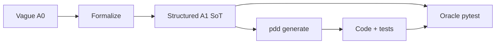

# Business value

This benchmark makes PDD's business value measurable: better prompts should reduce wasted
generation loops, lower token spend, and make AI-generated software easier to trust.

**Design:** [EXPERIMENT_DESIGN.md](EXPERIMENT_DESIGN.md)

## Core hypothesis

> A structured **A1** prompt with vocabulary, contract rules, and checkable requirements
> should need fewer PDD **generate / fix / verify** rounds than a vague **A0** prompt to
> reach acceptable behavior.

## Three phases → business levers

```
┌─────────────────────────────────────────────────────────────┐
│ 1. PROMPT QUALITY — shift-left before generate spend        │
└───────────────────────────┬─────────────────────────────────┘
                            ▼
┌─────────────────────────────────────────────────────────────┐
│ 2. GENERATE + RECORD — dollars and oracle pass rate         │
└───────────────────────────┬─────────────────────────────────┘
                            ▼
┌─────────────────────────────────────────────────────────────┐
│ 3. SHIP + STABILITY — trust across regeneration             │
└─────────────────────────────────────────────────────────────┘
```

| Phase | Milestone | Business lever | Key metrics |
|-------|-----------|----------------|-------------|
| **1** | **M1** | Cheaper mistakes caught **before** generation | Lint, contract rules, vocabulary, coverage, story Covers |
| **2** | **M2** | **Generation economics** — A0 vs A1 to acceptable code | Rounds, cost USD, oracle pass rate, non-oracle pass rate |
| **3** | **M3** | **Maintenance** — stable behavior across regen | Drift score, behavior stability, regen runs |

M1 does **not** claim lower token spend or fewer fix loops yet — it measures the upstream
lever that M2 and M3 connect to dollars and stability.

## Why this matters

- **Lower token and model cost:** Vague prompts often require repeated generation, failed
  tests, manual clarification, and extra repair loops. Formalized prompts should reduce
  avoidable retries by making intended behavior explicit before generation.
- **Faster delivery:** Fewer failed generation rounds means less wall-clock time on model
  calls and less engineering time debugging misunderstood requirements.
- **More predictable AI coding workflows:** Teams can measure prompt quality before
  spending generation budget, instead of discovering ambiguity only after broken code.
- **Better review and maintenance:** Vocabulary, contract rules, command logs, and hashes
  make the prompt a durable source-of-truth artifact that engineers can review, diff, and
  audit.
- **Enterprise trust:** Buyers care less about one-off code generation and more about
  whether generated code can be reproduced, checked, and kept aligned with requirements
  over time.

## Prompt as source of truth → better code



| Stage | A0 (vague) | A1 (formalized) | Effect on generated code |
|-------|------------|-----------------|--------------------------|
| Terms | Implicit | `<vocabulary>` | One interpretation, fewer silent mismatches |
| Behavior | Prose | `R*` contract rules | Observable MUST outcomes |
| Verification | None in prompt | Coverage + acceptance tests | Tests align with stated rules |
| Audit | Unstructured | Sections + evidence + SHA256 | Reviewers diff prompts, not only code |

## Honest reporting (M2+)

When M2 runs, report results as:

> Formalized prompts improved oracle test pass rate by X% at Y additional formalization
> cost and Z total generation cost, requiring N fewer generate/fix rounds than ad-hoc
> prompts on average.

Do **not** claim M1 alone proves generation savings.

See [PLAN.md](PLAN.md) and [pipelines/M2_ROADMAP.md](pipelines/M2_ROADMAP.md) for the
measurement plan.
