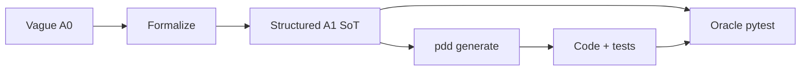

# Experiment design — A0→A1 formalization benchmark

This document is the **canonical map** from product workflow → benchmark milestones →
commands. For checkup command detail (purpose, flags, wrappers, exit codes) see
[CHECKUP_CHEATSHEET.md](CHECKUP_CHEATSHEET.md). For runbooks see [EVALUATION.md](EVALUATION.md);
for demos see [SHOWCASE.md](SHOWCASE.md).

**Tracking:** [issue #1273](https://github.com/promptdriven/pdd/issues/1273) · epic [#833](https://github.com/promptdriven/pdd/issues/833)

---

## Three phases (product mental model)

The experiment mirrors how PDD is meant to be used in production: **fix the spec before
spending on generation**, **record what was generated**, then **gate and drift-check before ship**.

```
┌─────────────────────────────────────────────────────────────┐
│ 1. PROMPT QUALITY (before spend on generate)                │
│    lint → contract check → coverage (+ stories #820)         │
└───────────────────────────┬─────────────────────────────────┘
                            ▼
┌─────────────────────────────────────────────────────────────┐
│ 2. GENERATE + RECORD                                        │
│    pdd generate / test / sync --evidence                    │
└───────────────────────────┬─────────────────────────────────┘
                            ▼
┌─────────────────────────────────────────────────────────────┐
│ 3. SHIP + STABILITY (after code exists)                     │
│    checkup gate → checkup drift (+ optional simplify)       │
└─────────────────────────────────────────────────────────────┘
```

| Phase | Benchmark | Business question |
|-------|-----------|-------------------|
| **1 — Prompt quality** | **M1** | Is the prompt checkable *before* we pay for `pdd generate`? |
| **2 — Generate + record** | **M2** | Does formalized **A1** produce better/cheaper code than vague **A0**? |
| **3 — Ship + stability** | **M3** | When we regen from the same prompt, does behavior stay aligned? |

**Experiment 2 (M4)** — [`../model_efficiency/`](../model_efficiency/) — reuses M2 economics
with two PDD Cloud strength tiers (smart vs budget).

---

## A0 vs A1 arms (what we compare)

Both arms run the **same pipeline** after Phase 1. Only the **prompt** differs.



| Arm | Source | Role |
|-----|--------|------|
| **A0** | Handcrafted `corpus/tasks/*/A0.prompt` | Control — vague requirements prose |
| **A1** | Formalized from A0 (M1 output) | Treatment — vocabulary, contract rules, coverage, stories |
| **Oracle tests** | Hand-written `tier_gold/*/oracle_tests/` | Independent ground truth (not from the prompt) |

M2 runs **`pdd generate` on A0 and on A1** with the same model settings, then scores both
against oracle pytest. That is how we test “prompt as source of truth → better code.”

---

## Why three phases?

### Phase 1 — Catch ambiguity before tokens

Vague prompts force the model to guess (“valid”, “safely”, “handle errors”). Checkup makes
gaps **visible and measurable** instead of discovered only after failed generation.

| Product command | What it checks | Benchmark script |
|-----------------|----------------|------------------|
| [`pdd checkup lint`](CHECKUP_CHEATSHEET.md#pdd-checkup-lint) | Vague terms, missing vocabulary, weak verbs | `prompt_metrics.py`, `checkup_formalize.py` |
| [`pdd checkup contract check`](CHECKUP_CHEATSHEET.md#pdd-checkup-contract-check) | `R*` rules, modal MUST structure | `prompt_metrics.py`, `formalize_a1.py` |
| [`pdd checkup coverage`](CHECKUP_CHEATSHEET.md#pdd-checkup-coverage) | Rule → story `## Covers` → tests | `checkup_formalize.py`, corpus stories (#820) |
| Story template (#820) | Oracle vs Non-Oracle acceptance criteria | `story_metrics.py` |

Full per-command reference (CLI, wrappers, exit codes):
[CHECKUP_CHEATSHEET.md § Phase 1](CHECKUP_CHEATSHEET.md#phase-1--prompt-quality-m1).

**M1 batch entry:**

```bash
python benchmarks/formalization/pipelines/run_experiment.py          # deterministic
python benchmarks/formalization/pipelines/run_experiment.py --allow-llm   # LLM stages
python benchmarks/formalization/pipelines/checkup_formalize.py ...   # product checkup loop
python benchmarks/formalization/pipelines/cloud_formalize.py ...    # PDD Cloud meta-prompt (WIP)
```

**Outputs:** `experiments/<run>/<task>/A1.prompt`, `REPORT.md`, `EVALUATION_RESULT.md`

**Honest claim:** M1 proves **checkability**, not lower generation cost.

### Phase 2 — Measure economics and code quality

Once prompts pass Phase 1, generation spend should buy **correct, auditable** artifacts.

| Product command | What it does | Benchmark script |
|-----------------|--------------|------------------|
| `pdd generate … --evidence --force` | Code from prompt + receipt | `generation_loop.py` |
| `pdd test … --evidence --force` | Tests from prompt + code | `generation_loop.py` |
| `pdd fix` | Repair loop on test failure | `generation_loop.py` (`--max-rounds`) |
| `pdd sync … --evidence` | Record validation into evidence store | Manual (product path; optional in demo) |

**Evaluation modes (M2):**

| Mode | Source | Trust level |
|------|--------|-------------|
| **Oracle** | `tier_gold/*/oracle_tests/` | High — independent hand-written pytest |
| **Non-oracle** | `pdd test` output | Informative — self-consistency from same prompt |

**M2 entry:**

```bash
# Live (API keys)
python benchmarks/formalization/pipelines/run_generation_benchmark.py --allow-llm \
  --m1-dir benchmarks/formalization/experiments/latest

# CI replay (recorded pdd generate/test fixtures)
python benchmarks/formalization/pipelines/run_generation_benchmark.py --replay-fixtures \
  --skip-formalize --m1-dir benchmarks/formalization/experiments/ci_smoke
```

**Outputs:** `experiments/m2_*/<task>/{A0,A1}/generated/`, `commands.jsonl`, oracle pass rates

### Phase 3 — Trust after regen

Enterprise buyers care whether AI output **stays aligned** when regenerated.

| Product command | What it does | Benchmark script |
|-----------------|--------------|------------------|
| [`pdd checkup gate`](CHECKUP_CHEATSHEET.md#pdd-checkup-gate) | Policy on evidence (stale code, missing verify) | Manual / future CI |
| [`pdd checkup drift`](CHECKUP_CHEATSHEET.md#pdd-checkup-drift) | Regen in temp dirs; compare API + behavior | `run_drift_benchmark.py` |
| [`pdd checkup simplify`](CHECKUP_CHEATSHEET.md#pdd-checkup-simplify-optional) | Post-gen cleanup with verify | Optional; not in harness |

Full per-command reference (dry-run vs live, wrappers, exit codes):
[CHECKUP_CHEATSHEET.md § Phase 3](CHECKUP_CHEATSHEET.md#phase-3--ship-and-stability-m3).
Reference tables (flags, env vars, runtimes):
[CHECKUP_CHEATSHEET.md § Reference tables](CHECKUP_CHEATSHEET.md#command-comparison-at-a-glance).

M3 **requires M2 code** on disk. Drift re-runs `pdd generate` from the prompt and compares
candidates to the baseline artifact.

**M2 → M3 combined entry:**

```bash
# CI-safe
python benchmarks/formalization/pipelines/run_m3_pipeline.py --replay-fixtures \
  --m1-dir benchmarks/formalization/experiments/ci_smoke --tasks email_validator

# Live
bash benchmarks/formalization/scripts/run_live_m3.sh
```

**Outputs:** `experiments/m3_*/<task>/evidence_*.json`, drift snapshots, `PIPELINE_RESULT.md`

---

## Command → phase quick reference

| You want to… | Phase | Command |
|--------------|-------|---------|
| Score prompt checkability on corpus | M1 | `run_experiment.py` |
| Formalize one task via checkup | M1 | `checkup_formalize.py` |
| Compare A0 vs A1 generation | M2 | `run_generation_benchmark.py --allow-llm` |
| Record cloud outputs for CI | M2 | `record_pdd_fixtures.py` |
| Replay fixtures + drift smoke | M2+M3 | `run_m3_pipeline.py --replay-fixtures` |
| Live generate + live drift | M2+M3 | `run_m3_pipeline.py --allow-llm` |
| Full CI smoke (M1→M2→M3) | All | `bash scripts/run_eval.sh` |

---

## Artifact policy

| Artifact | Who writes it | Git? |
|----------|---------------|------|
| A0 prompt | Humans | Yes |
| A1 prompt | Formalize step (M1) | Experiments dir (gitignored); replay in `tier_gold/*/pdd_generated/A1.prompt` |
| Generated code/tests | `pdd generate` / `pdd test` (M2) | Replay in `tier_gold/*/pdd_generated/` |
| Oracle tests | Humans | Yes |

Only **A0** and **oracle tests** are hand-written inputs. A1, code, and non-oracle tests
must come from PDD Cloud (or committed replay of a cloud record).

---

## Related docs

| Doc | Role |
|-----|------|
| [README.md](README.md) | Entry point |
| [CHECKUP_CHEATSHEET.md](CHECKUP_CHEATSHEET.md) | `pdd checkup` commands — purpose, usage, wrappers, exit codes |
| [COMMANDS.md](COMMANDS.md) | Copy-paste literals for every corpus task |
| [EVALUATION.md](EVALUATION.md) | Step-by-step runbook |
| [WORKFLOW.md](WORKFLOW.md) | Product PRs → commands (extended) |
| [BUSINESS_VALUE.md](BUSINESS_VALUE.md) | Hypothesis and honest claims |
| [pipelines/README.md](pipelines/README.md) | Script index |
| [corpus/README.md](corpus/README.md) | Task registry and fixtures |
| [../README.md](../README.md) | Both experiments (M1–M4) |
