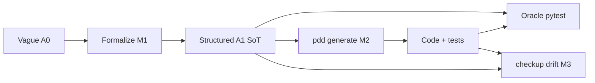

# A0→A1 Prompt Formalization Benchmark

Benchmark for [issue #1273](https://github.com/promptdriven/pdd/issues/1273) / epic [#833](https://github.com/promptdriven/pdd/issues/833).

**Start here:** [EXPERIMENT_DESIGN.md](EXPERIMENT_DESIGN.md) — three-phase workflow, diagrams, and
command map.

## Three phases → three milestones

```
┌─────────────────────────────────────────────────────────────┐
│ 1. PROMPT QUALITY (M1) — before spend on generate           │
│    lint → contract check → coverage (+ stories #820)         │
└───────────────────────────┬─────────────────────────────────┘
                            ▼
┌─────────────────────────────────────────────────────────────┐
│ 2. GENERATE + RECORD (M2)                                   │
│    pdd generate / test / sync --evidence                    │
└───────────────────────────┬─────────────────────────────────┘
                            ▼
┌─────────────────────────────────────────────────────────────┐
│ 3. SHIP + STABILITY (M3) — after code exists                │
│    checkup gate → checkup drift (+ optional simplify)       │
└─────────────────────────────────────────────────────────────┘
```

| Milestone | Status | Primary script |
|-----------|--------|----------------|
| **M1** — Prompt checkability | Implemented | `pipelines/run_experiment.py` |
| **M2** — Generation economics | Implemented | `pipelines/run_generation_benchmark.py` |
| **M3** — Regeneration drift | Implemented | `pipelines/run_m3_pipeline.py` |

**Hypothesis:** formalized **A1** prompts need fewer generate/fix rounds and score higher on
**oracle** tests than vague **A0** — see [BUSINESS_VALUE.md](BUSINESS_VALUE.md).

---

## Quick start

```bash
# CI smoke — M1 + M2 replay + M3 dry-run (~3 min, no API keys)
bash benchmarks/formalization/scripts/run_eval.sh

# M1 only — deterministic formalize + score
python benchmarks/formalization/pipelines/run_experiment.py
cat benchmarks/formalization/experiments/latest/REPORT.md

# Live M2 + M3 (requires pdd setup + API keys)
bash benchmarks/formalization/scripts/run_live_m3.sh
```

```bash
pytest -vv tests/test_formalization_benchmark.py tests/test_formalization_pipeline.py
```

---

## Documentation map

| Doc | Audience |
|-----|----------|
| [EXPERIMENT_DESIGN.md](EXPERIMENT_DESIGN.md) | **Design** — phases, diagrams, why M1/M2/M3 |
| [EVALUATION.md](EVALUATION.md) | **Runbook** — flags and outputs |
| [WORKFLOW.md](WORKFLOW.md) | **Product mapping** — checkup PRs → commands |
| [BUSINESS_VALUE.md](BUSINESS_VALUE.md) | PM / leadership |
| [SHOWCASE.md](SHOWCASE.md) | Live demo scripts |
| [pipelines/README.md](pipelines/README.md) | Script index |
| [corpus/README.md](corpus/README.md) | Task registry + fixtures |

---

## Arms

| Arm | Corpus path | Used in |
|-----|-------------|---------|
| **A0** | `corpus/tasks/*/A0.prompt` (handwritten) | M1 input; M2 control arm |
| **A1** | `experiments/<run>/<task>/A1.prompt` | M1 output; M2 treatment arm |
| **Oracle** | `corpus/tier_gold/*/oracle_tests/` | M2 independent scoring |



---

## Formalize paths (Phase 1)

| Path | Script | When |
|------|--------|------|
| Batch corpus (default) | `formalize_a1.py` via `run_experiment.py` | CI + local dev |
| Product checkup loop | `checkup_formalize.py` | Same engines as `pdd checkup` CLI |
| PDD Cloud meta-prompt | `cloud_formalize.py` | Cloud A1 via `pdd generate` (WIP integration) |

Add `--allow-llm` to `run_experiment.py` for LLM formalization stages (not default CI).

---

## v0.3 static harness (legacy)

Separate epic #833 scorecard — hand-curated fixtures under `tasks/`:

```bash
python benchmarks/formalization/run_benchmark.py --report
```

Not the M1–M3 corpus experiment; see [EPIC833.md](EPIC833.md).
