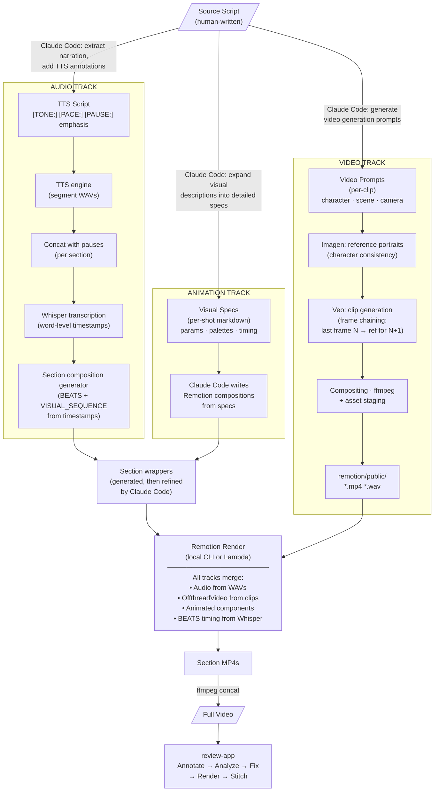
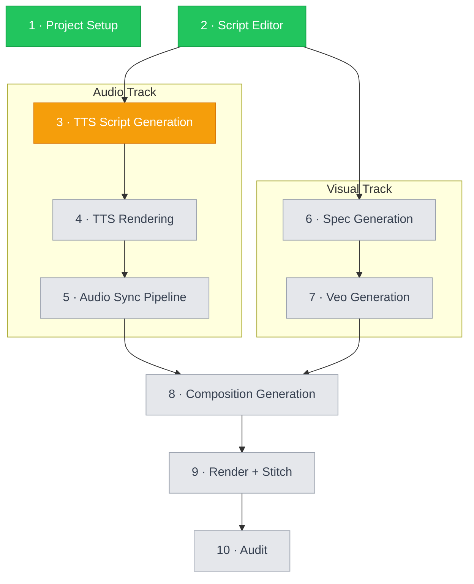
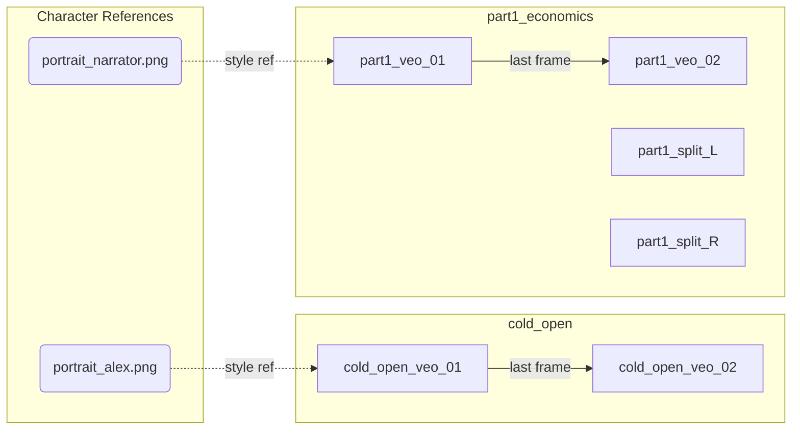

# PRD: AI-First Video Editor

**Status:** Internal Engineering Document — derived from working prototype
**Date:** 2026-02-19
**Prototype:** `demos/3blue1brown/`

---

## 1. Product Vision & Problem Statement

### The Problem

Video production is one of the last creative workflows where iteration is punishingly slow. A director spots a timing issue at 14:32 — the fix requires a human editor to locate the source clip, adjust keyframes, re-render, re-export, and re-review. Each cycle takes minutes to hours. Most feedback dies in the gap between "I see the problem" and "I can fix it."

AI video generation (Veo, Sora, Runway) is making *creation* cheap. But the edit loop — the thing that turns a rough cut into a finished product — is still manual. Generation costs are collapsing, but we're still patching frame by frame.

### The Vision

**Human as director, AI as entire crew.** A single webapp is the control plane for the full video production pipeline — from source script to finished video. The director:

1. **Writes or imports** a source script
2. **Triggers generation** of TTS audio, visual specs, Veo clips, and Remotion compositions — each step orchestrated by the webapp calling Claude Code
3. **Reviews** the rendered video, annotating problems (circling an area, speaking a note, typing a description)
4. **Approves fixes** proposed by Claude, which are applied, re-rendered, and stitched back automatically

The director never touches a timeline, keyframe, terminal, or code editor. The webapp calls Claude Code to handle every step that was previously manual — generating TTS scripts, writing specs, authoring Remotion components, staging assets between pipeline stages, and fixing issues found during review.

### Why This Matters

This is the same paradigm shift described in the video itself: moving from *crafting* (manually editing each frame) to *molding* (specifying intent, letting the machine produce). The prototype proves two things: (1) the review/fix loop works end-to-end, and (2) Claude Code can execute every "glue" step in the production pipeline. The product unifies both into a single webapp where the human directs and the AI produces.

---

## 2. Demo / Proof of Concept

### What Was Built

A complete 20-minute educational video ("Why You're Still Darning Socks") about Prompt-Driven Development, produced almost entirely through AI tooling:

| Component | Tool | Output |
|-----------|------|--------|
| Script & narrative | Human-written | `narrative/main_script.md` (39KB) |
| Voice narration | Qwen3-TTS (1.7B) | 100+ WAV segments at 24kHz mono |
| Word-level timestamps | faster-whisper | `word_timestamps.json` per section |
| Live-action footage | Google Veo 3.1 | 50+ MP4 clips (8s each, 9:16 & 16:9) |
| Animated visualizations | Remotion 4.0 + React 19 | 60 compositions, 73 named components |
| Section rendering | Remotion CLI + AWS Lambda | 7 section videos + 1 full 232MB video |
| Review & auto-fix | Express.js (prototype) + Claude Opus 4.6 | `review-app/` — the key innovation (V1 migrates to Next.js API routes) |

### What It Demonstrates

1. **Spec-driven video production works.** Every shot in the video traces back to a markdown spec file. The spec is the mold; the rendered video is just plastic.
2. **AI can fix its own output.** The review-app sends Claude the spec, the Remotion source code, and a screenshot of the problem. Claude edits the source, re-renders, and the fix appears in the video.
3. **The iteration cycle is ~2 minutes.** Annotate → analyze → fix → render → stitch. Compare to traditional video editing where a comparable change takes 15-60 minutes.

---

## 3. System Architecture

### General Pipeline

Any video produced by this system follows the same fork-and-converge pattern. A single source script splits into parallel tracks — audio, animation specs, and video clips — then all tracks merge at render time.



**In the product, the webapp controls the entire pipeline above** — not just the review loop at the bottom. Each "Claude Code" step in the diagram becomes a server-initiated Claude Code invocation triggered by the UI. Each "Fully automated" step (TTS, Whisper, Veo, Remotion render) becomes a job the server spawns and streams progress for. The user drives every stage from the same interface.

### Automation Model

Every step in the pipeline is one of three types. This pattern held across the demo and would hold for any video:

| Step | Method | Automation |
|------|--------|------------|
| Write source script | Human | Manual |
| Generate TTS script | Claude Code | LLM-directed |
| Generate visual specs | Claude Code | LLM-directed (iterative) |
| Generate video prompts | Claude Code | LLM-directed |
| Render TTS audio | TTS engine | Fully automated |
| Concatenate sections with pauses | Concat pipeline | Fully automated |
| Transcribe with word timestamps | Whisper | Fully automated |
| Generate character reference images | Imagen | Fully automated |
| Generate video clips (with frame chaining) | Veo | Fully automated |
| Stage video clips to Remotion | Claude Code | LLM-directed |
| Write Remotion compositions | Claude Code (from specs) | LLM-directed |
| Generate section wrapper scaffolding | Composition generator | Fully automated |
| Refine section wrappers | Claude Code | LLM-directed |
| Render sections | Remotion CLI / Lambda | Fully automated |
| Stitch full video | ffmpeg concat | Fully automated |
| Audit renders against specs | Parallel Claude Code agents | LLM-directed |
| Review and auto-fix | review-app + Claude | Automated loop |

The key insight: **Claude Code is the orchestrator.** The automated scripts handle individual pipeline stages, but Claude Code acts as the glue — generating intermediate artifacts, staging files between pipelines, and refining scaffolded output. In the prototype, a human drove Claude Code from the terminal. In the product, **the webapp drives Claude Code programmatically** — every "LLM-directed" step becomes a server-side Claude Code invocation triggered by a button in the UI.

### Data Flow: Annotation to Fixed Video

```
User presses [Space] on video
        │
        ├── Video pauses, drawing canvas activates (1920x1080 internal)
        ├── Speech recognition starts (Web Speech API)
        │
User draws circles/arrows, speaks/types description
        │
User presses [Space] again
        │
        ├── Frame thumbnail captured (canvas screenshot)
        ├── Composite image created (video + drawings)
        ├── Speech text + typed text combined
        ├── Annotation saved
        │
        ▼
POST /api/annotations/:id/analyze        ← runs immediately per annotation
        │
        ├── Reads spec files from specs/{sectionDir}/
        ├── Reads Remotion source from remotion/src/remotion/{remotionDir}/
        ├── Reads relevant TTS script section + Veo prompt if applicable
        ├── Reads relevant section from narrative/main_script.md
        ├── Includes frame screenshot + markup composite
        │
        ▼
Claude CLI (read-only):
  claude -p --model claude-opus-4-6 --output-format json
         --allowedTools Read,Glob
        │
        ├── Returns JSON: severity, category, summary,
        │   technicalAssessment, suggestedFixes, relevantFiles,
        │   fixType: "remotion" | "veo" | "tts"
        │
        ▼
[Annotation queued; user continues reviewing and annotating]
[Multiple annotations accumulate per section]
        │
        ▼
User clicks [Apply N Fixes] for a section
        │
        ▼
POST /api/sections/:sectionId/resolve-batch
        │
        ├── Returns { jobId } with HTTP 202
        ├── SSE stream: GET /api/jobs/:id/stream
        │
        ▼
  For each pending annotation in the batch (sequential):
        │
        ├── fixType = "remotion" ─────────────────────────────┐
        │   Claude CLI (Edit,Write,Glob,Grep)                  │
        │   Scoped to: remotion/src/remotion/{remotionDir}/    │
        │   Outputs: modified .tsx files + change summary       │
        │   Returns: { fixType, filesModified,                  │
        │              changeDescription, confidence }          │
        │                                                       │
        ├── fixType = "veo" ──────────────────────────────────┤
        │   Veo API: regenerate clip from updated prompt        │
        │   Stage new clip to remotion/public/                  │
        │   Returns: { fixType, clipId, stagingPath }           │
        │                                                       │
        └── fixType = "tts" ──────────────────────────────────┤
            TTS engine: re-render affected segment(s)           │
            sync_audio_pipeline.py: re-concat + re-transcribe   │
            Returns: { fixType, segmentIds, newDuration }       │
                                                               │
        ◄──────────────────────────────────────────────────────┘
        │
        ▼  (after all fixes in batch are applied)
  ┌─── RENDER ───────────────────────────────────────────────┐
  │ npx remotion render src/remotion/index.ts                 │
  │   {compositionId} --output {section.mp4}                  │
  │ Runs once per section per batch (not once per annotation) │
  │ Progress streamed via stderr parsing                      │
  └───────────────────────┬──────────────────────────────────┘
                          ▼
  ┌─── STITCH ──────────────────────────────────────────────┐
  │ ffmpeg -f concat -safe 0 -i concat_list.txt              │
  │   -c copy full_video.mp4                                  │
  │ Reassembles all sections into final video                 │
  └───────────────────────┬──────────────────────────────────┘
                          ▼
  Successful annotations marked resolved: true
  Failed annotations marked resolved: false, error: "..."
  Video player reloads with updated full_video.mp4
```

---

## 4. Core Product: The Webapp

The webapp is the single control plane for the entire pipeline. In the prototype, the review/fix loop is the most polished piece — but the product extends that same pattern (user triggers action → server calls Claude Code / spawns job → streams progress → returns result) to every pipeline stage.

### 4.1 Annotation Model

```
annotation = {
  id: "ann_{timestamp}_{random}",

  // What the reviewer said/drew
  text: {
    content: string,
    inputMethod: "typed" | "speech" | "mixed"
  },

  // Where in the video
  video: {
    source: "full" | "section",
    sectionId: "part1_economics" | "cold_open" | ...,
    timestamp: 5.0,                    // seconds
    timestampFormatted: "00:05.0",
    frameThumbnail: "/thumbnails/..."  // captured frame
  },

  // What they drew on the frame
  drawing: {
    canvasWidth: 1920,
    canvasHeight: 1080,
    paths: [{ tool, points, color, strokeWidth }],
    compositeImage: "/thumbnails/..."  // frame + drawings
  },

  // Claude's analysis
  analysis: {
    status: "pending" | "analyzing" | "completed" | "error",
    error: string | null,            // populated when status = "error"
    severity: "critical" | "high" | "medium" | "low" | "informational",
    category: "animation-timing" | "visual-design" | "readability" |
              "audio-sync" | "color-contrast" | "layout" | "typography" |
              "data-accuracy" | "transition" | "continuity" | "other",
    fixType: "remotion" | "veo" | "tts",   // routes server to correct pipeline
    summary: string,
    technicalAssessment: string,
    suggestedFixes: string[],
    relevantFiles: string[],
    specReference: string
  },

  // Resolution state
  resolved: boolean,
  resolveJob: {
    jobId: string,
    status: "pending" | "running" | "done" | "error",
    // step varies by fixType:
    //   remotion: "fixing" → "rendering" → "stitching"
    //   veo:      "generating-clip" → "staging-asset" → "rendering" → "stitching"
    //   tts:      "rendering-audio" → "syncing-audio" → "rendering" → "stitching"
    step: "fixing" | "generating-clip" | "staging-asset" |
          "rendering-audio" | "syncing-audio" | "rendering" | "stitching",
    progress: 0-100,
    error: string | null
  }
}
```

### 4.2 The Spacebar Workflow

The core UX interaction, implemented in `review-app/public/app.js`:

| Press | Action |
|-------|--------|
| **Space (1st)** | Pause video, activate drawing canvas, start speech recognition |
| *User annotates* | Draw with freehand/rectangle/circle/arrow/text tools; speak or type description |
| **Space (2nd)** | Stop recording, capture frame, create composite, save annotation, resume video |

Additional keyboard shortcuts: `D` (draw mode), `M` (mic), `F/R/C/A/T` (tool select), `Ctrl+Z` (undo drawing), `Ctrl+S` (save), `K` (play/pause), arrow keys (seek).

### 4.3 Claude Integration

Two separate Claude invocations with different tool permissions:

**Analysis (read-only) — runs per annotation:**
```bash
claude -p --model claude-opus-4-6 --output-format json \
  --no-session-persistence --allowedTools Read,Glob
```

Input prompt includes: spec files, main script section, Remotion source files, TTS script section, Veo prompt file (if applicable), frame screenshot, markup composite. Output: structured severity/category/`fixType`/assessment JSON.

**Fix (read-write) — runs per annotation within the batch, routed by `fixType`:**

| `fixType` | Tools | Scope | Output |
|-----------|-------|-------|--------|
| `remotion` | `Read,Write,Edit,Glob,Grep` | `remotion/src/remotion/{remotionDir}/` | `{ fixType, filesModified, changeDescription, confidence }` |
| `veo` | — (Veo API call, not Claude) | Veo API + `remotion/public/` staging | `{ fixType, clipId, stagingPath }` |
| `tts` | — (TTS engine + pipeline, not Claude) | `outputs/tts/`, `remotion/public/` | `{ fixType, segmentIds, newDuration }` |

For `remotion` fixes, Claude receives: everything from analysis + the analysis results. For `veo` and `tts` fixes, Claude's role ends at analysis — the server invokes the appropriate pipeline tool directly based on `fixType`.

### 4.4 Job Management

- **Per-section batch queue:** Annotations accumulate per section; the user triggers a batch resolve when ready. Only one batch job runs per section at a time. The job applies all pending annotations sequentially (by `fixType`), then renders and stitches once.
- **SSE streaming:** Real-time per-annotation and overall progress via `GET /api/jobs/:id/stream`
- **Polling fallback:** `GET /api/jobs/:id` if EventSource fails
- **Crash recovery:** On server restart, all pending/running jobs marked as `error: "Server restarted during pipeline"`
- **Per-annotation error handling within a batch:** If a single annotation's fix fails (any `fixType`), the batch does **not** abort. The failed annotation is marked `error` with the failure message, and the batch continues to the next annotation. After all annotations are attempted, the section renders and stitches with whatever fixes succeeded. The user can then retry individual failed annotations via [Retry Failed] or re-queue them in a new batch. This applies to all fix types: a failed Veo regeneration does not block a subsequent Remotion fix in the same batch.
- **Job retry:** Any failed job (pipeline stage or batch resolve) can be retried via `POST /api/jobs/:id/retry` without re-running upstream stages. The retry reuses the original job parameters.

### 4.5 Section Mapping

The server maintains a section registry that maps each video section to its spec directory, Remotion directory, and composition ID. This registry drives the entire review loop — analysis scopes Claude to the correct spec/source files, and rendering targets the correct composition.

```
section = {
  id: string,              // e.g. "intro"
  label: string,           // Display name
  videoFile: string,       // e.g. "intro.mp4"
  specDir: string,         // e.g. "00-intro"
  remotionDir: string,     // e.g. "S00-Intro"
  compositionId: string,   // e.g. "IntroSection"
  durationSeconds: number, // e.g. 23.4 — populated after render (read from ffprobe)
  offsetSeconds: number    // e.g. 0.0 — cumulative offset in full video (computed from section order + durations)
}
```

`durationSeconds` and `offsetSeconds` are populated after rendering (Stage 9) by running `ffprobe` on each section video. They are used to map a timestamp in the full video to the correct section during review — e.g., a pause at 64.6s in the full video maps to section `part2_paradigm_shift` (offset 41.2s) at local time 23.4s.

In the prototype, this is a hardcoded array in `server.js`. In V1, this should be part of `project.json` (see §4.5.1), loaded at startup, so new videos don't require code changes.

> **In the demo (7 sections):**
>
> | Section ID | Video File | Remotion Composition | Spec Dir |
> |------------|-----------|---------------------|----------|
> | `cold_open` | `cold_open.mp4` | `ColdOpenSection` | `00-cold-open` |
> | `part1_economics` | `part1_economics.mp4` | `Part1Economics` | `01-economics` |
> | `part2_paradigm_shift` | `part2_paradigm_shift.mp4` | `Part2ParadigmShift` | `02-paradigm-shift` |
> | `part3_mold` | `part3_mold.mp4` | `Part3MoldThreeParts` | `03-mold-has-three-parts` |
> | `part4_precision` | `part4_precision.mp4` | `Part4PrecisionTradeoff` | `04-precision-brings-cost` |
> | `part5_compound` | `part5_compound.mp4` | `Part5CompoundReturns` | `05-compound` |
> | `closing` | `closing.mp4` | `ClosingSection` | `06-closing` |

### 4.5.1 Project Config Schema (`project.json`)

`project.json` is the single source of truth for all project configuration. It is created by Stage 1 (Project Setup), read by every pipeline stage and the review loop, and updated automatically as pipeline stages produce output (e.g., `durationSeconds` after rendering).

```json
{
  "name": "3blue1brown-antibiotics",
  "outputResolution": { "width": 1920, "height": 1080 },

  "tts": {
    "engine": "qwen3-tts",
    "modelPath": "models/Qwen3-TTS-12Hz-1.7B-CustomVoice",
    "tokenizerPath": "models/Qwen3-TTS-Tokenizer-12Hz",
    "speaker": "Aiden",
    "speakingRate": 0.95,
    "sampleRate": 24000
  },

  "sections": [
    {
      "id": "cold_open",
      "label": "Cold Open",
      "videoFile": "cold_open.mp4",
      "specDir": "00-cold-open",
      "remotionDir": "S00-ColdOpen",
      "compositionId": "ColdOpenSection",
      "durationSeconds": null,
      "offsetSeconds": null
    }
  ],

  "audioSync": {
    "sectionGroups": {
      "cold_open": { "startSegment": "cold_open_001", "endSegment": "cold_open_004" },
      "part1_economics": { "startSegment": "part1_economics_001", "endSegment": "part1_economics_007" }
    },
    "silenceGapDefault": 0.3
  },

  "veo": {
    "model": "veo-3.1-generate-preview",
    "defaultAspectRatio": "16:9",
    "maxConcurrentGenerations": 4,
    "references": [
      {
        "id": "alex",
        "label": "Alex (protagonist)",
        "imagePath": "references/cold-open/developer_reference.png",
        "sections": ["cold_open", "part1_economics"]
      }
    ],
    "frameChains": [
      { "clips": ["cold_open_veo_01", "cold_open_veo_02"], "referenceId": "alex" }
    ]
  },

  "render": {
    "maxParallelRenders": 3,
    "useLambda": false,
    "lambdaRegion": "us-east-1"
  }
}
```

Fields with `null` values are populated automatically by pipeline stages (e.g., `durationSeconds` after Stage 9 rendering). All other fields are user-configured in Stage 1.

### 4.6 Production Pipeline UI

The production pipeline UI provides a staged workflow covering all steps from project setup through final render. It lives in a dedicated **"Pipeline"** tab alongside the existing review tab.

#### 4.6.1 Overall App Layout

The app has two columns: a narrow **stage sidebar** on the left and a **main panel** on the right that renders the active stage's UI. The 10 stages run in logical order. Triggering any stage **auto-runs all prerequisite stages** that haven't completed yet (see "Prerequisite auto-run" below).



**Status badge model:**

| Badge | Value | Meaning |
|-------|-------|---------|
| ○ | `not_started` | No output exists for this stage |
| ◌ | `running` | A job is currently executing |
| ● | `done` | Output exists and is up to date |
| ✕ | `error` | Last run failed; error message shown in tooltip |

Key behaviors:
- **Navigation is free**: clicking any stage immediately shows that stage's panel, regardless of upstream status.
- **Prerequisite auto-run**: when the user triggers a stage's run action, the server checks all upstream stages in the dependency graph (not a flat list — the graph has parallel tracks). Any stage that hasn't completed is run automatically before the requested stage executes. Independent branches run concurrently. For example, clicking [Render All] in Stage 9 with Stages 3-8 incomplete will run the audio track (TTS script → TTS rendering → audio sync) **in parallel with** the visual track (spec generation → Veo generation), then run composition generation once both tracks complete, then render. Progress for each prerequisite stage is streamed via SSE, and the sidebar badges update in real time as each completes. If any prerequisite fails, the chain stops and the error is reported.
- `GET /api/pipeline/status` is polled every 5 s to refresh all badges without a full page reload.

**SSE streaming pattern** (reused by every pipeline stage that triggers a job):

1. User clicks a trigger button (e.g., "Generate TTS Script →").
2. Client POSTs to the relevant endpoint and receives `{ jobId }`.
3. Client opens `EventSource` on `GET /api/jobs/:id/stream`.
4. Progress events are appended to a scrollable log panel in real time.
5. On `event: done`, the log shows a green ✓ banner; the sidebar badge updates to `done`.
6. On `event: error`, the log shows a red ✕ banner with the error message.
7. Fallback: if `EventSource` fails, poll `GET /api/jobs/:id` every 2 s.

---

#### 4.6.2 Stage 1: Project Setup

A settings form that initialises or edits `project.json`. This replaces the hardcoded `sections` array in `server.js`.

```
┌────────────────────────────────────────────────────────────────────────────┐
│  Stage 1 — Project Setup                                        [Save ✓]   │
├────────────────────────────────────────────────────────────────────────────┤
│  Project name:  [3blue1brown-antibiotics          ]                        │
│  Output res:    [1920x1080 ▾]                                              │
│  TTS voice:     [Aiden ▾]             Speaking rate: [0.95]               │
│                                                                             │
│  Section Registry              [Extract from Script] [+ Add Section]         │
│  ┌──────────────────┬──────────────────┬─────────────────┬──────────────┐ │
│  │ Section ID       │ Video File        │ Remotion Comp    │ Spec Dir     │ │
│  ├──────────────────┼──────────────────┼─────────────────┼──────────────┤ │
│  │ cold_open    [✎] │ cold_open.mp4    │ ColdOpenSection │ 00-cold-open │ │
│  │ part1_econ   [✎] │ part1_econ.mp4   │ Part1Economics  │ 01-economics │ │
│  │ …                │ …                │ …               │ …            │ │
│  └──────────────────┴──────────────────┴─────────────────┴──────────────┘ │
└────────────────────────────────────────────────────────────────────────────┘
```

Key behaviors:
- Each row in the Section Registry is **inline-editable**: clicking [✎] turns the row into text inputs.
- [+ Add Section] appends a blank row. Row drag handles allow reordering; order is preserved in `project.json`.
- **[Extract from Script]** uses Claude CLI to analyse `narrative/main_script.md` and auto-populate the Section Registry. Claude identifies `## HEADING (MM:SS - MM:SS)` markers that represent video sections (excluding appendix headings without timestamps), merges sub-sections into parents where appropriate, and returns a JSON array of `Section` objects. Extracted sections populate the registry for review — the user must still click [Save ✓] to persist. If sections already exist, a confirmation dialog warns before replacing.
- [Save ✓] PUTs to `PUT /api/project`. A success toast appears; badge moves to `done`.
- Unsaved changes show a yellow dot on [Save ✓] and trigger a browser `beforeunload` warning.
- The server reloads the section registry on save **without restart**; `project.json` is the single source of truth.

---

#### 4.6.3 Stage 2: Script Editor

A split-pane editor for viewing and editing `narrative/main_script.md` before TTS script generation.

```
┌────────────────────────────────────────────────────────────────────────────┐
│  Stage 2 — Script Editor                     [Generate TTS Script →]       │
├───────────────────────────┬────────────────────────────────────────────────┤
│  Source  (main_script.md) │  Structured Preview                             │
│  ─────────────────────────│────────────────────────────────────────────────│
│  ## Part 1: Economics     │  [SECTION: part1_economics]                    │
│                           │                                                 │
│  NARRATOR: The story of   │  ■ NARRATOR  (line 12)                        │
│  antibiotics begins...    │  The story of antibiotics begins...            │
│                           │                                                 │
│  [VISUAL: Wide shot of    │  ▣ VISUAL  (line 15)                          │
│  a Petri dish with a      │  Wide shot of a Petri dish...                  │
│  clear halo around a      │                                                 │
│  mold colony]             │                                                 │
│                           │                                                 │
│  (syntax-highlighted)     │  (color-coded by block type)                   │
└───────────────────────────┴────────────────────────────────────────────────┘
```

Key behaviors:
- Left pane is a **CodeMirror editor** with Markdown syntax highlighting. Changes auto-save to disk on 1 s debounce (`PUT /api/project/script`).
- Right pane **re-renders on every keystroke** (debounced 200 ms). `NARRATOR:` lines get a blue ■ badge; `[VISUAL:]` blocks get a teal ▣ badge; `## ...` headers get a gray section label.
- The split is **resizable** by dragging the divider.
- [Generate TTS Script →] is enabled only after at least one `NARRATOR:` block is detected. Clicking advances to Stage 3 and triggers the TTS script generation job.

---

#### 4.6.4 Stage 3: TTS Script Generation

A split diff view showing the Claude Code–generated TTS script alongside the source, with an inline editor for post-generation edits.

```
┌────────────────────────────────────────────────────────────────────────────┐
│  Stage 3 — TTS Script Generation                          [Render Audio →] │
├────────────────────────────────────────────────────────────────────────────┤
│  [Generate TTS Script ↺]   Last run: 2 min ago                             │
│                                                                             │
│  ┌─ Progress Log ──────────────────────────────────────────────────────┐   │
│  │  [13:42:01] Invoking Claude Code (claude-opus-4-6)...              │   │
│  │  [13:42:04] Reading main_script.md...                              │   │
│  │  [13:42:09] Writing tts_script.md...                               │   │
│  │  [13:42:11] ✓ Done (12 segments generated)                         │   │
│  └─────────────────────────────────────────────────────────────────────┘   │
│                                                                             │
│  ┌─ Source (main_script.md) ──┬─ Generated (tts_script.md) ──────────┐    │
│  │ NARRATOR: The story of     │ NARRATOR: The story of antibi-        │    │
│  │ antibiotics begins...      │ otics [PACE:slow] begins, in          │    │
│  │                            │ [PAUSE:0.5s] the nineteen thirties.   │    │
│  │ [VISUAL: Wide shot...]     │ [VISUAL: Wide shot...]  (unchanged)   │    │
│  └────────────────────────────┴───────────────────────────────────────┘    │
│                                                                             │
│  ┌─ Inline Editor (tts_script.md) ───────────────────────────────────┐    │
│  │  (editable; auto-saves on blur, 1 s debounce)                     │    │
│  └─────────────────────────────────────────────────────────────────── ┘    │
└────────────────────────────────────────────────────────────────────────────┘
```

Key behaviors:
- [Generate TTS Script ↺] POSTs to `POST /api/pipeline/tts-script/run`. SSE streaming pattern applies (see §4.6.1).
- The diff view uses **unified diff coloring**: removed lines red, added lines green, unchanged lines gray.
- The inline editor below the diff is always live; saving does **not** re-run the diff — the user must click [Generate TTS Script ↺] to regenerate.
- [Render Audio →] is enabled once `tts_script.md` exists on disk. Clicking advances to Stage 4.

---

#### 4.6.5 Stage 4: TTS Rendering

A segment list with per-row playback, re-render, and waveform preview, plus batch render controls.

```
┌────────────────────────────────────────────────────────────────────────────┐
│  Stage 4 — TTS Rendering          [Render All]  [Render Missing]           │
├──────┬──────────────────────────────────────────┬────────┬─────────────────┤
│  #   │ Segment ID                               │ Status │ Actions         │
├──────┼──────────────────────────────────────────┼────────┼─────────────────┤
│  01  │ cold_open_001                            │ ● done │ [▶] [↺]        │
│  02  │ cold_open_002                            │ ● done │ [▶] [↺]        │
│  03  │ part1_economics_001                      │ ◌ …    │ [▶] [↺]        │
│  04  │ part1_economics_002                      │ ○      │ [▶] [↺]        │
│  …   │ …                                        │ …      │ …               │
├──────┴──────────────────────────────────────────┴────────┴─────────────────┤
│  Batch progress:  ██████████░░░░░░░░░░  48%  (6/12 segments)  current: 03  │
└────────────────────────────────────────────────────────────────────────────┘
```

Key behaviors:
- [▶] plays the segment's `.wav` file via an `<audio>` element without leaving the page.
- [↺] triggers `POST /api/pipeline/tts-render/run` with `{ segments: ["cold_open_001"] }` and opens a small inline log for that row.
- [Render All] sends all segment IDs; [Render Missing] sends only segments with `not_started` status.
- **Row expand**: clicking a row expands it to show an inline **waveform preview** (rendered via `wavesurfer.js`) and the raw TTS text for that segment.
- Batch progress bar is updated via SSE; current segment ID is shown at the right end of the bar.
- `done` status means the `.wav` file exists and is non-zero bytes.

---

#### 4.6.6 Stage 5: Audio Sync Pipeline

Section grouping configuration, run controls for `sync_audio_pipeline.py`, and a word-timestamp viewer.

```
┌────────────────────────────────────────────────────────────────────────────┐
│  Stage 5 — Audio Sync Pipeline                           [Run Audio Sync]  │
├────────────────────────────────────────────────────────────────────────────┤
│  Section Grouping (segment ID ranges → section ID)    [Save Config]        │
│  ┌──────────────────┬─────────────────────────────────────────────────┐   │
│  │ Section ID        │ Segment Range                                   │   │
│  ├──────────────────┼─────────────────────────────────────────────────┤   │
│  │ cold_open        │ cold_open_001 – cold_open_004           [✎]    │   │
│  │ part1_economics  │ part1_economics_001 – part1_economics_007 [✎]  │   │
│  │ …                │ …                                               │   │
│  └──────────────────┴─────────────────────────────────────────────────┘   │
│                                                                             │
│  ┌─ Progress Log (SSE) ───────────────────────────────────────────────┐   │
│  │  [13:55:02] Running sync_audio_pipeline.py...                     │   │
│  │  [13:55:08] cold_open: 4 segments, 23.4 s                        │   │
│  │  [13:55:14] ✓ All sections complete                               │   │
│  └─────────────────────────────────────────────────────────────────── ┘   │
│                                                                             │
│  Word Timestamp Viewer        Filter: [all sections ▾]  [Search word…]    │
│  ┌────────┬──────────┬──────────┬──────────────────────────────────────┐  │
│  │ Word   │ Start    │ End      │ Segment ID                           │  │
│  ├────────┼──────────┼──────────┼──────────────────────────────────────┤  │
│  │ The    │  0.000 s │  0.080 s │ cold_open_001                       │  │
│  │ story  │  0.082 s │  0.240 s │ cold_open_001                       │  │
│  │ of     │  0.242 s │  0.290 s │ cold_open_001                       │  │
│  │ …      │ …        │ …        │ …                                   │  │
│  └────────┴──────────┴──────────┴──────────────────────────────────────┘  │
└────────────────────────────────────────────────────────────────────────────┘
```

Key behaviors:
- Section grouping config is **inline-editable**; [Save Config] persists ranges to `project.json` under `audioSync.sectionGroups`.
- [Run Audio Sync] POSTs to `POST /api/pipeline/audio-sync/run`. SSE streaming pattern applies.
- The Word Timestamp Viewer is **read-only** — data is loaded from pipeline output JSON; re-run the pipeline to update.
- The section filter dropdown lists all section IDs; selecting one scrolls and filters the table to that section's words.
- Timestamps display in seconds with three decimal places. Rows are 40 px tall; virtual scrolling is used for large scripts.

---

#### 4.6.7 Stage 6: Spec Generation

Section-grouped collapsible file list with visual type badges, inline editing, and per-section regeneration.

```
┌────────────────────────────────────────────────────────────────────────────┐
│  Stage 6 — Spec Generation      [Generate All Specs]  [Regenerate Section] │
├────────────────────────────────────────────────────────────────────────────┤
│  ▼ cold_open  (4 specs)                                                    │
│    ├─ [Remotion]  segment_01_title-card.md               ● [✎] [↺]        │
│    ├─ [Remotion]  segment_02_logo-reveal.md              ● [✎] [↺]        │
│    ├─ [veo:]      segment_03_petri-dish-wide.md          ● [✎] [↺]        │
│    └─ [title:]    segment_04_section-header.md           ● [✎] [↺]        │
│  ▶ part1_economics  (7 specs)                 ○ not started               │
│  ▶ part2_paradigm_shift  (6 specs)            ○ not started               │
│  …                                                                         │
│                                                                             │
│  ┌─ Inline Spec Editor ───────────────────────────────────────────────┐   │
│  │  # Segment 01: Title Card                                          │   │
│  │  **Type:** Remotion                                                 │   │
│  │  **Duration:** 3.2 s                                               │   │
│  │  …                                                                  │   │
│  │  (auto-saves to specs/{section}/segment_NN_*.md on blur)           │   │
│  └─────────────────────────────────────────────────────────────────── ┘   │
└────────────────────────────────────────────────────────────────────────────┘
```

Key behaviors:
- Section groups are **collapsible** (▼ open, ▶ closed). Last open/closed state is persisted in `localStorage`.
- Each spec file shows a **visual type badge**: `[Remotion]` (blue), `[veo:]` (purple), `[title:]` (gray), `[split:]` (orange).
- [✎] opens the spec in the inline CodeMirror Markdown editor below the list.
- [↺] triggers regeneration of that single spec file via `POST /api/pipeline/specs/run` with `{ sections: ["cold_open"], files: ["segment_01_title-card.md"] }`.
- [Generate All Specs] sends all section IDs; [Regenerate Section] sends the currently selected section's ID only.
- SSE streaming applies; the progress log is shown in an expandable drawer at the bottom of the panel.

---

#### 4.6.8 Stage 7: Veo Generation

Character reference panel, frame chaining graph, clip list, stale-upstream warnings, and batch generation controls.

```
┌────────────────────────────────────────────────────────────────────────────┐
│  Stage 7 — Veo Generation    [Generate All]  [Generate Missing]  [▾ Sect] │
├───────────────────────────┬────────────────────────────────────────────────┤
│  Character References     │  Clip List               Filter: [all ▾]       │
│  ─────────────────────────│────────────────────────────────────────────────│
│  [portrait_alex.png]      │  ┌────┬──────────────────┬─────┬───┬────────┐ │
│  Alex (protagonist)       │  │ #  │ Clip ID           │ Sec │ AR│ Status │ │
│  [↺ Regenerate]           │  ├────┼──────────────────┼─────┼───┼────────┤ │
│                           │  │ 01 │ cold_open_veo_01  │ c/o │16:9│ ● done│ │
│  [portrait_narrator.png]  │  │ 02 │ cold_open_veo_02  │ c/o │16:9│ ● done│ │
│  Narrator (voiceover)     │  │ 03 │ part1_veo_01      │ p1  │16:9│ ◌ …   │ │
│  [↺ Regenerate]           │  │ 04 │ part1_veo_02      │ p1  │9:16│ ○     │ │
│                           │  │ 05 │ part1_split_L     │ p1  │9:16│ ○  ⚠  │ │
│                           │  │ 06 │ part1_split_R     │ p1  │9:16│ ○     │ │
│                           │  └────┴──────────────────┴─────┴───┴────────┘ │
│  Frame Chaining           │                                                 │
│  cold_open_veo_01 →       │  ⚠ Clip 05: reference portrait changed.        │
│  cold_open_veo_02 →       │     Re-generate to update.                     │
│  part1_veo_01 →           │                                                 │
│  part1_veo_02             │  ☑ Auto-composite: part1_split (L+R → 16:9)    │
└───────────────────────────┴────────────────────────────────────────────────┘
```

**Frame chaining dependency graph** (character portrait → first clip; last frame of clip N → reference for clip N+1):



Key behaviors:
- The **Character References** panel shows a thumbnail for each portrait. [↺ Regenerate] triggers a new Veo generation for that portrait and updates the file in place.
- The **Frame Chaining** panel shows the clip dependency chain as a textual graph. If a clip's reference frame changes (upstream clip re-generated), all dependent clips show a ⚠ **stale-upstream warning** badge.
- Clip list columns: `#`, `Clip ID`, `Section` (abbreviated), `AR` (aspect ratio), `Status`.
- [Generate All] / [Generate Missing] / [▾ Sect] (dropdown to pick a single section) POST to `POST /api/pipeline/veo/run` with the appropriate clip ID list.
- **Auto-compositing**: when a `split:` spec defines a left + right clip pair, a checkbox appears once both clips are `done`. Checking it composites them automatically via `ffmpeg hstack`.
- SSE streaming shows per-clip progress: _"Clip 03/12: generating (est. 45 s remaining)"_.

---

#### 4.6.9 Stage 8: Composition Generation

Component and section wrapper list with asset staging manifest.

```
┌────────────────────────────────────────────────────────────────────────────┐
│  Stage 8 — Composition Generation             [Generate All Compositions]  │
├───────────────────────────────────────────────┬────────────────────────────┤
│  Components                   [Regenerate ↺]  │  Asset Staging Manifest    │
│  ──────────────────────────────────────────── │  [Stage All Missing]       │
│  ▼ cold_open                                  │  ──────────────────────────│
│    ├─ TitleCard           ● [Preview] [↺]     │  ✓ cold_open.wav           │
│    ├─ LogoReveal          ● [Preview] [↺]     │  ✓ cold_open_veo_01.mp4   │
│    └─ PetriDishWide       ✕ [Preview] [↺]     │  ✗ cold_open_veo_02.mp4   │
│  ▶ part1_economics (7)    ○                   │    [Stage Now]             │
│                                               │  ✓ part1_veo_01.mp4       │
│  Section Wrappers                             │  ✗ part1_veo_02.mp4       │
│  ──────────────────────────────────────────── │    [Stage Now]             │
│  ColdOpenSection          ● [Preview] [↺]     │  …                        │
│  Part1Economics           ○                   │  (lists remotion/public/   │
│  …                                            │   expected vs present)     │
└───────────────────────────────────────────────┴────────────────────────────┘
```

Key behaviors:
- **Component list**: each Remotion component derived from a spec. [Preview] runs `npx remotion still <compositionId> --frame=0` and opens the PNG in a modal. [↺] triggers `POST /api/pipeline/compositions/run` scoped to that component's ID.
- **Section Wrappers** are listed separately below components, with the same Preview and Regenerate controls.
- [Generate All Compositions] sends all component and wrapper IDs in a single batch job.
- **Asset Staging Manifest**: lists every file that `remotion/public/` must contain (derived from specs). ✓ = file present, ✗ = missing. [Stage Now] runs `POST /api/pipeline/asset-staging/run` for a single file; [Stage All Missing] stages all ✗ files at once.
- A ✕ (error) status on a component shows the last Claude Code error in a tooltip; clicking the row expands a log drawer.

---

#### 4.6.10 Stage 9: Render + Stitch

Section render list, parallel progress bars, and full-video stitch panel.

```
┌────────────────────────────────────────────────────────────────────────────┐
│  Stage 9 — Render + Stitch         [Render ▾]    [Stitch Full Video]      │
├────────────────────────────────────────────────────────────────────────────┤
│  ┌────────────────────┬──────────┬────────┬──────────────────┬───────────┐ │
│  │ Section            │ Duration │ Status │ Progress          │ Actions   │ │
│  ├────────────────────┼──────────┼────────┼──────────────────┼───────────┤ │
│  │ cold_open          │  23.4 s  │ ● done │ ████████████ 100%│ [▶] [↺]  │ │
│  │ part1_economics    │  41.2 s  │ ◌ …    │ ██████░░░░░░  52%│ [▶] [↺]  │ │
│  │ part2_paradigm…    │    —     │ ○      │ ░░░░░░░░░░░░   0%│ [▶] [↺]  │ │
│  │ …                  │ …        │ …      │ …                │ …         │ │
│  └────────────────────┴──────────┴────────┴──────────────────┴───────────┘ │
│                                                                             │
│  Active renders (2 parallel):                                               │
│  part1_economics  [██████░░░░]  52%   part3_mold  [███░░░░░░░]  28%        │
│                                                                             │
│  Full Video                                                                 │
│  ─────────────────────────────────────────────────────────────────────────│
│  Size: 1.2 GB   Duration: 4m 37s   Status: ○ not rendered                 │
│  [Stitch Full Video]   [Open in Review →]                                  │
└────────────────────────────────────────────────────────────────────────────┘
```

Key behaviors:
- [▶] for a completed section opens the rendered `.mp4` in a `<video>` modal.
- [↺] triggers `POST /api/pipeline/render/run` with `{ sections: ["cold_open"] }` for that row.
- **[Render ▾] dropdown** offers: "Render All", "Render Missing", "Render Selected Section" (scoped to the last-clicked row).
- **Parallel renders**: up to 3 sections can render concurrently. Each active render shows its own progress bar in the "Active renders" panel, updated via SSE.
- [Stitch Full Video] POSTs to `POST /api/pipeline/stitch/run`, which runs `ffmpeg -f concat -safe 0 -i concat.txt -c copy output.mp4`. Progress is streamed via SSE.
- **Full Video panel**: shows output file size, duration (read from `ffprobe`), and [Open in Review →] which switches to the Review tab with the full video loaded.

---

#### 4.6.11 Stage 10: Audit

Multi-agent spec-vs-render audit with per-section results and drill-down to individual spec verdicts.

```
┌────────────────────────────────────────────────────────────────────────────┐
│  Stage 10 — Audit              [Audit All Sections]  [Audit Section ▾]    │
├────────────────────────────────────────────────────────────────────────────┤
│  ┌────────────────────┬──────┬──────┬────────┬─────────────────────────┐  │
│  │ Section            │ Pass │ Fail │ Status │ Actions                 │  │
│  ├────────────────────┼──────┼──────┼────────┼─────────────────────────┤  │
│  │ cold_open          │  4   │  0   │ ● done │ [View Report] [↺]      │  │
│  │ part1_economics    │  6   │  1   │ ● done │ [View Report] [↺]      │  │
│  │ part2_paradigm…    │  —   │  —   │ ○      │ [View Report] [↺]      │  │
│  │ …                  │ …    │ …    │ …      │ …                       │  │
│  └────────────────────┴──────┴──────┴────────┴─────────────────────────┘  │
│                                                                            │
│  ┌─ Audit Detail (part1_economics) ──────────────────────────────────┐    │
│  │  segment_01_title-card.md          PASS  "Colors match spec"      │    │
│  │  segment_02_chart-animation.md     PASS  "Timing within 0.1s"     │    │
│  │  segment_03_veo-factory.md         FAIL  "Character not visible"  │    │
│  │    └─ [View Frame] [View Spec] [Create Annotation →]             │    │
│  └───────────────────────────────────────────────────────────────────┘    │
└────────────────────────────────────────────────────────────────────────────┘
```

Key behaviors:
- [Audit All Sections] POSTs to `POST /api/pipeline/audit/run`. Launches parallel Claude Code agents (one per section) that render still frames at segment midpoints via `npx remotion still` and compare against specs.
- [Audit Section ▾] dropdown scopes to a single section.
- [View Report] expands the section row to show per-spec pass/fail verdicts with one-line summaries.
- FAIL rows show a [Create Annotation →] button that pre-fills a new annotation in the Review tab with the audit finding, frame screenshot, and relevant spec — bridging the audit and review/fix loops.
- Audit output files are written to `audits/` and `specs/{section}/AUDIT_*.md` (see §5.6).
- SSE streaming shows per-agent progress: _"Agent 3/7: auditing part3_mold (spec 4/8)"_.

---

## 5. Video Production Pipeline

### 5.1 Spec-Driven Approach

Every visual beat in the video is defined by a markdown spec file before any code is written. The `specs/` directory contains ~150+ files organized by section.

Each spec includes:
- **Tool assignment:** Remotion (animation), Veo 3.1 (live-action), or Hybrid
- **Duration and timestamp** within the video
- **Visual description** with exact animation parameters
- **Color palette** with hex codes
- **Typography** (fonts, sizes, weights)
- **Narration sync points** (which words trigger which visual events)
- **Transition** to next scene

Visual type mapping in specs:
- `veo:filename` — Veo-generated video clip
- `ComponentName` — Remotion animation component
- `title:Text` — Inline title card
- `title_over_code:Text` — Title over code backdrop
- `code_regen:label` — Code animation sequence

### 5.2 Audio Pipeline

The audio pipeline follows a fixed five-stage pattern for any video: script extraction → TTS rendering → section grouping → transcription → timing constant generation.

```
Source Script
    │
    │  Full script with narration text + visual description blocks
    │
    ▼
Claude Code (one-time generation)
    │
    │  Extracts narration text (strips visual descriptions)
    │  Adds TTS annotations: [TONE:], [PACE:], [PAUSE:], [EMOTION:]
    │  Adds emphasis markers for delivery
    │  Condenses phrasing for natural speech
    │
    ▼
TTS Script
    │
    │  Pure narration with voice direction annotations
    │  Sections separated by --- dividers
    │
    ▼
TTS Renderer (render_tts.py) — parse + generate
    │
    │  1. Parse: extract segments with tone/pace/emotion metadata
    │  2. Generate: TTS engine produces individual WAV segments
    │  3. Output: per-segment WAVs + full concatenated audio
    │
    ▼
Per-segment WAV files
    │
    ▼
Sync Pipeline (sync_audio_pipeline.py) — group + concatenate + transcribe
    │
    │  1. Groups segments by section (segment-to-section mapping)
    │  2. Concatenates with silence gaps matching [PAUSE: Xs] durations
    │     (np.zeros at sample rate — not ffmpeg)
    │  3. Copies section WAVs to remotion/public/ for <Audio> playback
    │
    ▼
Per-section narration WAVs
    │
    │  Whisper transcription (word_timestamps=True)
    │
    ▼
Per-section word_timestamps.json
    │  { words: [{ word, start, end, probability }],
    │    segments: [{ start, end, text }] }
    │
    ▼
Section Composition Generator (generate_section_compositions.py)
    │
    │  Maps Whisper segments to visual compositions
    │  Generates BEATS constants + VISUAL_SEQUENCE arrays
    │
    ▼
remotion/src/remotion/{SectionDir}/constants.ts
    BEATS = {
      VISUAL_00_START: 0,    // frame numbers
      VISUAL_00_END: 148,
      VISUAL_01_START: 149,
      ...
    }
```

**Critical principle:** Audio is the source of truth, not script estimates. TTS condenses narration and reshuffles which visuals align with which words. Always generate audio first, run Whisper, then map visuals to actual word timestamps.

> **In the demo:**
> - Source script: `narrative/main_script.md` (39KB) with `NARRATOR:` text + `[VISUAL:]` blocks
> - TTS script: `narrative/tts_script.md` (20KB), ~103 segments
> - TTS engine: Qwen3-TTS 1.7B (local, 24kHz mono, speaker "Aiden"), 50+ tone mappings
> - Segment output: `outputs/tts/segment_000.wav` through `segment_111.wav` (112 files)
> - Section grouping (hardcoded ranges in `sync_audio_pipeline.py`): cold_open: 105-110, part1: 0-29, part2: 31-45, part3: 47-71, part4: 73-80, part5: 82-90, closing: 92-100
> - Section WAVs: `outputs/tts/{section}/{section}_narration.wav` (7 files)
> - Timestamps: `outputs/tts/{section}/word_timestamps.json` (7 files, faster-whisper base/int8)

### 5.3 Video Generation (Imagen + Veo)

Video generation follows a three-phase pattern: reference image creation, clip generation with frame chaining, and asset staging to the Remotion project.

#### Phase 1: Reference Images (Imagen)

Before generating video clips, create character reference portraits using an image generation model. These seed Veo with consistent character appearances.

```python
# tools/veo/generate_references.py
result = client.models.generate_images(
    model="imagen-3.0-generate-002",
    prompt=character_prompt,
    config=types.GenerateImagesConfig(
        number_of_images=1,
        person_generation="allow_adult"
    )
)
```

Reference images are stored in `references/{section}/` and include detailed character descriptions (age, clothing, accessories) in the prompt. Close-up portraits work better as reference images than wide shots.

#### Phase 2: Clip Generation with Frame Chaining

Each clip is generated from a prompt (extracted from the spec's `## Veo Prompt` block) plus a reference image. The reference can be either an Imagen portrait or the last frame of the previous clip.

```python
# tools/veo/generate_segments.py
operation = client.models.generate_videos(
    model="veo-3.1-generate-preview",
    prompt=enhanced_prompt,
    config=types.GenerateVideosConfig(
        aspect_ratio="9:16",          # vertical for split-screen, or 16:9 for full-frame
        number_of_videos=1
    ),
    image=reference_image             # Imagen portrait OR last frame of previous clip
)
```

**Frame chaining** is the key mechanism for character consistency across clips. Rather than using the same static reference for every clip, each script extracts the last frame of clip N and feeds it as the reference for clip N+1:

```
Imagen portrait → Veo clip A → extract last frame → Veo clip B →
  extract last frame → Veo clip C → ...
```

This chaining can also work **across sections**, creating visual continuity across the full video. Frame extraction uses ffprobe + ffmpeg:

```bash
ffprobe -v error -show_entries format=duration -of csv=p=0 clip.mp4
ffmpeg -ss {duration - 0.1} -i clip.mp4 -vframes 1 -q:v 2 last_frame.png
```

Common clip patterns:
- **Split-screen:** Left/right panels generated separately in 9:16 vertical, composited via ffmpeg into 16:9
- **Full-frame:** Generated directly in 16:9
- **Parallel generation:** `ThreadPoolExecutor` for generating independent clips concurrently
- **Post-processing:** Color grading (sepia, vignette) via ffmpeg `colorchannelmixer`

#### Phase 3: Asset Staging

Veo scripts write to `outputs/veo/{section}/{raw,composited,frames}/`. A separate step stages clips to `remotion/public/` where Remotion's `staticFile()` can find them. In the prototype, this was performed by Claude Code executing `cp` commands — not by any script.

The destination filenames must match the `staticFile()` references in the composition code. The `generate_section_compositions.py` script defines expected names via `veo:` prefixed entries in its visual sequence data (e.g., `"veo:intro_clip_01"`), which translates to `staticFile("intro_clip_01.mp4")`. Claude Code closed the loop by copying files to match these references.

In V1, asset staging should be automated — either by having Veo scripts write directly to `remotion/public/` with standardized names, or by maintaining a manifest that maps output paths to `staticFile()` references.

> **In the demo:**
>
> *Reference images:*
> - `references/cold-open/developer_reference.png` — 32-year-old male, dark navy hoodie, black-framed glasses
> - `references/cold-open/grandmother_reference.png` — 75-year-old woman, cream cardigan, wire-rimmed spectacles
> - `references/part-1/` — alternate reference set for economics section
>
> *Frame chaining across sections:* Cold open segment 01e's last frames (`01e_left_last.png`, `01e_right_last.png`) reused as references for economics segment 07. Segments 07→08→09 form their own dependency chain.
>
> *Generation scripts (9 total):*
>
> | Script | Section | Notable Features |
> |--------|---------|-----------------|
> | `generate_segments.py` | 00-cold-open | Main script; `--use-references`, `--separate-sides`, `--sequential` flags |
> | `generate_references.py` | — | Imagen 3.0 portrait generation (not Veo) |
> | `composite_segments.py` | 00-cold-open | ffmpeg split-screen compositing (left 9:16 + right 9:16 → 16:9) |
> | `generate_paradigm_shift.py` | 02-paradigm-shift | Generates segments 01, 02, 04, 05, 07 from section specs |
> | `generate_section_04.py` | 04-precision | Parallel generation via `ThreadPoolExecutor(max_workers=4)` |
> | `generate_segment_07.py` | 01-economics | Cross-section reference reuse; sepia color grading |
> | `generate_segment_08.py` | 01-economics | Chained from segment 07's last frame |
> | `generate_segment_09.py` | 01-economics | Chained from segment 08's last frame |
> | `generate_segment_2_01.py` | 02-paradigm-shift | Standalone factory floor shot |
>
> *Asset staging examples:*
>
> | Source (`outputs/veo/`) | Destination (`remotion/public/`) |
> |---|---|
> | `00-cold-open/composited/01a_establish_split_screen.mp4` | `cold_open_01a_establish.mp4` |
> | `02-paradigm-shift/raw/04_defect_discovered.mp4` | `veo_defect_discovered.mp4` |
> | `04-precision-tradeoff/composited/01_split_3d_vs_mold.mp4` | `split_3d_vs_mold.mp4` |

### 5.4 Remotion Composition Architecture

**Scale:** 60 registered compositions in `Root.tsx`, 73 named component folders.

**Composition structure:**
```
XX-CompositionName/
├── CompositionName.tsx    # Main React component
├── constants.ts           # Props (Zod-validated), timing, colors
├── index.ts               # Exports
└── [SubComponent.tsx]     # Supporting components
```

**Key patterns:**
- All timing uses frame-based `BEATS` constants derived from Whisper timestamps
- `s2f(seconds)` helper: `Math.round(seconds * FPS)`
- Audio playback via Remotion's `<Audio>` component with `staticFile()` references
- Video clips wrapped in `<Sequence from={startFrame}>` to reset OffthreadVideo playback position
- `interpolate()` for all animation curves, with strictly increasing input ranges
- Zod schemas for type-safe composition props

**Section wrapper pattern:** Each section composition (S00-S06) contains a `VISUAL_SEQUENCE` array that switches between Veo clips and Remotion sub-compositions based on frame number, effectively creating a timeline editor in code.

### 5.5 Rendering

**Local:**
```bash
npx remotion render src/remotion/index.ts {compositionId} \
  --output ../outputs/sections/{section}.mp4 --overwrite
```

**AWS Lambda:**
- Region: `us-east-1`
- RAM: 3009 MB, Disk: 10240 MB, Timeout: 240s
- Deployed via `remotion/deploy.mjs`
- API endpoints: `src/app/api/lambda/render/route.ts`, `.../progress/route.ts`

### 5.6 Multi-Agent Audit Pipeline

After rendering, parallel Claude Code agents audit every visual segment against its spec. Each agent:

1. Renders a still frame at the segment midpoint using `npx remotion still`
2. Compares the frame against the spec's visual description, color palette, animation state, and narration sync point
3. Writes an `AUDIT_*.md` file with pass/fail verdict and technical notes

Agents run in parallel (one per section). Each agent receives a batch of specs to audit and works independently. Results are aggregated into section-level and master sweep reports.

**Output structure:**
- `audits/AUDIT_SWEEP_{date}.md` — master sweep report with pass/fail counts
- `audits/AUDIT_BRIEFS.md` — pre-prepared audit briefs with batch breakdowns
- `audits/AUDIT_{section}.md` — section-level summaries
- `specs/{section}/AUDIT_*.md` — spec-level audit files with frame-by-frame analysis
- `specs/{section}/AUDIT_SUMMARY.md` — per-section rollup

Audit files include version iterations (e.g., `AUDIT_S01_V0.md` through `AUDIT_S01_V23.md`) when issues are found and re-audited after fixes.

> **In the demo:** 7 agents audited 82 scenes across 7 sections, producing 136 audit files. Master sweep report: 81 PASS, 1 NEEDS_FIX.

---

## 6. Tech Stack & Dependencies

### Core

| Layer | Technology | Version | Purpose |
|-------|-----------|---------|---------|
| Animation framework | Remotion | 4.0.410 | Programmatic video composition |
| UI framework | React | 19.2.3 | Component rendering |
| Web framework | Next.js | 16.0.10 | Remotion web UI + API server (replaces Express) |
| Styling | Tailwind CSS | 4.0.3 | Component styling |
| Schema validation | Zod | 3.22.3 | Composition prop validation |
| Reference images | Google Imagen 3.0 | `imagen-3.0-generate-002` | Character portrait generation for Veo consistency |
| Video generation | Google Veo 3.1 | Preview | AI-generated live-action footage |
| TTS | Qwen3-TTS | 1.7B (local, ~4.5GB) | Narration audio generation |
| Transcription | faster-whisper | base/int8 | Word-level timestamps |
| AI editor | Claude Opus 4.6 | CLI | Analysis + Remotion code fixes (Veo/TTS fixes route to their own pipelines) |
| Video processing | ffmpeg | System | Concat, composite, frame extract |
| Cloud rendering | AWS Lambda | @remotion/lambda | Distributed rendering (optional; local CLI used by default) |

### Python Tools

| Package | Purpose |
|---------|---------|
| `google-genai` | Vertex AI / Veo + Imagen API client |
| `faster-whisper` | Whisper transcription |
| `qwen_tts` | Qwen3-TTS model loading and inference |
| `transformers` | HuggingFace model infrastructure |
| `soundfile` | WAV file I/O |

### Model Setup

Qwen3-TTS runs locally and requires downloading ~4.5GB of model weights:

```
models/
├── Qwen3-TTS-12Hz-1.7B-CustomVoice/   # 3.8GB (model.safetensors + config)
└── Qwen3-TTS-Tokenizer-12Hz/          # 682MB (speech tokenizer)
```

V1 loads all models from the local `models/` directory. (`render_full.py` in the prototype loaded from HuggingFace Hub, but V1 standardizes on local-only to avoid runtime downloads.) A setup script downloads model weights on first run (see §9.3).

### Review App

| Package | Purpose |
|---------|---------|
| Next.js API routes | HTTP server (annotation API, video streaming, job management) |
| `jest` + `supertest` | Testing |
| Web Speech API | Browser-native speech recognition |

---

## 7. Current State Assessment

### What Works

| Capability | Status | Notes |
|------------|--------|-------|
| Spec → TTS → Whisper → BEATS constants | **Solid** | Reliable pipeline, well-documented |
| Veo clip generation with references | **Works** | Character consistency requires reference images every time |
| Remotion composition rendering | **Solid** | 60 compositions render successfully |
| Full video assembly (7 sections) | **Works** | ffmpeg concat with codec copy |
| Spacebar annotation workflow | **Works** | Drawing + speech + frame capture |
| Claude analysis of annotations | **Works** | Structured severity/category output |
| Claude auto-fix of Remotion source | **Works** | Scoped to section directory |
| Section re-render after fix | **Works** | Remotion CLI with progress monitoring |
| Full video re-stitch | **Works** | Fast — codec copy, no re-encoding |
| SSE job streaming | **Works** | With polling fallback |

### What's Prototype-Quality (Duct Tape)

| Area | Issue | Impact |
|------|-------|--------|
| **Persistence** | Annotations stored in a flat JSON file (`data/annotations.json`) | No concurrent access, no backup, no history |
| **Auth** | None | Single-user local app — no auth needed (see §9.5) |
| **Claude spawning** | New CLI process per analysis/fix — cold start every time | ~10s overhead per invocation |
| **JSON extraction** | Three fallback strategies for parsing Claude's output (direct parse, code fence, brace matching) | Fragile; depends on Claude's output format |
| **Section mapping** | Hardcoded array of 7 sections with manual spec/remotion/composition mapping | Adding sections requires server code change |
| **Video streaming** | Range request support but no caching, CDN, or adaptive bitrate | Fine for local, won't scale |
| **Drawing state** | Canvas paths serialized as JSON arrays | No undo history, no layer management |
| **Error recovery** | Jobs marked as error on server restart, no retry | Manual re-run required |
| **Thumbnail storage** | Local filesystem `data/thumbnails/` | Not backed up, grows unbounded |
| **Rendering** | Full Remotion render for any change, even single-frame fixes | Rendering a 2-minute section takes ~60s for a 1-line color change |

### What's Missing

| Feature | Why It Matters |
|---------|---------------|
| **Version control for fixes** | No way to revert a bad Claude fix. Once it edits the .tsx file, the old version is gone (unless git tracked). |
| **Multi-annotation batching** | In the prototype, each annotation triggers a separate fix → render → stitch cycle. Five annotations on the same section = five full renders. V1 implements per-section batch queuing (see §4.4, §9.2). |
| **Diff preview** | No way to see what Claude will change before it changes it. The fix is applied blindly. |
| **Selective re-render** | Rendering is per-section. Can't re-render just the 3 seconds around the fix. |
| **Asset management** | Veo clips, TTS segments, and reference images are scattered across `outputs/`, `remotion/public/`, and `references/`. No manifest or DAM. |
| **Collaboration** | Single-user, single-machine. No shared annotation state. |
| **Cost tracking** | No visibility into Claude API costs, Veo generation costs, or Lambda rendering costs per fix. |

---

## 8. Key Technical Learnings

These are hard-won lessons from production, documented in `docs/RENDERING_METHODOLOGY.md` and `docs/audio-synced-animation-process.md`.

### 8.1 OffthreadVideo Timing Bug

Remotion's `<OffthreadVideo>` seeks to the composition's absolute frame time, not relative to when the clip appears. If a clip is 8 seconds long and the segment starts at 10 seconds, OffthreadVideo tries to seek to 10s in an 8s clip, showing a frozen last frame.

**Fix:** Always wrap video clips in a `<Sequence>`:
```tsx
<Sequence from={BEATS.VISUAL_03_START}>
  <OffthreadVideo src={staticFile("clip.mp4")} />
</Sequence>
```

### 8.2 interpolate() Requires Strictly Increasing Input

```tsx
// WRONG — duplicate 10 causes runtime error
interpolate(frame, [0, 10, 10, 25], [1, 1, 1, 0])

// CORRECT — use 11 instead of second 10
interpolate(frame, [0, 10, 11, 25], [1, 1, 1, 0])
```

### 8.3 Character Consistency in Veo

Veo generates different-looking people every run. The solution is two-layered:

1. **Imagen-generated reference portraits** seed each section with a consistent character appearance
2. **Frame chaining** propagates consistency across clips — the last frame of clip N becomes the reference for clip N+1, creating a visual chain that drifts less than using a static portrait for every clip

Close-up portraits work better as reference images than wide shots. Cross-section chaining (cold open frames reused in economics) maintains continuity across the full video.

### 8.4 Audio Is Source of Truth

TTS narration is often condensed from the full script and reshuffles which visuals belong to which audio segments. Never estimate timing from the script — always generate audio first, run Whisper, then map visuals to actual word timestamps.

### 8.5 Visual Type Must Match Segment Duration

A 10-second Remotion animation crammed into a 1-2 second window shows only its first frames. Match the visual type to the available duration. Short segments need simple visuals; complex animations need long segments.

### 8.6 Frame Math for Short Segments

When a segment is only 1-2 seconds (30-60 frames at 30fps), animations must be compressed to complete within 80% of available frames. Leave 20% headroom for easing.

### 8.7 File Size as Smoke Test

For a 19-second rendered video:
- <5 MB = Multiple frozen/black segments (broken)
- 5-10 MB = Some segments are still frames (partially broken)
- 10-20 MB = Normal range (healthy)
- \>25 MB = Unusual; check for duplicated clips

### 8.8 Narration-Synced Animation Principles

1. Visual elements appear when the narrator mentions them, not before
2. Labels appear immediately when their line starts drawing, not after
3. Animation mirrors the script's rhetorical structure
4. Every narration phrase should have a visual response
5. No orphaned visuals — nothing appears that the narrator hasn't explained

---

## 9. Product Requirements for V1

### 9.1 Production Pipeline (Must Have)

**P0 — The webapp controls the full pipeline, not just the review loop:**

- [ ] **Project setup:** Create a new video project from a source script. Define sections, configure TTS voice/model, set output resolution.
- [ ] **Script → TTS script generation:** Trigger Claude Code to extract narration and add TTS annotations. Review/edit the generated TTS script in-app.
- [ ] **TTS rendering:** Trigger TTS generation from the UI. Preview audio per-segment. Re-generate individual segments.
- [ ] **Audio sync pipeline:** Trigger section grouping, silence insertion, Whisper transcription. Display word-level timestamps.
- [ ] **Spec generation:** Trigger Claude Code to generate visual specs from the source script. Edit specs in-app with live preview.
- [ ] **Veo generation:** Trigger reference image creation (Imagen) and clip generation (Veo) from the UI. Manage frame chaining dependencies. Preview clips inline.
- [ ] **Composition generation:** Trigger Claude Code to write Remotion compositions from specs. Trigger section wrapper scaffolding. Preview individual compositions.
- [ ] **Asset staging:** Automated staging of Veo clips and TTS audio to `remotion/public/` with manifest tracking (replacing the manual Claude Code `cp` pattern).
- [ ] **Section render + stitch:** Render sections via local Remotion CLI, assemble full video. (Lambda remains available as an opt-in for long renders.)
- [ ] **Progress streaming:** Real-time SSE updates for every pipeline stage — not just the fix loop. (SSE is preferred over WebSockets: communication is one-directional server→client, SSE has built-in browser reconnection, and the client never sends messages during a job.)

### 9.2 Review/Fix Loop (Must Have)

**P0 — The review/fix/render cycle, productized (extends the prototype's most polished piece):**

- [ ] **Video player with annotation:** Spacebar workflow (pause → draw → speak → save → resume), drawing tools (freehand, rectangle, circle, arrow, text), speech-to-text input
- [ ] **AI analysis:** Send annotation context (frame, drawing, text, spec, source code, TTS/Veo files as relevant) to Claude; return structured assessment with severity/category/`fixType`/fixes
- [ ] **Batch fix trigger:** Annotations queue per section after analysis. User reviews queued annotations (with `fixType` badge) and clicks [Apply N Fixes] to trigger the batch. This is the primary flow — not per-annotation real-time.
- [ ] **Fix preview (per fix type):** Before executing: code diff for `remotion` fixes; side-by-side clip preview for `veo` fixes; audio playback comparison for `tts` fixes. User can accept, reject, or edit per annotation.
- [ ] **AI fix (per fix type):** `remotion` — Claude edits .tsx files, git commit per batch for rollback. `veo` — server calls Veo API to regenerate clip, stages to `remotion/public/`. `tts` — server re-renders audio segment(s), re-runs audio sync pipeline.
- [ ] **Section re-render + re-stitch:** After all fixes in the batch are applied, render the section once and reassemble full video.

### 9.3 Reliability (Must Have)

**P0 — Things that are currently broken or fragile:**

- [ ] **Project config:** Section registry, composition mappings, and pipeline settings in a config file (e.g., `project.json`) loaded at startup — not hardcoded in server logic
- [ ] **Database-backed persistence:** Replace `annotations.json` with SQLite or Postgres. Support concurrent access, annotation history, and backup.
- [ ] **Structured Claude output:** Use Claude's tool_use mode or structured output instead of free-form JSON parsing with three fallback strategies
- [ ] **Git integration:** Auto-commit before and after every Claude fix. Enable `git diff` preview and `git revert` for bad fixes.
- [ ] **Job retry:** Allow retrying failed jobs (any pipeline stage, not just resolve) without re-running upstream steps
- [ ] **Asset manifest:** Central registry of all clips, audio segments, reference images, and generated compositions — replacing the current scatter across `outputs/`, `remotion/public/`, and `references/`
- [ ] **Dependency management:** `requirements.txt` for all Python dependencies (including `qwen_tts`, `google-genai`, `faster-whisper`, `soundfile`, `transformers`) and `package.json` for all Node dependencies. No implicit/undocumented dependencies.
- [ ] **Setup script:** A single `setup.sh` (or `make setup`) that installs Python + Node dependencies, downloads Qwen3-TTS model weights (~4.5GB) to `models/`, verifies `ffmpeg` is installed, and creates the expected directory structure (`outputs/`, `references/`, `audits/`, `data/`).

### 9.4 Efficiency (Should Have)

**P1 — Performance and cost improvements:**

- [ ] **Incremental rendering:** Render only the frames around the fix (Remotion supports `--frames` flag), composite into existing section video
- [ ] **Claude session reuse:** Keep a warm Claude session per section instead of cold-starting the CLI for every invocation
- [ ] **Parallel pipeline stages:** Run independent pipeline stages concurrently (e.g., TTS and Veo generation in parallel; multi-section renders in parallel)
- [ ] **Cost dashboard:** Track and display Claude API, Veo, and Imagen costs per stage and per session (local rendering has no marginal cost; Lambda costs tracked only if Lambda opt-in is used)

### 9.5 Out of Scope for V1

**Not in V1** — target user is a single internal team member on a local laptop:

- **Authentication:** No auth needed. Single-user local app — no login, no sessions, no user management.
- **Collaboration:** No multi-user support. No shared annotation state, comment threads, or role-based access.
- **Accessibility:** No WCAG compliance, screen reader support, or keyboard-only navigation beyond existing shortcuts. Desktop-only; no mobile/responsive layout.

---

## 10. Open Questions & Risks

### Technical Risks

| Risk | Severity | Mitigation |
|------|----------|------------|
| **Veo API stability** | High | Preview API; could change or be rate-limited. No SLA. Need fallback video generation (Runway, Sora, local models). |
| **Claude fix quality** | High | No guarantee fixes are correct. Diff preview is essential. Need rollback. Consider confidence threshold below which human review is required. |
| **Veo fix cost** | Medium | Veo clip regeneration is now in the fix loop, not just the production pipeline. A batch with multiple Veo fixes could cost $1-5+ per batch depending on Veo API pricing. Confidence threshold or user confirmation before Veo/TTS fix invocation is advisable. |
| **Remotion lock-in** | Medium | Entire pipeline assumes Remotion as the rendering engine. Switching to After Effects, DaVinci, or a different framework would require rewriting the fix pipeline. |
| **Qwen3-TTS quality** | Low | Local model, good enough for prototyping. Production may need ElevenLabs or similar for more natural speech. |
| **ffmpeg concat limitations** | Low | Codec copy works only when all sections have identical encoding params. Re-encoding on stitch would add minutes. |

### Product Questions

| Question | **Decision** | Rationale |
|----------|-------------|-----------|
| **Who is the user?** | **Internal teams making AI-generated video** | Scope is Remotion .tsx source code, not general-purpose video editing |
| **Real-time or batch?** | **Batch** | Queue multiple annotations per section, apply all fixes, render once — more efficient and avoids redundant renders |
| **Claude vs. general LLM?** | **Claude-only (for now)** | Claude's Edit tool and code understanding are the key differentiator; no pluggable backend needed yet |
| **Self-hosted or cloud?** | **Local laptop — Next.js + Python backend** | Avoids video upload latency; Next.js replaces Express for the server layer; Python handles pipeline tooling |
| **Scope of "fix"** | **All three, depending on issue** | Claude returns an explicit `fixType` field in its analysis output (`"remotion"` \| `"veo"` \| `"tts"`); the server routes to the correct pipeline based on that value. (a) Remotion .tsx edits for animation/visual issues, (b) Veo clip regeneration for live-action footage issues, (c) TTS re-render for audio/narration issues |

### Known Limitations

1. **Section granularity.** Fixes trigger a full section re-render (30s-4min of video) even for a 1-frame change. Remotion's `--frames` flag could narrow this, but stitching partial renders into an existing section requires additional ffmpeg work.
2. **Single video format.** The pipeline assumes one output resolution (1920x1080) and one codec. No adaptive bitrate, no mobile-optimized renders.
3. **No undo beyond git.** Git is the rollback mechanism, but `git diff` is only meaningful for Remotion (.tsx) fixes — Veo (MP4) and TTS (WAV) fixes produce binary files with no useful diff. The UI needs fix-type-aware previews: code diff for Remotion, side-by-side clip comparison for Veo, audio playback comparison for TTS (tracked in §9.2).

---

## Appendix A: API Surface

> Prototype implemented in `review-app/server.js` (Express). V1 moves to Next.js API routes (`/app/api/...`). The endpoint contracts below are unchanged; only the implementation layer moves.

### Video

| Method | Path | Description |
|--------|------|-------------|
| GET | `/video/full` | Stream full video with range requests |
| GET | `/video/sections/:file` | Stream section video with range requests |

### Annotations

| Method | Path | Description |
|--------|------|-------------|
| GET | `/api/annotations` | List all annotations |
| POST | `/api/annotations` | Create annotation (auto-ID) |
| PUT | `/api/annotations/:id` | Update annotation |
| DELETE | `/api/annotations/:id` | Delete annotation |
| POST | `/api/annotations/:id/analyze` | Trigger Claude analysis |
| POST | `/api/sections/:sectionId/resolve-batch` | Start batch fix → render → stitch for all pending annotations in a section (returns `{ jobId }`) |

### Analysis

| Method | Path | Description |
|--------|------|-------------|
| POST | `/api/analyze` | One-off analysis (no annotation created) |

### Jobs

| Method | Path | Description |
|--------|------|-------------|
| GET | `/api/jobs/:id` | Poll job status |
| GET | `/api/jobs/:id/stream` | SSE stream of job progress |
| POST | `/api/jobs/:id/retry` | Retry a failed job with original parameters |

### Metadata

| Method | Path | Description |
|--------|------|-------------|
| GET | `/api/sections` | List section metadata |
| POST | `/api/thumbnails` | Upload base64 frame capture |
| GET | `/api/export` | Download annotations.json |

### Pipeline

| Method | Path | Description |
|--------|------|-------------|
| GET | `/api/project` | Get project config (`project.json`) |
| PUT | `/api/project` | Update project config (sections, voice, resolution, etc.) |
| PUT | `/api/project/script` | Save edits to `narrative/main_script.md` |
| POST | `/api/pipeline/tts-script/run` | Trigger Claude Code TTS script generation |
| POST | `/api/pipeline/tts-render/run` | Trigger TTS rendering (body: `{ segments?: string[] }`) |
| POST | `/api/pipeline/audio-sync/run` | Trigger `sync_audio_pipeline.py` |
| POST | `/api/pipeline/specs/run` | Trigger Claude Code spec generation (body: `{ sections?: string[], files?: string[] }`) |
| POST | `/api/pipeline/veo/run` | Trigger Veo clip generation (body: `{ clips?: string[] }`) |
| POST | `/api/pipeline/compositions/run` | Trigger Claude Code composition generation (body: `{ ids?: string[] }`) |
| POST | `/api/pipeline/asset-staging/run` | Stage assets to `remotion/public/` (body: `{ files?: string[] }`) |
| POST | `/api/pipeline/render/run` | Trigger section render(s) (body: `{ sections?: string[] }`) |
| POST | `/api/pipeline/stitch/run` | Trigger `ffmpeg` concat stitch |
| POST | `/api/pipeline/audit/run` | Trigger multi-agent audit (body: `{ sections?: string[] }`) |
| GET | `/api/pipeline/status` | Get status of all pipeline stages |

### Common Response Schemas

**Job trigger response** (all `POST /api/pipeline/*/run` and `POST /api/sections/:sectionId/resolve-batch`):
```json
{ "jobId": "job_1708300000_abc123" }
```
HTTP 202 Accepted. Use `GET /api/jobs/:id` or `GET /api/jobs/:id/stream` to track progress.

**Job status response** (`GET /api/jobs/:id`):
```json
{
  "jobId": "job_1708300000_abc123",
  "status": "pending" | "running" | "done" | "error",
  "stage": "tts-script" | "tts-render" | "audio-sync" | "specs" | "veo" |
           "compositions" | "asset-staging" | "render" | "stitch" | "audit" |
           "resolve-batch" | "prerequisite-chain",
  "progress": 0-100,
  "step": "fixing" | "rendering" | "stitching" | ...,
  "error": null | "Error message string",
  "createdAt": "2026-02-16T13:42:01Z",
  "updatedAt": "2026-02-16T13:42:11Z"
}
```

**SSE event format** (`GET /api/jobs/:id/stream`):
```
event: progress
data: {"progress": 52, "step": "rendering", "message": "Rendering part1_economics (52%)"}

event: done
data: {"jobId": "job_...", "result": { ... }}

event: error
data: {"jobId": "job_...", "error": "Error message string"}
```

**Error response** (all endpoints, on failure):
```json
{
  "error": "Human-readable error message",
  "code": "INVALID_SECTION" | "JOB_NOT_FOUND" | "JOB_ALREADY_RUNNING" | "UPSTREAM_INCOMPLETE" | "INTERNAL_ERROR"
}
```

**Pipeline status response** (`GET /api/pipeline/status`):
```json
{
  "stages": {
    "project-setup": "done",
    "script-editor": "done",
    "tts-script": "running",
    "tts-render": "not_started",
    "audio-sync": "not_started",
    "specs": "not_started",
    "veo": "not_started",
    "compositions": "not_started",
    "asset-staging": "not_started",
    "render": "not_started",
    "stitch": "not_started",
    "audit": "not_started"
  },
  "activeJobIds": ["job_..."] | []
}
```

---

## Appendix B: Project Directory Structure

Any video project built with this system should follow this general layout:

```
{project}/
├── narrative/
│   ├── main_script.md            # Source script (human-written)
│   └── tts_script.md             # TTS-optimized script (Claude Code-generated)
│
├── specs/
│   └── {NN-section-name}/        # One directory per section
│       ├── segment_NN_*.md       # Per-shot visual specs
│       ├── AUDIT_*.md            # Per-spec audit results
│       └── prompts/              # Veo prompt files (optional)
│
├── remotion/
│   ├── src/remotion/
│   │   ├── Root.tsx              # Composition registrations
│   │   ├── {NN-ComponentName}/   # Individual animation compositions
│   │   └── {S0N-SectionName}/    # Section wrapper compositions
│   ├── public/                   # Static assets (WAVs, MP4s) for Remotion
│   ├── deploy.mjs                # AWS Lambda deployment (optional)
│   └── package.json
│
├── tools/
│   ├── tts/
│   │   ├── render_tts.py         # TTS rendering
│   │   └── sync_audio_pipeline.py # Section grouping + Whisper
│   ├── veo/
│   │   ├── generate_segments.py  # Video clip generation
│   │   ├── generate_references.py # Reference image generation
│   │   └── composite_segments.py # Split-screen compositing
│   └── generate_section_compositions.py  # Whisper → BEATS → Remotion
│
├── review-app/
│   ├── server.js                 # Express API
│   ├── public/                   # Editor UI (spacebar workflow)
│   └── data/                     # Annotations + thumbnails
│
├── outputs/
│   ├── full_video.mp4            # Final stitched video
│   ├── sections/                 # Per-section rendered videos
│   ├── tts/                      # Audio segments + timestamps
│   └── veo/                      # Generated video clips
│
├── references/                   # Character reference images for Veo
├── audits/                       # QA audit reports
├── models/                       # Local model weights (TTS, etc.)
├── docs/                         # Process documentation
└── archive/                      # Stale files preserved for reference
```

> **In the demo (`demos/3blue1brown/`):**
> - `narrative/` — 3 files including `tts_cold_open.md` (cold open excerpt)
> - `specs/` — 7 section dirs (`00-cold-open` through `06-closing`), ~150+ spec files
> - `remotion/src/remotion/` — 60 registered compositions (`01-ColdOpen/` through `51-SockMetaphorFinal/`), 7 section wrappers (`S00-ColdOpen/` through `S06-Closing/`)
> - `tools/veo/` — 9 generation scripts (section-specific, see Section 5.3)
> - `review-app/` — `server.js` (862 lines), 7 public JS modules, `server.test.js` (Jest)
> - `outputs/` — `full_video.mp4` (232MB), 7 section videos, 112 TTS segments
> - `docs/` — `RENDERING_METHODOLOGY.md` (354 lines), `audio-synced-animation-process.md`
