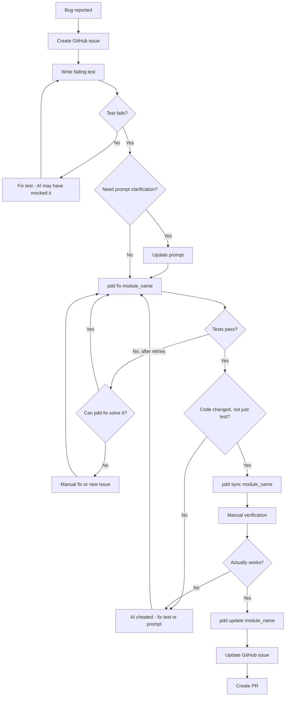
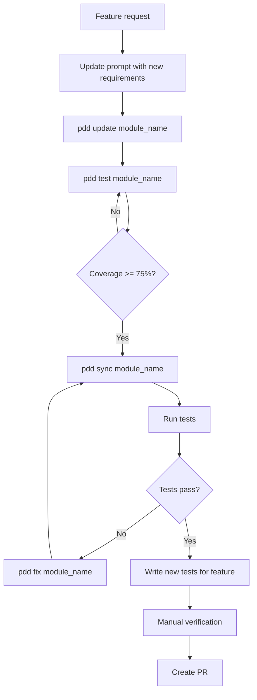

# PDD Internal Onboarding

For PDD employees with access to shared infrastructure.

> **Note**: This guide supplements the main [ONBOARDING.md](ONBOARDING.md). Complete steps 1-6 from that guide first, then return here for secrets management setup.

## Infisical Setup

PDD employees use Infisical for centralized secrets management instead of local `.env` files for API keys.

### 1. Accept the Invitation

Check your email for an Infisical invitation from the PDD team. Accept it and verify you can see the project in your Infisical dashboard.

### 2. Install the Infisical CLI

Choose the command for your operating system:

**macOS:**
```bash
brew install infisical
```

**Windows (PowerShell):**
```powershell
winget install infisical
```

**Linux:**
```bash
curl -1sLf 'https://artifacts-cli.infisical.com/setup.deb.sh' | sudo -E bash
```

### 3. Authenticate and Link Your Repository

From the root of the `pdd` repository:

```bash
# Log in to your Infisical account
infisical login

# Link your local repo to the Infisical project
infisical init
```

## Local Configuration

Even with Infisical, you need one local setting in your `.env` file:

```bash
# Add to .env (file path can't be stored in Infisical)
VERTEX_CREDENTIALS=/path/to/service-account.json
```

**To get the service account JSON:**
- Ask your team lead for access to the shared GCP service account, or
- Create your own following the Vertex AI setup steps in ONBOARDING.md

## Running Commands

Always use the `infisical run --` prefix to inject secrets:

```bash
# Run tests
infisical run -- make test

# Generate code
infisical run -- pdd generate module_name

# Sync a module
infisical run -- pdd sync module_name
```

## What's in Infisical

The following secrets are managed centrally:

| Category | Variables |
|----------|-----------|
| LLM API Keys | `OPENAI_API_KEY`, `ANTHROPIC_API_KEY`, `GOOGLE_API_KEY`, etc. |
| Vertex AI | `VERTEX_PROJECT`, `VERTEX_LOCATION` |
| GCS Caching | `GCS_BUCKET_NAME`, `GCS_HMAC_ACCESS_KEY_ID`, `GCS_HMAC_SECRET_ACCESS_KEY` |

**Not in Infisical** (must be set locally):
- `VERTEX_CREDENTIALS` - path to your local service account JSON file
- `PDD_PATH` - path to your local PDD installation

## Troubleshooting

**"Secret not found" errors:**
- Ensure you ran `infisical init` in the repo root
- Verify you have access to the project in your Infisical dashboard

**"API key appears too short" warnings:**
- This usually means Infisical secrets aren't being loaded
- Check that you're using `infisical run --` prefix

**Conflicts with local `.env`:**
- Infisical values take precedence over `.env` when there's a name conflict
- Keep only `VERTEX_CREDENTIALS` and `PDD_PATH` in your local `.env`

## Cost-Efficient CLI Usage

PDD has Google Cloud credits and limited Claude Max seats. Use AI CLI tools in this order to maximize value:

| Tier | Model | CLI Tool | Cost |
|------|-------|----------|------|
| 1st | Gemini Flash 3.0 | Gemini CLI | Free (GCP credits) |
| 2nd | Gemini Pro 3.0 | Gemini CLI | Free (GCP credits) |
| 3rd | Claude Opus 4.5 | Claude Code CLI | Limited (Max subscription) |

### Try and Escalate

1. **Start with Gemini Flash 3.0** for all tasks
2. **Escalate to Gemini Pro 3.0** if Flash struggles or produces poor results
3. **Use Claude Opus 4.5** only for truly complex problems that Gemini can't handle

This approach leverages our GCP credits while conserving limited Claude Max usage for when it's really needed.

## PDD Module Development Workflows

PDD has different workflows for **bug fixes** vs **new features**. The key principle: *bug fixes start with tests; features start with prompts*.

### Bug Fix vs Feature: Which Workflow?

| Task Type | Start With | Why |
|-----------|------------|-----|
| **Bug Fix** | Test file | Bugs represent *missed intent*—capture as a failing test first |
| **New Feature** | Prompt | Features represent *new intent*—define in the prompt first |

---

### Bug Fix Workflow



#### Steps

1. **Create GitHub issue** (enables parallel debugging):
   ```bash
   # Have Claude Code summarize the bug and create an issue
   # This lets you farm out multiple bugs to debug in parallel
   ```

2. **Write a failing test** (manually or via Claude Code):
   ```bash
   # NOTE: `pdd bug` doesn't work reliably yet - write tests manually
   # Add test to tests/test_module_name.py

   # Run the test to confirm it FAILS
   infisical run -- pytest -vv tests/test_module_name.py::test_specific_bug
   ```

   > **Why must it fail?** AI loves to mock things. If the test passes immediately, it's probably mocked up and not actually testing anything. A failing test proves you've pinpointed the real issue.

3. **Clarify the prompt** (if the bug reveals ambiguity):
   ```bash
   # Only if the prompt conflicts with expected behavior
   # Edit prompts/module_name.prompt directly
   # This is important because pdd fix reads the prompt
   ```

4. **Fix the code**:
   ```bash
   infisical run -- pdd fix module_name
   ```

5. **Verify the fix is real** (critical step!):
   ```bash
   # Check that CODE changed, not just the test
   git diff

   # If only the test changed and it passes - AI cheated!
   # The AI tends to do the easiest thing, which is often
   # modifying the test to pass rather than fixing the code
   ```

6. **Sync to regenerate example**:
   ```bash
   # Sync regenerates code and example (bug fix may add new inputs/outputs)
   infisical run -- pdd sync module_name
   ```

7. **Manual verification ("touch grass")**:
   ```bash
   # Run the actual command end-to-end
   # AI often works around problems rather than fixing them
   # You need to verify it actually works in reality
   ```

8. **Check if prompt needs updating**:
   ```bash
   # Run pdd update to see if prompt should change
   # Usually not needed for bug fixes, but check anyway
   infisical run -- pdd update module_name
   ```

9. **Update the GitHub issue and create PR**:
   ```bash
   # Have Claude Code:
   # 1. Summarize what was done
   # 2. Update the GitHub issue with findings
   # 3. Create PR linked to the issue
   ```

#### What if `pdd fix` can't fix it?

If `pdd fix` fails repeatedly even with agentic mode:
1. Analyze the scenario (multi-module issue? import problem?)
2. Try manual intervention
3. Create a new issue - it's likely a bug in `pdd fix` itself

---

### New Feature / Module Update Workflow

For adding features or maintaining modules, follow this workflow from the team discussion:



#### Steps

1. **Update the prompt** with new requirements:
   ```bash
   infisical run -- pdd update module_name
   ```

2. **Increase test coverage** to at least 75%:
   ```bash
   infisical run -- pdd test module_name

   # Check current coverage
   infisical run -- make coverage
   ```

3. **Regenerate the module**:
   ```bash
   # Sync regenerates code and updates the few-shot database
   infisical run -- pdd sync module_name
   ```

4. **Fix any failures** and iterate:
   ```bash
   infisical run -- pdd fix module_name
   ```

> **Note**: If coverage is below 50%, prioritize increasing it before regeneration. Low coverage leads to unreliable regeneration.

---

### PR Requirements Checklist

Before merging a PR, ensure it contains:

| Required | Item | Notes |
|----------|------|-------|
| ✅ | **Test** | Immediate rejection if missing - proves the bug existed |
| ✅ | **"All regression passed"** | So reviewer knows it's safe to merge |
| ⚠️ | **Prompt change** | Or comment: "prompt update not needed" |
| ⚠️ | **Example regenerated** | If prompt changed, example likely needs regeneration |
| ✅ | **Linked to issue** | PR and issue should reference each other |

---

### Quick Reference

| Command | Purpose | When to Use |
|---------|---------|-------------|
| `pdd fix` | Fix code to pass failing tests | Bug fixes, feature iteration |
| `pdd update` | Check if prompt needs changes | After fix, before PR |
| `pdd test` | Generate tests to increase coverage | Before regeneration (target: 75%+) |
| `pdd sync` | Regenerate code, example & update few-shot DB | After fixes succeed |

> **Note**: `pdd bug` doesn't work reliably yet. Write tests manually or with Claude Code.

### Important Notes

- **Tests are permanent, code is ephemeral**: Tests accumulate over time; code is regenerated
- **Verify AI didn't cheat**: After `pdd fix`, check that CODE changed, not just the test
- **Touch grass**: Always manually verify the fix actually works end-to-end
- **Parallel debugging**: Create GitHub issues so multiple bugs can be debugged simultaneously
- **Few-shot learning**: Each successful sync updates the few-shot database, improving future generations
- **Coverage matters**: Modules with <50% coverage produce unreliable regenerations
