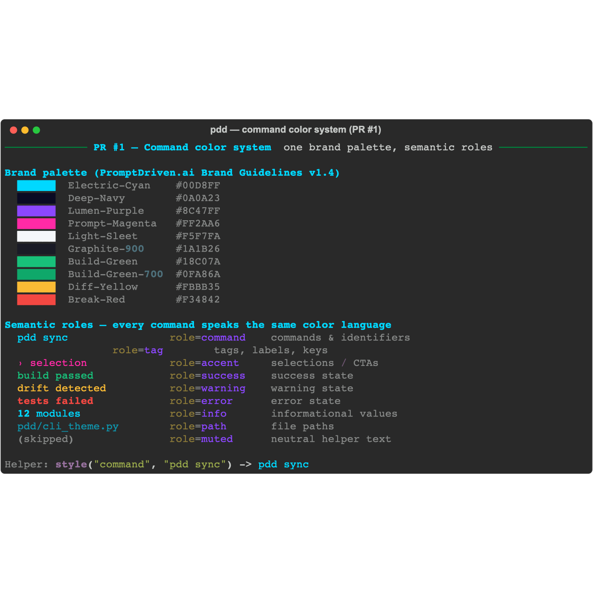
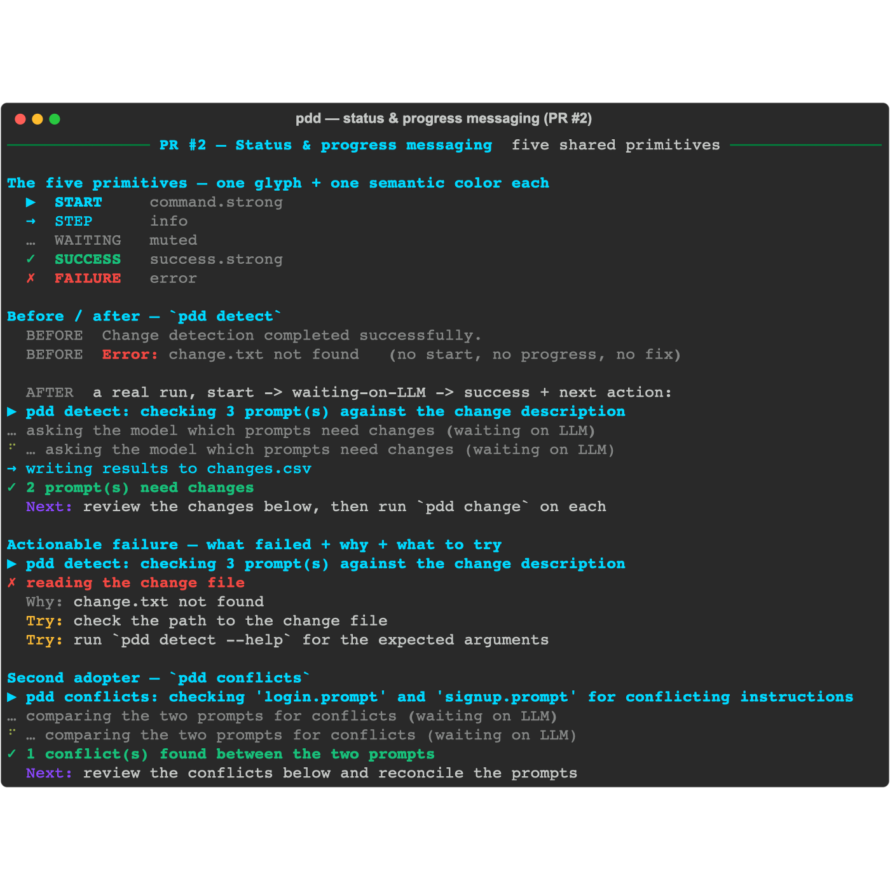
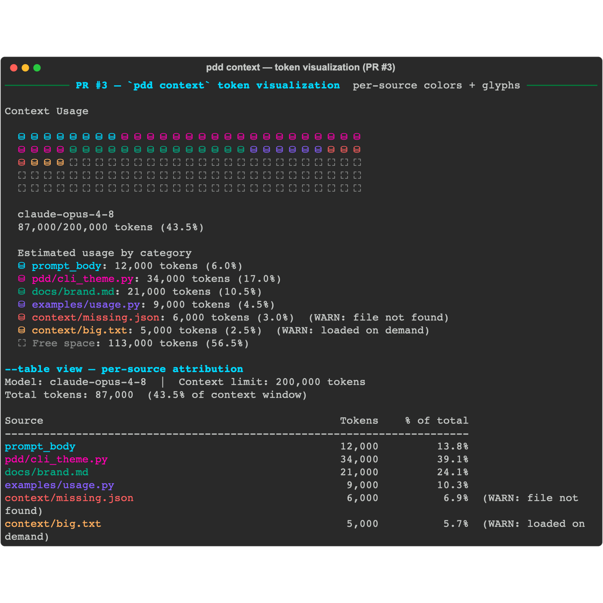

# EPIC #1540 — design-refresh demos

Terminal captures of the workstreams landed on `epic/1540-design-refresh` so far.
Each capture is generated from the **real** PDD modules on this branch (same
glyphs, colors, and message shapes the CLI emits) by
[`generate_demos.py`](./generate_demos.py) and exported with Rich's SVG recorder.

Each demo is committed as both a crisp **`.svg`** (source) and a **`.png`**
(guaranteed inline render on GitHub).

## PR #1 — Command color system (#1551)

One brand-derived palette (PromptDriven.ai Brand Guidelines v1.4) and a fixed set
of semantic roles (`command`, `tag`, `accent`, `success`, `warning`, `error`,
`info`, `path`, `muted`) so every command speaks the same color language.



## PR #2 — Status & progress messaging (#1552)

Five shared primitives — `▶ START · → STEP · … WAITING · ✓ SUCCESS · ✗ FAILURE` —
so the user can always tell what is happening now, what comes next, whether it is
waiting on the LLM, and what succeeded or failed (with a concrete next action, and
on failure: what failed + why + what to try). First adopters: `pdd detect` and
`pdd conflicts`.



## PR #3 — `pdd context` token visualization (#1553)

A Claude-Code-`/context`-style usage box with per-source colored token glyphs
(`⛁` used / `⛶` free), plus a `--table` per-source attribution view. Unresolved
sources render red, deferred ones yellow.



## Regenerating

```bash
# from a checkout of this branch, using a Python env with pdd's deps:
PYTHONPATH=$PWD python docs/design/demos/generate_demos.py docs/design/demos
```
