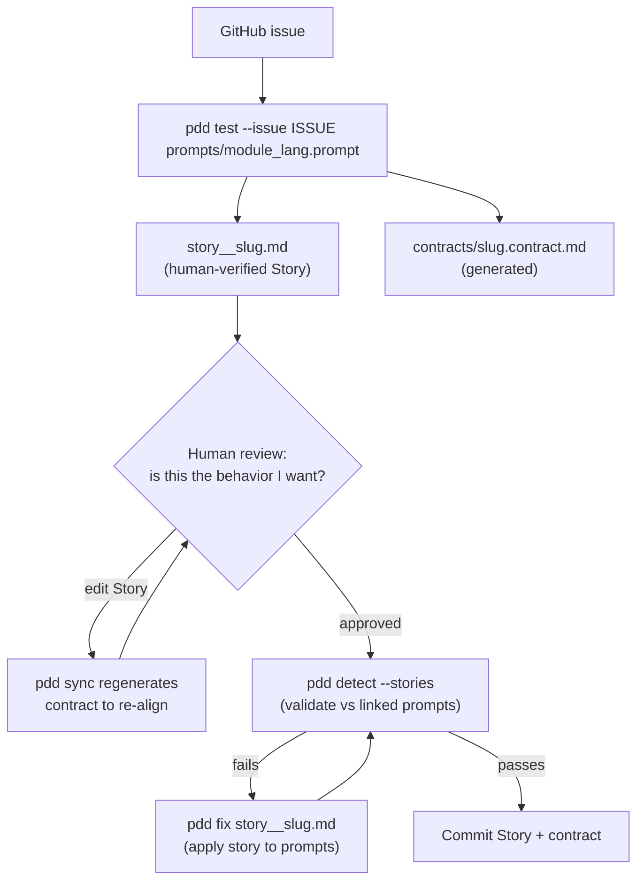

# Generating User Stories from GitHub Issues

A methodology and step-by-step guide for turning a GitHub issue into a durable,
human-verified **user story** in PDD.

This document is the *how-to / process* companion to the conceptual reference in
[`docs/prompting_guide.md`](prompting_guide.md) ("User Stories as Contract
Coverage") and the original design note
[`docs/issue_820_user_story_template.md`](issue_820_user_story_template.md). Read
this when you have an issue in hand and want to produce a story; read the
prompting guide when you want the model and rationale.

## Why user stories

A user story is an **independent oracle** for a piece of behavior. It captures
*what a user gains* from an issue — in plain language, durably — and is checked
against the prompts that are supposed to deliver it. Because the story is written
from the **issue alone** (never from the prompt or the generated code), it can
catch *prompt drift*: if a prompt stops delivering the behavior the issue
promised, the story fails even though the code still compiles and its own tests
still pass.

Use a story for:

- product/acceptance-level behavior that is easier to describe from the user's
  perspective than from a module's,
- cross-module behavior, critical edge cases, and negative ("must not") behavior,
- regressions captured from a bug, and
- any high-risk MUST / MUST NOT contract rule that needs coverage evidence (see
  [`docs/coverage_contracts.md`](coverage_contracts.md)).

## The two-file model

A story lives in **two files with different owners**:

| File | Owner | Holds | Edited by |
| --- | --- | --- | --- |
| `user_stories/story__<slug>.md` | **Human** (source of truth) | One plain-language `## Story` sentence | A person, by hand |
| `user_stories/contracts/<slug>.contract.md` | **Tooling** (generated) | `## Covers`, `## Acceptance Criteria`, `## Oracle`, `## Non-Oracle`, `## Negative Cases`, `## Non-Goals`, `## Candidate Prompts` | Regenerated, never hand-edited |

The human file is deliberately tiny so a person can read it, decide *"yes, that
is the behavior I want"*, and verify it by using the product. The machine-checkable
contract is **derived** from that Story plus the original issue, and is
re-derived whenever the Story changes. A `story-hash` in the contract header
tracks alignment.

> **Edit the Story, not the contract.** Hand-editing the contract is overwritten
> the next time it is regenerated.

## Workflow at a glance



## Step 1 — Get the issue

A story is generated from a **single GitHub issue**. The issue is the behavioral
source: acceptance criteria, options, exit codes, and MUST / MUST NOT
constraints all come from it.

You can point PDD at the issue three ways (the first that resolves wins):

1. **Local Markdown file** — preferred for offline, deterministic runs:
   `--issue ./issue-1454.md`
2. **Issue number** (repo inferred from the local git remote): `--issue 1454`
3. **Full GitHub URL**: `--issue https://github.com/promptdriven/pdd/issues/1454`

URL/number forms are fetched via the `gh` CLI, so you must be authenticated
(`gh auth status`). For reproducible CI, prefer saving the issue body to a
Markdown file and passing that path.

> **Tip:** A good issue makes a good story. Make sure the issue states the
> user-facing capability and any MUST NOT constraints explicitly — those become
> the contract's `## Acceptance Criteria` and `## Negative Cases`.

## Step 2 — Generate the story

Run `pdd test` with `--issue` and one or more `.prompt` files. The prompt files
are the **validation targets** the story will be linked to — they are *not* shown
to the story author, which is what keeps the story an independent oracle.

```bash
# From a GitHub issue URL
pdd test --issue https://github.com/promptdriven/pdd/issues/1454 \
  prompts/commands/generate_python.prompt

# From an issue number (repo inferred)
pdd test --issue 1454 prompts/commands/generate_python.prompt

# From a local issue file (deterministic / offline)
pdd test --issue ./issue-1454.md prompts/commands/generate_python.prompt
```

What this does:

1. **Resolves the issue source** (local file → number → URL).
2. **Writes the human Story** to `user_stories/story__<slug>.md`. The LLM sees
   only the issue text and writes one `## Story` sentence in the canonical shape
   *"As a &lt;persona&gt;, I can &lt;capability&gt;, so that &lt;benefit&gt;."*
3. **Generates the contract** at `user_stories/contracts/<slug>.contract.md` from
   the Story + issue + a prompt inventory, filling in `## Covers`,
   `## Acceptance Criteria`, `## Oracle`, `## Non-Oracle`, `## Negative Cases`,
   `## Non-Goals`, and `## Candidate Prompts`.
4. **Links the prompts** by writing a `<!-- pdd-story-prompts: ... -->` metadata
   comment at the top of the Story file.

The `<slug>` is derived from the prompt file names (e.g.
`prompts/commands/generate_python.prompt` → `story__pdd_test.md`). Pass
`--output <dir-or-path>` to control where the Story is written.

> `pdd test` has four modes. Story generation is selected automatically when the
> positional arguments are **all `.prompt` files** and you pass `--issue`. (The
> other modes: a bare GitHub issue URL runs agentic UI test generation;
> `--manual PROMPT CODE` generates unit tests; a single `story__*.md` argument
> just refreshes prompt-link metadata — see Step 5.)

## Step 3 — Review and verify the Story (the human gate)

Open `user_stories/story__<slug>.md` and read the single sentence. This is the
**only** artifact a human signs off on. Check it against these rules:

- **Plain language.** A newcomer who does not know PDD/LLM internals should grasp
  it on first read. Translate internal jargon to the plain idea even if the issue
  used it (e.g. "hydrated prompt" → "your fully assembled prompt with all its
  includes"). Keep genuine interface terms — real command names, `--json`, exit
  codes — because those are the user's own vocabulary.
- **No internals.** No flag names, exit codes, JSON shapes, or implementation
  structure in the Story sentence. Those belong in the generated contract.
- **Durable.** Describe the user's *stable goal* and *observable outcome*. Never
  pin the Story to a specific external product, tool, brand, or UI ("works like
  Claude Code's UI", "matches Codex") and never to a time-/version-specific fact
  ("the current best model", "as of 2026") unless the issue makes that exact
  version the requirement. Whichever tool is "best" today may be surpassed
  tomorrow; a pinned story rots into a false failure.
- **One capability.** Capture the single thing the user gains. Split unrelated
  capabilities into separate stories.

If the Story is right, you are done verifying — **trust the Story, let the
tooling own the contract.** Skim the contract only as a reviewer; do not edit it.

## Step 4 — Edit and re-sync (when the Story is wrong)

If the Story sentence is wrong, **edit the human Story file directly** and
regenerate the contract so the two stay aligned:

```bash
# After hand-editing user_stories/story__<slug>.md, regenerate its contract
pdd sync user_stories/story__<slug>.md
```

The contract is re-derived from your edited Story plus the issue recorded in the
contract header (`issue-ref="..."`), and the `story-hash` is updated. If no issue
reference is recorded, re-run the Step 2 command with `--issue` to re-anchor it.

Never close the loop by editing the contract — your edits will be regenerated
away. The Story is the source of truth; the contract follows it.

## Step 5 — Link or refresh prompt metadata

The Story is tied to the prompts it validates via the
`<!-- pdd-story-prompts: ... -->` comment. Step 2 sets this automatically. If
prompt files are renamed/moved, or you want to re-resolve the links, refresh the
metadata without regenerating the Story:

```bash
pdd test user_stories/story__<slug>.md
```

This re-links prompts (preferring prompts that actually changed, then explicit
references in the Story text, then all prompts as a fallback) and updates the
metadata comment.

## Step 6 — Validate against the prompts

Validation feeds the Story **and its contract, combined**, to `detect_change`
against each linked prompt. A story **passes** when the prompts still deliver the
promised behavior, and **fails** when they have drifted.

```bash
# Validate every story in user_stories/ against its linked prompts
pdd detect --stories

# Useful flags
pdd detect --stories --stories-dir user_stories --prompts-dir prompts
pdd detect --stories --no-fail-fast      # report all failures, don't stop at the first
pdd detect --stories --include-llm       # also validate against *_llm.prompt runtime templates
```

`pdd change` also runs story validation after a prompt modification, so stories
act as a regression gate during normal development.

## Step 7 — Fix drift

When a story fails because the prompts have drifted from the promised behavior,
apply the story back to the prompts and re-validate:

```bash
pdd fix user_stories/story__<slug>.md
```

This treats the Story + contract as the spec and updates the linked prompts to
satisfy it. Re-run `pdd detect --stories` to confirm.

## Anatomy of the generated files

**Human Story** — `user_stories/story__pdd_test.md`:

```md
<!-- pdd-story-prompts: prompts/commands/generate_python.prompt -->

# User Story: pdd test

## Story

As a maintainer who needs confidence in generated or changed code,
I want PDD to create, update, or link the right test and story artifacts from my request,
so that behavior can be verified through tests and durable user stories.
```

**Generated contract** — `user_stories/contracts/pdd_test.contract.md` (shown for
reference, not for hand-authoring):

```md
<!-- pdd-story-contract derived-from-story="../story__pdd_test.md" story-hash="<auto>" issue-ref="<url|number|path>" -->

# Contract: pdd test

## Covers
- R1: GitHub issue URLs route to agentic test generation.
- ...

## Acceptance Criteria
1. Given a GitHub issue URL and no manual override, when the user runs
   `pdd test <issue-url>`, then the command invokes agentic test mode ...

## Oracle
These details matter for pass/fail:
- routing among agentic issue, story generation, story linking, and manual modes
- ...

## Non-Oracle
These details should not matter:
- exact generated test code
- exact LLM-authored story wording as long as it passes validation
- ...

## Negative Cases
- A story file must not be treated as a prompt file for manual unit-test generation.
- ...

## Non-Goals
- This story does not cover `pdd generate` or `pdd example`.

## Candidate Prompts
- `prompts/commands/generate_python.prompt` — primary owner of the `pdd test` CLI. (primary)
- `prompts/agentic_test_python.prompt` — related agentic issue testing workflow. (related)
```

The contract's **Oracle vs. Non-Oracle** split is the durability boundary: assert
the user-facing outcome in `## Oracle`, and push anything that legitimately
varies during normal development (internal structure, exact non-user-facing
wording, cosmetic presentation, which model is used) into `## Non-Oracle`. A
contract has two failure modes, both bad — *too weak* (passes after a real
regression) and *too harsh* (fails on a healthy refactor). The generator aims for
the narrowest assertion that still catches the regression.

## File and naming conventions

- Stories: `user_stories/story__<slug>.md` (override the directory with
  `PDD_USER_STORIES_DIR`).
- Contracts: `user_stories/contracts/<slug>.contract.md` (sibling `contracts/`
  directory).
- Prompts: `prompts/` (override with `PDD_PROMPTS_DIR`).
- Slug: derived from the prompt file names, e.g. `refund_payment_python.prompt`
  → `story__refund_payment.md`.
- Templates: `user_stories/story__template.md` and
  `user_stories/contracts/template.contract.md`.

## CI integration

Add story validation as a pre-merge gate so prompt drift is caught
automatically:

```bash
pdd detect --stories --no-fail-fast
```

Pair it with the related quality gates: prompt and story quality
([`docs/prompt_lint.md`](prompt_lint.md)), deterministic contract-section lint
([`docs/contract_check.md`](contract_check.md)), and the rule-to-story/test
coverage matrix ([`docs/coverage_contracts.md`](coverage_contracts.md)).

## Quick reference

| Goal | Command |
| --- | --- |
| Generate a story + contract from an issue | `pdd test --issue <url\|number\|file> prompts/<module>_<lang>.prompt` |
| Regenerate a contract after editing the Story | `pdd sync user_stories/story__<slug>.md` |
| Refresh prompt-link metadata only | `pdd test user_stories/story__<slug>.md` |
| Validate all stories against their prompts | `pdd detect --stories` |
| Apply a story back to its prompts | `pdd fix user_stories/story__<slug>.md` |

## See also

- [`docs/prompting_guide.md`](prompting_guide.md) — "User Stories as Contract
  Coverage": the conceptual model, template, and rationale.
- [`docs/issue_820_user_story_template.md`](issue_820_user_story_template.md) —
  original design note for story contract coverage.
- [`docs/coverage_contracts.md`](coverage_contracts.md) — rule-to-story/test
  coverage matrix.
- [`docs/contract_check.md`](contract_check.md) — deterministic contract-section
  lint.
- [`docs/prompt_lint.md`](prompt_lint.md) — pre-merge prompt and user-story
  quality checks.
