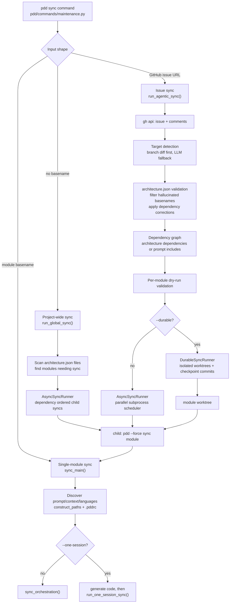
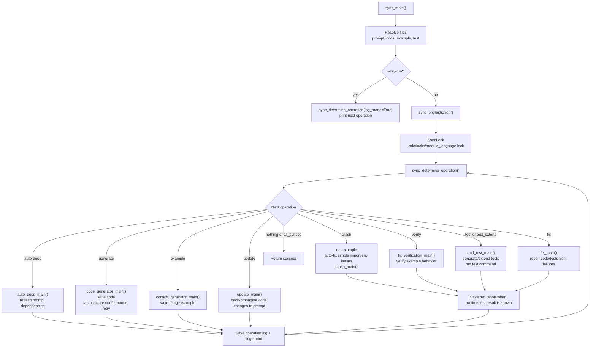
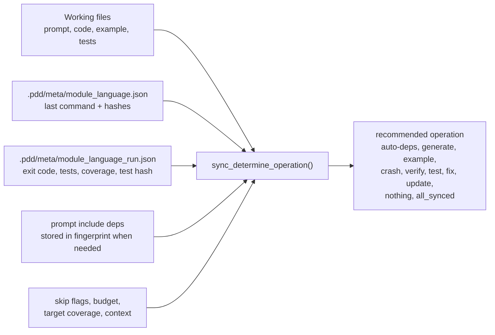
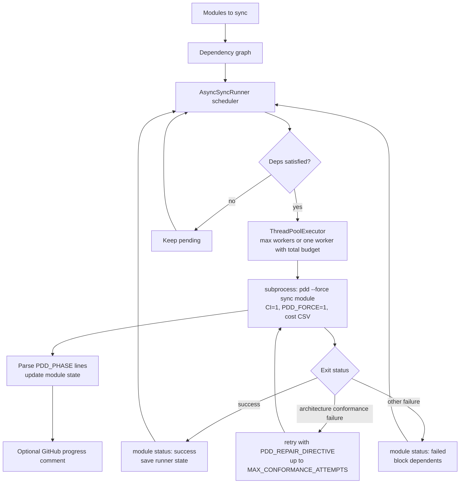

# PDD Sync Architecture Diagram

## Command Dispatch

## Single-Module Sync Loop

## Decision Inputs And State

## Multi-Module Runner

## Main Source Map

| Area | File |
| --- | --- |
| Click command dispatch | `pdd/commands/maintenance.py` |
| Single-module CLI wrapper | `pdd/sync_main.py` |
| State decision engine | `pdd/sync_determine_operation.py` |
| Single-module operation loop | `pdd/sync_orchestration.py` |
| Issue/global multi-module sync | `pdd/agentic_sync.py` |
| Parallel child sync runner | `pdd/agentic_sync_runner.py` |
| Durable worktree runner | `pdd/durable_sync_runner.py` |
| One-session agent path | `pdd/one_session_sync.py` |
| Sync UI and steering | `pdd/sync_tui.py` |
