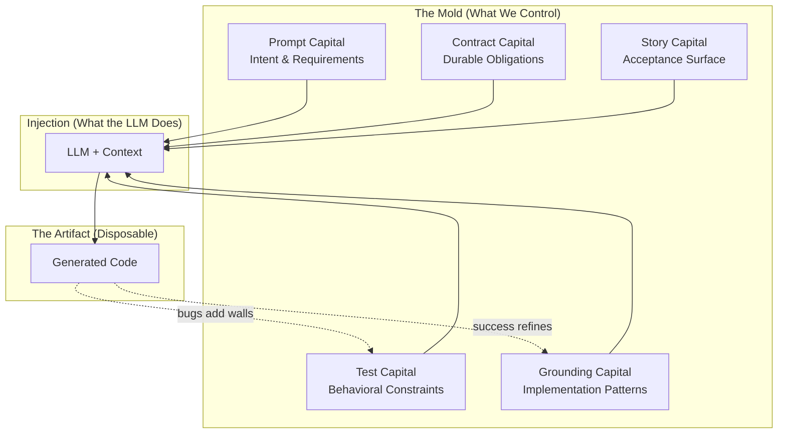

# Prompt‑Driven Development Doctrine

A concise set of principles for building and maintaining software where prompts are the primary source artifact, contract rules define durable obligations, user stories and tests preserve behavior, regeneration is the default, and synchronization across prompts, code, examples, stories, tests, and evidence is non‑negotiable.

## Why This Doctrine
- **Maintenance reality:** A large share of software cost is post‑creation. Patching accretes complexity; regeneration preserves integrity.
- **Intent over implementation:** Prompts capture the "why"; code captures one "how." We version the former and regenerate the latter.
- **Batch leverage:** Modern LLMs and batch economics make full‑module regeneration practical, reliable, and cost‑effective.

## The Mold Paradigm

To understand why PDD represents a fundamental shift—not just a new tool—consider an analogy from manufacturing: the transition from wood carving to injection molding.

### The Economic Inversion

**The Wood Era (Hand‑Written Code)**

In the pre‑industrial era, craftsmen worked directly with wood:
- Materials were relatively cheap; labor was expensive
- Each piece was hand‑carved, unique
- Modifications meant carefully chipping away at existing work
- The artifact accumulated the history of every cut
- Skill resided in the craftsman's hands
- Value lived in the object itself

This mirrors traditional software development:
- Compute is cheap; developer time is expensive
- Each codebase is hand‑written, unique
- Bug fixes mean surgically editing existing lines
- Code accumulates layers of patches, workarounds, "temporary" fixes
- Skill is measured by navigating legacy complexity
- Value is perceived to live in the code

**The Plastic Era (Generated Code)**

When injection molding emerged, it didn't just make production "faster." It triggered a **value migration**:
- Tooling (molds) became expensive upfront
- Per‑unit cost approached zero
- The object became disposable—you could produce infinite identical copies
- Modifications meant changing the mold, not the object
- Skill shifted to mold design
- Value migrated to the mold (the specification)

This mirrors PDD:
- Prompt, contract, story, and test design require thought (the "expensive" part)
- The marginal cost of regeneration approaches zero relative to manual patching, but verification and review still require discipline
- Code is disposable—regenerate at will
- Modifications mean changing the prompt, not the code
- Skill shifts to specification design
- Value lives in the source specification: prompts, contracts, stories, tests, and examples. Evidence makes regeneration reviewable.

*Note: "Cheap generation" doesn't mean "no effort." Good prompts, comprehensive tests, and careful verification all require work. PDD shifts **where** effort is invested (specification and constraints) rather than **whether** effort is required.*

**The Key Insight**

When plastic emerged, early adopters made a category error: "Now we can make cheaper wood‑like things!" They focused on the output rather than recognizing the paradigm shift.

Similarly, many view AI coding tools as "faster typing"—using LLMs to patch code, treating prompts as ephemeral instructions. They're making "cheaper wood."

The real insight: **value has migrated from the artifact to the specification**. Prompts, contracts, stories, tests, and examples are the mold; evidence records the production run; code is just what comes out.

### The Five Capitals

PDD success depends on five types of accumulated "capital," each playing a distinct role:

**1. Test Capital: The Mold Walls**

Tests define the **negative space**—what the generated code must satisfy:

```
┌─────────────────────────────────────────────────────────────┐
│                        THE MOLD                             │
│  ┌───────────────────────────────────────────────────────┐  │
│  │ TEST: null input returns None                         │  │ ← wall
│  ├───────────────────────────────────────────────────────┤  │
│  │ TEST: empty string returns ""                         │  │ ← wall
│  ├───────────────────────────────────────────────────────┤  │
│  │ TEST: handles unicode correctly                       │  │ ← wall
│  ├───────────────────────────────────────────────────────┤  │
│  │                                                       │  │
│  │            [space where code is generated]            │  │
│  │                                                       │  │
│  ├───────────────────────────────────────────────────────┤  │
│  │ TEST: performance < 100ms for 10k items               │  │ ← wall
│  └───────────────────────────────────────────────────────┘  │
└─────────────────────────────────────────────────────────────┘
```

Each test is a wall. Each bug discovered adds a wall. The more walls, the more constrained the shape, the more consistent regenerations become. This connects to the principle of **Test Accumulation**.

**The Precision Trade‑off: 3D Printing vs Injection Molding**

Consider two manufacturing approaches:

| Approach | How It Works | Precision Required |
|----------|--------------|-------------------|
| **3D Printing** | Deposits material precisely, layer by layer, with no mold | Extremely high—every point must be specified |
| **Injection Molding** | Injects material into a pre‑existing mold | Lower—material flows until it hits walls |

This maps directly to PDD:

| PDD Scenario | Equivalent | Prompt Precision Needed |
|--------------|------------|------------------------|
| Few tests | 3D printing | High—prompt must specify every behavior |
| Many tests | Injection molding | Lower—tests guide generation and enforce behavior |

The inverse relationship is fundamental: **as test coverage increases, prompt precision requirements decrease**. Each test you add is a wall the generated code is expected to respect and the test runner can enforce. With enough walls, the prompt only needs to specify intent—the tests handle much of the precision work.

This is why test accumulation matters: it's not just about catching regressions, it's about making prompts simpler and regeneration more reliable over time.

> More tests, less prompt. The mold does the precision work.

**2. Prompt Capital: The Injection Point**

The prompt directs **what fills the mold**—the intent, responsibilities, and requirements:

```python
# The prompt doesn't define every wall
# It defines WHAT you're asking for and WHY
# Contracts, stories, and tests make the behavioral shape explicit

"Create a function that parses user IDs..."
"Must handle untrusted input..."
"Return None on failure, never throw..."
```

The prompt is the injection specification—not the mold walls, but instructions for what gets injected and how. It answers "what do we want?" while contracts, stories, and tests answer "what must it satisfy?"

**3. Contract Capital: The Durable Obligations**

Contracts are the stable obligations inside the prompt: MUST, MUST NOT, MAY, SHOULD, and DOES NOT. They are the part of natural language that survives regeneration, review, and tooling.

A prompt may express broad intent:

```
Refunds must be safe.
```

A contract makes that intent durable:

```
R2 — For every refund request, the system MUST reject the request
when the requested amount is greater than the remaining refundable amount.
```

Contracts are not implementation instructions. They are behavioral obligations that stories, tests, policies, and reviewers can check.

**4. Story Capital: The Human Acceptance Surface**

User stories connect contract rules to product meaning. A contract says what must always be true. A story shows a concrete situation where that obligation matters.

Stories are not merely examples. In PDD, stories are prompt-level acceptance tests: they validate intent and acceptance behavior, while executable tests enforce behavior in code.
- they link to prompts,
- they identify covered contract rules,
- they define acceptance criteria,
- they name the oracle and non-oracle,
- they preserve user-facing intent across regeneration.

**5. Grounding Capital: Material Science**

Grounding determines the **properties of the "material"** being injected:

```
Same prompt + different grounding = different implementation patterns

Grounding from OOP module    → generates classes
Grounding from functional    → generates pure functions
Grounding from your success  → matches your established style
```

Just as plastic manufacturers must understand their material's properties, PDD practitioners benefit from understanding how grounding shapes generation.

**How They Work Together**



### Tests as Specification, Not Just Verification

This represents a subtle but profound shift in how tests function:

**Old Paradigm: Tests Verify**
```
Developer writes code
        ↓
Tests check if code works
        ↓
(Tests are after‑the‑fact QC)
```

Tests ask: "Did you build it right?"

**PDD Paradigm: Tests Specify**
```
Tests exist (the mold walls)
        ↓
Code is generated with those tests as behavioral context
        ↓
(Tests are before‑the‑fact constraints)
```

Tests tell the LLM: "Here are the walls this behavior must stay within."

When you run `pdd generate` after adding a test, the LLM sees that test as behavioral context. The generated code is expected to preserve that behavior, but the test runner provides the enforcement. The test acts as both specification and verification: it tells the model what behavior matters, then mechanically rejects outputs that violate it.

**Building on TDD's Foundation**

This insight isn't new—TDD practitioners have understood "tests as specification" for decades. What's new is that **generation makes specification‑first practical at scale**.

TDD required discipline: write the test first, resist the urge to jump into implementation. Many developers found this unnatural. PDD inverts the pressure: you *can't* jump into implementation because you're not writing the code—the LLM is. Writing tests first becomes the natural workflow because tests are how you describe and enforce what gets generated.

If you're already a TDD practitioner, PDD is a natural evolution. Your test‑first instincts become your primary tool for shaping generated output.

### The Compound Interest of Molds

Here's where the economics become compelling:

**In Manufacturing**

| Investment | Returns |
|------------|---------|
| Design mold once | Produce millions of units |
| Refine mold after defect | ALL future units improve |
| Parameterize mold | Variants at near‑zero cost |

The mold has **compound returns**. Each improvement multiplies across all future production.

**In PDD**

| Investment | Returns |
|------------|---------|
| Write tests once | Guide and enforce all future generations |
| Add test for bug | The bug should not recur while the test is retained and enforced |
| Improve prompt | ALL future regenerations improve |
| Grounding accumulates | Similar modules benefit automatically |

**Contrast with Patching**

| Approach | Returns on Bug Fix |
|----------|-------------------|
| **Patch** | Fixes ONE instance; similar bugs can recur elsewhere |
| **Mold refinement** | Adds a permanent wall; future generations are rejected if they cross it |

The patch has no compound returns. The test can compound across future regenerations while it remains part of the enforced suite. This is why the **Market Effects Matter** principle states that examples and patterns compound.

**The Ratchet Effect**

Each bug discovered → test added → wall becomes permanent → mold is more precise → regeneration is safer → more bugs found → more walls added...

The system gets **more constrained over time**, not less. Unlike patched codebases that accumulate complexity, PDD codebases accumulate *constraints* while the code itself stays clean (because it's regenerated fresh each time).

### Bug Workflow as Mold Refinement

In manufacturing, when a molded part has a flaw:
1. You don't hand‑fix each defective unit
2. You **refine the mold**
3. All future units are correct

The PDD bug workflow mirrors this exactly:

**Mold Refinement Workflow (PDD)**
```
Bug discovered
      ↓
Add failing test (add mold wall)
      ↓
Regenerate (re‑inject)
      ↓
New code conforms to refined mold
      ↓
Bug should not recur while the wall remains enforced
```

**Compare to Patch Workflow**
```
Bug discovered
      ↓
Hand‑carve fix into code
      ↓
Hope you carved correctly
      ↓
Hope you didn't weaken the structure
      ↓
Similar bug appears elsewhere (code has no memory)
```

### The Skill Evolution

The wood‑to‑plastic transition didn't eliminate craftsmen—it elevated their role. Mold designers needed *deeper* understanding of materials and physics than woodcarvers. PDD represents a similar elevation.

**For Developers: Same Skills, Higher Abstraction**

| Core Skill | Traditional Application | PDD Application |
|------------|------------------------|-----------------|
| Understanding code | Writing implementations | Designing tests that guide and enforce generation |
| Debugging | Line‑by‑line tracing | Verifying generated output, refining prompts |
| Refactoring | Manual code restructuring | Prompt refinement, test reorganization |
| System thinking | Architecture design | Specification architecture, dependency mapping |
| Edge case awareness | Writing defensive code | Writing comprehensive test cases |

Your existing skills aren't declining—they're being applied at a higher level of abstraction. Instead of *writing* the defensive code, you *specify* what defensive behavior looks like (via tests). Instead of *implementing* the architecture, you *describe* the contracts and constraints.

The shift: **From implementation craft to specification craft.**

**For New Users: The Mental Model**

If you're new to PDD, the key shift is:
- You're not writing code—you're designing molds
- Quality comes increasingly from the mold, not only from the operator
- A junior developer using a mature prompt, strong tests, and established grounding can produce output much closer to senior-quality implementation for that module
- Senior judgment still matters most in designing and validating the mold
- Your job is to make the mold precise enough that regeneration is reliable

**For Decision Makers: The Economics**

| Traditional | PDD |
|-------------|-----|
| Senior devs required for complex code | Mature prompts + contracts + stories + tests reduce operator variance |
| Knowledge siloed in individuals | Knowledge encoded in prompts, contracts, stories, tests, and examples |
| Bug fixes don't compound | Bug fixes become retained tests that future generations must satisfy |
| Onboarding = learning the codebase | Onboarding centers on prompts, contracts, stories, tests, and examples instead of reverse-engineering accumulated patches |

The ROI of prompt, contract, story, and test investment compounds over time. Each improvement benefits future work.

### The Resistance Pattern

Both the wood→plastic and code→prompt transitions face similar resistance:

| Wood → Plastic | Code → Prompt |
|----------------|---------------|
| "Mass‑produced items have no soul" | "Generated code has no elegance" |
| "Can't replace the craftsman's touch" | "Can't replace developer expertise" |
| "Plastic is for toys, not furniture" | "AI is for boilerplate, not real engineering" |
| Craftsmen guilds resist | Developer culture resists |

This resistance comes from legitimate sources:
1. **Sunk cost in existing skills** — Years of expertise feel devalued
2. **Identity tied to the craft** — "I'm a coder" vs "I design specifications"
3. **Early‑stage quality issues** — Early plastic was cheap; early AI code has flaws
4. **Misunderstanding the value shift** — Focusing on artifact quality rather than specification power

The resistance fades as:
- Generation quality improves (it is improving rapidly)
- Tooling matures (grounding, test accumulation, verification)
- Success stories accumulate (teams that adopt see compounding benefits)
- The economic reality becomes undeniable

**Acknowledging Legitimate Concerns**

Not all resistance is misguided:
- Generated code does need review (that's what tests and verification are for)
- Some domains genuinely require human expertise (safety‑critical, novel algorithms)
- The transition has real costs (learning new workflows, tooling investment)

PDD doesn't claim generation is perfect—it claims that **specification + constraints + regeneration** is a better maintenance model than **accumulating patches** once generation quality crosses a threshold. For many well-scoped, testable software domains, teams may already be past that threshold.

### The Complete Analogy Map

For reference, here's the full mapping between injection molding and PDD:

| Injection Molding | PDD |
|-------------------|-----|
| Mold | Prompt + contracts + stories + tests |
| Mold walls | Individual test cases |
| Mold cavity | The behavioral space allowed |
| Injection point | Prompt requirements |
| Acceptance surface | User stories |
| Interface fixture | Accepted examples |
| Plastic material | LLM capability |
| Material formulation | Grounding (few‑shot examples) |
| Molded object | Generated code |
| Production run | `pdd generate` |
| Mold refinement | Adding tests after bugs |
| New mold | New prompt for new module |
| Parameterized mold | Prompt templating / shared preambles |
| QC inspection | `pdd verify` + generated tests + project test suite |
| Production receipt | Evidence summary |
| Mold library | Grounding database (cloud) |
| Discarding defective units | Regenerating instead of patching |
| Material science | Understanding how grounding affects generation |

**The Core Insight, Restated**

> In wood carving, value lives in the artifact.
> In injection molding, value lives in the mold.
> In traditional coding, value lives in the code.
> In PDD, value lives in the source specification: prompts, contracts, stories, tests, and examples. Evidence makes regeneration reviewable.

Prompts encode intent. Contracts define obligations. Stories give intent concrete acceptance meaning. Tests preserve behavior. Evidence makes regeneration reviewable. Regeneration sustains integrity. Together, they convert maintenance from an endless patchwork into a compounding system of leverage.

## The Focused Generation Context Advantage

Modern LLMs operate within a fixed context window—a bounded "working memory" that holds everything the model can attend to during generation. How this window is allocated fundamentally affects generation quality.

### The Agentic Overhead Problem

Interactive agentic tools (Claude Code, Cursor, etc.) often dedicate significant context to operational overhead:

The following ranges are illustrative; exact overhead varies by tool, model, configuration, and session length.

| Overhead Type | Purpose | Typical Cost |
|---------------|---------|--------------|
| System prompts | Agent behavior, safety, persona | 2,000–5,000 tokens |
| Tool definitions | Bash, Read, Edit, Write, etc. | 3,000–8,000 tokens |
| MCP server configs | External integrations | 1,000–5,000 tokens |
| Chat history | Conversation continuity | Grows unbounded |
| Agentic loop instructions | Planning, reflection, error recovery | 1,000–3,000 tokens |

This overhead competes directly with developer-provided context. As the conversation progresses and history accumulates, less of the window remains for the actual task.

### Attention Degradation

Long contexts can produce attention issues:
- **"Lost in the middle"** behavior where mid-context information may be underweighted
- **Reduced coherence** as the model tracks more threads
- **Weaker use of relevant context** as important details are surrounded by more unrelated text

The result: without explicit context pruning or summarization, long agentic sessions can become less effective as chat history grows and relevant context is diluted.

### PDD: Focused Context for Generation

PDD's batch architecture minimizes live-agent overhead inside the generation context:

```
┌─────────────────────────────────────────────────────────────┐
│                    CONTEXT WINDOW                           │
├─────────────────────────────────────────────────────────────┤
│  AGENTIC TOOL ALLOCATION                                    │
│  ┌──────────┬──────────┬──────────┬────────────────────┐   │
│  │ System   │ Tools    │ MCP      │ Chat History       │   │
│  │ Prompts  │ Defs     │ Configs  │ (grows over time)  │   │
│  └──────────┴──────────┴──────────┴────────────────────┘   │
│  ┌─────────────────────────────────────────────────────┐   │
│  │         Developer's Actual Task (what remains)      │   │
│  └─────────────────────────────────────────────────────┘   │
├─────────────────────────────────────────────────────────────┤
│  PDD ALLOCATION                                             │
│  ┌─────────────────────────────────────────────────────┐   │
│  │                                                     │   │
│  │ Prompt, contracts, stories, tests, grounding        │   │
│  │ Examples and dependency context                     │   │
│  │                                                     │   │
│  │       Focused on the generation task                │   │
│  │                                                     │   │
│  └─────────────────────────────────────────────────────┘   │
└─────────────────────────────────────────────────────────────┘
```

More of the PDD context payload can be devoted directly to generation:
- **Prompt**: Requirements, constraints, intent
- **Contracts**: Durable obligations and forbidden behavior
- **Stories**: Acceptance context and user-facing intent
- **Grounding**: Proven implementation patterns (few‑shot)
- **Tests**: Behavioral constraints (the mold walls)
- **Examples**: Usage patterns and interface expectations
- **Dependencies**: Interface definitions

Unlike interactive agent loops, PDD does not normally spend the generation payload on growing chat history, live tool schemas, or step-by-step orchestration instructions.

### Why This Matters for Hard Problems

Simple tasks tolerate context inefficiency. Hard problems don't.

When tackling complex generation—intricate algorithms, multi-system integrations, nuanced business logic—you need:
- Comprehensive requirements
- Extensive grounding examples
- Thorough test constraints
- Precise interface definitions

If 30–50% of your context window is consumed by agentic overhead, these hard problems can become intractable. PDD's focused-context architecture makes them more accessible.

### The Mold Metaphor Extended

In injection molding, the machine's operational complexity sits outside the mold cavity. The mold presents a clean shape to the material.

Similarly, PDD keeps orchestration outside the generation payload as much as possible. The model receives a focused specification rather than a sprawling chat session. The "machine" (PDD tooling, cloud grounding, test discovery) operates externally, not within the precious context.

> When more tokens serve your intent, generation quality scales better with problem complexity instead of being diluted by operational overhead.

## Conversation Is Interface, Not Source

Interactive chat is an excellent programming interface: it is useful for exploration, debugging, clarification, and small local edits. But raw conversation is not a durable source artifact.

A chat transcript contains false starts, discarded ideas, implicit context, obsolete constraints, tool output, and model guesses. It is difficult to diff, review, replay, or use as a stable source of truth.

PDD treats conversation as a discovery surface. Durable intent must be distilled into versioned prompts, contract rules, user stories, tests, and examples; evidence records what was regenerated and checked.

Use chat to discover. Use PDD to preserve. Use generated code to run.

## Core Principles
- **Prompts As Source of Truth:** Versioned prompts define behavior, constraints, responsibilities, non-responsibilities, vocabulary, and contract rules. Code, infra, and docs are generated artifacts. Examples may be generated, but once accepted they become interface assets that show intended use. Tests may also be generated, but once accepted they become accumulated source constraints that preserve behavior across regenerations.
- **Contracts As Durable Obligations:** For non-trivial modules, express critical behavior as stable, named contract rules. Use controlled natural language with MUST, MUST NOT, MAY, SHOULD, and DOES NOT.
- **Stories As Acceptance Surface:** User stories are prompt-level acceptance tests: they validate intent and acceptance behavior, while executable tests enforce behavior in code. They connect contract rules to product situations and preserve user-facing intent across regeneration.
- **Regenerate, Don’t Patch:** Change the prompt, then regenerate affected surfaces. Avoid local edits that make implementation drift from the prompt.
- **Synchronization Loop:** Always back‑propagate implementation learnings to the appropriate source artifact: prompt, contract, story, test, example, preamble, or waiver. Keep the full PDD dev unit—prompt, contracts, stories, generated artifacts, tests, and evidence—in continuous sync.
- **Test Accumulation:** Never discard passing tests after regeneration. Grow a regression net that preserves behavior as the system evolves.
- **Modular Prompt Graph:** Model systems as composable prompt modules linked via minimal usage examples that act as clear interfaces.
- **Intent First:** Capture goals (e.g., “Black Friday scale,” “HIPAA”), not just resource settings. Generation maps intent → implementation.
- **Batch‑First Workflow:** Prefer deterministic, scriptable batch generation over interactive patching. Optimize for reproducibility and cost. (This also maximizes context available for generation—see "The Focused Generation Context Advantage.")
- **Sharp Knives, Safe Defaults:** Provide powerful generation flows with sensible conventions (naming, structure, tests) to prevent foot‑guns.
- **Conceptual Compression:** Consolidate requirements, rationale, and constraints in prompts or explicitly included source documents to reduce scattered context across chats, tickets, and unlinked docs.
- **Progress Over Stasis:** Evolve prompts and regenerate even if code diffs are large. Preserve behavior with tests, not line‑level inertia.
- **Market Effects Matter:** Few‑shot examples and patterns compound. Treat examples as assets that improve quality and reduce cost over time.
- **Evidence Over Vibes:** A regeneration is not good because the output looks plausible. It is good when stories, tests, verification, policy checks, and documented waivers make its correctness reviewable.
- **Conversation Is Not Source:** Chat can discover intent, but durable intent belongs in versioned prompts, contracts, stories, tests, and examples. Evidence records what was regenerated and checked.
- **Security & Compliance Built‑In:** Express compliance, threat models, capability boundaries, and forbidden side effects in prompts; verify via stories, tests, static or policy checks, and infra policies on every regeneration.

## The PDD Workflow (At A Glance)
- **Define:** Draft or refine the prompt, including responsibilities, vocabulary, contract rules, and relevant examples.
- **Cover:** Add or update user stories for product-level behavior and high-risk contract rules.
- **Generate:** Produce code, examples, infra, and interfaces from prompts.
- **Crash/Verify:** Resolve runtime errors, then validate functional behavior against intent.
- **Test:** Generate or augment executable unit and integration tests; preserve accumulated tests.
- **Classify:** When bugs occur, distinguish code bugs from prompt defects.
- **Fix:** Regenerate or repair until stories, tests, and verification pass.
- **Evidence:** Summarize prompt changes, regeneration scope, story/test results, verification, and waivers.
- **Update:** Back‑propagate learnings into prompts, parent specs, stories, and examples.

## What “Good” Looks Like
- **One Source Set:** A reader can understand a module’s purpose, responsibilities, constraints, public interface, and acceptance surface by reading the prompt, example, linked stories, and key tests.
- **Contracted:** Critical behavior is expressed as stable contract rules, not hidden in prose or chat history.
- **Covered:** High-risk rules are covered by stories, tests, policies, or explicit waivers.
- **Reproducible:** A clean regen reproduces functionally equivalent behavior; tests and stories confirm it.
- **Small Surfaces:** Prompts are scoped, examples are minimal, interfaces are explicit.
- **Traceable:** Each fix yields a test/story addition, a prompt update, or a documented waiver.
- **Evidence‑Backed:** PRs summarize prompt changes, regeneration scope, story/test results, verification, and unchecked obligations.
- **Deterministic Enough:** Batch runs are stable; variance is constrained by prompts, contracts, examples, grounding, stories, and tests.

## Anti‑Patterns
- **Prompt Drift:** Fixing code without updating prompts or tests.
- **Spec Sprawl:** Requirements scattered across chats, tickets, and unlinked READMEs instead of consolidated in prompts or explicitly included source documents.
- **Interactive Dependence:** Relying on chat patches for structural changes that should be regenerated.
- **Test Reset:** Throwing away prior tests after regeneration.
- **Mega‑Prompts:** Unbounded prompts that do too much; prefer split and composition.
- **Contractless Critical Behavior:** Relying on vague prose for high-risk behavior such as payments, auth, privacy, security, or external side effects.
- **Storyless Product Behavior:** Shipping user-facing behavior without a story or acceptance surface that explains why it matters.
- **Unchecked Obligations:** Keeping MUST/MUST NOT rules that have no story, test, policy check, or explicit waiver.
- **Waiver Rot:** Allowing temporary waivers to become permanent hidden debt.
- **Transcript‑as‑Source:** Treating chat history as authoritative instead of distilling final decisions into prompts, contracts, stories, and tests.
- **Grounding as Authority:** Letting few-shot examples override explicit prompt requirements, contracts, or tests.

## Doctrine vs. Prompting Guide

This doctrine defines the philosophy and invariants of PDD. The prompting guide defines the authoring conventions: prompt structure, natural-language contracts, story templates, coverage maps, waivers, context directives, and review checklists.

Doctrine answers: "What must remain true?"
Prompting guide answers: "How do I write it today?"
Tooling answers: "How is it enforced?"

## From Convention to Enforcement

PDD evolves in layers:

1. **Authoring discipline:** Prompts, contracts, stories, and waivers are written consistently.
2. **Context discipline:** Dependencies, tests, examples, and grounding are made explicit.
3. **Evidence discipline:** PRs summarize what changed, what passed, and what remains unchecked or waived.
4. **Tooling enforcement:** Contract checks, coverage reports, evidence manifests, gates, and drift checks make the discipline mechanical.

A convention is still valuable before it is fully enforced. Production-critical modules should move toward mechanical enforcement wherever possible.

## Example: Applying the Doctrine in This Repository

This section is repository-specific and is not part of the general PDD doctrine.

- **Structure:**
  - Frontend in `frontend/` (Next.js App Router, TypeScript)
  - Backend in `backend/functions/` (Python 3.12, Firebase Functions)
  - Next.js hosting function in `nextjs-server-function/`
  - Prompts, seeds, and context in `prompts/` and `context/`
- **Conventions:**
  - TypeScript: 2‑space indent, Prettier single quotes/trailing commas; components in `src/components/` (PascalCase); `@/*` alias.
  - Python: 4‑space indent, snake_case modules, explicit imports; business logic under `models/` and `utils/`.
- **Commands:**
  - Setup: `make setup`
  - Dev: `make dev` (or `make run-backend` and `cd frontend && npm run dev`)
  - Tests: `make test`, `make test-backend`, `make test-frontend`
  - Lint/format: `cd frontend && npm run lint && npm run format`
- **Testing:**
  - Backend: `backend/tests/test_*.py` with pytest; preserve and expand coverage when regenerating backend modules.
  - Frontend: Jest/Vitest colocated tests; keep server/client boundaries explicit and tested.
- **Security & Config:**
  - No secrets in git. Frontend vars in `frontend/.env.local` (`NEXT_PUBLIC_*` to expose). Backend secrets in GSM; local in `backend/functions/.env`.
- **Regeneration Discipline:**
  - Update prompts in `prompts/` first; run batch generation; fix; then back-propagate learnings into prompts.
  - Treat examples as interfaces; keep them runnable and minimal.

## Authoring Prompts
- **Be Declarative:** State goals, constraints, and non‑functional requirements explicitly.
- **State Interfaces:** Describe inputs/outputs and example usage; keep examples short but executable.
- **Context Wisely:** Include only relevant examples; prefer curated few‑shot over dumping repos.
- **Encode Policies:** Compliance, security, performance SLOs, capability boundaries, and forbidden side effects belong in prompts, contracts, stories, and tests.
- **Version Clearly:** Commit prompt changes with rationale (“why” first), link to affected modules/tests.

## Working With Examples & Patterns
- **Examples As Interfaces:** Each module has a minimal example that compiles/runs and demonstrates intended use.
- **Pattern Reuse:** Prefer proven few‑shot examples from our library/marketplace over ad‑hoc hand‑holding.
- **Auto‑Submit:** Where configured and permitted by project policy, allow successful examples to contribute back to the pattern library. Respect privacy, security, and retention policies.

## Quality Bar
- **Functional Equivalence Over Textual Diff:** Large diffs are acceptable; unchanged behavior is required.
- **Green Tests Before Merge:** Regenerated code must pass existing tests plus any new ones.
- **Story Validation Before Merge:** User stories linked to changed prompts must pass or have documented follow-up.
- **Contract Coverage:** High-risk MUST/MUST NOT rules should have stories, tests, policy checks, or explicit waivers.
- **Evidence Summary:** Non-trivial regenerations should include prompt changes, regeneration scope, generated artifacts, story/test results, verification, and unchecked obligations.
- **Observability:** Add logging/metrics via prompts; verify with smoke tests.
- **Docs From Prompts:** Where practical, public-facing docs should be generated from or checked against the same sources of truth.

## Governance & Collaboration
- **PR Discipline:** Summarize prompt changes, regeneration scope, story/test deltas, verification, and unchecked or waived obligations. Attach screenshots for UI, note emulator/config changes.
- **Review Mindset:** Review prompts, contracts, stories, examples, and key tests first, then generated code for unsafe or leaky abstractions.
- **Rollbacks:** Prefer regenerating from the prior prompt version over reverting code patches.

## When To Patch
- **Local, Low‑Risk Hotfixes:** Trivial typos, comments, and non‑behavioral changes may be patched directly. If the change should survive the next regeneration, back-propagate it into the prompt, preamble, example, or test. Otherwise, expect regeneration to overwrite it.
- **Everything Else:** Regenerate.

## North Star
Prompts encode intent. Contracts define obligations. Stories give intent concrete acceptance meaning. Tests preserve behavior. Evidence makes regeneration reviewable. Regeneration sustains integrity. Together, they convert maintenance from an endless patchwork into a compounding system of leverage.
