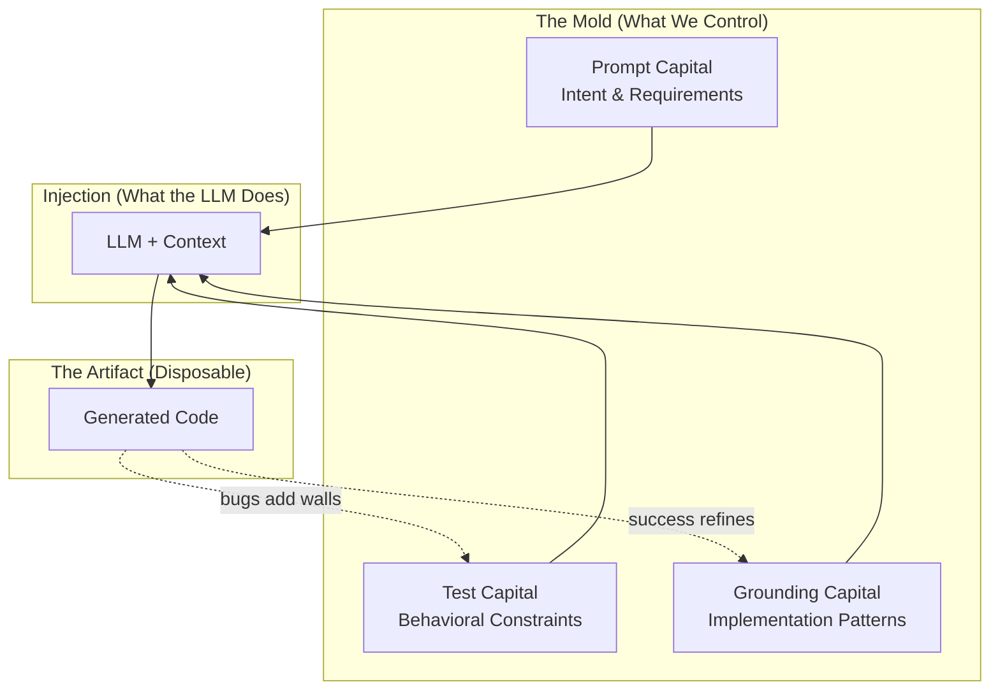

# Prompt‑Driven Development Doctrine

A concise set of principles for building and maintaining software where prompts are the primary artifact, regeneration is the default, and synchronization across code, examples, and tests is non‑negotiable.

## PDD As the Last Programming Language

PDD is not a faster way to type Python, TypeScript, or Go. It is a higher-level
source language for software intent that compiles into those implementation
languages. Developers author prompts, tests, examples, includes, and architecture
metadata; PDD regenerates the code artifacts from that source.

"The Last Programming Language" is a positioning claim, not a claim that target
languages disappear. Traditional languages remain real execution targets and
escape hatches. The shift is that humans primarily maintain the durable intent,
while generated code becomes reviewable compiler output.

## Why This Doctrine
- **Maintenance reality:** 80–90% of cost is post‑creation. Patching accretes complexity; regeneration preserves integrity.
- **Intent over implementation:** Prompts capture the "why"; code captures one "how." We version the former and regenerate the latter.
- **Batch leverage:** Modern LLMs and batch economics make full‑module regeneration practical, reliable, and cost‑effective.

## The Mold Paradigm

To understand why PDD represents a fundamental shift—not just a new tool—consider an analogy from manufacturing: the transition from wood carving to injection molding.

### The Economic Inversion

**The Wood Era (Hand‑Written Code)**

In the pre‑industrial era, craftsmen worked directly with wood:
- Materials were relatively cheap; labor was expensive
- Each piece was hand‑carved, unique
- Modifications meant carefully chipping away at existing work
- The artifact accumulated the history of every cut
- Skill resided in the craftsman's hands
- Value lived in the object itself

This mirrors traditional software development:
- Compute is cheap; developer time is expensive
- Each codebase is hand‑written, unique
- Bug fixes mean surgically editing existing lines
- Code accumulates layers of patches, workarounds, "temporary" fixes
- Skill is measured by navigating legacy complexity
- Value is perceived to live in the code

**The Plastic Era (Generated Code)**

When injection molding emerged, it didn't just make production "faster." It triggered a **value migration**:
- Tooling (molds) became expensive upfront
- Per‑unit cost approached zero
- The object became disposable—you could produce infinite identical copies
- Modifications meant changing the mold, not the object
- Skill shifted to mold design
- Value migrated to the mold (the specification)

This mirrors PDD:
- Prompt and test design requires thought (the "expensive" part)
- Each regeneration costs nearly nothing
- Code is disposable—regenerate at will
- Modifications mean changing the prompt, not the code
- Skill shifts to specification design
- Value lives in the prompt and tests

*Note: "Cheap generation" doesn't mean "no effort." Good prompts, comprehensive tests, and careful verification all require work. PDD shifts **where** effort is invested (specification and constraints) rather than **whether** effort is required.*

**The Key Insight**

When plastic emerged, early adopters made a category error: "Now we can make cheaper wood‑like things!" They focused on the output rather than recognizing the paradigm shift.

Similarly, many view AI coding tools as "faster typing"—using LLMs to patch code, treating prompts as ephemeral instructions. They're making "cheaper wood."

The real insight: **value has migrated from the artifact to the specification**. The prompt + tests are the mold; code is just what comes out.

### The Three Capitals

PDD success depends on three types of accumulated "capital," each playing a distinct role:

**1. Test Capital: The Mold Walls**

Tests define the **negative space**—what the generated code *cannot* violate:

```
┌─────────────────────────────────────────────────────────────┐
│                        THE MOLD                             │
│  ┌───────────────────────────────────────────────────────┐  │
│  │ TEST: null input returns None                         │  │ ← wall
│  ├───────────────────────────────────────────────────────┤  │
│  │ TEST: empty string returns ""                         │  │ ← wall
│  ├───────────────────────────────────────────────────────┤  │
│  │ TEST: handles unicode correctly                       │  │ ← wall
│  ├───────────────────────────────────────────────────────┤  │
│  │                                                       │  │
│  │            [space where code is generated]            │  │
│  │                                                       │  │
│  ├───────────────────────────────────────────────────────┤  │
│  │ TEST: performance < 100ms for 10k items               │  │ ← wall
│  └───────────────────────────────────────────────────────┘  │
└─────────────────────────────────────────────────────────────┘
```

Each test is a wall. Each bug discovered adds a wall. The more walls, the more constrained the shape, the more consistent regenerations become. This connects to the principle of **Test Accumulation**.

**The Precision Trade‑off: 3D Printing vs Injection Molding**

Consider two manufacturing approaches:

| Approach | How It Works | Precision Required |
|----------|--------------|-------------------|
| **3D Printing** | Deposits material precisely, layer by layer, with no mold | Extremely high—every point must be specified |
| **Injection Molding** | Injects material into a pre‑existing mold | Lower—material flows until it hits walls |

This maps directly to PDD:

| PDD Scenario | Equivalent | Prompt Precision Needed |
|--------------|------------|------------------------|
| Few tests | 3D printing | High—prompt must specify every behavior |
| Many tests | Injection molding | Lower—tests constrain the output |

The inverse relationship is fundamental: **as test coverage increases, prompt precision requirements decrease**. Each test you add is a wall the generated code cannot violate. With enough walls, the prompt only needs to specify intent—the tests handle the rest.

This is why test accumulation matters: it's not just about catching regressions, it's about making prompts simpler and regeneration more reliable over time.

> More tests, less prompt. The mold does the precision work.

**2. Prompt Capital: The Injection Point**

The prompt directs **what fills the mold**—the intent, contracts, and requirements:

```python
# The prompt doesn't define the shape (tests do that)
# It defines WHAT you're asking for and WHY

"Create a function that parses user IDs..."
"Must handle untrusted input..."
"Return None on failure, never throw..."
```

The prompt is the injection specification—not the mold walls, but instructions for what gets injected and how. It answers "what do we want?" while tests answer "what must it satisfy?"

**3. Grounding Capital: Material Science**

Grounding determines the **properties of the "material"** being injected:

```
Same prompt + different grounding = different implementation patterns

Grounding from OOP module    → generates classes
Grounding from functional    → generates pure functions
Grounding from your success  → matches your established style
```

Just as plastic manufacturers must understand their material's properties, PDD practitioners benefit from understanding how grounding shapes generation.

**How They Work Together**



### Tests as Specification, Not Just Verification

This represents a subtle but profound shift in how tests function:

**Old Paradigm: Tests Verify**
```
Developer writes code
        ↓
Tests check if code works
        ↓
(Tests are after‑the‑fact QC)
```

Tests ask: "Did you build it right?"

**PDD Paradigm: Tests Specify**
```
Tests exist (the mold walls)
        ↓
Code is generated to pass them
        ↓
(Tests are before‑the‑fact constraints)
```

Tests tell the LLM: "Here are walls you must not cross."

When you run `pdd generate` after adding a test, the LLM sees that test as context. The generated code is **constrained to pass it**—the test acts as a specification, not just a verification.

**Building on TDD's Foundation**

This insight isn't new—TDD practitioners have understood "tests as specification" for decades. What's new is that **generation makes specification‑first practical at scale**.

TDD required discipline: write the test first, resist the urge to jump into implementation. Many developers found this unnatural. PDD inverts the pressure: you *can't* jump into implementation because you're not writing the code—the LLM is. Writing tests first becomes the natural workflow because tests are how you constrain what gets generated.

If you're already a TDD practitioner, PDD is a natural evolution. Your test‑first instincts become your primary tool for shaping generated output.

### The Compound Interest of Molds

Here's where the economics become compelling:

**In Manufacturing**

| Investment | Returns |
|------------|---------|
| Design mold once | Produce millions of units |
| Refine mold after defect | ALL future units improve |
| Parameterize mold | Variants at near‑zero cost |

The mold has **compound returns**. Each improvement multiplies across all future production.

**In PDD**

| Investment | Returns |
|------------|---------|
| Write tests once | Constrain all future generations |
| Add test for bug | Bug can NEVER recur |
| Improve prompt | ALL future regenerations improve |
| Grounding accumulates | Similar modules benefit automatically |

**Contrast with Patching**

| Approach | Returns on Bug Fix |
|----------|-------------------|
| **Patch** | Fixes ONE instance; similar bugs can recur elsewhere |
| **Mold refinement** | Adds permanent wall; bug is impossible in all future generations |

The patch has no compound returns. The test (mold wall) has infinite compound returns. This is why the **Market Effects Matter** principle states that examples and patterns compound.

**The Ratchet Effect**

Each bug discovered → test added → wall becomes permanent → mold is more precise → regeneration is safer → more bugs found → more walls added...

The system gets **more constrained over time**, not less. Unlike patched codebases that accumulate complexity, PDD codebases accumulate *constraints* while the code itself stays clean (because it's regenerated fresh each time).

### Prompt Capital Appreciates; Code Capital Depreciates

There is a second compounding force, and it is unique to generated software. The "machine" that turns the mold into an object—the LLM compiler—keeps getting better. Each model upgrade is a free improvement to the press.

- **Code capital depreciates.** Hand‑written source is frozen at the skill and context of the moment it was written. It rots: dependencies drift, idioms age, and the only way to improve it is more human labor. Patches accelerate the decay.
- **Prompt capital appreciates.** Prompts, tests, and grounding are model‑independent intent. Regenerate the same mold against a stronger model and the output improves for free—better idioms, fewer bugs, new language or platform targets—without rewriting the specification.

This is a distinct, defensible advantage, not a restatement of "regenerate, don't patch." A traditional codebase gets *older* every year; a prompt‑sourced codebase gets *younger* every time the compiler improves, because its durable asset is intent rather than implementation. The investment you make in a good prompt today is repaid again on every future model upgrade.

> Traditional source is a depreciating asset you must keep maintaining. A well‑specified mold is an appreciating one—the press improves under it.

### Bug Workflow as Mold Refinement

In manufacturing, when a molded part has a flaw:
1. You don't hand‑fix each defective unit
2. You **refine the mold**
3. All future units are correct

The PDD bug workflow mirrors this exactly:

**Mold Refinement Workflow (PDD)**
```
Bug discovered
      ↓
Add failing test (add mold wall)
      ↓
Regenerate (re‑inject)
      ↓
New code conforms to refined mold
      ↓
Bug can NEVER recur (wall is permanent)
```

**Compare to Patch Workflow**
```
Bug discovered
      ↓
Hand‑carve fix into code
      ↓
Hope you carved correctly
      ↓
Hope you didn't weaken the structure
      ↓
Similar bug appears elsewhere (code has no memory)
```

### The Skill Evolution

The wood‑to‑plastic transition didn't eliminate craftsmen—it elevated their role. Mold designers needed *deeper* understanding of materials and physics than woodcarvers. PDD represents a similar elevation.

**For Developers: Same Skills, Higher Abstraction**

| Core Skill | Traditional Application | PDD Application |
|------------|------------------------|-----------------|
| Understanding code | Writing implementations | Designing tests that constrain generation |
| Debugging | Line‑by‑line tracing | Verifying generated output, refining prompts |
| Refactoring | Manual code restructuring | Prompt refinement, test reorganization |
| System thinking | Architecture design | Specification architecture, dependency mapping |
| Edge case awareness | Writing defensive code | Writing comprehensive test cases |

Your existing skills aren't declining—they're being applied at a higher level of abstraction. Instead of *writing* the defensive code, you *specify* what defensive behavior looks like (via tests). Instead of *implementing* the architecture, you *describe* the contracts and constraints.

The shift: **From implementation craft to specification craft.**

**For New Users: The Mental Model**

If you're new to PDD, the key shift is:
- You're not writing code—you're designing molds
- Quality comes from the mold, not the operator
- A junior developer with a good prompt produces the same code as a senior
- Your job is to make the mold precise enough that regeneration is reliable

**For Decision Makers: The Economics**

| Traditional | PDD |
|-------------|-----|
| Senior devs required for complex code | Good prompts + tests = consistent output regardless of operator |
| Knowledge siloed in individuals | Knowledge encoded in prompts and tests |
| Bug fixes don't compound | Bug fixes (tests) permanently prevent recurrence |
| Onboarding = learning the codebase | Onboarding = learning the prompts |

The ROI of prompt and test investment compounds over time. Each improvement benefits all future work.

### The Objections Worth Taking Seriously

The wood→plastic analogy is useful precisely because the early skepticism of injection molding was *partly right*: early plastic really was brittle, and some objects really are better carved. The code→prompt transition draws the same family of objections—and several of them are correct under specific conditions. A senior engineer who raises them is doing their job, not defending turf. The right response is not to dismiss the concern but to state the evidence threshold that would resolve it and to name where the paradigm genuinely does not apply.

| Wood → Plastic | Code → Prompt | The legitimate concern underneath |
|----------------|---------------|-----------------------------------|
| "Mass‑produced items have no soul" | "Generated code has no elegance" | Readability and idiom matter for code humans still review. |
| "Can't replace the craftsman's touch" | "Can't replace developer expertise" | Some work is genuinely irreducible to a specification (see weak‑fit categories). |
| "Plastic is for toys, not furniture" | "AI is for boilerplate, not real engineering" | Generation quality is uneven across domains and must be measured, not assumed. |

Each of these has a concrete resolution condition rather than a rhetorical rebuttal:

- **"Generated code is hard to review."** Then the evidence threshold is: can a reviewer understand the module from the prompt and example, and do the tests encode the constraints they care about? If not, the prompt and tests are incomplete—fix the mold, don't defend the patch.
- **"Generation isn't reliable enough here."** Then measure it on *this* code. The honest answer is domain‑specific: PDD claims an advantage only once generation quality crosses a threshold *for the work in question*. For the strong‑fit categories above, the threshold is routinely met today; for the weak‑fit categories, it may not be, and patching is the correct call.
- **"It will break in ways we can't test."** This is the most important objection, and it is decisive where true. PDD's entire safety argument rests on behavioral invariance under regeneration, which only holds where tests can prove it. If the behavior is genuinely hard to test (timing, hidden coupling, safety‑critical paths without a strong net), then regeneration is unsafe and the doctrine says so—see [When PDD Wins / When Patching Wins](#when-pdd-wins--when-patching-wins).

**What PDD actually claims (and what it does not)**

PDD does not claim generation is perfect, that expertise is obsolete, or that everything should be regenerated. It claims something narrower and falsifiable: **specification + constraints + regeneration is a better maintenance model than accumulating patches—for work that can be specified and verified, once generation quality crosses a measurable threshold for that work.** Where those conditions fail, hand‑editing wins, and the doctrine treats that as a feature of the boundary, not an exception to be explained away.

The case strengthens over time as generation quality improves, tooling matures (grounding, test accumulation, verification), and teams accumulate measured results rather than anecdotes. The transition also has real costs—learning new workflows, building the test net, tooling investment—and a skeptic is right to weigh them. The argument here is that for a growing share of work the ledger now favors the mold; it is not that the skeptic is behind the times.

### The Complete Analogy Map

For reference, here's the full mapping between injection molding and PDD:

| Injection Molding | PDD |
|-------------------|-----|
| Mold | Tests + Prompt |
| Mold walls | Individual test cases |
| Mold cavity | The behavioral space allowed |
| Injection point | Prompt requirements |
| Plastic material | LLM capability |
| Material formulation | Grounding (few‑shot examples) |
| Molded object | Generated code |
| Production run | `pdd generate` |
| Mold refinement | Adding tests after bugs |
| New mold | New prompt for new module |
| Parameterized mold | Prompt templating / shared preambles |
| QC inspection | `pdd verify` / `pdd test` |
| Mold library | Grounding database (cloud) |
| Discarding defective units | Regenerating instead of patching |
| Material science | Understanding how grounding affects generation |

**The Core Insight, Restated**

> In wood carving, value lives in the artifact.
> In injection molding, value lives in the mold.
> In traditional coding, value lives in the code.
> In PDD, value lives in the prompt and tests.

The prompt encodes intent. The tests preserve behavior. Regeneration sustains integrity. Together, they convert maintenance from an endless patchwork into a compounding system of leverage.

## When PDD Wins / When Patching Wins

PDD is not "regenerate everything." It is a maintenance model that pays off when work is *specifiable and verifiable*, and it loses to a careful hand‑edit when work is neither. Naming that boundary plainly is the honest core of this doctrine: the paradigm earns trust by being explicit about where it does **not** apply.

The discriminating question is rarely "is the LLM smart enough?" It is "can I express this as a frozen interface plus tests that prove the behavior?" Where the answer is yes, regeneration compounds. Where the answer is no, regeneration is a liability and a patch (or a human) is the right tool.

**Strong‑fit work (regenerate by default)**

These categories have clear contracts, are cheap to test, and recur in variants—exactly where the mold's compound returns dominate:
- **Validation and business rules** — input checks, eligibility logic, policy decisions.
- **Adapters and API wrappers** — clients, SDK shims, protocol translation.
- **Data transforms** — parsing, serialization, ETL, schema mapping.
- **Internal tools and scripts** — one‑purpose utilities with well‑defined I/O.
- **CRUD and persistence layers** — repetitive, contract‑bounded data access.
- **Customer / tenant variants** — the same module parameterized many ways (the parameterized‑mold case).
- **Test generation** — producing the very mold walls that make further regeneration safe.
- **Policy and compliance enforcement** — rules that must be stated explicitly and checked on every build.

**Weak‑fit work (patch, or use a hybrid human/agent edit)**

These categories resist specification, resist testing, or carry risk that regeneration variance cannot justify. Here, a surgical edit is the correct engineering choice—and saying so is not a retreat from the paradigm:
- **Tiny hotfixes** — a one‑line correction where building the mold costs more than the fix.
- **Performance micro‑optimization** — outcomes depend on implementation detail the prompt deliberately abstracts away.
- **Legacy code with hidden coupling** — behavior depends on undocumented side effects no test currently captures.
- **Hard‑to‑test behavior** — non‑determinism, timing, or environmental effects that resist behavioral assertions.
- **Novel algorithms** — work whose correctness is the research, not the specification.
- **Large architectural ambiguity** — the design is still being discovered; there is no stable interface to freeze yet.
- **Safety‑critical behavior without strong tests** — where the cost of a silent regeneration drift is unacceptable and the test net cannot yet guarantee invariance.

The boundary is not fixed. As you add tests, freeze interfaces, and accumulate grounding, weak‑fit modules migrate toward strong‑fit—this is the same ratchet described under [The Compound Interest of Molds](#the-compound-interest-of-molds). The discipline is to be honest about which side of the line a given module is on *today*, and to use the right tool for it now. See also [When To Patch](#when-to-patch) for the operational rule and [prompting_guide.md#brownfield-adoption](prompting_guide.md#brownfield-adoption) for migrating existing code across this boundary.

## The Context Window Advantage

Modern LLMs operate within a fixed context window—a bounded "working memory" that holds everything the model can attend to during generation. How this window is allocated fundamentally affects generation quality.

### The Agentic Overhead Problem

Interactive agentic tools (Claude Code, Cursor, etc.) must dedicate context to operational overhead—system behavior, tool schemas, integrations, and conversation history—that a batch generation does not carry.

The table below gives **illustrative order‑of‑magnitude estimates**, not measured figures. They are meant to convey *that* the overhead is structural and non‑trivial, and that some of it (chat history) grows over a session; the exact magnitudes vary widely by tool, configuration, and model, and several change with every product release.

| Overhead Type | Purpose | Illustrative magnitude (estimate) |
|---------------|---------|-----------------------------------|
| System prompts | Agent behavior, safety, persona | thousands of tokens |
| Tool definitions | Bash, Read, Edit, Write, etc. | thousands of tokens |
| MCP server configs | External integrations | hundreds to thousands of tokens |
| Chat history | Conversation continuity | grows over the session |
| Agentic loop instructions | Planning, reflection, error recovery | thousands of tokens |

The conceptual point stands regardless of the precise numbers: this overhead competes with developer‑provided context, and as history accumulates, less of the window remains for the actual task. The specific magnitudes are exactly the kind of thing the [PDD research program](#a-research-program-not-just-an-assertion) intends to measure rather than assert—via matched‑editing and repo‑bloat experiments that compare context allocation between agentic and batch flows on the same tasks.

### Attention Degradation

A separate, well‑documented effect compounds the overhead: model quality can degrade as the *used* portion of the context grows, independent of where the overhead came from. The literature reports patterns such as:
- **"Lost in the middle"** effects where mid‑context information is underweighted
- **Reduced coherence** as the model tracks more threads
- **Increased hallucination** as relevant context gets pushed further from attention

The strength of these effects is model‑ and task‑dependent and is improving as long‑context training matures—so we treat the *direction* of the effect as the durable claim and the *magnitude* as something to measure on our own workloads, not to quote as a fixed number. The practical hypothesis: **the more a session fills its window with overhead and history, the less effective each subsequent generation tends to become.** This, too, is a target of the research program rather than a settled figure.

### PDD: Full Context for Generation

PDD's batch architecture eliminates operational overhead entirely:

```
┌─────────────────────────────────────────────────────────────┐
│                    CONTEXT WINDOW                           │
├─────────────────────────────────────────────────────────────┤
│  AGENTIC TOOL ALLOCATION                                    │
│  ┌──────────┬──────────┬──────────┬────────────────────┐   │
│  │ System   │ Tools    │ MCP      │ Chat History       │   │
│  │ Prompts  │ Defs     │ Configs  │ (grows over time)  │   │
│  └──────────┴──────────┴──────────┴────────────────────┘   │
│  ┌─────────────────────────────────────────────────────┐   │
│  │         Developer's Actual Task (what remains)      │   │
│  └─────────────────────────────────────────────────────┘   │
├─────────────────────────────────────────────────────────────┤
│  PDD ALLOCATION                                             │
│  ┌─────────────────────────────────────────────────────┐   │
│  │                                                     │   │
│  │   Prompt  │  Grounding  │  Tests  │  Dependencies  │   │
│  │                                                     │   │
│  │            100% for Generation Task                 │   │
│  │                                                     │   │
│  └─────────────────────────────────────────────────────┘   │
└─────────────────────────────────────────────────────────────┘
```

Every token in the PDD context window serves generation:
- **Prompt**: Requirements, constraints, intent
- **Grounding**: Proven implementation patterns (few‑shot)
- **Tests**: Behavioral constraints (the mold walls)
- **Dependencies**: Interface definitions

No tokens are wasted on tool definitions, chat history, or agent orchestration.

### Why This Matters for Hard Problems

Simple tasks tolerate context inefficiency. Hard problems don't.

When tackling complex generation—intricate algorithms, multi-system integrations, nuanced business logic—you need:
- Comprehensive requirements
- Extensive grounding examples
- Thorough test constraints
- Precise interface definitions

If 30–50% of your context window is consumed by agentic overhead, these hard problems become intractable. PDD's full-context architecture makes them accessible.

### The Mold Metaphor Extended

In injection molding, the press applies its full force to the material—none is wasted operating the machine. The machine's complexity exists, but it operates *outside* the molding process itself.

Similarly, PDD's batch architecture keeps operational complexity outside the context window. The model receives a clean, focused specification and produces code. The "machine" (PDD tooling, cloud grounding, test discovery) operates externally, not within the precious context.

> When every token serves your intent, generation quality scales with problem complexity rather than degrading against operational overhead.

### A Research Program, Not Just an Assertion

The context‑window argument above is a *hypothesis with a strong mechanism*, not a measured result. The honest posture is to flag exactly which claims are empirical and to commit to measuring them on real workloads rather than quoting figures. The PDD research program is intended to do this through, among others:

- **Matched‑editing experiments** — drive the same set of changes through an agentic flow and through a batch PDD flow, and measure context allocation, generation quality, and cost head‑to‑head on identical tasks.
- **Repo‑bloat experiments** — measure how overhead and accumulated history scale across a session and a codebase, and how that correlates with generation quality.

Until those results land, the overhead table, the attention‑degradation magnitudes, and the "less effective each subsequent generation" hypothesis should be read as illustrative reasoning, not data. The mechanism is sound and the direction is well‑supported; the magnitudes are what we are measuring. See [prompting_guide.md#verification-the-spine-of-pdd](prompting_guide.md#verification-the-spine-of-pdd) for how the same measure‑don't‑assert discipline applies to per‑module behavioral guarantees.

## Core Principles
- **Prompts As Source of Truth:** Versioned prompts define behavior and constraints. Code, examples, tests, infra, and docs are generated artifacts.
- **Regenerate, Don’t Patch (for strong‑fit work):** Change the prompt, then regenerate affected surfaces. Avoid local edits that drift intent from implementation. This is the default *where work is specifiable and verifiable*—see [When PDD Wins / When Patching Wins](#when-pdd-wins--when-patching-wins) for the categories where a patch or hybrid edit is the correct choice.
- **Verification Is the Spine:** PDD's entire advantage rests on verification strength and behavioral invariance under regeneration. A module is regeneration‑safe only when it has the *minimum viable mold*: **(a)** a frozen/declared interface, **(b)** N behavioral tests that pin the required behavior, and **(c)** a negative test for every MUST‑NOT. Without these, regeneration is a gamble, not a guarantee. See [prompting_guide.md#verification-the-spine-of-pdd](prompting_guide.md#verification-the-spine-of-pdd).
- **Prompt Capital Appreciates:** Prompts, tests, and grounding are model‑independent intent that *gains* value as the LLM compiler improves—regenerate against a stronger model and the output gets better for free. Hand‑written code depreciates. Invest in the mold. See [Prompt Capital Appreciates; Code Capital Depreciates](#prompt-capital-appreciates-code-capital-depreciates).
- **Complement Agentic Coders, Don’t Compete:** PDD is the governance and build layer for AI coding context, not a rival to interactive agents. The agent edits prompts, tests, and contracts; PDD regenerates and verifies. Don't try to out‑agent them—make their work cheaper, reproducible, and reviewable. See [prompting_guide.md#using-pdd-with-your-coding-agent](prompting_guide.md#using-pdd-with-your-coding-agent).
- **Synchronization Loop:** Always back‑propagate implementation learnings to prompts. Keep prompts, code, examples, and tests in continuous sync.
- **Test Accumulation:** Never discard passing tests after regeneration. Grow a regression net that preserves behavior as the system evolves—this is how a module accumulates the mold walls that make it regeneration‑safe (see **Verification Is the Spine**).
- **Modular Prompt Graph:** Model systems as composable prompt modules linked via minimal usage examples that act as clear interfaces.
- **Intent First:** Capture goals (e.g., “Black Friday scale,” “HIPAA”), not just resource settings. Generation maps intent → implementation.
- **Batch‑First Workflow:** Prefer deterministic, scriptable batch generation over interactive patching. Optimize for reproducibility and cost. (This also maximizes context available for generation—see "The Context Window Advantage.")
- **Sharp Knives, Safe Defaults:** Provide powerful generation flows with sensible conventions (naming, structure, tests) to prevent foot‑guns.
- **Conceptual Compression:** Consolidate requirements, rationale, and constraints inside prompts to reduce scattered context across tickets and docs.
- **Progress Over Stasis:** Evolve prompts and regenerate even if code diffs are large. Preserve behavior with tests, not line‑level inertia.
- **Market Effects Matter:** Few‑shot examples and patterns compound. Treat examples as assets that improve quality and reduce cost over time.
- **Security & Compliance Built‑In:** Express compliance and threat models in prompts; verify via tests and infra policies on every regeneration.

## The PDD Workflow (At A Glance)
- **Define:** Draft or refine the prompt and select relevant few‑shot examples (auto‑deps, marketplace).
- **Generate:** Produce code, infra, and interfaces from prompts.
- **Crash/Verify:** Resolve runtime errors, then validate functional behavior against intent.
- **Test:** Generate/augment unit and integration tests; codify non‑functional requirements where feasible.
- **Fix:** Iterate until tests pass reliably.
- **Update:** Back‑propagate learnings into prompts and parent specs; keep examples current.

## What “Good” Looks Like
- **One Truth:** A reader can understand a module’s purpose and constraints by reading the prompt and its example.
- **Reproducible:** A clean regen reproduces functionally equivalent behavior; tests confirm it.
- **Small Surfaces:** Prompts are scoped, examples are minimal, interfaces are explicit.
- **Traceable:** Each fix yields a prompt update with rationale captured concisely.
- **Deterministic Enough:** Batch runs are stable; variance is constrained by prompts, examples, and tests.

## Anti‑Patterns
- **Prompt Drift:** Fixing code without updating prompts or tests.
- **Spec Sprawl:** Requirements scattered across chats, tickets, and READMEs instead of consolidated in prompts.
- **Interactive Dependence:** Relying on chat patches for structural changes that should be regenerated.
- **Test Reset:** Throwing away prior tests after regeneration.
- **Mega‑Prompts:** Unbounded prompts that do too much; prefer split and composition.

## Doctrine → Practice (This Repo)
- **Structure:**
  - Frontend in `frontend/` (Next.js App Router, TypeScript)
  - Backend in `backend/functions/` (Python 3.12, Firebase Functions)
  - Next.js hosting function in `nextjs-server-function/`
  - Prompts, seeds, and context in `prompts/` and `context/`
- **Conventions:**
  - TypeScript: 2‑space indent, Prettier single quotes/trailing commas; components in `src/components/` (PascalCase); `@/*` alias.
  - Python: 4‑space indent, snake_case modules, explicit imports; business logic under `models/` and `utils/`.
- **Commands:**
  - Setup: `make setup`
  - Dev: `make dev` (or `make run-backend` and `cd frontend && npm run dev`)
  - Tests: `make test`, `make test-backend`, `make test-frontend`
  - Lint/format: `cd frontend && npm run lint && npm run format`
- **Testing:**
  - Backend: `backend/tests/test_*.py` with pytest; preserve and expand coverage when regenerating backend modules.
  - Frontend: Jest/Vitest colocated tests; keep server/client boundaries explicit and tested.
- **Security & Config:**
  - No secrets in git. Frontend vars in `frontend/.env.local` (`NEXT_PUBLIC_*` to expose). Backend secrets in GSM; local in `backend/functions/.env`.
- **Regeneration Discipline:**
  - Update prompts in `prompts/` first; run batch generation; fix; then `update` prompts with learnings.
  - Treat examples as interfaces; keep them runnable and minimal.

## Authoring Prompts
- **Be Declarative:** State goals, constraints, and non‑functional requirements explicitly.
- **State Interfaces:** Describe inputs/outputs and example usage; keep examples short but executable.
- **Context Wisely:** Include only relevant examples; prefer curated few‑shot over dumping repos.
- **Encode Policies:** Compliance, security, performance SLOs belong in prompts and tests.
- **Version Clearly:** Commit prompt changes with rationale (“why” first), link to affected modules/tests.

## Working With Examples & Patterns
- **Examples As Interfaces:** Each module has a minimal example that compiles/runs and demonstrates intended use.
- **Pattern Reuse:** Prefer proven few‑shot examples from our library/marketplace over ad‑hoc hand‑holding.
- **Auto‑Submit:** Where applicable, allow successful examples to contribute back to the pattern library.

## Quality Bar
- **Functional Equivalence Over Textual Diff:** Large diffs are acceptable; unchanged behavior is required.
- **Green Tests Before Merge:** Regenerated code must pass existing tests plus any new ones.
- **Observability:** Add logging/metrics via prompts; verify with smoke tests.
- **Docs From Prompts:** Public‑facing docs are generated from the same sources of truth.

## Governance & Collaboration
- **PR Discipline:** Summarize prompt changes, regeneration scope, and test deltas. Attach screenshots for UI, note emulator/config changes.
- **Review Mindset:** Review prompts and examples first, then generated code for unsafe or leaky abstractions.
- **Rollbacks:** Prefer regenerating from the prior prompt version over reverting code patches.

## When To Patch

Regeneration is the default **for strong‑fit work**—work that can be specified and verified. It is not a universal mandate. The full task‑fit boundary lives in [When PDD Wins / When Patching Wins](#when-pdd-wins--when-patching-wins); this section is the operational rule that follows from it.

- **Local, Low‑Risk Hotfixes:** Trivial typos, comments, and non‑behavioral changes may be patched directly—but follow with an `update` to keep prompts in sync.
- **Weak‑Fit Categories:** A surgical patch (or a human/agent hybrid edit) is the correct choice for the weak‑fit cases—tiny hotfixes where building a mold costs more than the fix, performance micro‑optimization, legacy code with hidden coupling, hard‑to‑test behavior, novel algorithms, large architectural ambiguity, and safety‑critical paths without a strong test net. Patch now; where it's worth it, invest in tests and a frozen interface afterward to migrate the module toward regeneration‑safe.
- **Strong‑Fit Work (Everything Else That's Specifiable):** Regenerate. Validation and business rules, adapters and API wrappers, data transforms, CRUD, internal tools, customer variants, test generation, and policy enforcement all belong here.

The discipline is to identify which side of the boundary a module is on *today* and use the right tool—not to force regeneration where verification can't yet make it safe, and not to keep patching where a mold would compound.

## North Star

The operational north‑star metric is **`verified_behavioral_change_per_unit_cost`**: the number of *hidden‑test‑passing* behavioral changes delivered, divided by the total cost to deliver them—editing, localization, generation, verification, and review combined. Everything in this doctrine is in service of that ratio: tests and frozen interfaces raise the numerator (verified change) and let regeneration drive the denominator (cost) toward zero; prompt capital appreciating means the same numerator gets cheaper on every model upgrade; honoring the task‑fit boundary keeps you from spending mold‑building cost where a patch maximizes the same ratio. Optimize the metric, not the activity.

> Prompts encode intent. Tests preserve behavior. Regeneration sustains integrity. Together, they convert maintenance from an endless patchwork into a compounding system of leverage—measured as verified behavioral change per unit cost.
