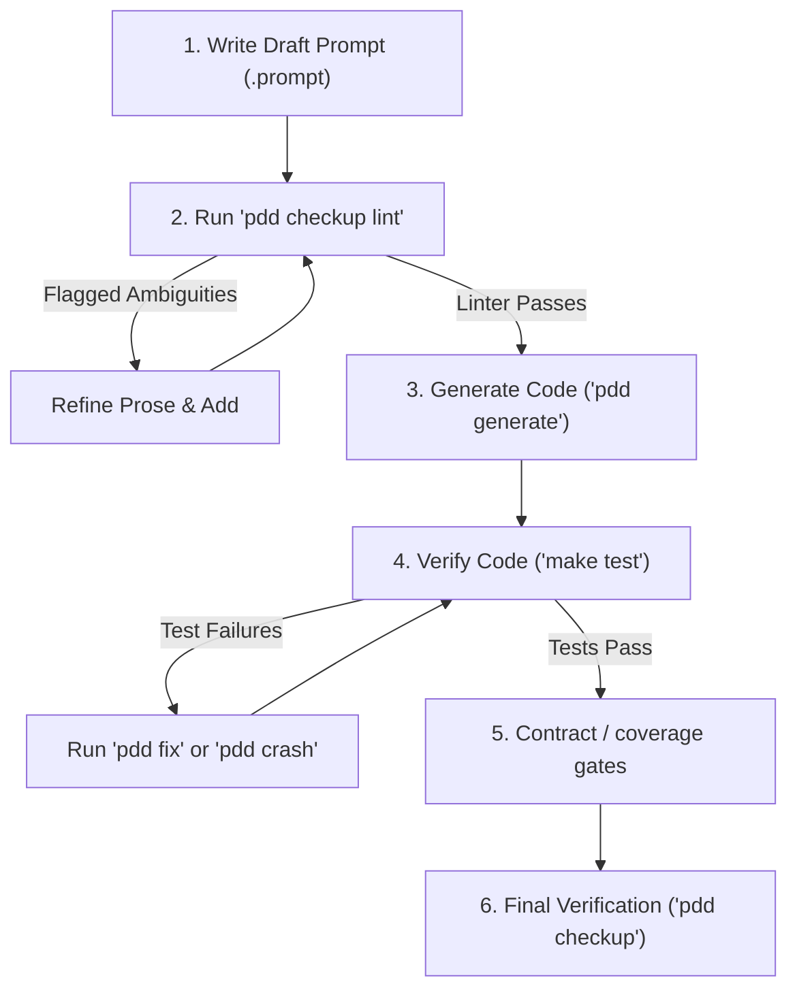

# PDD Prompt and Story Linter

Prompt-Driven Development (PDD) treats `.prompt` files as the source of truth for your software. The quality, precision, and clarity of your prompt contracts directly determine the correctness of the generated code and test suites.

The PDD Prompt Linter analyzes prompt files (`*.prompt`) and user stories (`story__*.md`) to flag vague, ambiguous language and help you build precise, testable contract vocabularies.

---

## Commands

| Command | Purpose |
|---------|---------|
| `pdd checkup lint TARGET` | Fast local heuristic scan (default; suitable for CI) |
| `pdd checkup lint --stories DIRECTORY` | Scan user-story markdown files (`story__*.md`) |
| `pdd checkup lint TARGET --review explain` | Add advisory LLM review for prompt authoring (preferred) |
| `pdd checkup lint TARGET --review off` | Explicit default; no LLM invoked |
| `pdd checkup lint TARGET --llm` | **Deprecated** — alias for `--review explain`; emits a stderr warning |
| `pdd checkup lint TARGET --strict` | Promote all warnings to errors |

For day-to-day prompt authoring, use `--review explain`. The default scan is deterministic and needs no network access.

---

## Out of Scope (Follow-up)

Interactive apply/writeback (accept suggested vocabulary, `--apply`, accept-all) is intentionally deferred. The linter is read-only advisory only; incorporate suggestions manually in your prompt editor.

---

## Linter Modes

### 1. Heuristic Scan (Deterministic)
By default, the linter performs a local, instant scan of your prompt sections (such as `<contract_rules>`, `<requirements>`, and `<acceptance_tests>`) or user-story acceptance criteria. It checks for:
- **Vague terms** (e.g., `valid`, `safe`, `gracefully`, `successful`) used without a corresponding `<vocabulary>` or glossary definition.
- **Observable outcome gaps**: Behavioral rules containing a vague term must also contain an observable outcome verb (e.g., `returns`, `raises`, `writes`, `emits`, `logs`, `rejects`) to ensure the rule represents a testable invariant.

### 2. LLM-Assisted Review (`--review explain`)
For active prompt engineering, enable the advisory LLM review pass with `--review explain`. This uses PDD Cloud or local providers to perform a deep semantic analysis of your prompt prose — identifying double-meanings, flagging subjective constraints, and listing alternative interpretations to help tighten specifications.

The `--llm` flag is a deprecated alias for `--review explain` and emits a one-line deprecation warning on stderr. It will be removed in a future release.

The advisory pass is strictly read-only: exit codes and core heuristic output are identical to the default scan. LLM failure sets `advisory.status=failed` and leaves the exit code unchanged. JSON output gains an additive `"advisory"` field per result item only when `--review explain` is active (see §JSON output below).

**JSON additive field** (present per result item only with `--review explain`):

```json
{
  "advisory": {
    "status": "ok",
    "findings": [
      {
        "severity": "warn",
        "area": "contract_rules",
        "message": "The term 'valid' in R1 is ambiguous without a Vocabulary entry.",
        "evidence": "R1 - Reject invalid input"
      }
    ]
  }
}
```

*(Omitted entirely with `--review off`.)*

---

## Recommended PDD Development Loop

To achieve maximum velocity and specification quality in Prompt-Driven Development, follow this step-by-step methodology:



### Step 1: Write Draft Prompt
Draft the initial `.prompt` file containing your `<contract_rules>` and `<requirements>`.

### Step 2: Lint the Prompt (Primary Quality Gate)
Run the linter early and often during draft authoring:
```bash
pdd checkup lint prompts/my_feature_python.prompt --review explain
```
Review the advisory warnings, refine any vague terms, and build a precise `<vocabulary>` block in the prompt to define what ambiguous terms mean in your domain. Rerun the linter until the scan is clean.

### Step 3: Generate Code
Once the prompt contract is clean and deterministic, generate the initial implementation:
```bash
make generate MODULE=my_feature
```

### Step 4: Validate Functionality
Run tests against the generated code:
```bash
make test
```
If the tests fail, let the agentic loop fix it (`make fix MODULE=my_feature` or `make crash MODULE=my_feature`).

### Step 5: Contract and Coverage Checkup (when applicable)
After tests pass for the module, run any project-specific contract or coverage gates before the full agentic checkup:

- **Contract / architecture alignment**: use `pdd checkup --validate-arch-includes` (and your project's contract-compile workflow, if configured) to confirm `architecture.json`, prompt `<include>` tags, and generated artifacts stay aligned.
- **Coverage**: use `pdd test` / `make test` with coverage targets from `.pddrc` or `pdd generate --coverage-report` where your project defines them; treat coverage gaps as prompt or test debt, not something lint replaces.

Lint catches vague prose early; contract and coverage gates catch structural and behavioral completeness later.

### Step 6: Final Verification
Before opening a Pull Request, run the complete agentic checkup to verify whole-project, cross-module, and architecture-wide integrity:
```bash
pdd checkup TARGET_ISSUE_URL
```
