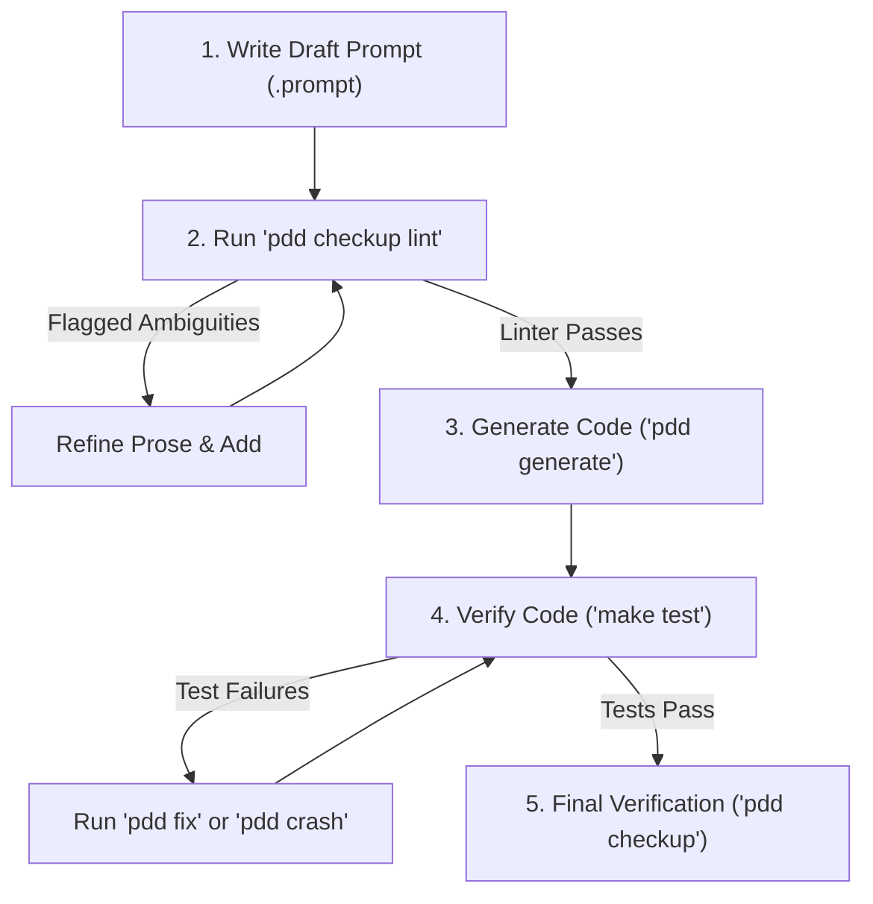

# PDD Prompt and Story Linter

Prompt-Driven Development (PDD) treats `.prompt` files as the source of truth for your software. The quality, precision, and clarity of your prompt contracts directly determine the correctness of the generated code and test suites. 

The PDD Prompt Linter analyzes prompt files (`*.prompt`) and user stories (`story__*.md`) to flag vague, ambiguous language and help you build precise, testable contract vocabularies.

---

## Commands

- **`pdd checkup lint TARGET`** — Scans the specified prompt file or a directory of prompts for quality issues.
- **`pdd checkup lint --stories DIRECTORY`** — Scans user-story markdown files (`story__*.md`) in the specified directory.
- **`pdd checkup lint TARGET --llm`** — Performs an advisory, deep LLM-assisted ambiguity review in addition to the deterministic scan.
- **`pdd checkup lint TARGET --strict`** — Runs in strict mode (all warnings are promoted to hard errors).

---

## Advisory Scoping

The PDD Prompt Linter operates in a **read-only, advisory capacity**. It does not automatically edit, write back, or rewrite your prompts. Instead, it acts as an assistant to guide you in authoring high-quality prompt specifications, suggesting additions to your `<vocabulary>` blocks that you can review, adapt, and incorporate manually.

---

## Linter Modes

### 1. Heuristic Scan (Deterministic)
By default, the linter performs a local, instant scan of your prompt sections (such as `<contract_rules>`, `<requirements>`, and `<acceptance_tests>`) or user-story acceptance criteria. It checks for:
- **Vague terms** (e.g., `valid`, `safe`, `gracefully`, `successful`) used without a corresponding `<vocabulary>` or glossary definition.
- **Observable outcome gaps**: Behavioral rules containing a vague term must also contain an observable outcome verb (e.g., `returns`, `raises`, `writes`, `emits`, `logs`, `rejects`) to ensure the rule represents a testable invariant.

### 2. LLM-Assisted Review (`--llm`)
For active prompt engineering, you can enable the LLM-assisted review path by passing the `--llm` flag. This pass uses PDD Cloud or local providers to perform a deep semantic analysis of your prompt prose. The LLM identifies potential double-meanings, flags subjective constraints, and lists alternative interpretations to help you tighten your specifications.

---

## Recommended PDD Development Loop

To achieve maximum velocity and specification quality in Prompt-Driven Development, follow this step-by-step methodology:



### Step 1: Write Draft Prompt
Draft the initial `.prompt` file containing your `<contract_rules>` and `<requirements>`.

### Step 2: Lint the Prompt (Primary Quality Gate)
Run the linter early and often during draft authoring:
```bash
pdd checkup lint prompts/my_feature_python.prompt --llm
```
Review the advisory warnings, refine any vague terms, and build a precise `<vocabulary>` block in the prompt to define what ambiguous terms mean in your domain. Rerun the linter until the scan is clean.

### Step 3: Generate Code
Once the prompt contract is clean and deterministic, generate the initial implementation:
```bash
make generate MODULE=my_feature
```

### Step 4: Validate Functionality
Run tests against the generated code:
```bash
make test
```
If the tests fail, let the agentic loop fix it (`make fix MODULE=my_feature` or `make crash MODULE=my_feature`).

### Step 5: Final Verification
Before opening a Pull Request, run the complete agentic checkup to verify whole-project, cross-module, and architecture-wide integrity:
```bash
pdd checkup TARGET_ISSUE_URL
```
