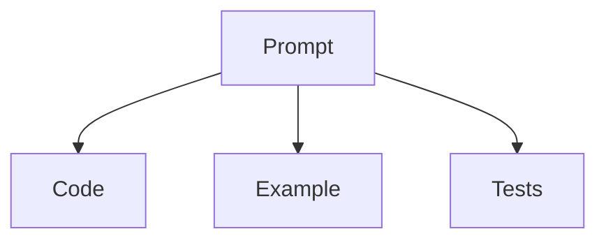
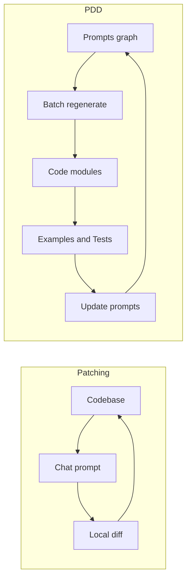
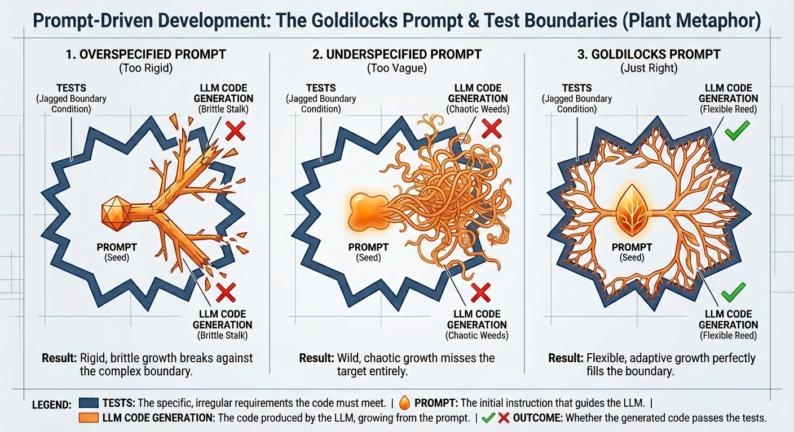
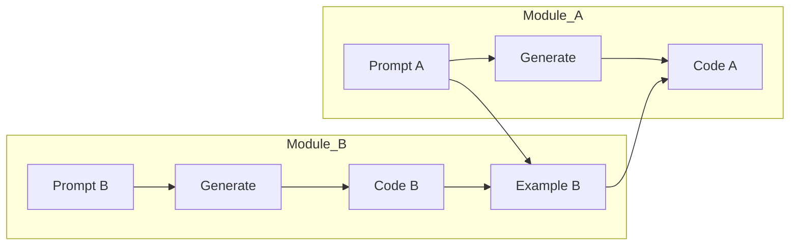

# Prompt‑Driven Development Prompting Guide

This guide shows how to write effective prompts for Prompt‑Driven Development (PDD). It distills best practices from the PDD whitepaper, the PDD doctrine, and working patterns in this repo. It also contrasts PDD prompts with interactive agentic coding tools (e.g., Claude Code, Cursor) where prompts act as ad‑hoc patches instead of the source of truth.

References: pdd/docs/whitepaper.md, pdd/docs/prompt-driven-development-doctrine.md, README.md (repo structure, conventions), [Effective Context Engineering](https://www.anthropic.com/engineering/effective-context-engineering-for-ai-agents), [Anthropic Prompt Engineering Overview](https://docs.anthropic.com/en/docs/build-with-claude/prompt-engineering/overview).

---

## Quickstart: PDD in 5 Minutes

If you are new to Prompt-Driven Development (PDD), follow this recipe:

1.  **Think "One Prompt = One Module":** Don't try to generate the whole app at once. Focus on one file (e.g., `user_service.py`).
2.  **Use a Template:** Start with a clear structure: Role, Requirements, Dependencies, Instructions.
3.  **Explicitly Include Context:** Use `<include>path/to/file</include>` to give the model *only* what it needs (e.g., a shared preamble or a dependency interface). This is a **PDD directive**, not just XML.
4.  **Regenerate, Don't Patch:** If the code is wrong, fix it using `pdd fix`. This updates the system's memory so the next `pdd generate` is grounded in the correct solution.
5.  **Verify:** Run the generated code/tests.

*Tip: Treat your prompt like source code. It is the single source of truth.*

---

## Glossary

- **Context Engineering:** The art of curating exactly what information (code, docs, examples) fits into the LLM's limited "working memory" (context window) to get the best result.
- **Shared Preamble:** A standard text file (e.g., `project_preamble.prompt`) included in every prompt to enforce common rules like coding style, forbidden libraries, and formatting.
- **PDD Directive:** Special tags like `<include>` or `<shell>` that the PDD tool processes *before* sending the text to the AI. The AI sees the *result* (the file content), not the tag.
- **Source of Truth:** The definitive record. In PDD, the **Prompt** is the source of truth; the code is just a temporary artifact generated from it.
- **Grounding (Few-Shot History):** The process where the PDD system automatically uses successful past pairs of (Prompt, Code) as "few-shot" examples during generation. This ensures that regenerated code adheres to the established style and logic of the previous version, preventing the model from hallucinating a completely different implementation.
- **Drift:** When the generated code slowly diverges from the prompt's intent over time, or when manual edits to code make it inconsistent with the prompt.

---

## Why PDD Prompts (Not Patches)

- Prompts are the source of truth; code is a generated artifact. Update the prompt and regenerate instead of patching code piecemeal.
- Regeneration preserves conceptual integrity and reduces long‑term maintenance cost (see pdd/docs/whitepaper.md).
- Prompts consolidate intent, constraints, dependencies, and examples into one place so the model can enforce them.
- Tests accumulate across regenerations and act as a regression net; prompts and tests stay in sync.

Contrast with interactive patching (Claude Code, Cursor): prompts are ephemeral instructions for local diffs. They are great for short, local fixes, but tend to drift from original intent as context is implicit and often lost. In PDD, prompts are versioned, explicit, and designed for batch, reproducible generation.

---

## The PDD Mental Model

- One prompt typically maps to one code file or narrowly scoped module.
- You explicitly curate the context to place in the model’s window (don’t “dump the repo”).
- Change behavior by editing the prompt; re‑generate the file; run crash/verify/test/fix; then update the prompt with learnings.
- Keep the “dev unit” synchronized: prompt + generated code + minimal runnable example + tests.

Key principles: everything is explicit, prompts are the programming language, and you regenerate rather than patch.

Dev Unit (Prompt with Code, Example, Test):



Notes:
- The prompt defines intent. Code, example, and tests are generated artifacts.
- Regenerate rather than patch; keep tests accumulating over time.

---

## Automated Grounding (In-Context Learning)

Unlike standard LLM interactions where every request is a blank slate, PDD uses **Automated Grounding** to prevent "implementation drift."

*   **How it works:** When you successfully generate or fix a module, PDD records that specific version (the Prompt and the resulting Code).
*   **The Loop:** When you run `pdd generate` again, the system retrieves the most recent successful version and provides it to the LLM as a "few-shot example."
*   **The Benefit:** The LLM sees *how* it previously solved the problem. This ensures that re-generations preserve variable naming choices, helper function structures, and stylistic nuances, rather than rewriting the code from scratch in a different style.

*Note: This is distinct from "Examples as Interfaces" (which teach how to **use** a dependency). Grounding teaches the model how to **write** the current module.*

---

## Anatomy of a Good PDD Prompt

Use clear sections and explicit includes. A recommended structure (matching our templates) is:

1) Role and scope: one short paragraph defining what the module/file is responsible for.
2) Requirements: numbered bullets for functionality, contracts, errors, validation, logging, performance, security, and any SLOs.
3) Dependencies: explicit XML tags (one per dependency) with <include> of examples or prompt names.
4) Instructions: precise input/output specs, class/function responsibilities, edge cases, and testing notes.
5) Deliverables: what code artifact(s) to produce and the entry point(s).

See pdd/pdd/templates/generic/generate_prompt.prompt for a concrete scaffold. For broader principles and guardrails, see pdd/docs/prompt-driven-development-doctrine.md.

---

## Prompt Syntax Essentials

These patterns are used across prompts in this repo:

- Preamble and role: start with a concise, authoritative description of the task and audience (e.g., “You are an expert Python engineer…”).
- Includes for context: bring only what the model needs.
  - Single include: `<include>path/to/file</include>`. **Note:** This is a PDD directive, not standard XML. The PDD tool replaces this tag with the actual file content *before* the LLM sees it. (Handles both text and images).
  - Multiple: `<include-many>path1, path2, …</include-many>`
  - Grouping: wrap includes in a semantic tag to name the dependency or file they represent, for example:
    ```xml
    <render_js>
      <include>src/render.js</include>
    </render_js>
    ```
  - When including larger files inline for clarity, wrap with opening/closing tags named after the file, e.g. `<render.js>…</render.js>`.
- Inputs/outputs: state them explicitly (names, types, shapes). Prompts should define Inputs/Outputs and steps clearly.
- Steps & Chain of Thought: Outline a short, deterministic plan. For complex logical tasks, explicitly instruct the model to "Analyze the requirements and think step-by-step before writing code." This improves accuracy on difficult reasoning problems.
- Constraints: specify style, performance targets, security, and error handling.
- Environment: reference required env vars (e.g., `PDD_PATH`) when reading data files.

Tip: Prefer small, named sections using XML‑style tags to make context scannable and deterministic.

### Special XML Tags: pdd, shell, web

The PDD preprocessor supports additional XML‑style tags to keep prompts clean, reproducible, and self‑contained. Processing order (per spec) is: `pdd` → `include`/`include-many` → `shell` → `web`. When `recursive=True`, `<shell>` and `<web>` are deferred until a non‑recursive pass.

- `<pdd>…</pdd>`
  - Purpose: human‑only comment. Removed entirely during preprocessing.
  - Use: inline rationale or notes that should not reach the model.
  - Example: `Before step X <pdd>explain why we do this here</pdd>`

- `<shell>…</shell>`
  - Purpose: run a shell command and inline stdout at that position.
  - Behavior: executes during non‑recursive preprocessing; on non‑zero exit, inserts a bracketed error with the exit code instead of failing the pipeline.
  - Example: `<shell>git config --get user.name</shell>`

- `<web>URL</web>`
  - Purpose: fetch the page (via Firecrawl) and inline the markdown content.
  - Behavior: executes during non‑recursive preprocessing; on failure, inserts a bracketed error note.
  - Example: `<web>https://docs.litellm.ai/docs/completion/json_mode</web>`

Guidance: Use these tags sparingly to keep prompts deterministic. Prefer stable inputs and short outputs (e.g., `head -n 20` in `<shell>`) so that regenerated prompts remain consistent across runs.

---

## Advanced Tips

### Shared Preamble for Consistency

Use a shared include (e.g., `<include>context/project_preamble.prompt</include>`) at the top of every prompt. You should create this file in your project's `context/` directory to define your "Constitution": consistent coding style (e.g., indentation, naming conventions), preferred linting rules, and forbidden libraries. This ensures all generated code speaks the same language without cluttering individual prompts.

### Automatic Update Propagation via Includes

A key benefit of `<include>` directives is **automatic propagation**: when the included file changes, all prompts that reference it automatically reflect those changes on the next generation—without editing the prompts themselves.

Use this pattern when:
- **Authoritative documentation exists elsewhere** (e.g., a README that defines environment variables, API contracts, or configuration options). Include it rather than duplicating the content.
- **Shared constraints evolve** (e.g., coding standards, security policies). A single edit to the preamble file updates all prompts.
- **Interface definitions change** (e.g., a dependency's example file). Prompts consuming that example stay current.

*Tradeoff:* Large includes consume context tokens. If only a small portion of a file is relevant, consider extracting that portion into a dedicated include file (e.g., `docs/output_conventions.md` rather than the full `README.md`).

### Positive over Negative Constraints

Models often struggle with negative constraints ("Do not use X"). Instead, phrase requirements positively: instead of "Do not use unassigned variables," prefer "Initialize all variables with default values." This greatly improves reliability.

### Positioning Critical Instructions (Hierarchy of Attention)

LLMs exhibit "middle-loss" – they pay more attention to the **beginning** (role, preamble) and the **end** (steps, deliverables) of the prompt context. If a critical constraint (e.g., security, output format) is ignored, ensure it's placed in your shared preamble, explicitly reiterated in the final "Instructions" or "Steps" section, or even pre-filled in the expected output format if applicable.

### Command-Specific Context Files

Some PDD commands (e.g., `pdd test`, `pdd example`) can automatically include project-specific context files like `context/test.prompt` or `context/example.prompt` during their internal preprocessing. Use these to provide instructions tailored to your project, such as preferred testing frameworks or specific import statements, without modifying the main prompt.

---

## Why PDD Scales to Large Codebases

- Explicit, curated context: use minimal examples and targeted includes instead of dumping source, reducing tokens and confusion.
- Modular dev units: one prompt per file/module constrains scope, enabling independent regeneration and parallel work.
- Batch, reproducible flow: eliminate long chat histories; regeneration avoids patch accumulation and incoherent diffs.
- Accumulating tests: protect behavior across wide regenerations and refactors; failures localize issues quickly.
- Single source of truth: prompts unify intent and dependencies, improving cross‑team coordination and reducing drift.
- Automated Grounding: By feeding successful past generations back into the context, the system stabilizes the code over time, making "regeneration" safe even for complex modules.

---

Patch vs PDD at Scale (diagram):



---

## Example (Minimal, Python)

This simplified example illustrates a minimal functional prompt:

```text
% You are an expert Python engineer. Your goal is to write a function `get_extension` that returns the file extension for a given language.

<include>context/python_preamble.prompt</include>

% Inputs/Outputs
  Input: language (str), like "Python" or "Makefile".
  Output: str file extension (e.g., ".py"), or "" if unknown.

% Data
  The CSV at $PDD_PATH/data/language_format.csv contains: language,comment,extension

% Steps
  1) Load env var PDD_PATH and read the CSV
  2) Normalize language case
  3) Lookup extension
  4) Return "" if not found or invalid
```

This style:
- Declares role and outcome
- Specifies IO, data sources, and steps
- Uses an `<include>` to pull a shared preamble

---

## Scoping & Modularity

- One prompt → one file/module. If a prompt gets too large or brittle, split it into smaller prompts that compose via explicit interfaces.
- Treat examples as interfaces: create a minimal runnable example demonstrating how the module is meant to be used.
- Avoid “mega‑prompts” that try to implement an entire subsystem. Use the PDD graph of prompts instead. For how prompts compose via examples, see “Dependencies & Composability (Token‑Efficient Examples)”.

---

## Writing Effective Requirements

Focus on clarity, measurable outcomes, and determinism:

- Functional: list behaviors, invariants, and contract boundaries (API shape, props, return types, error codes).
- Non‑functional: performance budgets (latency, memory), logging, tracing, security (authn/z, secrets handling), compliance.
- Edge cases: input validation, missing data, timeouts, network failures, concurrency.
- Observability: what to log/measure and at what levels; how to verify success in tests.
- Testing: specify what tests should cover and any golden examples.

---

## Level of Abstraction (The "Goldilocks" Zone)



Write prompts at the level of *architecture, contract, and intent*, not line-by-line *implementation details*.

- **Too Vague:** "Create a user page." (Model guesses the requirements; unrepeatable).
- **Too Detailed:** "Create a class User with a private field _id. In the constructor, set _id. Write a getter..." (Brittle; turns the model into a glorified typist and makes the prompt harder to read/maintain than the code).
- **Just Right:** "Implement a UserProfile component that displays user details and handles the 'update' action via the API. It must handle loading/error states and match the existing design system."

**Rule of Thumb:** If you are dictating control flow (loops, variable names) for standard logic, you are too deep. If you are omitting error handling or data types for public interfaces, you are too shallow. Focus on **Interfaces**, **Invariants**, and **Outcomes**.

---

## Dependencies & Composability (Token‑Efficient Examples)

- Include only relevant dependencies; more context is not always better.
- **Examples as Compressed Interfaces:** Real source code is heavy. A 500-line module might have a 50-line usage example. By including only the example, you save ~90% of the tokens while still teaching the model *how* to use the module. This "token compression" is the key to scaling PDD to large, multi-module systems.
- **Examples as Interfaces:** The minimal runnable example generated by `pdd example` *acts* as the module's interface. Other prompts consume this example (not the full source) to understand how to interact with the module. This stabilizes generation and keeps the context focused.
- Use XML tags to label each dependency block and `<include>` real files.
- If a dependency is defined by another prompt, list it under a "Prompt Dependencies" subsection and, where possible, pair it with a corresponding example file from `context/`.

**Tip:** Use `pdd auto-deps` to scan your `examples/` directory and automatically populate relevant dependencies into your prompt.

Example dependency block that composes another module via its example:

```xml
<billing_service>
  <include>context/billing_service_example.py</include>
</billing_service>
```

Composability via Examples (diagram):



---

## Regenerate, Verify, Test, Update

**Crucial Prerequisite:** Before regenerating a module, ensure you have **high test coverage** for its current functionality. Because PDD overwrites the code file entirely, your test suite is the critical safety net that prevents regression of existing features while you iterate on new ones.

The PDD workflow (see pdd/docs/whitepaper.md):

1) **Generate:** Fully regenerate (overwrite) the code module and its example.
2) **Crash → Verify:** Run the example. Fix immediate runtime errors.
3) **Test (Accumulate):** Run existing tests. If fixing a bug, **write a new failing test case first** and append it to the test file. *Never overwrite the test file; tests must accumulate to prevent regressions.*
4) **Fix via Command:** When you use `pdd fix` (or manual fixes verified by tests), the system **automatically submits** the successful Prompt+Code pair to PDD Cloud (or local history).
5) **Fix via Prompt:** If the logic is fundamentally flawed, update the prompt text to clarify the requirement or constraint that was missed, then **go to step 1**.
5) **Drift Check (Optional):** Occasionally regenerate the module *without* changing the prompt (e.g., after upgrading LLM versions or before major releases). If the output differs significantly or fails tests, your prompt has "drifted" (it relied on lucky seeds or implicit context). Tighten the prompt until the output is stable.
6) **Update:** Once tests pass, back-propagate any final learnings into the prompt.

Key practice: Code and examples are ephemeral (regenerated); Tests and Prompts are permanent assets (accumulated and versioned).

### Workflow Cheatsheet: Features vs. Bugs

| Task Type | Where to Start | The Workflow |
| :--- | :--- | :--- |
| **New Feature** | **The Prompt** | 1. Add/Update Requirements in Prompt.<br>2. Regenerate Code.<br>3. Write new Tests to verify. |
| **Bug Fix** | **The Test File** | 1. Write a failing test case (repro) in the Test file.<br>2. Clarify the Prompt to address the edge case.<br>3. Regenerate Code to pass the test. |

**Why?** Features represent *new intent* (Prompt). Bugs represent *missed intent* which must first be captured as a constraint (Test) before refining the definition (Prompt).

---

## PDD vs Interactive Agentic Coders (Claude Code, Cursor)

- Source of truth:
  - PDD: the prompt is primary and versioned; code is regenerated output
  - Interactive: the code is primary; prompts are ephemeral patch instructions
- Workflow:
  - PDD: batch‑oriented, reproducible runs; explicit context via includes
  - Interactive: live chat loops; implicit context; local diffs
- Scope:
  - PDD: scoped to modules/files with clear interfaces; compose via examples
  - Interactive: excels at small, local edits; struggles as scope and history grow
- Synchronization:
  - PDD: update prompts after fixes; tests accumulate and protect behavior
  - Interactive: prompt history rarely persists; documentation often drifts

When to use which: Use PDD for substantive new modules, refactors, and anything requiring long‑term maintainability and repeatability. Use interactive patching for trivial hotfixes; follow up with a prompt `update` so the source of truth remains synchronized.

---

## Patch vs PDD: Concrete Examples

Patch‑style prompt (interactive agent):

```text
Fix this bug in src/utils/user.ts. In function parseUserId, passing null should return null instead of throwing.

Constraints:
- Change the minimum number of lines
- Do not alter the function signature or add new functions
- Keep existing imports and formatting
- Output a unified diff only

Snippet:
  export function parseUserId(input: string) {
    return input.trim().split(":")[1];
  }
```

PDD‑style prompt (source of truth):

```text
% You are an expert TypeScript engineer. Create a module `user_id_parser` with a function `parseUserId` that safely extracts a user id.

% Role & Scope
  A utility module responsible for parsing user identifiers from various inputs.

% Requirements
  1) Function: `parseUserId(input: unknown): string | null`
  2) Accepts strings like "user:abc123" and returns "abc123"
  3) For null/undefined/non‑string, return null without throwing
  4) Trim whitespace; reject blank ids as null
  5) Log at debug level on parse failures; no exceptions for expected cases
  6) Performance: O(n) in input length; no regex backtracking pitfalls
  7) Security: no eval/exec; treat input as untrusted

% Dependencies
  <logger>
    <include>context/logger_example.ts</include>
  </logger>

% Instructions
  - Implement in `src/utils/user_id_parser.ts`
  - Export `parseUserId`
  - Add narrow helpers if needed; keep module cohesive
  - Include basic JSDoc and simple debug logging hooks
```

Key differences:
- Patch prompt constrains a local edit and often asks for a diff. It assumes code is the source of truth.
- PDD prompt defines the module’s contract, dependencies, and deliverables. It is the source of truth; code and tests are regenerated to match it.

---

## Checklist: Before You Run `pdd generate`

- Does the prompt state the module’s role and boundaries clearly?
- Do you have high test coverage for the existing code? (Regeneration relies on tests to catch regressions).
- Are functional and non‑functional requirements explicit and testable?
- Are inputs/outputs and error handling specified?
- Are dependencies minimal and included explicitly (with `<include>`)?
- Is there a short, deterministic set of steps?
- Is there a small example you can generate and run?
- Did you add any new learnings back into the prompt (after prior runs)?

---

## Common Pitfalls (And Fixes)

- Too much context: prune includes; prefer targeted examples over entire files.
- Vague requirements: convert to explicit contracts, budgets, and behaviors.
- Mega‑prompts: split into smaller prompts (one per file/module) and compose.
- Prompt outweighs the code: if the prompt is larger than the generated file, it’s usually over‑specifying control flow. Aim for prompts to be a fraction of the target code size; keep them at the interface/behavior level and let the model fill in routine implementation.
- Patching code directly: make the change in the prompt and regenerate; then `update` with learnings.
- Throwing away tests: keep and expand; they are your long‑term leverage.

---

## Naming & Conventions (This Repo)

- One prompt per module/file, named like `${BASENAME}_${LanguageOrFramework}.prompt` (see templates under `pdd/pdd/templates`).
- Follow codebase conventions from README.md for Python and TypeScript style.
- Use curated examples under `context/` to encode interfaces and behaviors.

---

## Final Notes

Think of prompts as your programming language. Keep them concise, explicit, and modular. Regenerate instead of patching, verify behavior with accumulating tests, and continuously back‑propagate implementation learnings into your prompts. That discipline is what converts maintenance from an endless patchwork into a compounding system of leverage.
