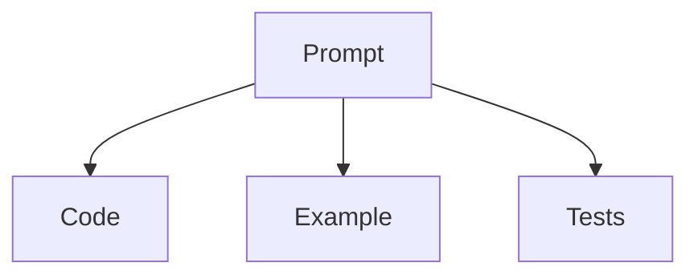
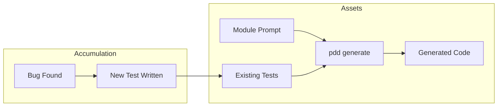
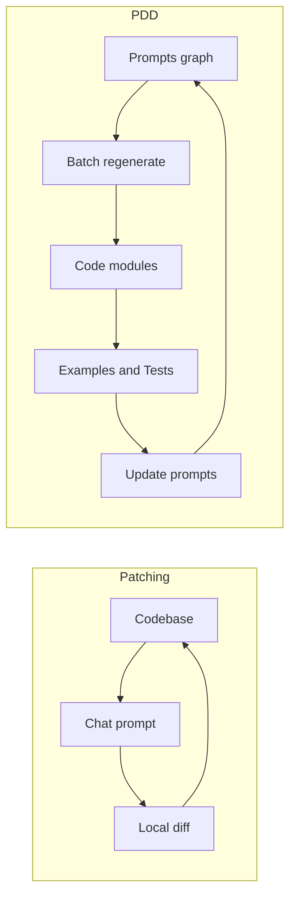
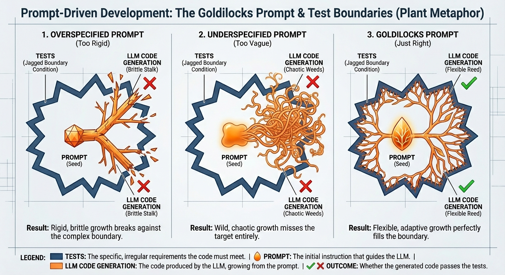
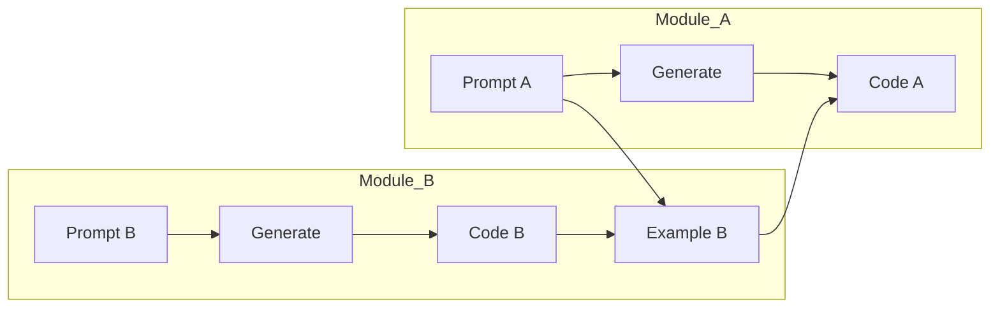

# Prompt‑Driven Development Prompting Guide

This guide shows how to write effective prompts for Prompt‑Driven Development (PDD). It distills best practices from the PDD whitepaper, the PDD doctrine, and working patterns in this repo. It also contrasts PDD prompts with interactive agentic coding tools (e.g., Claude Code, Cursor) where prompts act as ad‑hoc patches instead of the source of truth.

Think of PDD prompts as source files in a prompt-native programming system. The
prompt suite, includes, examples, tests, architecture metadata, and `.pddrc`
configuration form the source; `pdd sync` compiles that source into conventional
code artifacts.

References: pdd/docs/whitepaper.md, pdd/docs/prompt-driven-development-doctrine.md, README.md (repo structure, conventions), [Effective Context Engineering](https://www.anthropic.com/engineering/effective-context-engineering-for-ai-agents), [Anthropic Prompt Engineering Overview](https://docs.anthropic.com/en/docs/build-with-claude/prompt-engineering/overview).

---

## Quickstart: PDD in 5 Minutes

If you are new to Prompt-Driven Development (PDD), follow this recipe:

1.  **Think "One Prompt = One Module":** Don't try to generate the whole app at once. Focus on one file (e.g., `user_service.py`).
2.  **Use a Template:** Start with a clear structure: Role, Requirements, Dependencies, Instructions.
3.  **Explicitly Include Context:** Use `<include>path/to/file</include>` to give the model *only* what it needs (e.g., a shared preamble or a dependency interface). This is a **PDD directive**, not just XML.
4.  **Regenerate, Don't Patch:** Change behavior by changing the prompt and regenerating. If generated code fails to satisfy a correct prompt/test, use `pdd bug` / `pdd fix`. If the intended behavior is missing or wrong in the prompt, update the prompt first.
5.  **Verify:** Run the generated code/tests.

*Tip: Treat your prompt like source code. It is the single source of truth.*

Successful fixes can contribute to grounding, but the prompt remains the source of truth. If the fix changes intent, back-propagate that intent into the prompt.

*For the conceptual foundation of why this works, see [The Mold Paradigm](prompt-driven-development-doctrine.md#the-mold-paradigm) in the doctrine.*

---

## Glossary

- **Context Engineering:** The art of curating exactly what information (code, docs, examples) fits into the LLM's limited "working memory" (context window) to get the best result.
- **Shared Preamble:** A standard text file (e.g., `project_preamble.prompt`) included in every prompt to enforce common rules like coding style, forbidden libraries, and formatting.
- **PDD Directive:** Special tags like `<include>` or `<shell>` that the PDD tool processes *before* sending the text to the AI. The AI sees the *result* (the file content), not the tag.
- **Source of Truth:** The definitive record. In PDD, the **Prompt** is the source of truth; the code is just a temporary artifact generated from it.
- **PDD Program:** A versioned prompt suite plus its includes, examples, tests, architecture metadata, and configuration.
- **Compilation:** Running `pdd sync` or related commands to regenerate conventional code artifacts from PDD source and validate them.
- **Grounding (Few-Shot History):** The process where the PDD system can use successful past pairs of (Prompt, Code) as "few-shot" examples during generation. This helps regenerated code follow established style and logic, reducing the chance of a completely different implementation.
- **Drift:** When the generated code slowly diverges from the prompt's intent over time, or when manual edits to code make it inconsistent with the prompt.

---

## Why PDD Prompts (Not Patches)

- Prompts are the source of truth; code is a generated artifact. Update the prompt and regenerate instead of patching code piecemeal.
- Regeneration preserves conceptual integrity and reduces long‑term maintenance cost (see pdd/docs/whitepaper.md).
- Prompts consolidate intent, constraints, dependencies, and examples into one place so the model can use them during generation.
- Tests accumulate across regenerations and act as a regression net; prompts and tests stay in sync.

Contrast with interactive patching (Claude Code, Cursor): prompts are ephemeral instructions for local diffs. They are great for short, local fixes, but tend to drift from original intent as context is implicit and often lost. In PDD, prompts are versioned, explicit, and designed for batch, reproducible generation.

For a deeper exploration of why this paradigm shift matters—and an analogy to manufacturing's wood‑to‑plastic transition—see [The Mold Paradigm](prompt-driven-development-doctrine.md#the-mold-paradigm) in the doctrine.

---

## The PDD Mental Model

- One prompt typically maps to one code file or narrowly scoped module.
- You explicitly curate the context to place in the model’s window (don’t “dump the repo”).
- Change behavior by editing the prompt; re‑generate the file; run crash/verify/test/fix; then update the prompt with learnings.
- Keep the “dev unit” synchronized: prompt + generated code + minimal runnable example + tests.

Key principles: everything is explicit, prompts are the programming language, and you regenerate rather than patch.

Dev Unit (Prompt with Code, Example, Test):


```mermaid
flowchart TB
  P[Prompt]
  C[Code]
  E[Example]
  T[Tests]

  P --> C
  P --> E
  P --> T
```

Notes:
- The prompt defines intent. Code, example, and tests are generated artifacts.
- Regenerate rather than patch; keep tests accumulating over time.

---

<a name="automated-grounding"></a>
## Automated Grounding (PDD Cloud)

Unlike standard LLM interactions where every request is a blank slate, PDD Cloud uses **Automated Grounding** to reduce implementation drift.

### How It Works

When you run `pdd generate`, the system:
1. Embeds your prompt into a vector
2. Searches for similar prompts in the cloud database (cosine similarity)
3. Auto-injects the closest (prompt, code) pair as a few-shot example

**This is automatic.** You don't configure it. As you edit your prompt:
- The embedding changes
- Different examples may be retrieved
- Generation naturally adapts to your prompt's content

On first generation: Similar existing modules in your project may provide grounding.
On re-generation: Your prior successful generation is typically the closest match.

### Why This Matters for Prompt Writing

- **Your prompt wording affects grounding.** Similar prompts retrieve similar examples.
- **Implementation patterns can be handled automatically in Cloud workflows.** Grounding can provide structural consistency from similar modules (class vs functional, helper patterns, etc.).
- **Prompts can be minimal in Cloud workflows.** Focus on requirements; Cloud grounding handles many implementation patterns when enough relevant history exists.

*Note: This is distinct from "Examples as Interfaces" (which teach how to **use** a dependency). Grounding teaches the model how to **write** the current module.*

> **Local users (no cloud):** Without grounding, prompts must be more detailed—include structural guidance and explicit examples via `<include>`. Use a shared preamble for coding style. The minimal prompt guidance in this document assumes cloud access.

---

## Grounding Overrides: Pin & Exclude (PDD Cloud)

For users with PDD Cloud access, you can override automatic grounding using XML tags:

**`<pin>module_name</pin>`** — Force a specific example to always be included
- Use case: Ensure a critical module always follows a "golden" pattern
- Use case: Bootstrap a new module with a specific style

**`<exclude>module_name</exclude>`** — Block a specific example(s) from being retrieved
- Use case: Escape an old pattern that's pulling generation in the wrong direction
- Use case: Intentionally break from established patterns for a redesign

These tags are processed by the preprocessor (like `<include>`) and removed before the LLM sees the prompt.

**Most prompts don't need these.** Automatic grounding works well for:
- Standard modules with similar existing examples
- Re-generations of established modules
- Modules following common project patterns

---

## Anatomy of a Good PDD Prompt

A well-designed prompt contains **only what can't be handled elsewhere**. With Cloud grounding or explicit examples plus accumulated tests, prompts can stay focused.

### Required Sections for Simple Modules

1. **Role and scope** (1-2 sentences): What this module does
2. **Requirements** (5-10 items): Functional and non-functional specs
3. **Dependencies** (via `<include>`): Only external or critical interfaces

### Required Sections for Non-Trivial Modules

Use more structure when the module has external side effects, security risk, cross-module behavior, state transitions, or business-critical rules:

1. **Role and scope**: One or two sentences describing what this module does.
2. **Responsibility**: What this module owns.
3. **Non-responsibilities**: What this module explicitly does not own.
4. **Vocabulary**: Definitions for domain terms that could be ambiguous.
5. **Contract rules**: Stable, numbered MUST/MUST NOT/MAY/DOES NOT rules.
6. **Inputs and outputs**: Types, shapes, accepted values, validation rules, and error conditions.
7. **Dependencies**: Use `<include>` for external APIs, critical interfaces, schemas, examples, or documentation.
8. **Deliverables**: Only when non-obvious.

For trivial modules, you may combine Responsibility, Vocabulary, and Contract Rules into a concise Requirements section. Do not bloat prompts with every edge case. Use user stories and accumulated tests for examples and regressions.

### Optional Sections

- **Instructions**: Only if default behavior needs overriding
- **Deliverables**: Only if non-obvious
- **Coverage**: Useful for non-trivial modules with named contract rules

### What NOT to Include

- **Coding style** (naming, formatting, imports) → Handled by shared preamble
- **Implementation patterns** (class structure, helpers) → Usually handled by Cloud grounding; local users may need explicit examples via `<include>`
- **Every edge case** → Handled by accumulated tests
- **Implementation steps** → Let the LLM decide (unless critical)

### Target Size: Prompt-to-Code Ratio

Aim for **10-30%** of your expected code size:

| Ratio | Meaning |
|-------|---------|
| **< 10%** | Too vague—missing contracts, error handling, or key constraints |
| **10-30%** | Just right—requirements and contracts without implementation details |
| **> 50%** | Too detailed—prompt is doing preamble's, examples', or grounding's job |

If your prompt exceeds 30%, ask: Am I specifying things that the preamble, Cloud grounding, examples, or tests should handle?

**Note:** Executable tests are generated from the module prompt plus generated code or example code, with `context/test.prompt` providing project-wide test guidance. Well-written requirements are inherently testable, so most module prompts do not need a separate Testing section.

See pdd/pdd/templates/generic/generate_prompt.prompt for a concrete scaffold.

---

## Natural-Language Contracts

A natural-language contract is a testable obligation written in controlled language.

Use contract rules for behavior that must survive regeneration:

- Validation rules
- Error behavior
- Invariants
- Security constraints
- Permission boundaries
- State transitions
- Idempotency
- Data privacy
- External side effects

Contract rules should use stable IDs and modal verbs:

- **MUST**: required behavior
- **MUST NOT**: forbidden behavior
- **MAY**: allowed behavior
- **SHOULD**: preferred behavior, but not required
- **DOES NOT**: explicitly outside this module's responsibility

A good contract rule is observable, testable, scoped to this module, independent of implementation strategy, and written at the level of behavior rather than code structure.

### Contract Rule Format

```md
R<ID> - <Short name>

For every <entity/action>,
the system MUST/MUST NOT <observable behavior>
when <condition>.

This rule is violated if <specific forbidden outcome>.
```

Do not renumber existing rule IDs after stories or tests reference them. If a rule is removed, mark it deprecated or leave a gap. If a rule changes meaning substantially, create a new rule ID.

Example:

```md
R1 - Reject over-refunds

For every refund request,
the system MUST reject the request
when the requested amount is greater than the remaining refundable amount.

This rule is violated if the payment provider is called for an over-refund request.
```

### Vocabulary and Ambiguity Control

Define any term that could affect behavior. Common ambiguous terms include active user, valid request, duplicate record, safe HTML, recent transaction, successful import, authorized user, remaining balance, trusted input, and graceful error handling.

Weak:

```md
The system should reject duplicate uploads.
```

Better:

```md
Duplicate upload means an upload with the same normalized file hash and tenant ID as a previously accepted upload.
The system MUST reject duplicate uploads before writing new records.
```

Weak:

```md
Return safe HTML.
```

Better:

```md
Safe HTML means user-controlled text has been escaped before being written to an HTML sink.
The system MUST NOT write raw user-controlled display name, bio, or location text into an HTML sink.
```

Before committing a prompt, review every contract rule and ask:

- Which words could be interpreted in more than one way?
- Are those words defined in Vocabulary?
- Could a test writer implement this requirement without asking follow-up questions?

### Capabilities and Side Effects

For modules that touch external systems, add a capabilities section. The capabilities section says what this module may and may not do. This helps prevent accidental behavior expansion during regeneration.

Template:

```xml
<capabilities>
- MAY read <resource>.
- MAY write <resource>.
- MAY call <external API>.
- MAY emit <event>.
- MUST NOT call <forbidden API>.
- MUST NOT read <forbidden data>.
- MUST NOT write <forbidden data>.
- MUST NOT mutate <out-of-scope state>.
</capabilities>
```

Example:

```xml
<capabilities>
- MAY read payment records.
- MAY write refund records.
- MAY call the payment provider refund endpoint.
- MAY write audit events.
- MUST NOT send emails.
- MUST NOT update customer profile records.
- MUST NOT log provider secrets, bearer tokens, card PAN, or CVV.
</capabilities>
```

### Contract Rules vs. Edge Cases vs. Tests

Use contract rules for general obligations.

Use user stories for product-level examples and cross-module behavior.

Use executable tests for concrete edge cases, regressions, and implementation-level checks.

Do not put every edge case in the prompt. Instead:

- Summarize the general rule in the prompt
- Add representative user stories
- Accumulate executable tests as bugs and edge cases are discovered

Example:

```md
Prompt contract rule:
R1 - The system MUST reject malformed email addresses.

User story:
Given a signup form with malformed email "alice@", when submitted, then the user sees an email validation error.

Tests:
- rejects empty email
- rejects whitespace email
- rejects email without domain
- rejects email with invalid unicode
- accepts normalized valid email
```

### Contract Evidence Levels

1. **Prompt-only:** Contract rules are visible to the model and reviewer.
2. **Story-backed:** High-risk rules are covered by user stories.
3. **Test-backed:** Rules are covered by executable tests.
4. **Policy-backed:** Security/capability rules are checked by static analysis, CI, or custom review.

### Contract Exception States

- **Unchecked:** No story, test, policy check, or waiver exists yet.
- **Waived:** The rule is intentionally unchecked, with reason, approver, expiry, and follow-up.

Most modules do not need every evidence level. Production-critical modules should not rely on prompt-only contracts for high-risk behavior.

### Reusable Prompt Skeleton

```xml
% Role:
% You are an expert <language/framework> engineer.
% Implement <module_name>.

<include>context/project_preamble.prompt</include>

<pdd-reason>Short architecture-facing reason this module exists.</pdd-reason>

<pdd-interface>
{
  "type": "module",
  "module": {
    "functions": [
      {
        "name": "refund_payment",
        "signature": "(payment_id, amount, idempotency_key) -> RefundResult",
        "returns": "RefundResult"
      }
    ]
  }
}
</pdd-interface>

<responsibility>
This module validates and creates refunds for captured payments.
</responsibility>

<non_responsibilities>
- Does not authenticate the operator.
- Does not authorize whether the operator may refund.
- Does not perform currency conversion.
- Does not send customer notifications.
</non_responsibilities>

<vocabulary>
- Captured amount: the amount successfully captured from the customer.
- Successful refund: a refund confirmed by the payment provider.
- Pending refund: a refund submitted to the provider but not yet confirmed or failed.
- Remaining refundable amount: captured amount minus successful refunds minus pending refunds.
- Duplicate request: a request with the same payment ID and idempotency key.
</vocabulary>

<contract_rules>
R1 - Positive amount
For every refund request, the system MUST reject the request when the requested amount is less than or equal to zero.

R2 - Remaining balance
For every refund request, the system MUST reject the request when the requested amount is greater than the remaining refundable amount.

R3 - No provider call before validation
The system MUST NOT call the payment provider for requests rejected by R1 or R2.

R4 - Idempotency
For every duplicate request with the same payment ID and idempotency key, the system MUST NOT create more than one provider refund, MUST NOT write more than one successful-refund audit event, and MUST return the same logical result for repeated submissions.

R5 - Auditability
For every successful refund, the system MUST write exactly one durable successful-refund audit event.
Provider failures MAY write a failed-refund audit event, but MUST NOT write a successful-refund audit event.

R6 - Privacy
The system MUST NOT expose card PAN, CVV, API keys, bearer tokens, or raw provider secrets in logs, audit events, errors, or return values.
</contract_rules>

<capabilities>
- MAY read payment records.
- MAY write refund records.
- MAY call the payment provider refund endpoint after validation succeeds.
- MAY write audit events.
- MUST NOT send emails.
- MUST NOT modify customer profile records.
- MUST NOT read unrelated environment variables.
</capabilities>

<waivers>
W1:
  Rule: R6
  Status: temporary
  Reason: Provider error fixture is not available yet.
  Approved by: security-review
  Expires: 2026-06-01
  Follow-up: Add story__provider_secret_not_leaked.md and executable test.
</waivers>

<dependencies>
<include mode="interface">src/payments/provider.py</include>
<include>docs/refund_policy.md</include>
</dependencies>

<coverage>
R1: story__refund_invalid_amount.md
R2: story__refund_over_remaining.md
R3: story__refund_over_remaining.md
R4: TODO add idempotency story before production use
R5: story__refund_auditability.md
R6: WAIVED W1
</coverage>

<deliverables>
Generate the implementation only.
Executable tests are generated separately by `pdd test prompts/refund_payment_python.prompt src/refund_payment.py`.
</deliverables>
```

Use `<pdd-reason>`, `<pdd-interface>`, and `<pdd-dependency>` only for architecture metadata; they sync with `architecture.json`. Do **not** put contracts inside `<pdd>...</pdd>` comments because `<pdd>` content is removed before the model sees it. Use ordinary semantic tags such as `<contract_rules>`, `<vocabulary>`, `<capabilities>`, `<waivers>`, and `<coverage>`.

---

## User Stories as Contract Coverage

A user story is an example-level prompt test. A contract rule is a general obligation. A good story identifies which contract rules it covers.

Every high-risk MUST or MUST NOT rule should be covered by at least one of:

- A user story
- An executable test
- An explicit waiver

Use stories for cross-module behavior, product acceptance criteria, critical edge cases, negative behavior, regressions from bugs, and behavior that is easier to describe from a user perspective than a module perspective.

Story files live in `user_stories/`. Use `pdd detect --stories` to validate them, `pdd change` to run validation after prompt modifications, and `pdd fix user_stories/story__*.md` to apply a story to prompts and re-validate it. Link stories to prompts with `pdd-story-prompts` metadata.

### Story Template

```md
<!-- pdd-story-prompts: prompts/<module>_<language>.prompt -->

# User Story: <name>

<!-- Replace or remove every placeholder before committing this story. -->

## Covers

For a single-prompt story, keep one prompt in `pdd-story-prompts`.
For a cross-module story, list prompts comma-separated in `pdd-story-prompts`.

For single-prompt stories, reference contract rule IDs directly:

- R1: <rule name>
- R2: <rule name>

For cross-module stories, namespace rule IDs by prompt:

- prompts/<module_a>_<language>.prompt#R1: <rule name>
- prompts/<module_b>_<language>.prompt#R3: <rule name>

## Story

As a <persona>,
I want <behavior>,
so that <value>.

## Context / Fixtures

Describe relevant state, assumptions, fixtures, users, records, external services, mocks, spies, logs, events, or dependencies.

## Acceptance Criteria

1. Given ...,
   when ...,
   then ...

2. Given ...,
   when ...,
   then ...

## Oracle

List only the observations that matter for this story's pass/fail result.

Examples:

- The returned error type is <error type>.
- The state transition is <state change>.
- The external call <does/does not> happen.
- The emitted event is <event name>.
- The returned value has <required shape>.

## Non-Oracle

List details that should not affect pass/fail.

Examples:

- Private helper names do not matter.
- Internal class structure does not matter.
- Exact wording of non-user-facing messages does not matter.
- Deterministic but irrelevant ordering does not matter.

## Forbidden Outcomes

List outcomes this story protects against.

For MUST NOT rules, this section is required.
For ordinary positive stories, this section may be empty or omitted.

## Non-Goals

What this story explicitly does not cover.

## Notes

Links, edge cases, fixture notes, rationale, follow-up work, or review notes.
```

Example:

```md
<!-- pdd-story-prompts: prompts/refund_payment_python.prompt -->

# User Story: Refund requests are validated before provider calls

## Covers

- R1: Positive amount
- R2: Remaining balance
- R3: No provider call before validation

## Story

As a support operator,
I want invalid refund requests to be rejected before provider calls,
so that customers are not over-refunded and provider state stays consistent.

## Context / Fixtures

The payment has been captured for $100.
Successful prior refunds total $80.
Pending refunds total $0.
The payment provider refund API is observed with a spy or mock.
Payment state is observed from the payment record after the request.

## Acceptance Criteria

1. Given the payment above,
   when the operator requests a $30 refund,
   then the system returns OverRefundError.

2. Given the payment above,
   when the operator requests a $30 refund,
   then the payment provider is not called.

3. Given the payment above,
   when the operator requests a $30 refund,
   then the payment state is unchanged.

## Oracle

The error type is `OverRefundError`.
The payment provider is not called.
The payment state is unchanged.

## Non-Oracle

The exact error message text is not important.
The private helper names are not important.
The order of internal validation checks is not important, as long as provider calls do not happen before validation.

## Forbidden Outcomes

- The payment provider must not be called for an over-refund request.
- The payment state must not change.
- A successful-refund audit event must not be written.

## Non-Goals

This story does not test operator authorization.
This story does not test currency conversion.
This story does not test customer notification.

## Notes

This is a negative story: it verifies forbidden behavior does not occur.
```

### Negative Stories

Positive stories describe what should happen. Negative stories describe what must never happen.

Use negative stories for security requirements, invalid inputs, authorization failures, idempotency, forbidden side effects, privacy/data leakage, and provider failure behavior.

Example:

```md
<!-- pdd-story-prompts: prompts/refund_payment_python.prompt -->

# User Story: Provider secrets are not leaked

## Covers

- R6: Privacy

## Story

As a security reviewer,
I want provider secrets removed from returned errors and logs,
so that generated code does not leak credentials.

## Context / Fixtures

The payment provider client is mocked to return an error that contains an API key.
Returned errors and log output are captured by test fixtures.

## Acceptance Criteria

1. Given the payment provider returns an error containing an API key,
   when the module returns an error to the caller,
   then the returned error does not contain the API key.

2. Given the payment provider returns an error containing an API key,
   when the module writes logs,
   then the logs do not contain the API key.

## Oracle

The returned error does not contain the API key.
Captured logs do not contain the API key.

## Non-Oracle

The exact sanitized error wording is not important.
The exact log message wording is not important.

## Forbidden Outcomes

- Returned errors must not contain the API key.
- Logs must not contain the API key.
```

### Contract Coverage Matrix

For non-trivial modules, maintain a lightweight coverage map from contract rules to stories, tests, and waivers. The purpose is not bureaucracy. The purpose is to make missing evidence visible.

`<coverage>` is a PDD authoring convention, not a special preprocessor directive. It is visible to the model and useful for review, generation, and validation prompts. `pdd coverage --contracts` parses `<contract_rules>`, story `## Covers` sections, conservative test rule-ID references, `<coverage>`, and `<waivers>` to build an inspectable rule-to-evidence matrix.

Run the checker locally or in CI:

```bash
pdd coverage --contracts prompts/refund_payment_python.prompt
pdd coverage --contracts --json prompts/
```

The command is legacy-safe: prompts without `<contract_rules>` report `no contract coverage data` rather than failing. Rules are reported as `checked`, `story-only`, `test-only`, `unchecked`, `waived`, or `failed`. `failed` is deterministic v1 validation failure, such as a linked story covering a rule without `## Acceptance Criteria`, or a syntax-invalid `test_*.py` file that explicitly references the rule ID.

Coverage source of truth:

- Story files are the primary place to declare `## Covers`.
- The prompt's `<coverage>` section is an optional summary for non-trivial modules.
- If both exist, keep them synchronized during prompt review.
- Test names/comments may reference rule IDs explicitly, for example `test_R3_no_provider_call_invalid`; this is a conservative heuristic, not semantic test analysis.

```xml
<coverage>
R1: story__refund_invalid_amount.md
R2: story__refund_over_remaining.md
R3: story__refund_over_remaining.md
R4: story__refund_idempotency.md
R5: story__refund_auditability.md
R6: story__provider_secret_not_leaked.md
</coverage>
```

During development, unchecked rules may be visible:

```xml
<coverage>
R1: story__refund_invalid_amount.md
R2: story__refund_over_remaining.md
R3: story__refund_over_remaining.md
R4: TODO add idempotency story before production use
R5: TODO add audit-event test
R6: WAIVED W1
</coverage>
```

Unchecked rules are allowed during development, but they should be visible. Production-critical modules should not merge with unchecked high-risk MUST/MUST NOT rules unless there is an explicit waiver.

### Contract Compilation

Coverage answers whether a rule has evidence. Contract compilation answers
whether a rule is structured enough to become machine-readable.

Use `pdd contracts compile` after lint/check/coverage:

```bash
pdd prompt lint --strict prompts/refund_payment_python.prompt
pdd contracts check prompts/refund_payment_python.prompt
pdd coverage --contracts prompts/refund_payment_python.prompt
pdd contracts compile --json prompts/refund_payment_python.prompt
```

The compiler produces `pdd.contract_ir.v1`, a JSON-safe intermediate
representation containing rule IDs, titles, `When ...` conditions, modal verbs,
observable obligations, and raw rule text.

Rules compile best when written in this shape:

```text
R1 - Reject duplicate refund
When a request has the same tenant ID and idempotency key as an accepted refund,
the service MUST return HTTP 409 and MUST NOT write a new refund record.
```

The v1 compiler recognizes observable obligations such as:

- `MUST return HTTP 409`
- `MUST return a JSON object`
- `MUST write one upload record`
- `MUST NOT write a new record`
- `MUST NOT call provider_client`
- `MUST emit refund.accepted`
- `MUST raise ValueError`

Compile errors are deterministic:

- `UNSTABLE_RULE_ID`: the rule lacks an explicit ID such as `R1`
- `MISSING_CONDITION`: the rule lacks a parseable `When ...` condition
- `NO_OBSERVABLE_OBLIGATION`: the rule lacks a recognized observable outcome

`pdd contracts compile` is not a proof engine by itself. It creates the IR that
future verification adapters can consume to generate property tests, runtime
assertions, API checks, or formal models. During authoring, use
`pdd prompt lint --ambiguity prompts/<module>_<language>.prompt` for LLM guidance on
rewriting vague rules into compile-friendly contracts.

Structured waivers are easier to review and expire:

```xml
<waivers>
W1:
  Rule: R6
  Status: temporary
  Reason: Provider error fixture is not available yet.
  Approved by: security-review
  Expires: 2026-06-01
  Follow-up: Add story__provider_secret_not_leaked.md and executable test.
</waivers>
```

---

## Prompt Syntax Essentials

These patterns are used across prompts in this repo:

- Preamble and role: start with a concise, authoritative description of the task and audience (e.g., “You are an expert Python engineer…”).
- Includes for context: bring only what the model needs.
  - Single include: `<include>path/to/file</include>`. **Note:** This is a PDD directive, not standard XML. The PDD tool replaces this tag with the actual file content *before* the LLM sees it. (Handles both text and images). Use `<include optional>path/to/file</include>` to treat missing files as empty string (while still logging a warning).
  - Multiple: `<include-many>path1, path2, …</include-many>`
  - Grouping: wrap includes in a semantic tag to name the dependency or file they represent, for example:
    ```xml
    <render_js>
      <include>src/render.js</include>
    </render_js>
    ```
  - When including larger files inline for clarity, wrap with XML-safe opening/closing tags named after the file, e.g. `<render_js>…</render_js>`.
  - Note: `<include>`, `<include-many>`, `<shell>`, and `<web>` inside fenced code blocks (``` or ~~~) or inline backticks are treated as literal text.
- Inputs/outputs: state them explicitly (names, types, shapes). Prompts should define Inputs/Outputs and steps clearly.
- Steps & Reasoning: For complex logical tasks, ask the model to analyze requirements privately before writing code, then return only a concise implementation plan and the final artifact. Do not require hidden chain-of-thought output.
- Constraints: specify style, performance targets, security, and error handling.
- Environment: reference required env vars (e.g., `PDD_PATH`) when reading data files.

Tip: Prefer small, named sections using XML‑style tags to make context scannable and deterministic.

### Special XML Tags: pdd, shell, web

The PDD preprocessor supports additional XML‑style tags to keep prompts clean, reproducible, and self‑contained. Processing order (per spec) is: `pdd` → `include` → `include-many` → `shell` → `web`. When `recursive=True`, `<shell>`, `<web>`, `<include ... query="...">`, and `<include-many>` are deferred until a non‑recursive pass.

- `<pdd>...</pdd>`
  - Purpose: human‑only comment. Removed entirely during preprocessing.
  - Use: inline rationale or notes that should not reach the model.
  - Example: `<pdd>Before step X, explain why the fallback exists.</pdd>`

- `<shell>…</shell>`
  - Purpose: run a shell command and inline stdout at that position.
  - Behavior: executes during non‑recursive preprocessing; on non‑zero exit, inserts a bracketed error with the exit code instead of failing the pipeline.
  - Example: `<shell>git config --get user.name</shell>`

- `<web>URL</web>`
  - Purpose: fetch the page (via Firecrawl) and inline the markdown content.
  - Behavior: executes during non‑recursive preprocessing; on failure, inserts a bracketed error note.
  - Example: `<web>https://docs.litellm.ai/docs/completion/json_mode</web>`

> ⚠️ **Warning: Non-Deterministic Tags**
>
> `<shell>`, `<web>`, and `<include ... query="...">` introduce **non-determinism**:
> - `<shell>` output varies by environment (different machines, different results)
> - `<web>` content changes over time (same URL, different content)
> - `<include ... query="...">` relies on LLM interpretation (may vary by model or seed)
>
> **Impact:** Same prompt file → different generations on different machines/times
>
> **Prefer instead:** Capture output to a static file, then `<include>` that file. This ensures reproducible regeneration.

Use these tags sparingly. When you must use them, prefer stable commands with bounded output (e.g., `head -n 20` in `<shell>`).

### Determinism for Contract-Critical Context

For contract-critical facts, prefer stable includes over dynamic context.

Good:

```xml
<include>docs/refund_policy_snapshot.md</include>
```

Risky:

```xml
<web>https://provider.example.com/refund-policy</web>
```

Good:

```xml
<include mode="interface">src/payments/provider.py</include>
```

Risky:

```xml
<include query="refund provider behavior">src/payments/provider.py</include>
```

Use dynamic tags for exploration, but snapshot the result before relying on it for durable contract behavior.

**`context_urls` in Architecture Entries:**

When an architecture.json entry includes a `context_urls` array, the `generate_prompt` template automatically converts each entry into a `<web>` tag in the generated prompt's Dependencies section. This enables the LLM to fetch relevant API documentation during code generation:

```json
"context_urls": [
  {"url": "https://fastapi.tiangolo.com/tutorial/first-steps/", "purpose": "FastAPI routing patterns"}
]
```

Becomes in the generated prompt:
```xml
<fastapi_routing_patterns>
  <web>https://fastapi.tiangolo.com/tutorial/first-steps/</web>
</fastapi_routing_patterns>
```

Because `context_urls` generate `<web>` tags, they are dynamic context. Do not rely on them for contract-critical facts unless the fetched content is snapshotted into a stable file and included with `<include>`.

The tag name is derived from a sanitized version of the `purpose` field. This mechanism bridges architecture-level research with prompt-level context.

---

## Architecture Metadata Tags

PDD prompts can include optional XML metadata tags that sync with `architecture.json`. These tags enable bidirectional sync between prompt files and the architecture visualization, keeping your project's architecture documentation automatically up-to-date.

### Tag Format

Place architecture metadata tags at the **top of your prompt file** (after any `<include>` directives but before the main content):

```xml
<pdd-reason>Brief description of module's purpose (60-120 chars)</pdd-reason>

<pdd-interface>
{
  "type": "module",
  "module": {
    "functions": [
      {"name": "function_name", "signature": "(...)", "returns": "Type"}
    ]
  }
}
</pdd-interface>

<pdd-dependency>dependency_prompt_1.prompt</pdd-dependency>
<pdd-dependency>dependency_prompt_2.prompt</pdd-dependency>
```

### Tag Reference

**`<pdd-reason>`**
- **Purpose**: One-line description of why this module exists
- **Maps to**: `architecture.json["reason"]`
- **Format**: Single line string (recommended 60-120 characters)
- **Example**: `<pdd-reason>Provides unified LLM invocation across all PDD operations.</pdd-reason>`

**`<pdd-interface>`**
- **Purpose**: JSON describing the module's public API (functions, commands, pages)
- **Maps to**: `architecture.json["interface"]`
- **Format**: Valid JSON matching one of four interface types (see below)
- **Example**:
  ```xml
  <pdd-interface>
  {
    "type": "module",
    "module": {
      "functions": [
        {"name": "llm_invoke", "signature": "(prompt, strength, ...)", "returns": "Dict"}
      ]
    }
  }
  </pdd-interface>
  ```

**`<pdd-dependency>`**
- **Purpose**: References other prompt files this module depends on
- **Maps to**: `architecture.json["dependencies"]` array
- **Format**: Prompt filename (e.g., `llm_invoke_python.prompt`)
- **Multiple tags**: Use one `<pdd-dependency>` tag per dependency
- **Example**:
  ```xml
  <pdd-dependency>llm_invoke_python.prompt</pdd-dependency>
  <pdd-dependency>path_resolution_python.prompt</pdd-dependency>
  ```

### Interface Types

The `<pdd-interface>` tag supports four interface types, matching the architecture.json schema:

**Module Interface** (Python modules with functions):
```json
{
  "type": "module",
  "module": {
    "functions": [
      {"name": "func_name", "signature": "(arg1, arg2)", "returns": "Type"}
    ]
  }
}
```

**CLI Interface** (Command-line interfaces):
```json
{
  "type": "cli",
  "cli": {
    "commands": [
      {"name": "cmd_name", "description": "What it does"}
    ]
  }
}
```

**Command Interface** (PDD commands):
```json
{
  "type": "command",
  "command": {
    "commands": [
      {"name": "cmd_name", "description": "What it does"}
    ]
  }
}
```

**Frontend Interface** (UI pages):
```json
{
  "type": "frontend",
  "frontend": {
    "pages": [
      {"name": "page_name", "route": "/path"}
    ]
  }
}
```

### Sync Workflow

1. **Add/edit tags** in your prompt files using the format above
2. **Click "Sync from Prompt"** in the PDD Connect Architecture page (or call the API endpoint)
3. **Tags automatically update** `architecture.json` with your changes
4. **Architecture visualization** reflects the updated dependencies and interfaces

Prompts are the **source of truth** - tags in prompt files override what's in `architecture.json`. This aligns with PDD's core philosophy that prompts, not code or documentation, are authoritative.

### Validation

Validation is **lenient**:
- Missing tags are OK - only fields with tags get updated
- Malformed XML/JSON is skipped without blocking sync
- Circular dependencies are detected and prevent invalid updates
- Missing dependency files generate warnings but don't block sync

### Best Practices

**Keep `<pdd-reason>` concise** (60-120 chars)
- Good: "Provides unified LLM invocation across all PDD operations."
- Too long: "This module exists because we needed a way to call different LLM providers through a unified interface that supports both streaming and non-streaming modes while also handling rate limiting and retry logic..."

**Use prompt filenames for dependencies**, not module names
- Correct: `<pdd-dependency>llm_invoke_python.prompt</pdd-dependency>`
- Wrong: `<pdd-dependency>pdd.llm_invoke</pdd-dependency>`
- Wrong: `<pdd-dependency>context/example.py</pdd-dependency>`

**Validate interface JSON before committing**
- Use a JSON validator to check syntax
- Ensure `type` field matches one of: `module`, `cli`, `command`, `frontend`
- Include required nested keys (`functions`, `commands`, or `pages`)

**Run "Sync All" after bulk prompt updates**
- If you've edited multiple prompts, sync all at once
- Review the validation results for circular dependencies
- Fix any warnings before committing changes

### Relationship to Other Tags

**`<pdd-dependency>` vs `<include>`**:
- `<pdd-dependency>`: Declares architectural dependency (updates `architecture.json`)
- `<include>`: Injects content into prompt for LLM context (does NOT affect architecture)
- Use both when appropriate - they serve different purposes

**`<pdd-*>` tags vs `<pdd>` comments**:
- `<pdd-reason>`, `<pdd-interface>`, `<pdd-dependency>`: Metadata tags (processed by sync tool)
- `<pdd>...</pdd>`: Human-only comments (removed by preprocessor, never reach LLM)
- Unlike `<pdd>...</pdd>` comments, `<pdd-reason>`, `<pdd-interface>`, and `<pdd-dependency>` are not human-only comments. The standard prompt preprocessor does not remove them, so they may be visible during generation and are also consumed by architecture sync.

### Example: Complete Prompt with Metadata Tags

See `docs/examples/prompt_with_metadata.prompt` for a full example showing all three metadata tags in context.

---

## Advanced Tips

### Shared Preamble for Consistency

Use a shared include (e.g., `<include>context/project_preamble.prompt</include>`) at the top of every prompt. You should create this file in your project's `context/` directory to define your "Constitution": consistent coding style (e.g., indentation, naming conventions), preferred linting rules, and forbidden libraries. This ensures all generated code speaks the same language without cluttering individual prompts.

### Automatic Update Propagation via Includes

A key benefit of `<include>` directives is **automatic propagation**: when the included file changes, all prompts that reference it automatically reflect those changes on the next generation—without editing the prompts themselves.

Use this pattern when:
- **Authoritative documentation exists elsewhere** (e.g., a README that defines environment variables, API contracts, or configuration options). Include it rather than duplicating the content.
- **Shared constraints evolve** (e.g., coding standards, security policies). A single edit to the preamble file updates all prompts.
- **Interface definitions change** (e.g., a dependency's example file). Prompts consuming that example stay current.

### Selective Includes

Use `select=` to include only specific parts of a file instead of the whole thing:

```xml
<include select="def:parse_user_id">src/utils.py</include>
<include select="class:User">src/models.py</include>
<include select="section:Environment Variables">docs/config.md</include>
<include select="lines:10-50">src/config.py</include>
<include select="pattern:/^API_.*=/">src/constants.py</include>
```

| Selector | File types | Example |
|----------|-----------|---------|
| `lines:N-M` | Any | `lines:10-20`, `lines:5-`, `lines:-3` |
| `def:name` | Python | `def:process_request` |
| `class:Name` | Python | `class:UserModel` |
| `class:Name.method` | Python | `class:UserModel.validate` |
| `section:Heading` | Markdown | `section:Installation` |
| `pattern:/regex/` | Any | `pattern:/^import/` |
| `path:key.nested` | JSON/YAML | `path:config.database.host` |

Selectors are composable: `select="lines:1-5,def:main,def:helper"`. If a selector fails to match, PDD falls back to the full file with a warning.

**Interface mode** (`mode="interface"`, Python only) extracts signatures, docstrings, and type hints with bodies replaced by `...`. Useful when you only need the contract, not the implementation:

```xml
<include select="class:BillingService" mode="interface">src/billing/service.py</include>
<include mode="interface">src/billing/service.py</include>
```

**Attribute priority:** `select=` always wins over `query=` (deterministic, no LLM cost). `mode="interface"` is applied to the result of `select=`.

### Interfaces for Contracts, Examples for Usage

Use `mode="interface"` when the dependency's public contract matters. Use examples when the dependency's usage pattern matters. Use full source only when implementation details are genuinely required.

```xml
<provider_contract>
<include mode="interface">src/payments/provider.py</include>
</provider_contract>

<provider_usage_example>
<include>examples/refund_provider_example.py</include>
</provider_usage_example>
```

### Semantic Query (`query=`)

For large documents where structural selectors aren't enough, use `query=` for LLM-powered extraction:

```xml
<include query="Authentication flow and JWT handling">docs/large_api_reference.md</include>
```

Results are cached in `.pdd/extracts/` and auto-refreshed when the source file changes. Run `pdd extracts prune` to garbage-collect orphaned cache entries.

### Positive and Negative Constraints

Use positive constraints for normal desired behavior:

- Initialize all variables before use.
- Return `ValidationResult` for invalid input.

Use `MUST NOT` for forbidden behavior, especially security, privacy, and side effects:

- MUST NOT log bearer tokens.
- MUST NOT call the payment provider before validation succeeds.
- MUST NOT mutate customer profile records.

When possible, pair a negative rule with the allowed alternative:

- MUST NOT log raw provider secrets.
- Instead, log only redacted provider error codes and correlation IDs.

### Positioning Critical Instructions (Hierarchy of Attention)

LLMs exhibit "middle-loss" – they pay more attention to the **beginning** (role, preamble) and the **end** (steps, deliverables) of the prompt context. If a critical constraint (e.g., security, output format) is ignored, ensure it's placed in your shared preamble, explicitly reiterated in the final "Instructions" or "Steps" section, or even pre-filled in the expected output format if applicable.

### Command-Specific Context Files

Some PDD commands (e.g., `pdd test`, `pdd example`) can automatically include project-specific context files like `context/test.prompt` or `context/example.prompt` during their internal preprocessing. Use these to provide instructions tailored to your project, such as preferred testing frameworks or specific import statements, without modifying the main prompt.

### `pdd test` Has Two Relevant Modes

**Unit test mode**

```bash
pdd test prompts/foo_python.prompt src/foo.py
pdd test prompts/foo_python.prompt examples/foo_example.py
```

Generates or enhances executable unit tests from the module prompt plus generated code or example code.

**Story mode**

```bash
pdd test prompts/upload_python.prompt prompts/notify_python.prompt
pdd test user_stories/story__my_flow.md
```

Generates or updates Markdown user stories and prompt links.

**`context/test.prompt`** is particularly important:
- Defines testing conventions, frameworks, and patterns for your project
- Included automatically when running executable unit test generation (alongside the module prompt and generated code or example code)
- Tests accumulate over time via `--merge` as bugs are found
- Tests persist when the module prompt changes—only code is regenerated, not tests
- This ensures tests remain stable "permanent assets" while code can be freely regenerated

For contract-aware test generation, add guidance like this to `context/test.prompt`:

```md
When generating tests from a PDD prompt:

1. Read the `<contract_rules>` section.
2. For each MUST or MUST NOT rule, generate at least one test unless the rule is explicitly marked non-testable.
3. Name tests so they reference the rule ID when practical.
   Example: `test_R2_rejects_over_refund`.
4. Include negative tests for MUST NOT rules.
5. Prefer observable behavior over private implementation details.
6. Do not assert private helper names, internal class structure, or irrelevant error-message wording.
7. Preserve existing tests; never overwrite accumulated regression tests.
8. If a rule cannot be tested with the available fixtures, add a comment explaining the missing fixture or dependency.
```

---

## Why PDD Scales to Large Codebases

- Explicit, curated context: use minimal examples and targeted includes instead of dumping source, reducing tokens and confusion.
- Modular dev units: one prompt per file/module constrains scope, enabling independent regeneration and parallel work.
- Batch, reproducible flow: eliminate long chat histories; regeneration avoids patch accumulation and incoherent diffs.
- Accumulating tests: protect behavior across wide regenerations and refactors; failures localize issues quickly.
- Single source of truth: prompts unify intent and dependencies, improving cross‑team coordination and reducing drift.
- Automated Grounding: By feeding successful past generations back into the context, the system can stabilize code over time and make regeneration more reliable for complex modules.

### Tests as Generation Context

A key PDD feature: existing tests are automatically included as context when generating code. This means:

- The LLM sees the test file as behavioral context
- Generated code is expected to preserve those behaviors
- The test runner provides the actual enforcement
- New tests accumulate over time, progressively guiding and checking future generations
- This creates a "ratchet effect" - each bug fix adds a test, preventing regression

This is distinct from test *generation*. Executable tests are generated via `pdd test PROMPT_FILE CODE_OR_EXAMPLE_FILE`, which uses the module prompt, generated code or example code, and `context/test.prompt` for project-wide guidance. Story mode also uses `pdd test`, but it generates or updates Markdown stories and prompt links rather than executable test files. Executable tests accumulate over time via `--merge` as bugs are found. Requirements in the module prompt implicitly define what to test—each requirement should correspond to at least one test case.


```mermaid
flowchart LR
  subgraph Assets
    P[Module Prompt] --> G[pdd generate]
    T[Existing Tests] --> G
    G --> C[Generated Code]
  end

  subgraph Accumulation
    BUG[Bug Found] --> NT[New Test Written]
    NT --> T
  end
```

---

Patch vs PDD at Scale (diagram):


```mermaid
flowchart LR
  subgraph Patching
    C0[Codebase] --> P0[Chat prompt]
    P0 --> D0[Local diff]
    D0 --> C0
  end

  subgraph PDD
    PG[Prompts graph] --> GZ[Batch regenerate]
    GZ --> CM[Code modules]
    CM --> XT[Examples and Tests]
    XT --> UP[Update prompts]
    UP --> PG
  end
```

---

## The Three Pillars of PDD Generation

Understanding how prompts, Cloud grounding, examples, and tests work together is key to writing minimal, effective prompts.

| Pillar | What It Provides | Maintained By |
|--------|-----------------|---------------|
| **Prompt** | Requirements and constraints (WHAT) | Developer (explicit) |
| **Cloud Grounding / Examples** | Implementation patterns (HOW) | System grounding when available; explicit examples via `<include>` otherwise |
| **Tests** | Behavioral correctness | Accumulated over time |

### How They Interact

- **Prompt** defines WHAT → "validate user input, return errors"
- **Cloud Grounding / Examples** define HOW → class structure, helper patterns, and dependency usage patterns
- **Tests** define CORRECTNESS → edge cases discovered through bugs

### Conflict Resolution

- **Tests take precedence over grounding/examples**: If a test requires new behavior, generation should satisfy it and the test runner enforces it
- **Explicit requirements override grounding/examples**: If prompt says "use functional style", that overrides OOP examples in grounding
- **Cloud grounding / explicit examples fill gaps**: They can guide patterns not specified in the prompt or checked by tests

### Why Prompts Can Be Minimal

You don't need to specify:
- **Coding style** → preamble provides it
- **Implementation patterns** → Cloud grounding or explicit examples provide them
- **Edge cases** → tests encode them

You only specify:
- What the module does
- What contracts it must satisfy
- What constraints apply

---

## Example (Minimal, Python)

This simplified example illustrates a minimal functional prompt:

```text
% You are an expert Python engineer. Your goal is to write a function `get_extension` that returns the file extension for a given language.

<include>context/python_preamble.prompt</include>

% Inputs/Outputs
  Input: language (str), like "Python" or "Makefile".
  Output: str file extension (e.g., ".py"), or "" if unknown.

% Data
  The CSV at $PDD_PATH/data/language_format.csv contains: language,comment,extension,run_command,run_test_command,outputs

% Steps
  1) Load env var PDD_PATH and read the CSV
  2) Normalize language case
  3) Lookup extension
  4) Return "" if not found or invalid
```

This style:
- Declares role and outcome
- Specifies IO, data sources, and steps
- Uses an `<include>` to pull a shared preamble

---

## Scoping & Modularity

- One prompt → one file/module. If a prompt gets too large or brittle, split it into smaller prompts that compose via explicit interfaces.
- Treat examples as interfaces: create a minimal runnable example demonstrating how the module is meant to be used.
- Avoid “mega‑prompts” that try to implement an entire subsystem. Use the PDD graph of prompts instead. For how prompts compose via examples, see “Dependencies & Composability (Token‑Efficient Examples)”.

---

## Writing Effective Requirements

Requirements are the core of your prompt. Everything else should be handled by the shared preamble, Cloud grounding when available, explicit examples for local workflows, and accumulated tests.

### Structure (aim for 5-10 items)

1. **Primary function**: What does this module do? (one sentence)
2. **Input contract**: Types, validation rules, what's accepted
3. **Output contract**: Types, error conditions, return values
4. **Key invariants**: What must always be true
5. **Performance constraints**: If any (latency, memory, complexity)
6. **Security constraints**: If any (input sanitization, auth requirements)

### Each Requirement Should Be

- **Testable**: If you can't write a test for it, it's too vague
- **Behavioral**: Describe WHAT, not HOW
- **Unique**: Don't duplicate what preamble, grounding, explicit examples, or tests provide

### Example: Before/After

**Too detailed:**
```
1. Create a UserValidator class with validate() method
2. Use snake_case for all methods          ← belongs in preamble
3. Import typing at the top                ← belongs in preamble
4. Add docstrings to all public methods    ← belongs in preamble
5. Handle null by returning ValidationError
6. Handle empty string by returning ValidationError
7. Handle whitespace-only by returning ValidationError
```

**Just right** (requirements only):
```
1. Function: validate_user(input) → ValidationResult
2. Input: Any type (untrusted user input)
3. Output: ValidationResult with is_valid bool and errors list
4. Invalid inputs: null, empty, whitespace-only, malformed
5. Performance: O(n) in input length
6. Security: No eval/exec, treat input as untrusted
```

Style conventions (2-4) belong in a shared preamble. Edge cases (5-7) can be collapsed into a single requirement.

**Requirements as Test Specifications:** Each requirement implies at least one test case. If you can't test a requirement, it's too vague.

### Bad / Better / Best Contract Examples

Example 1:

```md
Bad:
Make refunds safe.

Better:
The system MUST reject over-refunds.

Best:
R2 - Remaining balance
For every refund request, the system MUST reject the request when the requested amount is greater than the remaining refundable amount.
Remaining refundable amount means captured amount minus successful refunds minus pending refunds.
The provider MUST NOT be called for rejected requests.
```

Example 2:

```md
Bad:
Handle provider errors gracefully.

Better:
Return ProviderRefundError when the provider fails.

Best:
R7 - Provider failure behavior
When the provider rejects a refund, the system MUST return ProviderRefundError, MUST preserve the original payment state, MUST write one failed-refund audit event, and MUST NOT expose provider secrets in logs or returned errors.
```

Example 3:

```md
Bad:
Support duplicate requests.

Better:
Duplicate requests should be idempotent.

Best:
R4 - Idempotency
For every duplicate request with the same payment ID and idempotency key, the system MUST NOT create more than one provider refund and MUST NOT write more than one successful-refund audit event.
```

---

## Prompt Abstraction Level



Write prompts at the level of *architecture, contract, and intent*, not line-by-line *implementation details*.

### Heuristics: Are You at the Right Level?

| Indicator | Too Detailed (> 30%) | Too Vague (< 10%) |
|-----------|----------------------|-------------------|
| **Content** | Specifying variable names, loop structures | Missing error handling strategy |
| **Style** | Dictating indentation, imports | No input/output types |
| **Result** | Prompt harder to maintain than code | Every generation is wildly different |

### If Your Prompt Is Too Long

Ask yourself:
- **Am I specifying coding style?** → Remove it (preamble handles this)
- **Am I specifying implementation patterns?** → Remove them when Cloud grounding or explicit examples already provide the pattern
- **Am I listing every edge case?** → Remove them (tests handle this)
- **Is the module too big?** → Split into multiple prompts

### Examples

- **Too Vague:** "Create a user page." (Model guesses everything; unrepeatable)
- **Too Detailed:** "Create a class User with a private field _id. In the constructor, set _id. Write a getter..." (Prompt is harder to maintain than code)
- **Just Right:** "Implement a UserProfile component that displays user details and handles the 'update' action via the API. It must handle loading/error states and match the existing design system."

**Rule of Thumb:** Focus on **Interfaces**, **Invariants**, and **Outcomes**. Let the preamble handle coding style; let Cloud grounding or explicit examples handle implementation patterns.

---

## Domain Pattern: Auth-Heavy Modules

This pattern applies primarily to PRD/issue-driven generation workflows. For ordinary module prompts, use the requirements below as guidance rather than assuming PDD will automatically split and prioritize auth modules.

Auth modules (OAuth, JWT, session auth, API key management) are one of the most common sources of test failures in generated code. This is because auth inherently depends on external identity providers that can't be called during testing, and because token lifecycle management spans multiple concerns.

### Why Auth Modules Fail

1. **External provider dependency**: OAuth flows require real network calls to providers (Google, GitHub, Auth0). Generated tests that attempt these calls fail without credentials.
2. **Complex lifecycle**: Token issuance, validation, refresh, and revocation are separate operations that must all work correctly. Missing any stage causes subtle production failures.
3. **Tight coupling**: Auth logic embedded in business modules makes both untestable. The auth logic can't be mocked because it's not a separate dependency.

### Writing Prompts for Auth Modules

When writing prompts for auth-related modules, include these requirements:

1. **Testability**: "Use dependency injection for the OAuth client and token verifier. Accept these as constructor/function parameters so tests can substitute mock implementations without calling real identity providers."
2. **Token lifecycle**: "Handle the full token lifecycle: issuance (or exchange), validation, refresh, revocation, and expiry detection."
3. **Error handling**: "Handle auth-specific errors: expired tokens (return 401 with refresh hint), invalid tokens (return 401), missing scopes (return 403), CSRF state mismatch (return 400), and network failures during token exchange (retry with backoff)."
4. **Security**: "Never log tokens or secrets at INFO level or above. Use CSRF state parameters for all OAuth redirect flows. Validate redirect URIs against an allowlist."
5. **Test fixtures**: "Tests should use mock OAuth fixtures and pre-generated JWT tokens (see context/test.prompt Pattern 14 for concrete examples)."

### Example Requirements Section for an OAuth Module

```text
Requirements
1. Function: exchange_code_for_token(code, redirect_uri, oauth_client) -> TokenResponse
2. Function: refresh_access_token(refresh_token, oauth_client) -> TokenResponse
3. Function: revoke_token(token, oauth_client) -> bool
4. Accept oauth_client as a parameter (dependency injection for testability)
5. Handle errors: invalid_grant, expired refresh token, network timeout (retry 3x)
6. Never log token values; log only token metadata (expiry, scopes)
7. Validate redirect_uri against configured allowlist before exchange
```

### Architecture Guidance

When using `pdd generate <issue>` with a PRD that mentions auth:
- PDD may detect auth technologies and create separate auth modules
- Auth modules may be tagged with "auth" and given low priority numbers
- Business modules depend on auth modules, not the reverse
- Completeness validation can check for full token lifecycle coverage in workflows that enable it

---

## Dependencies

### When to Use `<include>`

Include dependencies explicitly when:
- **External libraries** not in your grounding history
- **Critical interfaces** that must be exact
- **New modules** with no similar examples in Cloud grounding

```xml
<billing_service>
  <include>context/billing_service_example.py</include>
</billing_service>
```

### When to Rely on Grounding

If you've successfully generated code that uses a dependency before and PDD Cloud grounding is available, grounding often suffices—the usage pattern is already in the cloud database.

**Prefer explicit `<include>` for:** External APIs, critical contracts, cross-team interfaces
**Rely on grounding for:** Internal modules with established patterns when Cloud grounding is available

### Documentation as Dependencies

In addition to code examples, prompts can include documentation files (schema docs, API references, PRD sections) as dependencies. This prevents prompts from becoming "islands" that duplicate shared information.

Use `pdd auto-deps` to automatically discover both code and documentation dependencies. The command will:
- Find relevant `.md`, `.txt`, and `.rst` files alongside code examples
- Insert `<include>` directives for discovered documents
- Remove redundant inline content that duplicates what the included documents provide

**Prefer `<include>` over inline duplication:**
- Good: `<include>docs/api_schema.md</include>` (single source of truth, auto-updates)
- Bad: Copy-pasting the schema content directly into the prompt (creates drift)

### Token Efficiency

Real source code is heavy. A 500-line module might have a 50-line usage example. By including only the example, you save ~90% of tokens. Use `pdd auto-deps` to automatically populate relevant examples and documentation references.


```mermaid
flowchart LR
  subgraph Module_B
    PB[Prompt B] --> GB[Generate] --> CB[Code B]
    CB --> EB[Example B]
  end

  subgraph Module_A
    PA[Prompt A] --> GA[Generate] --> CA[Code A]
    PA --> EB
  end

  EB --> CA
```

---

## Regenerate, Verify, Test, Update

**Crucial Prerequisite:** Before regenerating an established module, ensure you have **high test coverage** for its current functionality. Because PDD overwrites the code file entirely, your test suite is the critical safety net that prevents regression of existing features while you iterate on new ones. For new modules, create the prompt, generate code and examples, then generate or write the first executable tests before relying on repeated regeneration.

The PDD workflow (see pdd/docs/whitepaper.md):

1) **Generate:** Fully regenerate (overwrite) the code module and its example.
2) **Crash → Verify:** Run the example. Fix immediate runtime errors.
3) **Test (Accumulate):** Run existing tests. If fixing a bug, **write a new failing test case first** and append it to the test file. *Never overwrite the test file; tests must accumulate to prevent regressions.*
4) **Fix via Command:** When you use `pdd fix`, successful Prompt+Code pairs may be recorded for grounding, depending on your local or Cloud configuration. Treat this as part of your project's privacy and retention policy.
5) **Fix via Prompt:** If the logic is fundamentally flawed, update the prompt text to clarify the requirement or constraint that was missed, then **go to step 1**.
6) **Drift Check (Optional):** Occasionally regenerate the module *without* changing the prompt (e.g., after upgrading LLM versions or before major releases). If the output differs significantly or fails tests, your prompt has "drifted" (it relied on lucky seeds or implicit context). Tighten the prompt until the output is stable.
7) **Update:** Once tests pass, back-propagate any final learnings into the prompt.

Key practice: Code and examples are ephemeral (regenerated); Tests and Prompts are permanent assets (accumulated and versioned).

**Important:** Tests ARE generated from the module prompt (plus code and `context/test.prompt`). The key distinction is their lifecycle:
- Code is regenerated on prompt changes; tests accumulate and persist
- Requirements implicitly define test coverage—each requirement implies at least one test
- Use `context/test.prompt` for project-wide test guidance (frameworks, patterns)
- Existing tests are included as context during code generation
- This creates a "ratchet effect" where each new test gives future generations more behavioral context and gives the test runner more regression coverage

### Workflow Cheatsheet: Features vs. Bugs

| Task Type | Where to Start | The Workflow |
| :--- | :--- | :--- |
| **New Feature** | **The Prompt** | 1. Add/update contract rules in the prompt.<br>2. Add or update user stories for product-level behavior.<br>3. Regenerate code (LLM sees existing tests as behavioral context).<br>4. Generate or merge executable tests.<br>5. Run story validation and tests. |
| **Bug Fix (Code)** | **The Test File** | 1. Use `pdd bug` to create a failing test case (repro) in the Test file.<br>2. Clarify the Prompt to address the edge case if needed.<br>3. Run `pdd fix`; the LLM sees the new test as behavioral context, and the test runner enforces the result.<br>**Tip:** Use `pdd fix --protect-tests` if the tests from `pdd bug` are correct and you want to prevent the LLM from modifying them. |
| **Bug Fix (Prompt Defect)** | **The Prompt** | When `pdd bug` determines the prompt specification itself is wrong (Step 5.5), it auto-fixes the prompt file. The workflow then continues to generate tests based on the corrected prompt. |

**Key insight:** When you run `pdd generate` after adding a test, the LLM sees that test as behavioral context. The generated code should satisfy it, but the test suite is still the enforcement mechanism.

**Why?** Features represent *new intent* (Prompt). Bugs represent *missed intent* which must first be captured as a constraint (Test) before refining the definition (Prompt).

### When to Update the Prompt (and When Not To)

After a successful fix, ask: "Where should this knowledge live?"

| Knowledge Type | Where It Lives | Update Prompt? |
|---------------|----------------|----------------|
| New edge case behavior | Test file | **No** |
| Implementation pattern fix | Cloud grounding or local history, when configured | **No** |
| Missing requirement | Prompt | **Yes** |
| Wrong constraint | Prompt | **Yes** |
| Security/compliance rule | Prompt or preamble | **Yes** |

**Rule of thumb:** Update the prompt only for **intent changes**:
- "The module should also handle X" → Add requirement
- "The constraint was wrong" → Fix requirement
- "This security rule applies" → Add requirement

**Don't update for implementation fixes:**
- "There was a null-handling bug, and the prompt already implies null behavior" → Add test; grounding may capture the implementation fix
- "The code style was inconsistent" → Update preamble (not prompt)
- "Private naming/style preference" → Update preamble, not module prompt
- "Public API name changed" → Update prompt/interface

If the intended behavior changed, update the prompt. For example, "The module should now accept null as a valid input" is a prompt/interface change, not just a test addition.

### Prompt Defects vs. Code Bugs

In PDD, the prompt is the source of truth. However, prompts themselves can contain defects. The `pdd bug` agentic workflow (Step 5.5: Prompt Classification) distinguishes between two types of bugs:

| Defect Type | Definition | Detection | Action |
|-------------|------------|-----------|--------|
| **Code Bug** | Code doesn't match the prompt specification | Tests fail because implementation diverges from requirements | Fix the code via `pdd fix` |
| **Prompt Defect** | Prompt doesn't match the intended behavior | User-reported expected behavior contradicts the prompt | Fix the prompt, then regenerate |

**How Prompt Classification Works:**

After root cause analysis (Step 5), the workflow examines whether:
1. The code correctly implements the prompt, but the prompt is wrong (→ Prompt Defect)
2. The code incorrectly implements the prompt (→ Code Bug)

**Output markers** for automation:
- `DEFECT_TYPE: code` - Proceed with normal test generation
- `DEFECT_TYPE: prompt` - Auto-fix the prompt file first
- `PROMPT_FIXED: path/to/file.prompt` - Indicates which prompt was modified
- `PROMPT_REVIEW: reason` - Request human review for ambiguous cases

**Default behavior:** When classification is uncertain, the workflow defaults to "code bug" to preserve backward compatibility.

This classification prevents the "test oracle problem" - where tests generated from a flawed prompt would encode incorrect behavior, causing `pdd fix` to "fix" correct code to match the buggy specification.

---

## Prompt Review Checklist

Before merging a prompt change, check the contract, story, test, context, and evidence surfaces together.

### Contract Quality

- [ ] Does every important behavior have a contract rule?
- [ ] Are MUST/MUST NOT rules observable?
- [ ] Are ambiguous domain terms defined?
- [ ] Are non-responsibilities explicit?
- [ ] Are capabilities and forbidden side effects explicit?

### Story Coverage

- [ ] Does every high-risk rule have a story, test, or waiver?
- [ ] Do stories list `Covers: R...`?
- [ ] Are negative stories included for forbidden behavior?
- [ ] Is `pdd-story-prompts` metadata present or intentionally omitted?

### Test Quality

- [ ] Are tests behavioral rather than implementation-specific?
- [ ] Do new tests accumulate instead of replacing old tests?
- [ ] Are regressions captured as tests before fixes?

### Context Quality

- [ ] Are critical dependencies included explicitly?
- [ ] Are large files included with targeted excerpts or interface mode?
- [ ] Are dynamic `<shell>`, `<web>`, or semantic-query includes avoided for contract-critical context?

### Evidence

- [ ] Did `pdd detect --stories` pass?
- [ ] Did generated tests pass?
- [ ] Did `pdd verify` pass where appropriate?
- [ ] Are any skipped checks or waivers documented?

## PR Evidence Summary

For non-trivial prompt changes, include a short evidence summary in the PR.

```md
Prompt changes:
- Added R4 idempotency rule to `prompts/refund_payment_python.prompt`.
- Clarified "remaining refundable amount" vocabulary.

Stories:
- `story__refund_idempotency.md` added.
- `story__refund_over_remaining.md` still passes.
- `pdd detect --stories` passed.

Generated artifacts:
- `src/refund_payment.py`
- `examples/refund_payment_example.py`
- `tests/test_refund_payment.py`

Verification:
- `pdd verify` passed.
- Unit tests passed.
- New tests cover R4.

Unchecked or waived:
- R6 provider-secret leakage has no provider fixture yet.
- Waiver expires after provider mock fixture is added.
```

---

## PDD vs Interactive Agentic Coders (Claude Code, Cursor)

- Source of truth:
  - PDD: the prompt is primary and versioned; code is regenerated output
  - Interactive: the code is primary; prompts are ephemeral patch instructions
- Workflow:
  - PDD: batch‑oriented, reproducible runs; explicit context via includes
  - Interactive: live chat loops; implicit context; local diffs
- Scope:
  - PDD: scoped to modules/files with clear interfaces; compose via examples
  - Interactive: excels at small, local edits; struggles as scope and history grow
- Synchronization:
  - PDD: update prompts after fixes; tests accumulate and protect behavior
  - Interactive: prompt history rarely persists; documentation often drifts

When to use which: Use PDD for substantive new modules, refactors, and anything requiring long‑term maintainability and repeatability. Use interactive patching for trivial hotfixes; follow up by updating the PDD prompt so the source of truth remains synchronized.

---

## Patch vs PDD: Concrete Examples

Patch‑style prompt (interactive agent):

```text
Fix this bug in src/utils/user.ts. In function parseUserId, passing null should return null instead of throwing.

Constraints:
- Change the minimum number of lines
- Do not alter the function signature or add new functions
- Keep existing imports and formatting
- Output a unified diff only

Snippet:
  export function parseUserId(input: string) {
    return input.trim().split(":")[1];
  }
```

PDD‑style prompt (source of truth):

```text
% You are an expert TypeScript engineer. Create a module `user_id_parser` with a function `parseUserId` that safely extracts a user id.

% Role & Scope
  A utility module responsible for parsing user identifiers from various inputs.

% Requirements
  1) Function: `parseUserId(input: unknown): string | null`
  2) Accepts strings like "user:abc123" and returns "abc123"
  3) For null/undefined/non‑string, return null without throwing
  4) Trim whitespace; reject blank ids as null
  5) Log at debug level on parse failures; no exceptions for expected cases
  6) Performance: O(n) in input length; no regex backtracking pitfalls
  7) Security: no eval/exec; treat input as untrusted

% Dependencies
  <logger>
    <include>context/logger_example.ts</include>
  </logger>

% Instructions
  - Implement in `src/utils/user_id_parser.ts`
  - Export `parseUserId`
  - Add narrow helpers if needed; keep module cohesive
  - Include basic JSDoc and simple debug logging hooks
```

Key differences:
- Patch prompt constrains a local edit and often asks for a diff. It assumes code is the source of truth.
- PDD prompt defines the module's contract, dependencies, and deliverables. It is the source of truth; code is regenerated to match it, while tests accumulate over time.

---

## Checklist: Before You Run `pdd generate`

### Must Have
- [ ] Module purpose is clear (1-2 sentences)
- [ ] Requirements are testable and behavioral (5-10 items)
- [ ] Dependencies included (if external or critical)
- [ ] High-risk MUST/MUST NOT rules have stable IDs
- [ ] Ambiguous terms are defined in Vocabulary

### For Established Modules
- [ ] Tests exist for known edge cases
- [ ] Previous generation was successful (Cloud grounding can use it)
- [ ] Coverage map lists stories, tests, TODOs, or waivers for high-risk rules

### For New Modules
- [ ] Similar modules exist in codebase or examples are included explicitly
- [ ] Or: Consider `<pin>` to reference a template module (Cloud)
- [ ] Non-responsibilities and forbidden side effects are explicit

### You Don't Need to Specify
- Coding style (preamble handles this)
- Implementation patterns (Cloud grounding or explicit examples handle this)
- Every edge case (tests handle this)

---

## Common Pitfalls (And Fixes)

- Too much context: prune includes; prefer targeted examples over entire files.
- Vague requirements: convert to explicit contracts, budgets, and behaviors.
- Mega‑prompts: split into smaller prompts (one per file/module) and compose.
- Prompt outweighs the code: if the prompt is larger than the generated file, it’s usually over‑specifying control flow. Aim for prompts to be a fraction of the target code size; keep them at the interface/behavior level and let the model fill in routine implementation.
- Patching code directly: make the change in the prompt and regenerate; then back-propagate any learnings into the prompt.
- Throwing away tests: keep and expand; they are your long‑term leverage.

---

## Naming & Conventions (This Repo)

- One prompt per module/file, named like `${BASENAME}_${LanguageOrFramework}.prompt` (see templates under `pdd/pdd/templates`).
- Follow codebase conventions from README.md for Python and TypeScript style.
- Use curated examples under `context/` to encode interfaces and behaviors.

---

## Final Notes

Think of prompts as your programming language. Keep them concise, explicit, and modular. Regenerate instead of patching, verify behavior with accumulating tests, and continuously back‑propagate implementation learnings into your prompts.

The durable PDD chain is:

```text
Prompt = source of truth
Contract rules = durable obligations
User stories = prompt-level acceptance tests
Generated tests = executable evidence
Accumulated tests = mold walls
Generated code = disposable artifact
```

That discipline is what converts maintenance from an endless patchwork into a compounding system of leverage.
