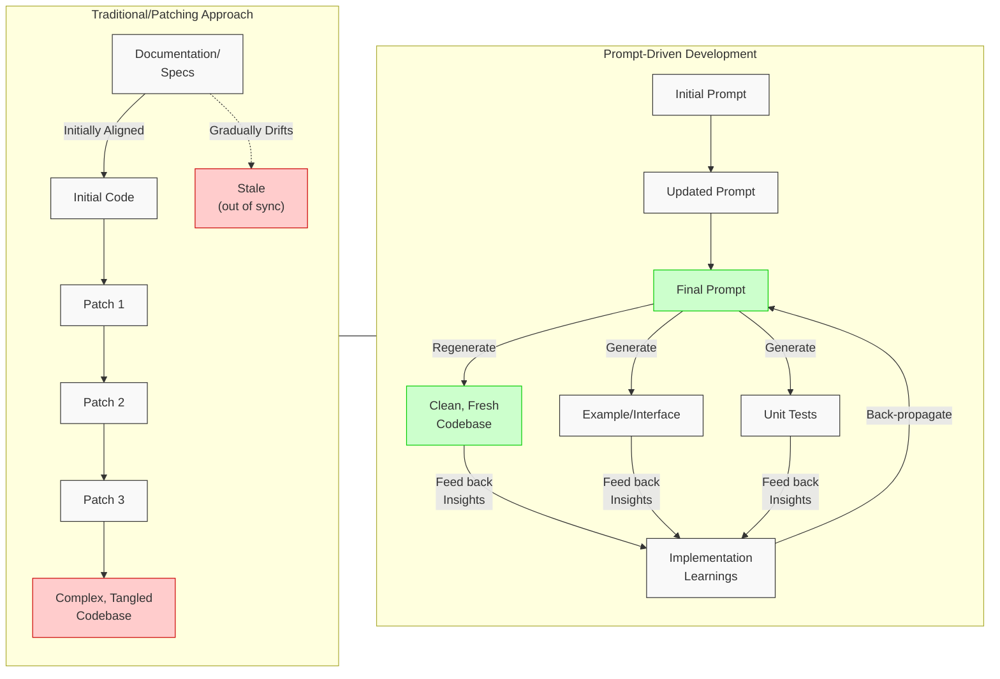
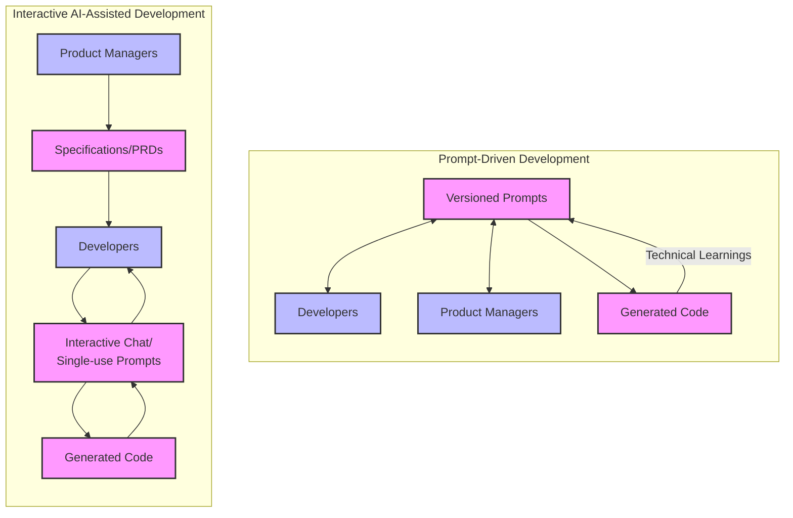
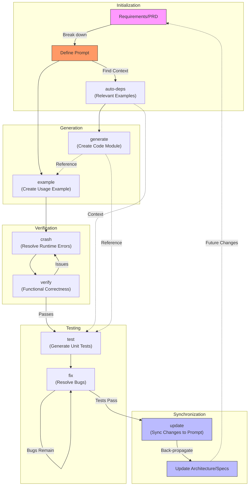

# Whitepaper: The Case for Prompt-Driven Development

## Introduction: Addressing the Maintenance Burden

Traditional software development faces a significant challenge: the overwhelming cost of maintenance. Estimates suggest 80-90% of development costs are incurred *after* the initial code is written, primarily in modifications and updates over the system's lifetime. Modifying existing code, often patched and complex, is akin to renovating an old house – frequently more expensive and complex per unit than building new. This "legacy code" problem often makes starting from scratch seem easier than adapting what exists. Interactive tools excel at making *local* patches, but this approach often exacerbates the long-term maintenance burden by creating complex, interwoven code structures.

Prompt-Driven Development (PDD) proposes a paradigm shift to tackle this core issue. Instead of treating source code as the primary artifact of a software system, PDD elevates the **prompt** to this central role. The core idea is to maintain and evolve the prompt, **regenerating** the code as needed, rather than continuously **patching** the code itself.

## Comparing Maintenance Models: PDD vs Traditional Approaches



## The Paradigm Shift: Prompts as the New Source Code

This shift mirrors historical transitions in other engineering fields. In chip design, the primary artifact evolved from low-level netlists (schematics) to High-Level Description Languages (HDLs) like Verilog and VHDL. Initially, the synthesized netlist was still considered primary, but today, the HDL code is universally recognized as the source of truth. PDD envisions a similar evolution for software, where prompts become the high-level, authoritative description from which code is derived.

This transition elevates the developer's role, moving them to a higher level of abstraction, akin to the evolution from assembly language to C to Python, and now to prompts. Developers focus more on intent, logic, and system design, gaining leverage and accelerating development.

## Core Principles of Prompt-Driven Development

PDD is built on several fundamental concepts, detailed in the PDD methodology:

1.  **Prompts as the Source of Truth**: The prompts, written primarily in natural language, authoritatively define the system's intended behavior. Code becomes a generated artifact derived from these prompts. Importantly, prompts unify information that is often scattered across source code, comments, README files, Confluence, Jira, and other documentation sources—putting all relevant context in one place that the model can enforce.
2.  **Regenerative Development**: Changes are implemented by modifying the relevant prompt(s) and regenerating the affected code. This avoids the accumulation of patches and maintains conceptual integrity.
3.  **Intent Preservation**: Prompts capture the "why" behind the code, preserving design rationale more effectively than code comments alone.
4.  **Modularity**: Similar to code, prompts are designed as modular units, often linked via minimal "example" files that act as interfaces, promoting reusability and token efficiency.
5.  **Synchronization**: A core tenet is maintaining synchronization between the prompt, the generated code, usage examples, and tests. Learning gained during implementation is fed back into the prompts, ensuring they remain accurate and up-to-date. This contrasts with patching approaches where documentation and original specifications often become stale.
6.  **Batch-Oriented Workflow**: PDD is fundamentally designed as a batch process, allowing for scripted, reproducible generation, contrasting with the inherently interactive nature of many code-patching AI tools.

## Key Benefits of PDD

Adopting a PDD approach offers numerous advantages, particularly when contrasted with direct code patching using interactive AI assistants:

> **From a single prompt, the system can emit:** working code, OpenAPI spec, client SDKs, integration tests, Terraform route, plus a Storybook page if it's front-end. Hand-written code only gives you one of those; humans still have to wire up the rest.

*   **Reduced Maintenance Cost & Effort**: By regenerating code from updated prompts, PDD avoids the "rat's nest" complexity that arises from repeated patching. Refactoring and implementing large changes become significantly easier and cleaner. For example, because the prompt knows the full intent, you can change "JWT" to "session cookie" once and re-generate the whole slice—tests and docs included. With code-as-source you chase that change across a dozen files and invariably miss one.
*   **Increased Efficiency & Speed (Developer Focus & Throughput)**: Developers operate at a higher abstraction level. While a single patch might seem faster interactively, PDD's batch nature frees up developer time by eliminating the need to constantly "babysit" the AI, leading to greater overall throughput, especially on larger tasks.
*   **Cost Savings (LLM Usage)**:
    *   **Token Efficiency**: PDD workflows, being more structured and modular (using examples as interfaces), can be more deterministic and token-efficient compared to the potentially verbose interactions of purely agentic/chat-based coding assistants.
    *   **Automated Context Compression**: PDD supports global compression modes (`--context-compression`) that automatically reduce the token count of dependencies—extracting only contract rules, function signatures, or relevant failing tests—without losing behavioral integrity. This provides a compounding advantage as the codebase grows.
    *   **Batch Processing API Discounts**: PDD is inherently suited to batch-mode generation. Developers can define prompts, launch the generation process, and return later. LLM providers often offer significant discounts (e.g., 50% off) for batch processing APIs compared to the more expensive interactive APIs required by constantly supervised tools.

### Batch vs. Interactive Workflow Timelines

```mermaid
gantt
    title Developer Time Utilization: Interactive vs. Batch Approaches
    dateFormat  HH:mm
    axisFormat %H:%M
    section Interactive/Patching
    Define initial prompt      :a1, 00:00, 5m
    Review & direct AI         :a2, after a1, 5m
    Review & redirect AI       :a3, after a2, 5m
    Review & fix output        :a4, after a3, 5m
    Review & redirect AI       :a5, after a4, 5m
    Review & fix output        :a6, after a5, 5m
    Review & redirect AI       :a7, after a6, 5m
    Final review & integration :a8, after a7, 10m
    section PDD (Batch)
    Define/refine prompt       :b1, 00:00, 15m
    Launch generation          :milestone, after b1, 0m
    AI batch processing        :b2, after b1, 30m
    Developer works on other tasks :b3, after b1, 30m
    Review results & integrate :b4, after b2, 10m
```



*Figure 1: Comparison of developer time utilization in interactive vs. batch (PDD) workflows. While both approaches might use similar total LLM processing time, the PDD approach frees the developer from constant supervision, allowing them to work on other tasks while batch processing occurs.*

*   **Enhanced Control & Consistency**: PDD provides more direct control over the generation process. Prompts are attached to specific code modules, making the generation highly directed and reproducible, unlike less predictable, "universal chatbot" style interactions.
*   **Improved Collaboration & Accessibility**: Prompts, being in natural language, serve as a common language accessible to both technical and non-technical stakeholders. This facilitates validation of business logic and keeps everyone aligned, unlike code-centric patching workflows. For example, a compliance officer or PM can grep a prompt for "GDPR delete-within-30-days" and see exactly where the contract lives—without reading Python decorators.
*   **Easier Onboarding**: New team members can understand the system's purpose and structure by reading the prompts, which are typically much shorter and clearer than the full codebase resulting from numerous patches.
*   **Better Scalability & Complexity Management**: For large, complex systems, PDD's directed, modular approach with regeneration offers more control and manageability than repeatedly patching a large, monolithic codebase via interactive chat.
*   **Enhanced Code Quality (via Explicit Context)**: PDD emphasizes systematically finding and providing relevant context (like few-shot examples, potentially sourced from a shared cloud) to the LLM during generation. Good context can allow even less powerful models to outperform stronger models that lack context, leading to higher-quality, more accurate code compared to zero-shot or implicit context approaches.
*   **Adaptability**: PDD excels in scenarios requiring frequent changes or evolution. Modifying high-level prompts is often simpler and safer than performing deep surgery on patched code.
*   **Systematic Prompt Management**: PDD treats generation prompts as critical, version-controlled artifacts, unlike interactive approaches where valuable generation logic may be lost in chat history.
*   **Integration**: PDD tools are designed to be complementary to existing development environments (like VS Code) and agentic tools (like Cursor or Cloud Code), often integrating via protocols like MCP (Model Context Protocol). They can be used *together*.

## PDD in Context: Comparison with Other Approaches

To fully appreciate PDD, it's helpful to contrast it with other common software development methodologies and tools:

*   **PDD vs. Traditional Manual Coding:** Traditional coding offers maximum direct control but is often slower, especially for complex tasks, and struggles with the maintenance burden described earlier. PDD accelerates development by leveraging LLMs and raises the abstraction level from syntax details to defining intent via prompts. It directly tackles long-term maintenance by making regeneration from prompts the primary update mechanism.

*   **PDD vs. Interactive AI-Assisted Patching (e.g., Cursor, Aider):** While both use LLMs, their core philosophies differ significantly.
    *   *Primary Artifact:* PDD elevates the **Prompt** to the source of truth. Interactive tools typically treat the **Code** as primary, using ephemeral chat instructions for direct patching.
    *   *Workflow:* PDD is primarily **batch-oriented** and **regenerative**, freeing developer time. Interactive tools are inherently **interactive**, requiring constant supervision for patching.
    *   *Maintenance:* PDD favors **regeneration** to avoid complexity creep. Interactive patching risks accumulating technical debt if not managed carefully.
    *   *Synchronization:* PDD includes mechanisms (`pdd update`, back-propagation) to keep prompts aligned with implementation. Interactive tools lack this systematic prompt-synchronization loop.
    *   *Leveraging LLM Improvements:* As LLMs grow more powerful and reliable in generating longer, more complex code blocks, PDD's regenerative model is better positioned to leverage these advancements for substantial generation tasks. Interactive patching, focused on incremental changes, was arguably more necessary when LLMs were limited but may underutilize the capabilities of modern models for larger-scale regeneration.

*   **PDD vs. Test-Driven Development (TDD):** PDD shares TDD's emphasis on the importance of testing. However, TDD typically involves writing tests *before* manually writing minimal code to pass them. PDD uses prompts to generate the code, examples, *and* initial tests (`pdd generate`, `pdd example`, `pdd test`). While tests guide refinement in PDD (via `pdd fix`), the prompt remains the ultimate source of functional intent, and the initial code generation is LLM-driven, not manual.

In essence, PDD offers a unique blend: the speed and automation potential of LLMs, combined with a structured, prompt-centric methodology focused on long-term maintainability, synchronization, and leveraging batch processing efficiencies, setting it apart from both purely manual methods and purely interactive AI patching tools.

## Visual: Collaboration Model Comparison

The following diagram illustrates how PDD transforms collaboration between different stakeholders by making prompts (rather than code) the central shared artifact:



In traditional interactive AI-assisted development, developers create ephemeral prompts in chat interfaces to generate code, but these prompts are typically lost and not systematically preserved. PDD transforms this by making versioned prompts the central, persisted artifact that both developers and product managers actively contribute to and maintain. Crucially, technical learnings gained during implementation are back-propagated to keep prompts updated, ensuring continuous synchronization with the generated code.

## Addressing Potential Concerns

While PDD offers significant advantages, potential challenges exist:

*   **Learning Curve**: Developers need to shift their mindset and develop skills in writing effective, concise prompts that specify *what* is needed, not necessarily *how* to implement it. Using agentic tools to help draft and refine prompts can ease this transition.
*   **Prompt Quality & Consistency**: Poorly written or non-standardized prompts could lead to inconsistent results. Emphasizing clarity, conciseness, and potentially team standards or preambles (similar to style guides) helps mitigate this.
*   **Synchronization Overhead**: While keeping diverse artifacts synchronized traditionally required immense, often impractical, manual discipline, **LLMs fundamentally change this calculus.** PDD leverages LLM capabilities for automation (e.g., using `pdd update` potentially orchestrated via Makefiles) to handle the crucial back-propagation of changes (from code/tests back to prompts/specs). This transforms constant synchronization from an impractical ideal into a core, achievable workflow component.
*   **Depth of Customization**: Concerns may arise that prompts can't capture every nuance required. PDD addresses this by allowing for detailed prompts when necessary and focusing on specifying the desired outcome clearly. The `test` and `fix` cycles further ensure requirements are met. For very small, localized fixes, direct patching might *feel* faster in the moment, but PDD prioritizes long-term maintainability by keeping the prompt as the source of truth. A balanced approach, perhaps using tests to guide prompt fixes even for small bugs, is often optimal.
*   **Dependency Management**: Changes in one prompt/module could affect others. This is managed through modular design, clear interfaces (examples), and comprehensive testing to catch integration issues early. PDD's structure helps manage this more systematically than ad-hoc patching.

## The PDD Workflow: A Synchronized Cycle



**Key Principle: Test Accumulation**
A crucial aspect of this workflow is the longevity of tests. When prompts are updated and code is regenerated, existing unit tests should ideally be preserved and potentially augmented with new ones. The goal is not to discard old tests but to accumulate a growing suite that acts as a regression safety net, ensuring that previously working functionality remains correct even as the system evolves.

A typical PDD workflow involves a **batch-oriented, synchronized cycle**, contrasting with the constant supervision model of interactive patching:

1.  **Define**: Start with a requirement (e.g., from a PRD) and break it down into a specific prompt for a code module. Use `auto-deps` to find and include necessary context — both code examples and relevant documentation files.
2.  **Generate**: Use `generate` to create the code module from the prompt.
3.  **Example**: Use `example` to create a minimal usage example (the interface).
4.  **Crash**: Use `crash` to fix any runtime errors that prevent the code/example from running.
5.  **Verify**: After resolving crashes, use `verify` to ensure the example runs correctly and aligns with the prompt's intent.
6.  **Test**: Use `test` to generate unit tests for the code module.
7.  **Fix**: Use `fix` along with the generated tests to identify and correct bugs in the generated code, iterating until tests pass. Support for automated context compression (e.g., via `--context-compression`) enables cost-effective fixing in large codebases by including only the most relevant failing tests and fixtures in the LLM's context.
8.  **Update & Back-propagate**: Use `update` to synchronize any necessary changes made during fixing back to the prompt. Crucially, propagate these learnings back up the chain to architectural specs or parent prompts to ensure consistency across the system.

The fundamental unit is often considered the prompt and its generated code, example, and test file – all kept in sync. If a prompt is too complex to generate correctly in one shot (even with fixing), it should be split (`split`) into smaller, manageable units.

## Future Directions

PDD continues to evolve, with initiatives like:

*   **PDD Cloud**: A platform to store and share few-shot examples, providing crucial context to LLMs during generation, enabling higher quality results even with less powerful models. This acts as a marketplace for valuable context.
*   **VS Code Extension**: Provides syntax highlighting and tooling support for `.prompt` files within the popular editor.

## Architecture

<!-- ARCHITECTURE_START -->

```mermaid
flowchart TB
        PRD["PDD System Architecture"]
    
    subgraph Frontend
        constants_typescript["constants_typescript (150)"]
    end
    
    subgraph Backend
        ci_drift_heal_python["ci_drift_heal_python (80)"]
    end
    
    subgraph Shared
        agentic_common_python["agentic_common_python (5)"]
        get_language_python["get_language_python (6)"]
        path_resolution_python["path_resolution_python (7)"]
        postprocess_python["postprocess_python (8)"]
        unfinished_prompt_python["unfinished_prompt_python (9)"]
        agentic_langtest_python["agentic_langtest_python (10)"]
        continue_generation_python["continue_generation_python (11)"]
        get_jwt_token_python["get_jwt_token_python (12)"]
        agentic_test_step5b_enhance_plan_LLM["agentic_test_step5b_enhance_plan_LLM (210)"]
        agentic_test_step6_coverage_LLM["agentic_test_step6_coverage_LLM (211)"]
        agentic_test_step7_checklist_LLM["agentic_test_step7_checklist_LLM (212)"]
        agentic_test_step8_manual_test_LLM["agentic_test_step8_manual_test_LLM (213)"]
        agentic_test_step9_regression_LLM["agentic_test_step9_regression_LLM (214)"]
        agentic_test_step10_validate_LLM["agentic_test_step10_validate_LLM (215)"]
        agentic_test_step11_loop_LLM["agentic_test_step11_loop_LLM (216)"]
        agentic_test_step15_plan_validation_LLM["agentic_test_step15_plan_validation_LLM (217)"]
        agentic_bug_python["agentic_bug_python (20)"]
        fix_verification_errors_python["fix_verification_errors_python (20)"]
        update_prompt_python["update_prompt_python (21)"]
        fix_errors_from_unit_tests_python["fix_errors_from_unit_tests_python (22)"]
        context_generator_python["context_generator_python (23)"]
        detect_change_python["detect_change_python (24)"]
        agentic_crash_explore_LLM["agentic_crash_explore_LLM (25)"]
        agentic_fix_explore_LLM["agentic_fix_explore_LLM (26)"]
        agentic_update_LLM["agentic_update_LLM (27)"]
        agentic_verify_explore_LLM["agentic_verify_explore_LLM (28)"]
        cli_python["cli_python (29)"]
        generate_output_paths_python["generate_output_paths_python (30)"]
        logo_animation_python["logo_animation_python (31)"]
        cli_branding_python["cli_branding_python (31)"]
        sync_analysis_LLM["sync_analysis_LLM (32)"]
        track_cost_python["track_cost_python (33)"]
        process_csv_change_python["process_csv_change_python (34)"]
        auto_deps_main_python["auto_deps_main_python (35)"]
        conflicts_main_python["conflicts_main_python (36)"]
        context_generator_main_python["context_generator_main_python (37)"]
        get_test_command_python["get_test_command_python (38)"]
        summarize_directory_python["summarize_directory_python (39)"]
        trace_main_python["trace_main_python (40)"]
        xml_tagger_python["xml_tagger_python (41)"]
        agentic_bug_orchestrator_python["agentic_bug_orchestrator_python (42)"]
        agentic_update_python["agentic_update_python (43)"]
        agentic_verify_python["agentic_verify_python (44)"]
        auto_include_python["auto_include_python (45)"]
        change_python["change_python (46)"]
        crash_main_python["crash_main_python (47)"]
        fix_verification_main_python["fix_verification_main_python (48)"]
        git_update_python["git_update_python (49)"]
        increase_tests_python["increase_tests_python (50)"]
        preprocess_main_python["preprocess_main_python (51)"]
        split_python["split_python (52)"]
        trace_python["trace_python (53)"]
        agentic_crash_python["agentic_crash_python (54)"]
        bug_main_python["bug_main_python (55)"]
        cmd_test_main_python["cmd_test_main_python (56)"]
        code_generator_main_python["code_generator_main_python (57)"]
        fix_code_loop_python["fix_code_loop_python (58)"]
        fix_verification_errors_loop_python["fix_verification_errors_loop_python (59)"]
        insert_includes_python["insert_includes_python (60)"]
        split_LLM["split_LLM (61)"]
        update_main_python["update_main_python (62)"]
        bug_to_unit_test_python["bug_to_unit_test_python (63)"]
        code_generator_python["code_generator_python (64)"]
        failure_classification_python["failure_classification_python (64)"]
        fix_error_loop_python["fix_error_loop_python (65)"]
        fix_main_python["fix_main_python (66)"]
        sync_determine_operation_python["sync_determine_operation_python (67)"]
        generate_test_python["generate_test_python (68)"]
        agentic_fix_python["agentic_fix_python (69)"]
        sync_orchestration_python["sync_orchestration_python (70)"]
        Makefile_makefile["Makefile_makefile (71)"]
        agentic_bug_step1_duplicate_LLM["agentic_bug_step1_duplicate_LLM (72)"]
        agentic_bug_step2_docs_LLM["agentic_bug_step2_docs_LLM (73)"]
        agentic_bug_step3_triage_LLM["agentic_bug_step3_triage_LLM (74)"]
        agentic_bug_step5_reproduce_LLM["agentic_bug_step5_reproduce_LLM (75)"]
        agentic_bug_step6_root_cause_LLM["agentic_bug_step6_root_cause_LLM (76)"]
        agentic_bug_step8_test_plan_LLM["agentic_bug_step8_test_plan_LLM (77)"]
        agentic_bug_step9_generate_LLM["agentic_bug_step9_generate_LLM (78)"]
        agentic_bug_step10_verify_LLM["agentic_bug_step10_verify_LLM (79)"]
        agentic_bug_step12_pr_LLM["agentic_bug_step12_pr_LLM (80)"]
        agentic_fix_nonpython_LLM["agentic_fix_nonpython_LLM (81)"]
        agentic_fix_primary_LLM["agentic_fix_primary_LLM (82)"]
        auto_include_LLM["auto_include_LLM (83)"]
        auto_update_python["auto_update_python (84)"]
        bug_to_unit_test_LLM["bug_to_unit_test_LLM (85)"]
        change_LLM["change_LLM (86)"]
        code_patcher_LLM["code_patcher_LLM (87)"]
        comment_line_python["comment_line_python (88)"]
        conflict_LLM["conflict_LLM (89)"]
        continue_generation_LLM["continue_generation_LLM (90)"]
        detect_change_LLM["detect_change_LLM (91)"]
        diff_analyzer_LLM["diff_analyzer_LLM (92)"]
        example_generator_LLM["example_generator_LLM (94)"]
        extract_code_LLM["extract_code_LLM (96)"]
        extract_conflict_LLM["extract_conflict_LLM (97)"]
        extract_detect_change_LLM["extract_detect_change_LLM (98)"]
        extract_program_code_fix_LLM["extract_program_code_fix_LLM (99)"]
        extract_prompt_change_LLM["extract_prompt_change_LLM (100)"]
        extract_prompt_split_LLM["extract_prompt_split_LLM (101)"]
        extract_prompt_update_LLM["extract_prompt_update_LLM (102)"]
        extract_promptline_LLM["extract_promptline_LLM (103)"]
        extract_unit_code_fix_LLM["extract_unit_code_fix_LLM (104)"]
        extract_xml_LLM["extract_xml_LLM (105)"]
        find_section_python["find_section_python (106)"]
        find_verification_errors_LLM["find_verification_errors_LLM (107)"]
        fix_code_module_errors_LLM["fix_code_module_errors_LLM (108)"]
        fix_verification_errors_LLM["fix_verification_errors_LLM (109)"]
        generate_test_LLM["generate_test_LLM (110)"]
        increase_tests_LLM["increase_tests_LLM (111)"]
        insert_includes_LLM["insert_includes_LLM (112)"]
        install_completion_python["install_completion_python (113)"]
        language_format_csv["language_format_csv (114)"]
        llm_model_csv["llm_model_csv (115)"]
        pdd_completion_bash["pdd_completion_bash (116)"]
        pdd_completion_fish["pdd_completion_fish (117)"]
        pdd_completion_zsh["pdd_completion_zsh (118)"]
        postprocess_0_python["postprocess_0_python (120)"]
        pypi_description_restructuredtext["pypi_description_restructuredtext (121)"]
        pyproject_toml["pyproject_toml (122)"]
        pytest_output_python["pytest_output_python (123)"]
        render_mermaid_python["render_mermaid_python (126)"]
        setup_tool_python["setup_tool_python (129)"]
        cli_detector_python["cli_detector_python (130)"]
        summarize_file_LLM["summarize_file_LLM (131)"]
        sync_tui_python["sync_tui_python (132)"]
        template_registry_python["template_registry_python (133)"]
        trace_LLM["trace_LLM (135)"]
        trim_results_LLM["trim_results_LLM (136)"]
        trim_results_start_LLM["trim_results_start_LLM (137)"]
        unfinished_prompt_LLM["unfinished_prompt_LLM (138)"]
        update_model_costs_python["update_model_costs_python (139)"]
        update_prompt_LLM["update_prompt_LLM (140)"]
        get_comment_python["get_comment_python (141)"]
        main_gen_prompt["main_gen_prompt (142)"]
        sync_animation_python["sync_animation_python (144)"]
        xml_convertor_LLM["xml_convertor_LLM (145)"]
        detect_change_main_python["detect_change_main_python (146)"]
        split_main_python["split_main_python (147)"]
        sync_main_python["sync_main_python (148)"]
        incremental_code_generator_python["incremental_code_generator_python (149)"]
        change_main_python["change_main_python (150)"]
        fix_errors_from_unit_tests_LLM["fix_errors_from_unit_tests_LLM (151)"]
        agentic_architecture_orchestrator_python["agentic_architecture_orchestrator_python (152)"]
        architecture_registry_python["architecture_registry_python (208)"]
        agentic_architecture_python["agentic_architecture_python (209)"]
        generate_python["generate_python (234)"]
        incremental_prd_architecture_patch_LLM["incremental_prd_architecture_patch_LLM (207)"]
        incremental_prd_architecture_python["incremental_prd_architecture_python (208)"]
        agentic_arch_step1_analyze_prd_LLM["agentic_arch_step1_analyze_prd_LLM (154)"]
        agentic_arch_step2_analyze_LLM["agentic_arch_step2_analyze_LLM (155)"]
        agentic_arch_step3_research_LLM["agentic_arch_step3_research_LLM (156)"]
        agentic_bug_step11_e2e_test_LLM["agentic_bug_step11_e2e_test_LLM (167)"]
        agentic_change_orchestrator_python["agentic_change_orchestrator_python (168)"]
        agentic_change_python["agentic_change_python (169)"]
        agentic_change_step10_architecture_update_LLM["agentic_change_step10_architecture_update_LLM (170)"]
        agentic_change_step11_identify_issues_LLM["agentic_change_step11_identify_issues_LLM (171)"]
        agentic_change_step12_fix_issues_LLM["agentic_change_step12_fix_issues_LLM (172)"]
        agentic_change_step13_create_pr_LLM["agentic_change_step13_create_pr_LLM (173)"]
        agentic_change_step1_duplicate_LLM["agentic_change_step1_duplicate_LLM (174)"]
        agentic_change_step2_docs_LLM["agentic_change_step2_docs_LLM (175)"]
        agentic_change_step3_research_LLM["agentic_change_step3_research_LLM (176)"]
        agentic_change_step4_clarify_LLM["agentic_change_step4_clarify_LLM (177)"]
        agentic_change_step5_docs_change_LLM["agentic_change_step5_docs_change_LLM (178)"]
        agentic_change_step6_devunits_LLM["agentic_change_step6_devunits_LLM (179)"]
        agentic_change_step7_architecture_LLM["agentic_change_step7_architecture_LLM (180)"]
        agentic_change_step8_analyze_LLM["agentic_change_step8_analyze_LLM (181)"]
        agentic_change_step9_implement_LLM["agentic_change_step9_implement_LLM (182)"]
        agentic_e2e_fix_orchestrator_python["agentic_e2e_fix_orchestrator_python (183)"]
        agentic_e2e_fix_python["agentic_e2e_fix_python (184)"]
        agentic_e2e_fix_step1_unit_tests_LLM["agentic_e2e_fix_step1_unit_tests_LLM (185)"]
        agentic_e2e_fix_step2_e2e_tests_LLM["agentic_e2e_fix_step2_e2e_tests_LLM (186)"]
        agentic_e2e_fix_step3_root_cause_LLM["agentic_e2e_fix_step3_root_cause_LLM (187)"]
        agentic_e2e_fix_step4_fix_e2e_tests_LLM["agentic_e2e_fix_step4_fix_e2e_tests_LLM (188)"]
        agentic_e2e_fix_step5_identify_devunits_LLM["agentic_e2e_fix_step5_identify_devunits_LLM (189)"]
        agentic_e2e_fix_step6_create_unit_tests_LLM["agentic_e2e_fix_step6_create_unit_tests_LLM (190)"]
        agentic_e2e_fix_step7_verify_tests_LLM["agentic_e2e_fix_step7_verify_tests_LLM (191)"]
        agentic_e2e_fix_step8_run_pdd_fix_LLM["agentic_e2e_fix_step8_run_pdd_fix_LLM (192)"]
        agentic_e2e_fix_step9_verify_all_LLM["agentic_e2e_fix_step9_verify_all_LLM (193)"]
        agentic_test_generate_LLM["agentic_test_generate_LLM (194)"]
        agentic_test_generate_python["agentic_test_generate_python (195)"]
        agentic_test_orchestrator_python["agentic_test_orchestrator_python (196)"]
        agentic_test_python["agentic_test_python (197)"]
        agentic_test_step1_duplicate_LLM["agentic_test_step1_duplicate_LLM (198)"]
        agentic_test_step2_docs_LLM["agentic_test_step2_docs_LLM (199)"]
        agentic_test_step3_clarify_LLM["agentic_test_step3_clarify_LLM (200)"]
        agentic_test_step4_detect_frontend_LLM["agentic_test_step4_detect_frontend_LLM (201)"]
        agentic_test_step5_test_plan_LLM["agentic_test_step5_test_plan_LLM (202)"]
        agentic_test_step6_generate_tests_LLM["agentic_test_step6_generate_tests_LLM (203)"]
        agentic_test_step7_run_tests_LLM["agentic_test_step7_run_tests_LLM (204)"]
        agentic_test_step8_fix_iterate_LLM["agentic_test_step8_fix_iterate_LLM (205)"]
        agentic_test_step16_run_tests_LLM["agentic_test_step16_run_tests_LLM (205)"]
        agentic_test_step9_submit_pr_LLM["agentic_test_step9_submit_pr_LLM (206)"]
        architecture_sync_python["architecture_sync_python (207)"]
        auth_service_python["auth_service_python (208)"]
        generate_test_from_example_LLM["generate_test_from_example_LLM (209)"]
        operation_log_python["operation_log_python (210)"]
        prompt_code_diff_LLM["prompt_code_diff_LLM (211)"]
        prompt_diff_LLM["prompt_diff_LLM (212)"]
        remote_session_python["remote_session_python (213)"]
        sync_order_python["sync_order_python (214)"]
        agentic_sync_python["agentic_sync_python (215)"]
        agentic_sync_runner_python["agentic_sync_runner_python (216)"]
        durable_sync_runner_python["durable_sync_runner_python (216)"]
        agentic_checkup_python["agentic_checkup_python (217)"]
        checkup_review_loop_python["checkup_review_loop_python (217.5)"]
        checkup_gates_python["checkup_gates_python (217.6)"]
        agentic_checkup_orchestrator_python["agentic_checkup_orchestrator_python (218)"]
        arrange_graph_layout_LLM["arrange_graph_layout_LLM (219)"]
        fix_python["fix_python (220)"]
        ci_validation_python["ci_validation_python (221)"]
        agentic_e2e_fix_step10_ci_validation_LLM["agentic_e2e_fix_step10_ci_validation_LLM (222)"]
        agentic_e2e_fix_step11_code_cleanup_LLM["agentic_e2e_fix_step11_code_cleanup_LLM (223)"]
        embed_retrieve_python["embed_retrieve_python (38)"]
        __init___python["__init___python (70)"]
        maintenance_python["maintenance_python (70)"]
        modify_python["modify_python (70)"]
        checkup_python["checkup_python (236)"]
        prompt_lint_python["prompt_lint_python (237)"]
        prompt_python["prompt_python (238)"]
        agentic_split_orchestrator_python["agentic_split_orchestrator_python (224)"]
        agentic_split_python["agentic_split_python (225)"]
        agentic_split_step1_survey_LLM["agentic_split_step1_survey_LLM (226)"]
        agentic_split_step2_diagnose_LLM["agentic_split_step2_diagnose_LLM (227)"]
        agentic_split_step3_investigate_LLM["agentic_split_step3_investigate_LLM (228)"]
        agentic_split_step4_propose_options_LLM["agentic_split_step4_propose_options_LLM (229)"]
        agentic_split_step6_extract_LLM["agentic_split_step6_extract_LLM (230)"]
        agentic_split_step7_assess_LLM["agentic_split_step7_assess_LLM (231)"]
        agentic_split_step8_repair_LLM["agentic_split_step8_repair_LLM (232)"]
        agentic_split_step0_intent_LLM["agentic_split_step0_intent_LLM (226)"]
        agentic_split_step6a_phase_extract_LLM["agentic_split_step6a_phase_extract_LLM (226)"]
        agentic_split_step9_refine_check_LLM["agentic_split_step9_refine_check_LLM (226)"]
        split_validation_python["split_validation_python (225)"]
        agentic_common_worktree_python["agentic_common_worktree_python (224)"]
        get_lint_commands_python["get_lint_commands_python (223)"]
        cli_python["cli_python (5)"]
        duplicate_cli_guard_python["duplicate_cli_guard_python (5)"]
        generate_model_catalog_python["generate_model_catalog_python (5)"]
        _keyring_timeout_python["_keyring_timeout_python (233)"]
        agentic_sync_identify_modules_LLM["agentic_sync_identify_modules_LLM (235)"]
        cloud_python["cloud_python (5)"]
        jobs_python["jobs_python (220)"]
        metadata_sync_python["metadata_sync_python (5)"]
        git_porcelain_python["git_porcelain_python (4)"]
        llm_invoke_python["llm_invoke_python (236)"]
        codex_subscription_python["codex_subscription_python (236)"]
        contract_ir_python["contract_ir_python (239)"]
        contract_check_python["contract_check_python (240)"]
        contracts_python["contracts_python (241)"]
        checkup_file_selection_python["checkup_file_selection_python (4)"]
        checkup_simplify_claude_python["checkup_simplify_claude_python (5)"]
        checkup_simplify_engines_python["checkup_simplify_engines_python (5)"]
        checkup_simplify_python["checkup_simplify_python (5)"]
        agentic_arch_step10_completeness_LLM["agentic_arch_step10_completeness_LLM (243)"]
        agentic_arch_step11_sync_LLM["agentic_arch_step11_sync_LLM (244)"]
        agentic_arch_step12_deps_LLM["agentic_arch_step12_deps_LLM (245)"]
        agentic_arch_step13_fix_LLM["agentic_arch_step13_fix_LLM (246)"]
        agentic_arch_step1b_complexity_LLM["agentic_arch_step1b_complexity_LLM (247)"]
        agentic_arch_step2b_codebase_scan_LLM["agentic_arch_step2b_codebase_scan_LLM (248)"]
        agentic_arch_step4_data_model_LLM["agentic_arch_step4_data_model_LLM (249)"]
        agentic_arch_step5_design_LLM["agentic_arch_step5_design_LLM (250)"]
        agentic_arch_step5b_completeness_gate_LLM["agentic_arch_step5b_completeness_gate_LLM (251)"]
        agentic_arch_step5b_fix_LLM["agentic_arch_step5b_fix_LLM (252)"]
        agentic_arch_step6_research_deps_LLM["agentic_arch_step6_research_deps_LLM (253)"]
        agentic_arch_step7_generate_LLM["agentic_arch_step7_generate_LLM (254)"]
        agentic_arch_step7b_review_LLM["agentic_arch_step7b_review_LLM (255)"]
        agentic_arch_step8_5_context_docs_LLM["agentic_arch_step8_5_context_docs_LLM (256)"]
        agentic_arch_step8_pddrc_LLM["agentic_arch_step8_pddrc_LLM (257)"]
        agentic_arch_step9_prompts_LLM["agentic_arch_step9_prompts_LLM (258)"]
        agentic_arch_step9b_cross_audit_LLM["agentic_arch_step9b_cross_audit_LLM (259)"]
        agentic_bug_step11_e2e_test_LLM["agentic_bug_step11_e2e_test_LLM (260)"]
        agentic_bug_step12_pr_LLM["agentic_bug_step12_pr_LLM (261)"]
        api_key_scanner_python["api_key_scanner_python (262)"]
        checkup_simplify_python["checkup_simplify_python (263)"]
        config_resolution_python["config_resolution_python (264)"]
        conflicts_in_prompts_python["conflicts_in_prompts_python (265)"]
        construct_paths_python["construct_paths_python (266)"]
        content_selector_python["content_selector_python (267)"]
        dump_python["dump_python (268)"]
        errors_python["errors_python (269)"]
        utils_python["utils_python (270)"]
        core_dump_requirements_LLM["core_dump_requirements_LLM (271)"]
        cross_issue_reconcile_LLM["cross_issue_reconcile_LLM (272)"]
        extracts_prune_python["extracts_prune_python (274)"]
        firecrawl_cache_python["firecrawl_cache_python (275)"]
        api_typescript["api_typescript (276)"]
        useTaskQueue_typescript["useTaskQueue_typescript (277)"]
        include_query_extractor_python["include_query_extractor_python (278)"]
        load_prompt_template_python["load_prompt_template_python (279)"]
        model_tester_python["model_tester_python (280)"]
        one_session_sync_python["one_session_sync_python (281)"]
        pddrc_initializer_python["pddrc_initializer_python (282)"]
        post_gen_verify_LLM["post_gen_verify_LLM (283)"]
        preprocess_python["preprocess_python (284)"]
        provider_manager_python["provider_manager_python (285)"]
        architecture_python["architecture_python (286)"]
        extracts_python["extracts_python (287)"]
        token_counter_python["token_counter_python (288)"]
        template_expander_python["template_expander_python (289)"]
    end
    
    PRD --> Frontend
    PRD --> Backend

    agentic_common_python -->|uses| llm_invoke_python
    agentic_common_python -->|uses| auth_service_python
    agentic_common_python -->|uses| _keyring_timeout_python
    agentic_common_python -->|uses| git_porcelain_python
    get_jwt_token_python -->|uses| _keyring_timeout_python
    generate_output_paths_python -->|uses| auto_deps_main_python
    track_cost_python -->|uses| llm_invoke_python
    auto_deps_main_python -->|uses| construct_paths_python
    auto_deps_main_python -->|uses| insert_includes_python
    auto_deps_main_python -->|uses| validate_prompt_includes_python
    auto_deps_main_python -->|uses| operation_log_python
    auto_deps_main_python -->|uses| auto_deps_architecture_python
    summarize_directory_python -->|uses| llm_invoke_python
    summarize_directory_python -->|uses| load_prompt_template_python
    summarize_directory_python -->|uses| path_resolution_python
    agentic_update_python -->|uses| agentic_update_LLM
    agentic_update_python -->|uses| sync_order_python
    auto_include_python -->|uses| llm_invoke_python
    auto_include_python -->|uses| load_prompt_template_python
    auto_include_python -->|uses| summarize_directory_python
    auto_include_python -->|uses| embed_retrieve_python
    auto_include_python -->|uses| path_resolution_python
    bug_main_python -->|uses| agentic_bug_python
    bug_main_python -->|uses| bug_to_unit_test_python
    bug_main_python -->|uses| cloud_python
    code_generator_main_python -->|uses| construct_paths_python
    code_generator_main_python -->|uses| preprocess_python
    code_generator_main_python -->|uses| code_generator_python
    code_generator_main_python -->|uses| incremental_code_generator_python
    code_generator_main_python -->|uses| cloud_python
    code_generator_main_python -->|uses| auto_include_python
    code_generator_main_python -->|uses| agentic_langtest_python
    code_generator_main_python -->|uses| _keyring_timeout_python
    insert_includes_python -->|uses| llm_invoke_python
    insert_includes_python -->|uses| load_prompt_template_python
    insert_includes_python -->|uses| auto_include_python
    insert_includes_python -->|uses| preprocess_python
    insert_includes_python -->|uses| path_resolution_python
    split_LLM -->|uses| cli_python
    split_LLM -->|uses| conflicts_main_python
    split_LLM -->|uses| trace_main_python
    split_LLM -->|uses| track_cost_python
    update_main_python -->|uses| auto_include_python
    update_main_python -->|uses| metadata_sync_python
    update_main_python -->|uses| construct_paths_python
    update_main_python -->|uses| config_resolution_python
    update_main_python -->|uses| get_language_python
    update_main_python -->|uses| agentic_common_python
    update_main_python -->|uses| agentic_update_python
    update_main_python -->|uses| sync_determine_operation_python
    update_main_python -->|uses| operation_log_python
    fix_error_loop_python -->|uses| failure_classification_python
    fix_main_python -->|uses| fix_error_loop_python
    fix_main_python -->|uses| agentic_langtest_python
    fix_main_python -->|uses| auth_service_python
    fix_main_python -->|uses| cloud_python
    sync_determine_operation_python -->|uses| agentic_langtest_python
    generate_test_python -->|uses| bug_to_unit_test_python
    sync_orchestration_python -->|uses| code_generator_main_python
    sync_orchestration_python -->|uses| agentic_sync_runner_python
    setup_tool_python -->|uses| cli_detector_python
    setup_tool_python -->|uses| cli_branding_python
    main_gen_prompt -->|uses| preprocess_main_python
    xml_convertor_LLM -->|uses| split_LLM
    sync_main_python -->|uses| cloud_python
    sync_main_python -->|uses| code_generator_main_python
    sync_main_python -->|uses| agentic_sync_runner_python
    incremental_code_generator_python -->|uses| llm_invoke_python
    incremental_code_generator_python -->|uses| preprocess_python
    incremental_code_generator_python -->|uses| postprocess_python
    fix_errors_from_unit_tests_LLM -->|uses| code_generator_python
    fix_errors_from_unit_tests_LLM -->|uses| conflicts_in_prompts_python
    fix_errors_from_unit_tests_LLM -->|uses| context_generator_python
    fix_errors_from_unit_tests_LLM -->|uses| detect_change_python
    agentic_architecture_python -->|uses| agentic_architecture_orchestrator_python
    agentic_architecture_python -->|uses| incremental_prd_architecture_python
    agentic_architecture_python -->|uses| architecture_registry_python
    generate_python -->|uses| agentic_architecture_python
    generate_python -->|uses| agentic_test_python
    generate_python -->|uses| cmd_test_main_python
    generate_python -->|uses| code_generator_main_python
    generate_python -->|uses| context_generator_main_python
    generate_python -->|uses| operation_log_python
    generate_python -->|uses| template_registry_python
    generate_python -->|uses| track_cost_python
    incremental_prd_architecture_python -->|uses| architecture_sync_python
    incremental_prd_architecture_python -->|uses| change_python
    incremental_prd_architecture_python -->|uses| detect_change_python
    incremental_prd_architecture_python -->|uses| incremental_prd_architecture_patch_LLM
    agentic_arch_step2_analyze_LLM -->|uses| agentic_arch_step1_analyze_prd_LLM
    agentic_arch_step3_research_LLM -->|uses| agentic_arch_step2_analyze_LLM
    agentic_change_orchestrator_python -->|uses| architecture_sync_python
    agentic_change_orchestrator_python -->|uses| agentic_common_python
    agentic_change_orchestrator_python -->|uses| git_porcelain_python
    agentic_change_python -->|uses| agentic_change_orchestrator_python
    agentic_change_python -->|uses| agentic_common_python
    agentic_change_step10_architecture_update_LLM -->|uses| llm_invoke_python
    agentic_change_step10_architecture_update_LLM -->|uses| path_resolution_python
    agentic_e2e_fix_orchestrator_python -->|uses| agentic_bug_orchestrator_python
    agentic_e2e_fix_orchestrator_python -->|uses| agentic_checkup_python
    agentic_e2e_fix_orchestrator_python -->|uses| ci_validation_python
    agentic_e2e_fix_python -->|uses| agentic_e2e_fix_orchestrator_python
    agentic_test_orchestrator_python -->|uses| agentic_common_python
    auth_service_python -->|uses| _keyring_timeout_python
    remote_session_python -->|uses| auth_service_python
    sync_order_python -->|uses| auto_include_python
    sync_order_python -->|uses| agentic_common_python
    sync_order_python -->|uses| architecture_sync_python
    agentic_sync_python -->|uses| architecture_sync_python
    agentic_sync_python -->|uses| auto_deps_main_python
    agentic_sync_python -->|uses| agentic_sync_runner_python
    agentic_sync_python -->|uses| durable_sync_runner_python
    agentic_sync_runner_python -->|uses| architecture_sync_python
    agentic_sync_runner_python -->|uses| agentic_langtest_python
    agentic_sync_runner_python -->|uses| agentic_test_orchestrator_python
    agentic_sync_runner_python -->|uses| sync_order_python
    durable_sync_runner_python -->|uses| agentic_sync_runner_python
    agentic_checkup_python -->|uses| agentic_common_python
    agentic_checkup_python -->|uses| checkup_review_loop_python
    checkup_review_loop_python -->|uses| agentic_common_python
    checkup_review_loop_python -->|uses| agentic_change_python
    checkup_review_loop_python -->|uses| agentic_checkup_orchestrator_python
    checkup_review_loop_python -->|uses| agentic_e2e_fix_orchestrator_python
    checkup_review_loop_python -->|uses| architecture_registry_python
    checkup_review_loop_python -->|uses| git_porcelain_python
    checkup_gates_python -->|uses| checkup_review_loop_python
    agentic_checkup_orchestrator_python -->|uses| agentic_common_python
    agentic_checkup_orchestrator_python -->|uses| checkup_review_loop_python
    agentic_checkup_orchestrator_python -->|uses| checkup_gates_python
    fix_python -->|uses| agentic_e2e_fix_python
    fix_python -->|uses| fix_main_python
    fix_python -->|uses| track_cost_python
    ci_validation_python -->|uses| agentic_common_python
    maintenance_python -->|uses| auto_deps_main_python
    maintenance_python -->|uses| architecture_sync_python
    modify_python -->|uses| split_main_python
    modify_python -->|uses| agentic_split_python
    modify_python -->|uses| change_main_python
    modify_python -->|uses| agentic_change_python
    modify_python -->|uses| update_main_python
    checkup_python -->|uses| agentic_checkup_python
    checkup_python -->|uses| prompt_python
    checkup_python -->|uses| contracts_python
    prompt_lint_python -->|uses| prompt_lint_LLM
    prompt_python -->|uses| prompt_lint_python
    ci_drift_heal_python -->|uses| sync_determine_operation_python
    ci_drift_heal_python -->|uses| operation_log_python
    ci_drift_heal_python -->|uses| agentic_sync_runner_python
    ci_drift_heal_python -->|uses| user_story_tests_python
    ci_drift_heal_python -->|uses| agentic_common_python
    ci_drift_heal_python -->|uses| auto_include_python
    ci_drift_heal_python -->|uses| agentic_langtest_python
    ci_drift_heal_python -->|uses| architecture_sync_python
    ci_drift_heal_python -->|uses| metadata_sync_python
    agentic_split_orchestrator_python -->|uses| agentic_common_worktree_python
    agentic_split_orchestrator_python -->|uses| split_validation_python
    agentic_split_orchestrator_python -->|uses| architecture_sync_python
    agentic_split_python -->|uses| agentic_split_orchestrator_python
    agentic_split_python -->|uses| agentic_common_python
    agentic_split_python -->|uses| get_language_python
    agentic_split_python -->|uses| agentic_common_worktree_python
    agentic_split_step1_survey_LLM -->|uses| agentic_split_orchestrator_python
    agentic_split_step2_diagnose_LLM -->|uses| agentic_split_orchestrator_python
    agentic_split_step3_investigate_LLM -->|uses| agentic_split_orchestrator_python
    agentic_split_step4_propose_options_LLM -->|uses| agentic_split_orchestrator_python
    agentic_split_step6_extract_LLM -->|uses| agentic_split_orchestrator_python
    agentic_split_step7_assess_LLM -->|uses| agentic_split_orchestrator_python
    agentic_split_step8_repair_LLM -->|uses| agentic_split_orchestrator_python
    agentic_split_step0_intent_LLM -->|uses| agentic_split_orchestrator_python
    agentic_split_step6a_phase_extract_LLM -->|uses| agentic_split_orchestrator_python
    agentic_split_step9_refine_check_LLM -->|uses| agentic_split_orchestrator_python
    split_validation_python -->|uses| get_test_command_python
    split_validation_python -->|uses| get_lint_commands_python
    agentic_common_worktree_python -->|uses| agentic_common_python
    agentic_common_worktree_python -->|uses| git_porcelain_python
    get_lint_commands_python -->|uses| get_test_command_python
    cli_python -->|uses| dump_python
    cli_python -->|uses| errors_python
    cli_python -->|uses| utils_python
    cli_python -->|uses| duplicate_cli_guard_python
    cli_python -->|uses| agentic_common_python
    cli_python -->|uses| auto_update_python
    cli_python -->|uses| track_cost_python
    cli_python -->|uses| cli_branding_python
    duplicate_cli_guard_python -->|uses| architecture_registry_python
    duplicate_cli_guard_python -->|uses| agentic_langtest_python
    duplicate_cli_guard_python -->|uses| agentic_test_orchestrator_python
    duplicate_cli_guard_python -->|uses| agentic_common_python
    cloud_python -->|uses| auth_service_python
    metadata_sync_python -->|uses| architecture_sync_python
    metadata_sync_python -->|uses| sync_determine_operation_python
    metadata_sync_python -->|uses| operation_log_python
    llm_invoke_python -->|uses| path_resolution_python
    llm_invoke_python -->|uses| token_counter_python
    contract_check_python -->|uses| contract_ir_python
    contracts_python -->|uses| contract_check_python
    checkup_simplify_engines_python -->|uses| checkup_simplify_claude_python
    checkup_simplify_python -->|uses| checkup_file_selection_python
    checkup_simplify_python -->|uses| checkup_simplify_engines_python
    checkup_simplify_python -->|uses| checkup_simplify_claude_python
    checkup_simplify_python -->|uses| git_porcelain_python
    agentic_arch_step10_completeness_LLM -->|uses| agentic_arch_step9_prompts_LLM
    agentic_arch_step11_sync_LLM -->|uses| agentic_arch_step10_completeness_LLM
    agentic_arch_step12_deps_LLM -->|uses| agentic_arch_step11_sync_LLM
    agentic_arch_step13_fix_LLM -->|uses| agentic_arch_step12_deps_LLM
    agentic_arch_step1b_complexity_LLM -->|uses| agentic_arch_step1_analyze_prd_LLM
    agentic_arch_step2b_codebase_scan_LLM -->|uses| agentic_arch_step2_analyze_LLM
    agentic_arch_step4_data_model_LLM -->|uses| agentic_arch_step3_research_LLM
    agentic_arch_step5_design_LLM -->|uses| agentic_arch_step4_data_model_LLM
    agentic_arch_step5b_completeness_gate_LLM -->|uses| agentic_arch_step5_design_LLM
    agentic_arch_step5b_fix_LLM -->|uses| agentic_arch_step5b_completeness_gate_LLM
    agentic_arch_step6_research_deps_LLM -->|uses| agentic_arch_step5_design_LLM
    agentic_arch_step7_generate_LLM -->|uses| agentic_arch_step6_research_deps_LLM
    agentic_arch_step7b_review_LLM -->|uses| agentic_arch_step7_generate_LLM
    agentic_arch_step8_5_context_docs_LLM -->|uses| agentic_arch_step8_pddrc_LLM
    agentic_arch_step8_pddrc_LLM -->|uses| agentic_arch_step7_generate_LLM
    agentic_arch_step9_prompts_LLM -->|uses| agentic_arch_step8_pddrc_LLM
    agentic_arch_step9b_cross_audit_LLM -->|uses| agentic_arch_step9_prompts_LLM
    checkup_simplify_python -->|uses| checkup_simplify_python
    extracts_prune_python -->|uses| include_query_extractor_python
    extracts_prune_python -->|uses| preprocess_python
    extracts_prune_python -->|uses| path_resolution_python
    include_query_extractor_python -->|uses| llm_invoke_python
    include_query_extractor_python -->|uses| load_prompt_template_python
    include_query_extractor_python -->|uses| preprocess_python
    include_query_extractor_python -->|uses| path_resolution_python
    one_session_sync_python -->|uses| code_generator_main_python
    one_session_sync_python -->|uses| fix_code_loop_python
    one_session_sync_python -->|uses| fix_verification_errors_loop_python
    one_session_sync_python -->|uses| generate_test_python
    one_session_sync_python -->|uses| fix_error_loop_python
    preprocess_python -->|uses| path_resolution_python
    preprocess_python -->|uses| content_selector_python
    preprocess_python -->|uses| include_query_extractor_python
    provider_manager_python -->|uses| api_key_scanner_python
    architecture_python -->|uses| architecture_sync_python
    architecture_python -->|uses| agentic_common_python
    architecture_python -->|uses| load_prompt_template_python
    extracts_python -->|uses| include_query_extractor_python
    extracts_python -->|uses| preprocess_python
    
    classDef frontend fill:#FFF3E0,stroke:#F57C00,stroke-width:2px
    classDef backend fill:#E3F2FD,stroke:#1976D2,stroke-width:2px
    classDef shared fill:#E8F5E9,stroke:#388E3C,stroke-width:2px
    classDef system fill:#E0E0E0,stroke:#616161,stroke-width:3px
    
    class constants_typescript frontend
    class ci_drift_heal_python backend
    class agentic_common_python,get_language_python,path_resolution_python,postprocess_python,unfinished_prompt_python,agentic_langtest_python,continue_generation_python,get_jwt_token_python,agentic_test_step5b_enhance_plan_LLM,agentic_test_step6_coverage_LLM,agentic_test_step7_checklist_LLM,agentic_test_step8_manual_test_LLM,agentic_test_step9_regression_LLM,agentic_test_step10_validate_LLM,agentic_test_step11_loop_LLM,agentic_test_step15_plan_validation_LLM,agentic_bug_python,fix_verification_errors_python,update_prompt_python,fix_errors_from_unit_tests_python,context_generator_python,detect_change_python,agentic_crash_explore_LLM,agentic_fix_explore_LLM,agentic_update_LLM,agentic_verify_explore_LLM,cli_python,generate_output_paths_python,logo_animation_python,cli_branding_python,sync_analysis_LLM,track_cost_python,process_csv_change_python,auto_deps_main_python,conflicts_main_python,context_generator_main_python,get_test_command_python,summarize_directory_python,trace_main_python,xml_tagger_python,agentic_bug_orchestrator_python,agentic_update_python,agentic_verify_python,auto_include_python,change_python,crash_main_python,fix_verification_main_python,git_update_python,increase_tests_python,preprocess_main_python,split_python,trace_python,agentic_crash_python,bug_main_python,cmd_test_main_python,code_generator_main_python,fix_code_loop_python,fix_verification_errors_loop_python,insert_includes_python,split_LLM,update_main_python,bug_to_unit_test_python,code_generator_python,failure_classification_python,fix_error_loop_python,fix_main_python,sync_determine_operation_python,generate_test_python,agentic_fix_python,sync_orchestration_python,Makefile_makefile,agentic_bug_step1_duplicate_LLM,agentic_bug_step2_docs_LLM,agentic_bug_step3_triage_LLM,agentic_bug_step5_reproduce_LLM,agentic_bug_step6_root_cause_LLM,agentic_bug_step8_test_plan_LLM,agentic_bug_step9_generate_LLM,agentic_bug_step10_verify_LLM,agentic_bug_step12_pr_LLM,agentic_fix_nonpython_LLM,agentic_fix_primary_LLM,auto_include_LLM,auto_update_python,bug_to_unit_test_LLM,change_LLM,code_patcher_LLM,comment_line_python,conflict_LLM,continue_generation_LLM,detect_change_LLM,diff_analyzer_LLM,example_generator_LLM,extract_code_LLM,extract_conflict_LLM,extract_detect_change_LLM,extract_program_code_fix_LLM,extract_prompt_change_LLM,extract_prompt_split_LLM,extract_prompt_update_LLM,extract_promptline_LLM,extract_unit_code_fix_LLM,extract_xml_LLM,find_section_python,find_verification_errors_LLM,fix_code_module_errors_LLM,fix_verification_errors_LLM,generate_test_LLM,increase_tests_LLM,insert_includes_LLM,install_completion_python,language_format_csv,llm_model_csv,pdd_completion_bash,pdd_completion_fish,pdd_completion_zsh,postprocess_0_python,pypi_description_restructuredtext,pyproject_toml,pytest_output_python,render_mermaid_python,setup_tool_python,cli_detector_python,summarize_file_LLM,sync_tui_python,template_registry_python,trace_LLM,trim_results_LLM,trim_results_start_LLM,unfinished_prompt_LLM,update_model_costs_python,update_prompt_LLM,get_comment_python,main_gen_prompt,sync_animation_python,xml_convertor_LLM,detect_change_main_python,split_main_python,sync_main_python,incremental_code_generator_python,change_main_python,fix_errors_from_unit_tests_LLM,agentic_architecture_orchestrator_python,architecture_registry_python,agentic_architecture_python,generate_python,incremental_prd_architecture_patch_LLM,incremental_prd_architecture_python,agentic_arch_step1_analyze_prd_LLM,agentic_arch_step2_analyze_LLM,agentic_arch_step3_research_LLM,agentic_bug_step11_e2e_test_LLM,agentic_change_orchestrator_python,agentic_change_python,agentic_change_step10_architecture_update_LLM,agentic_change_step11_identify_issues_LLM,agentic_change_step12_fix_issues_LLM,agentic_change_step13_create_pr_LLM,agentic_change_step1_duplicate_LLM,agentic_change_step2_docs_LLM,agentic_change_step3_research_LLM,agentic_change_step4_clarify_LLM,agentic_change_step5_docs_change_LLM,agentic_change_step6_devunits_LLM,agentic_change_step7_architecture_LLM,agentic_change_step8_analyze_LLM,agentic_change_step9_implement_LLM,agentic_e2e_fix_orchestrator_python,agentic_e2e_fix_python,agentic_e2e_fix_step1_unit_tests_LLM,agentic_e2e_fix_step2_e2e_tests_LLM,agentic_e2e_fix_step3_root_cause_LLM,agentic_e2e_fix_step4_fix_e2e_tests_LLM,agentic_e2e_fix_step5_identify_devunits_LLM,agentic_e2e_fix_step6_create_unit_tests_LLM,agentic_e2e_fix_step7_verify_tests_LLM,agentic_e2e_fix_step8_run_pdd_fix_LLM,agentic_e2e_fix_step9_verify_all_LLM,agentic_test_generate_LLM,agentic_test_generate_python,agentic_test_orchestrator_python,agentic_test_python,agentic_test_step1_duplicate_LLM,agentic_test_step2_docs_LLM,agentic_test_step3_clarify_LLM,agentic_test_step4_detect_frontend_LLM,agentic_test_step5_test_plan_LLM,agentic_test_step6_generate_tests_LLM,agentic_test_step7_run_tests_LLM,agentic_test_step8_fix_iterate_LLM,agentic_test_step16_run_tests_LLM,agentic_test_step9_submit_pr_LLM,architecture_sync_python,auth_service_python,generate_test_from_example_LLM,operation_log_python,prompt_code_diff_LLM,prompt_diff_LLM,remote_session_python,sync_order_python,agentic_sync_python,agentic_sync_runner_python,durable_sync_runner_python,agentic_checkup_python,checkup_review_loop_python,checkup_gates_python,agentic_checkup_orchestrator_python,arrange_graph_layout_LLM,fix_python,ci_validation_python,agentic_e2e_fix_step10_ci_validation_LLM,agentic_e2e_fix_step11_code_cleanup_LLM,embed_retrieve_python,__init___python,maintenance_python,modify_python,checkup_python,prompt_lint_python,prompt_python,agentic_split_orchestrator_python,agentic_split_python,agentic_split_step1_survey_LLM,agentic_split_step2_diagnose_LLM,agentic_split_step3_investigate_LLM,agentic_split_step4_propose_options_LLM,agentic_split_step6_extract_LLM,agentic_split_step7_assess_LLM,agentic_split_step8_repair_LLM,agentic_split_step0_intent_LLM,agentic_split_step6a_phase_extract_LLM,agentic_split_step9_refine_check_LLM,split_validation_python,agentic_common_worktree_python,get_lint_commands_python,cli_python,duplicate_cli_guard_python,generate_model_catalog_python,_keyring_timeout_python,agentic_sync_identify_modules_LLM,cloud_python,jobs_python,metadata_sync_python,git_porcelain_python,llm_invoke_python,codex_subscription_python,contract_ir_python,contract_check_python,contracts_python,checkup_file_selection_python,checkup_simplify_claude_python,checkup_simplify_engines_python,checkup_simplify_python,agentic_arch_step10_completeness_LLM,agentic_arch_step11_sync_LLM,agentic_arch_step12_deps_LLM,agentic_arch_step13_fix_LLM,agentic_arch_step1b_complexity_LLM,agentic_arch_step2b_codebase_scan_LLM,agentic_arch_step4_data_model_LLM,agentic_arch_step5_design_LLM,agentic_arch_step5b_completeness_gate_LLM,agentic_arch_step5b_fix_LLM,agentic_arch_step6_research_deps_LLM,agentic_arch_step7_generate_LLM,agentic_arch_step7b_review_LLM,agentic_arch_step8_5_context_docs_LLM,agentic_arch_step8_pddrc_LLM,agentic_arch_step9_prompts_LLM,agentic_arch_step9b_cross_audit_LLM,agentic_bug_step11_e2e_test_LLM,agentic_bug_step12_pr_LLM,api_key_scanner_python,checkup_simplify_python,config_resolution_python,conflicts_in_prompts_python,construct_paths_python,content_selector_python,dump_python,errors_python,utils_python,core_dump_requirements_LLM,cross_issue_reconcile_LLM,extracts_prune_python,firecrawl_cache_python,api_typescript,useTaskQueue_typescript,include_query_extractor_python,load_prompt_template_python,model_tester_python,one_session_sync_python,pddrc_initializer_python,post_gen_verify_LLM,preprocess_python,provider_manager_python,architecture_python,extracts_python,token_counter_python,template_expander_python shared
    class PRD system
```

<!-- ARCHITECTURE_END -->
 