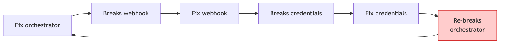
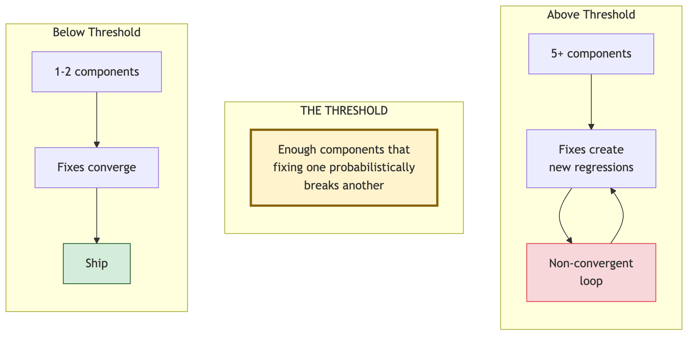
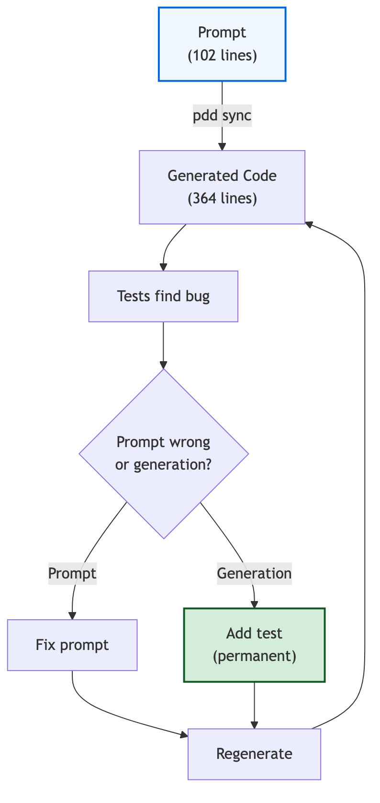

# Why AI Code Falls Apart

## A Case Study in Specification Drift

**Serhan Asad**

## 1. Introduction

For many adopters of AI-assisted coding, the initial enthusiasm gives way to frustration and disappointment. The first few changes happen fast. Then, somewhere past the initial stage, velocity collapses without an obvious cause. The code keeps changing. The tests keep running. The commits keep piling up. But the system stops getting closer to shipping. This case is one instance of that pattern, observed and instrumented closely enough to identify why.

This paper studies that failure mode through creation of one production feature: an automated GitHub issue solver for the Prompt-Driven Development system (PDD). The specification requires the system to read a labeled GitHub issue, choose the right workflow, run code generation and tests, verify the result, and open a pull request.

The implementation was attempted once each with two workflows: once vibe coded with Claude Opus 4.6, and once using the PDD system itself using the same model for generation. The vibe-coded attempt never reached production readiness, and the effort was terminated after 15 days; the PDD workflow reached first end-to-end staging success after 5 days and merged to production after 9 days.

The most noteworthy learning of this experience is a stark drawback of the vibe coding approach — what I call __specification drift__ — a gradual degradation of the original output specification, which was communicated piecewise over the course of the interaction between human and vibe coder. As I'll argue, specification drift is a consequence of the specification and product functionality being conflated in the output code. By contrast, within Prompt-Driven Development, specification lives within a durable artifact — unit tests and per-code-file prompts, where each prompt is a mini-specification of the output file.


---

## 2. Workflows Compared

This paper compares two workflows, and it is worth defining both in detail before we go any further.

**Prompt-Driven Development (PDD)** treats the prompt — not the code — as the living artifact. A developer writes a prompt, and `pdd sync` generates the source code, unit tests, and other artifacts from that prompt. The generated files are replaceable, much the same as compiler outputs are easily regenerated. Durable fixes usually live either in the prompt or in behavioral tests that are intentionally preserved across regeneration cycles. When either a prompt or test is updated, `pdd sync` runs again, and the code is regenerated from the corrected specification (prompt + tests combination).

**Vibe coding**, by contrast, treats the current state of the code as the living artifact. A developer describes a change in chat, reviews the edits, runs tests, patches bugs, and commits. The prompts that produced the code disappear with the chat session; only the code gets saved. There is no durable specification saved. Consequently, specification is implied in the code itself; as code is patched or replaced, specification potentially degrades.

In short, the core difference is this: the workflows use the same AI, but differ in what they treat as the source of truth.

That distinction also matters for fixes and spec changes, because those also survive differently in the two workflows. In vibe coding, a fix or change often lives only in implementation code that a subsequent AI edit may rewrite. In PDD, a fix or change exists in prompts or in durable behavioral tests, so it survives subsequent code regeneration. The case below argues that this difference explains why one attempt failed to converge while the other converged.

---

## 3. The Feature and Evidence Base

The feature converted a labeled GitHub issue into a verified pull request, end to end, with no human code-writing intervention. In other words, someone files an issue on a repository and tags it with a specific label (pdd-issue). From that tag onward, no human writes code. The system reads the issue, classifies what kind of work it describes, selects the right PDD workflow, runs the required PDD commands (change, sync, bug, fix) against the repository, checks its own result against the original issue ("did this actually solve what was asked?"), and opens a pull request for a reviewer to merge. If verification fails, it retries with the full attempt history so the next attempt can see what went wrong.

Beyond this, the system also had to handle operational edge cases: oversized issues (decompose into sub-issues), vague issues (ask a clarifying question and wait for a reply), LLM credential exhaustion (rotate providers), stuck jobs (zombie recovery), and secrets that had to be redacted before anything was posted back to GitHub.


**Figure 1.** The production workflow the feature had to automate.

This was not a script. It was a stateful, distributed, integration-heavy workflow with at least five live subsystems — webhook handling, credential management, state machine, issue analyzer, verifier — plus the glue code that held them together. That shape matters. For isolated features, vibe coding is often a quick path to working code. This feature had enough interacting parts that a fix in one subsystem could break another elsewhere.

The quantitative evidence comes from three artifact classes: the git history for the feature branch, Claude Code session logs, and the final pull request's CI results. Table 1 summarizes the main measures. Appendix B describes the counting rules.

| Metric | Vibe coding | PDD |
|---|---:|---:|
| Attempt duration (calendar) | 15 days | 9 days |
| Feature-relevant session-log days | 9 | 9 |
| Feature commits | 116 | 67 |
| Fix commits | 75 | 57 |
| Opus 4.6 developer messages | 5,553 | 1,504 |
| Reverts | 7 | 1 |
| Test functions | 67 | 371 |
| First end-to-end staging success | Not reached | Day 5 |
| Merged to production | Not reached | Day 9 |
| Final disposition | Hard reset | Merged, all cloud CI checks passed |

**Table 1.** Outcomes of the two attempts.

### 3.1 What I Held Constant

The value of comparing the two attempts depends on what was kept the same between them. The same person did both attempts, on the same core feature, with the same AI model, repository, and cloud test environment. What changed most visibly between them was the workflow — but because the attempts were sequential and the second began from a reset, the comparison supports mechanism-building rather than a clean causal estimate.

More precisely:

- **Same developer.** I was the only human in the loop in both attempts.
- **Same core feature.** The PDD attempt reached everything the vibe coding attempt reached and added production paths the vibe coding attempt never touched — zombie recovery, concurrency-safe credential rotation, secret redaction.
- **Same model, isolated AI contexts.** Both attempts used Claude Opus 4.6, but the AI context was not shared. The vibe coding attempt ran from my laptop through Claude Code; the PDD attempt ran through PDD's cloud workflow using a different account. Because the attempts used separate sessions, accounts, and execution environments, any learning that carried over flowed through me, not through hidden AI memory.

The two attempts ran in sequence — vibe coding first, then PDD from a clean branch. That ordering introduces four confounds I return to in §9: order itself, the fresh-start effect of the reset, accumulated developer knowledge, and heavier owner review during the PDD attempt.

---

## 4. Attempt One: Vibe Coding

The first attempt ran for 15 days, with feature-relevant Claude Code sessions logged on 9 of them and commits spread across the window. The workflow was straightforward: describe the change to Claude Opus 4.6, review the diff, run tests, fix any bugs and ship it. The workflow optimized for rapid iteration.

Vibe days 1-2 produced real progress. Eleven commits were made on vibe day 1, four on vibe day 2. The orchestrator — the core state-machine file — started at 1,146 lines and grew at a controlled pace. The early bug fix ratio averaged 38%. Features outnumbered reverts.

### 4.1 Crossing the Threshold

On vibe day 6, the orchestrator had become hard to navigate. I asked Claude to clean it up — refactor the module into clearer pieces. Rather than make a series of targeted edits, Claude rewrote the entire file in a single pass. The new code came back with 357 lint errors. The file had been clean before that rewrite; now it would not even build. I pushed an emergency fix 58 minutes later just to get the code compiling again. That commit was the turning point. Before it, most of what I did was add features; after it, most of what I did was repair the output of the last AI pass. By vibe day 8, the fix ratio crossed 50% — more fix commits than feature commits on the average day — and it stayed above that line for the rest of the attempt.

| Period | Fix ratio | Reverts | Signal |
|---|---|---|---|
| Vibe days 1-5 | 35–46% | 1 | Features outpaced fixes |
| Vibe days 6-7 | 41–45% | 2 | 357-error rewrite; 8 new issues in one day |
| Vibe days 8-15 | 52–80% | 4 | Fix ratio never below 50% |

**Table 2.** Fix-ratio inflection during the vibe coding phase.

By vibe day 7, the orchestrator had reached 2,188 lines. Five subsystems — webhook handler, credential manager, state machine, analyzer, verifier — were all live at once. This threshold is descriptive, not universal: in this case, it marks the point at which coupling became dense enough that a fix in one subsystem reliably broke another.

### 4.2 The Convergence Loop

By the end, 75 of 116 commits (65%) were fixes. The fixes were going in circles: each one solved the bug in front of me, but the system as a whole was no closer to shipping.



**Figure 2.** Fix orchestrator → breaks webhook → fix webhook → breaks credentials → fix credentials → re-breaks orchestrator. The convergence loop was visible at every scale.

The peak came on vibe day 11: 30 commits in eight hours. Six consecutive commits targeted multi-provider LLM support — letting the system fall back to a different AI provider when the current one ran out of capacity — and oscillated through add, fix, revert, and alternate approaches.


**Figure 3.** Six consecutive commits on multi-provider LLM support. The peak produced 30 commits with no net progress.

Across many days, the same shape showed up in a single bug that would not stay fixed. There was a defect in the system's *stop condition* — the logic that decides when the issue solver is done with a task and is safe to open a pull request. The bug caused the solver to keep running past the point it should have stopped. Over five days I opened five different branches trying to fix it: `fix-659`, `fix-659-clean`, `fix-659-perfect`, `fix-659-perfect-local`, `fix/issue-659-stop-condition-ignored`. The branch names read as diminishing confidence — and none of them resolved the issue cleanly.

Other signals from the commit log point to the same loss of control:

- `"re-apply architectural fixes lost"` — fixes I had already made, lost during fixing new bugs, now being redone by hand. The same work, twice.
- `"temp: all changes"` — a single commit dumping every uncommitted edit into the repository at once. The kind of commit a developer writes when they have lost track of what is and isn't saved.
- Two consecutive commits each claiming "100% pass rate" — when the pass rate was not, in fact, 100%. By that point I was running tests fast enough to misread the output.

### 4.3 The Reset

By vibe day 5, I suspected I was in an endless convergence loop but had not yet accepted it. The Claude Code session log was already blunt about it:

> *"I tried to vibe code, and I am stuck in a loop."*

But I kept going under the illusion that I was fixing the bugs in each pass.

That was the trap. Each new fix looked useful in the moment. Each regression was visible, concrete, and small enough to patch. The work still felt productive because there was always another obvious thing to try. Stopping was the harder move.

By vibe day 13, the log captures the same frustration in different words:

> *"Do a full end-to-end analysis. We had been stuck in the same debugging loop for three hours."*

On vibe day 15, I finally gave up and hard-reset the branch. 16,894 lines across 23 files disappeared in one command.

The feature worked only in the narrowest case but was not working fully and missing a lot of additional operational safeguards: no recovery for stuck jobs, no credential rotation when a provider ran out, and no secret redaction in logs. It looked like progress, but the implementation did not yet understand the failure modes of the system it was trying to automate.

Two weeks of work had produced the visible part of the feature. The parts that would have made it shippable had never actually been built.

---

## 5. Why Code-Level Discipline Was Not Enough

The simplest explanation for a non-converging project is that I did not try hard enough: too few tests, too little structure, fixes driven by impatience rather than process. The session-log evidence makes that explanation insufficient for this case.

### 5.1 Test-Driven Development Was Requested 38 Times

Across the 15 days I asked Claude to do test-driven development 38 times. Vibe day 1 alone had three TDD instructions:

```
Vibe day 1  "also always work in test driven development, create the test first..."
Vibe day 1  "also always work in tdd format test driven development"
Vibe day 1  "i want you to do in tdd style, first write test then code"
```

Tests were added and run with `pytest` and the project's cloud integration suite. By the end of the 15 days, the suite contained 67 test functions.

### 5.2 Test-First Behavior Was Also Observed

Asking an AI to "do TDD" is not the same as observing test-first behavior, so I reconstructed the per-task order of file-write operations from the raw Claude Code session logs (n=87 feature-relevant vibe coding sessions). A task is the span between two consecutive human messages. Three increasingly strict definitions produced three numbers:

| Test | What it measures | Vibe coding |
|---|---|---|
| Did I *ask* for TDD? | How many times I typed a TDD request in chat | 38 times |
| Did I show test-first behavior? | The first file Claude edited after asking for TDD was a test file | ~4 in 5 sessions |
| Did I follow *strict* TDD? | A brand-new test file was created before a brand-new source file in the same session | 1 in 10 sessions |

**Table 3.** Three increasingly strict tests of whether TDD instructions translated into test-first behavior.

The pattern holds across all three layers. **Asking for TDD** was frequent, and the convergence loop persisted. **Test-first behavior** was also frequent, and the convergence loop persisted. **Strict TDD** — creating a brand-new test file before a brand-new source file — was rare, but that does not mean the workflow lacked discipline. In a mature codebase, new work often extends existing source and test files; creating a fresh test file before a fresh source file is not always the natural or even correct engineering move.

More importantly, the mechanism developed in §6 suggests that stricter TDD would not have addressed the core failure mode unless the tests were moved to a durable behavioral layer. The decisive issue was not simply *when* the test was written. It was *what* the test was anchored to. In this attempt, the tests remained too close to replaceable implementation artifacts. In a workflow where AI repeatedly rewrites surrounding code, those are exactly the artifacts most likely to be replaced or drift away from the original intent.

So the failure was not the absence of TDD. It was that, in this attempt, the tests were not durable enough to survive the rewrite cycle.

### 5.3 Other Forms of Structure Were Tried

TDD was not the only intervention. I also asked for regression sweeps, ran staging deployments on a dedicated staging environment, requested full system reviews, and asked for flow diagrams of the architecture. Session logs from the first attempt show the pattern:

> *"We need to make a regression sweep, because what is currently happening is we fix one thing, it fails the other thing... we are kind of running in loop for now."*

In another log entry, I tried to articulate — to Claude itself — what a workflow that would actually work might look like:

> *"The problem we are running is that we writing code, but we reaching dead end, so we want to work in prompt space, code space is not working for us. Write the test and prompt first and then the code"*

That message was reaching for what PDD would later make mechanical: prompts first, tests before code, code last. Early in the failed attempt, I had stumbled into the right idea. But the vibe coding workflow had no durable regeneration step from a saved prompt. I could edit a prompt in chat, but I then had to manually patch the generated code to match — which reintroduced exactly the drift the convergence loop was made of. The insight was correct. The workflow could not deliver on it.

The convergence loop persisted through every code-level intervention I tried. The discipline was real. What failed was the layer it was applied to.

---

## 6. The Failure Mode: Specification Drift

> **Specification drift** is the gap between intended behavior and what AI-rewritten or regenerated code actually preserves.

It grows when a fix is made only in replaceable code. A developer learns something real — this race needs a lock, this edge case needs handling, this stop condition must terminate — but that insight does not move into a durable prompt or preserved behavioral test. A subsequent AI pass rewrites the surrounding code. The local patch may disappear immediately, resurface days later, or be missed entirely.

Two conditions make this failure mode likely:

- **Coupling.** I use coupling here in the broad architectural sense: parts of the system depend on each other, so a change in one component can break behavior in another. This is not limited to object-oriented coupling.
- **Replacement pressure.** Replacement pressure is the degree to which a workflow repeatedly rewrites or regenerates surrounding code instead of preserving a chain of small manual edits. The higher the replacement pressure, the more likely a code-only fix is to be erased or contradicted by a later AI pass.

When coupling and replacement pressure are low, local fixes usually converge. When both are high, previously-fixed bugs can return as quickly as new bugs are fixed. The system keeps changing, but the bug count does not reliably shrink.

### 6.1 Regeneration and Rewrites Act Like Refactors

This kind of architectural coupling has long been a known problem in software design. In normal development, big refactors are rare. During a deliberate refactor, a developer is careful: the connected parts are known, and the surrounding behavior is checked for unintended breakage.

**In a regeneration-based AI workflow, every regeneration is effectively a refactor — and one a developer may not be treating as a refactor.** In vibe coding, a large AI rewrite can have the same effect. The AI rewrites a file, that rewrite ripples through other parts that depended on it, and breakage can accumulate faster than the developer can apply fresh fixes.

This is where the **complexity threshold** comes in. Below it — a few components, thin coupling — local fixes converge. Above it, the system has enough interacting parts that a local fix is likely to break something else. Regeneration compresses the timescale on which this matters. A test coupled to an implementation detail in a hand-edited codebase may reveal itself on the next major refactor, years later. The same test in a regeneration-based workflow can reveal itself on the next `pdd sync`, the same afternoon.



**Figure 4.** Below the threshold, fixes converge. Above it, fixes introduce new regressions faster than the developer can apply them.

### 6.2 What This Explains That "Try Harder" Cannot

This failure mode accounts for three observations from the vibe coding attempt that an effort-based explanation cannot:

1. **Effort alone did not help.** 30 commits in 8 hours with zero net progress is consistent with a regime in which regression rate matches fix rate. Adding more hours does not change the ratio.
2. **The convergence loop was invisible from within a single commit.** Each fix succeeded locally. The regression was elsewhere, at a different time, in a coupled component. Only the aggregate commit pattern revealed the non-convergence.
3. **Code-level tests could not stop it.** Tests anchored to implementation details reduce regressions locally but cannot prevent drift. Durable tests anchored to specification-level behavior can survive regeneration and constrain the system globally.

The third point is the one this paper defends. The first two follow from it.

---

## 7. Attempt Two: PDD

After the reset, I rebuilt the same core feature using PDD. The workflow started from a different question. Instead of "what code should I write?", I asked "what prompt describes what this file should do?"

Four prompts defined the feature:

| Prompt | Lines | Specifies |
|---|---:|---|
| Orchestrator prompt | 280 | State machine, retry, decomposition, PR flow |
| Verification prompt | 111 | Two-phase verification against issue requirements |
| Analysis prompt | 102 | Issue classification and command selection |
| LLM invocation prompt | 56 | Provider-aware model invocation |
| **Total** | **549** | Generated **3,904** lines of production code |

**Table 4.** The four prompts that defined the PDD attempt.

549 lines of prompts generated 3,904 lines of production code, so I reviewed a much smaller specification surface than the generated implementation surface. The generated code still mattered, but it was not the primary source of truth. If behavior was wrong, I had two durable places to fix it: the prompt, or a test that would constrain future generations. The code could be regenerated after either.

Generated tests can still be useful, but they are not the ratchet unless they survive the next generation and continue to express the intended behavior.



**Figure 5.** A bug found in the generated code resolves into a prompt change or a behavioral test. Either survives the next regeneration.

### 7.1 Concrete Examples

The analysis prompt (102 lines) specified that the system should classify each GitHub issue and return a structured decision: which commands to run, whether to decompose the issue, whether to ask for clarification, or whether the issue was already resolved.

From that prompt, `pdd sync` generated 364 lines of implementation: data models for each decision type, structured output extraction, context formatting, and the confidence-gate logic. When a bug appeared in the gate during testing, the durable fix was one line in the prompt, followed by rerunning `pdd sync`. The code was regenerated. The specification survived; only the artifact was replaced.

A second example exposed a bug that ordinary code-level tests would not have caught. Early in the PDD phase, `pdd change` created prompt files but did not commit them into the pull request. The generated code could work and its tests could pass, but the PR was missing the specification needed to regenerate that code later. That is a PDD-specific invariant: if the prompt is absent, the code is no longer reproducible from its source artifact. Fixing the issue required treating the prompt file itself as part of the deliverable, not merely checking that the generated code passed.

### 7.2 Regressions Occurred; Tests Caught Them

PDD did not eliminate regressions. On PDD day 7, a test suite that had been passing started failing. What differed from vibe coding was not the absence of regressions but their containment. Each regression was detected by the test suite, traced to a root cause, and fixed with a new test that prevented recurrence. The system maintained forward progress despite setbacks.

The PDD attempt reached first end-to-end success on PDD day 5. The repository owner reviewed the pull request on PDD day 6 and identified 8 issues; all 8 were resolved with TDD over the next two days. On PDD day 9, the PR cleared every automated cloud test — a 64-job CI matrix spanning the platforms, runtimes, and integrations the system deploys on — and merged. The final PR touched 120 files across 25,056 net lines, including infrastructure, configuration, and modifications to existing platform code.

---

## 8. Why PDD Converged

The model was held constant across both attempts. The mechanism-level difference was where fixes lived.

| Vibe coding | PDD |
|---|---|
| Fixes lived mostly in AI-written implementation code | Fixes lived in prompts or behavioral tests |
| Code was the primary artifact | Prompts were the primary artifact |
| Tests coupled to current implementation | Tests coupled to intended behavior |
| AI edits accumulated patches | AI regenerated from specification |
| Progress felt fast but failed to converge | Progress was constrained and converged |
| Regressions were discovered late | Regressions were caught and turned into tests |
| Final result: hard reset | Final result: merged, all cloud CI checks passed |

**Table 5.** What actually differed between the two attempts.

Three properties of PDD reinforce each other:

**Specification over implementation.** Reviewing 549 lines of prompts is a smaller problem than reviewing 3,904 lines of generated code. The search space is smaller; fixes are easier to review. Each prompt fix survives regeneration; a code-level fix may not.

**Tests as a ratchet.** The PDD phase had 371 test functions; the vibe coding phase had 67. The count is not the point. The anchoring is. The durable PDD tests were coupled to behavioral invariants derived from the specification, so they survived regeneration. Each passing durable test further constrained the system. Over time, the system became more constrained, not more fragile. This is the mechanism by which regression rate can be pulled below fix rate.

**Regeneration over patching.** Prompts survive; code is disposable. When the specification is right and the tests are strong, generated code can be replaced at will. Regeneration reduces the accumulation of interdependent patches — the primary mechanism by which drift accumulated in the first attempt.

### 8.1 Fix Ratio Is Not the Signal

A surface reading of the commits produces a paradox: PDD's fix ratio (57 of 67 commits, 85%) was higher than vibe coding's (75 of 116, 65%). Fix ratio alone makes PDD look worse. Three commit-level signals separate the phases:

- **Reverts:** 7 (vibe coding) vs. 1 (PDD).
- **Branches per bug:** 5 branches on issue #659 in vibe coding; PDD maintained a 1:1 issue-to-branch mapping.
- **Convergence to shipment:** vibe coding never reached a shippable state; PDD reached end-to-end success on PDD day 5 and cleared every cloud CI check on PDD day 9.

Fix ratio measures activity. Convergence measures whether activity adds up. Vibe coding's 65% did not converge. PDD's 85% converged.

### 8.2 The Perception Gap

[METR](https://metr.org/Early_2025_AI_Experienced_OS_Devs_Study-paper.pdf) found that experienced open-source developers using AI tools on familiar repositories were 19% slower despite believing beforehand that AI would make them 24% faster. That finding is consistent with what this case shows at the feature scale. Each vibe coding commit felt productive in the moment, because each commit *was* progress on its own terms. The regression happened in a different component, at a different time, under a different test. Only the aggregate pattern revealed the convergence loop.

This is the illusion the complexity threshold creates: local speed is real; system speed is not. A commit log, or a regression suite anchored to specification-level invariants, is what exposes the gap.

---

## 9. What This Case Does and Does Not Show

This is one case study, not a controlled experiment. Four design confounds and one limitation from my role matter:

**Sequential ordering.** The PDD attempt came after the vibe coding attempt. Any second attempt benefits from the first attempt's failures, regardless of methodology. The case can show that PDD coincided with convergence after vibe coding failed; it cannot, by itself, estimate how much of that improvement came from simply going second.

**Fresh start.** The PDD attempt began from a clean branch after a hard reset. Starting over is a powerful intervention independent of methodology — it can remove accumulated debt, interdependent patches, and implicit assumptions baked into existing code. Isolating methodology from fresh start requires a clean-slate vibe coding arm, which this case does not contain.

**Accumulated knowledge.** I had 15 days of system knowledge before PDD began. Two observations bound this confound. First, knowledge did not prevent the convergence loop during vibe coding: by vibe day 15, with the most system knowledge I had, it was still running. Second, the PDD phase converged quickly on problem classes vibe coding had never touched — zombie recovery, credential exhaustion, secret redaction — as well as on problems I had already wrestled with. Knowledge is necessary but not sufficient.

**Owner review intensity.** The repository owner was significantly more involved during the PDD phase, enforcing test requirements and catching 8 issues in a single review. PDD days 6-7 produced 36 of the phase's 67 commits — more than half. Heavy review alone does not fully explain convergence: during vibe coding the owner had already advised adding regression tests and the convergence loop still did not break. But this case cannot quantify how much of the outcome difference is the review versus the methodology.

**Conflict of interest.** I built the PDD tooling analyzed here. Familiarity can inflate apparent effectiveness, and I had a stronger incentive to apply rigor during the PDD phase. The commit data and session logs are more objective than memory or self-report, but the decision of when to apply discipline is not objective. Independent replication with developers who have no stake in either methodology is what would address this limitation.

### 9.1 What a Controlled Experiment Would Need

A three-arm design:

| Arm | Description | What it isolates |
|---|---|---|
| A | Vibe coding, light review, fresh start | Baseline (closest to attempt 1) |
| B | Vibe coding, heavy review, fresh start | A vs B: effect of heavier review |
| C | PDD, heavy review, fresh start | B vs C: effect of methodology holding review and fresh start constant |

Independent developers with no authorship stake in either methodology, building the same kind of stateful, integration-heavy feature in each arm. Useful measures: time to first staging success, commits to merge, reverts, regression rate, Opus-message volume, test count, reviewer-found defects, final CI pass rate.

The B-vs-C contrast is what isolates methodology from the combined fresh-start-and-review confound. This paper motivates running it (see Appendix E for the full design).

### 9.2 When Vibe Coding Still Wins

This paper should not be read as an argument against vibe coding in general. Below the complexity threshold, vibe coding is often a quick path to working code. In my experience, for UI experiments, simple scripts, one-off tools, small isolated bug fixes, and early product exploration, the overhead of PDD is not justified. The threshold is a boundary, not a judgment.

The warning sign is not the presence of bugs — bugs are normal. The warning sign is when the same kinds of bugs return, fixes create new failures, and "we fixed this already" becomes a recurring sentence. That is the point where the durable artifact starts to matter.

---

## 10. Takeaway

I built the same production feature twice. Same developer, same core feature, same LLM, same repository, same cloud test environment. What differed most visibly was where fixes lived.

When fixes lived only in generated or AI-rewritten code, the code kept changing and the fixes kept being lost. The effort was real; the discipline was real; the convergence loop persisted anyway. I named this failure mode **specification drift**. It is a risk in AI workflows where code is repeatedly replaced without a durable specification layer, and it intensifies once the system has enough coupling that local fixes can break other components.

When fixes lived in prompts and behavioral tests, the durable artifact changed. Prompts specified intent. Tests locked in invariants. Code could be regenerated without losing the reason behind previous fixes. On the same core feature, with the same developer and the same model, the work converged.

The general lesson this case *suggests* — not proves — is narrow and practical: **in AI-assisted development above the complexity threshold, move fixes to the artifact that survives the next generation.** When AI coding stops converging, the move is not to add more patches. It is to move the fix into the specification layer.

This is one data point. The mechanism is testable and the replication design is specified. What the case argues against is the simplest explanation. It was not lack of effort. It was not lack of testing. It was not a weaker model.

It was the abstraction layer.

---

## Appendix A — Phase Anchors

The exact daily commit distribution is less important than the transition points. These are the phase anchors used in the analysis above.

| Phase | Event | Why it matters |
|---|---|---|
| Vibe days 1-2 | Initial implementation; first TDD instructions; first 15 feature commits | Early progress before the convergence loop was obvious |
| Vibe day 4 | Regression sweep requested; "prompt space" versus "code space" articulated in session log | The failure mode was visible before the reset |
| Vibe day 5 | Session log says vibe coding was stuck in a loop | Explicit recognition of non-convergence |
| Vibe day 6 | Large AI rewrite of the orchestrator produced 357 lint errors; emergency repair followed | Inflection point from feature-building to repair |
| Vibe day 7 | Orchestrator reached 2,188 lines; five subsystems were live | Integration surface had become dense |
| Vibe day 8 | Fix ratio crossed 50% and did not recover | Repair work became dominant |
| Vibe day 11 | 30 commits in eight hours; six consecutive multi-provider LLM commits oscillated through add/fix/revert | Peak local activity with no net convergence |
| Vibe day 13 | Session log asks for full end-to-end analysis after three hours in the same loop | The convergence loop persisted despite more knowledge |
| Vibe day 15 | Branch hard-reset after 116 feature commits and no successful staging run | Vibe coding attempt ended with 0 lines shipped |
| PDD day 1 | PDD attempt began from a clean branch | Methodology changed after reset |
| PDD day 5 | First end-to-end staging success | PDD reached the first shippable workflow |
| PDD day 6 | Owner review identified 8 issues | Heavier review became a major PDD-phase factor |
| PDD day 7 | Regressions were caught and converted into tests | Tests acted as a ratchet rather than a treadmill |
| PDD day 9 | PR merged after all 64 cloud CI jobs passed | PDD attempt shipped after 67 feature commits |

Aggregate result: vibe coding produced 116 feature commits and was reset; PDD produced 67 feature commits and merged with 25,056 net lines in the final PR.

---

## Appendix B — Counting Rules and Method

The counts in Table 1 use the following rules.

- **Feature commits** are commits whose primary purpose was the autonomous issue solver, its prompts, tests, infrastructure, or CI hardening. Unrelated repository maintenance was excluded.
- **Fix commits** are commits whose message or diff primarily repaired a defect, regression, test failure, CI failure, revert fallout, or integration breakage. Ambiguous commits were classified by dominant intent rather than by prefix alone.
- **Reverts** include explicit `revert` commits and commits whose dominant purpose was to undo a preceding approach.
- **Test functions** are feature-scoped pytest functions or methods present in each phase's terminal snapshot: the reset snapshot for vibe coding and the merged PR for PDD.
- **Net lines** are the final pull-request diff size, using added lines minus deleted lines.
- **Opus 4.6 developer messages** count developer-authored messages in feature-relevant Claude Code sessions using Claude Opus 4.6. They do not count every automated subagent session spawned by `pdd sync` or other tooling.
- **Feature-relevant session-log days** are distinct days with Claude Code sessions that changed, analyzed, or debugged the feature.
- **TDD ordering** was measured per task window, where a task window is the span after a human message requesting TDD and before the next human message. The test-first measure asks whether the first subsequent feature-scoped file edit targeted a test file. The stricter measure asks whether a brand-new test file was created before a brand-new source file in the same window.

These rules are not a substitute for a controlled experiment, but they make the case study's measurements auditable and separate activity measures from convergence measures.

---

## Appendix C — Selected Session-Log Evidence

Direct quotes from the Claude Code session logs during the vibe coding phase (selected from 38 TDD instructions in total, and other explicit process signals). Spelling and grammar are preserved from the original logs:

```
Vibe day 1   "also always work in test driven devlopment, create the test first
             and then make the fix from now on"
Vibe day 1   "also always work in tdd format test driven development"
Vibe day 1   "i want you to do in tdd style, first write test then code"
Vibe day 4   "we need to make a regression sweep, because what is currently
             happening is we fix one thing, it fails the other thing"
Vibe day 4   "so the problem we are running is that we writing code, but we
             reaching dead end, so we want to work in prompt space"
Vibe day 5   "i tried to vibe code, and i am stuck in loop, using vibe code to
             fix this is not working"
Vibe day 13  "do a full end to end analysis, we running in loops, its been
             3 hours, make sure everything is proper and correct"
```

Selected commit-message signals from the vibe coding phase:

```
Vibe day 1   fix: re-apply architectural fixes lost in remote squash
Vibe day 2   temp: all changes including uncommitted work
Vibe day 9   Fix all test failures for 100% pass rate
Vibe day 9   Fix tests to achieve 100% pass rate       (the first "100%" was not 100%)
Vibe day 11  feat: add multi-provider LLM support
Vibe day 11  fix: auto-select provider
Vibe day 11  fix: create config directory
Vibe day 11  fix: pre-create config files
Vibe day 11  fix: seed config
Vibe day 11  revert: remove seeding
Vibe day 11  fix: use env vars instead
Vibe day 11  fix: skip incompatible credentials
Vibe day 15  fix: hotpatch bug via string replace
```

---

## Appendix D — Related Work

This study sits inside a broader literature on AI-assisted development and an older literature on coupling and test design.

- **[Vibe coding](https://time.com/7334730/word-of-the-year-2025-cambridge-collins-dictionary-oxford-merriam/).** Andrej Karpathy coined the term; later commentary around AI-assisted development increasingly distinguished casual prompting from more structured agentic workflows.
- **[METR](https://metr.org/Early_2025_AI_Experienced_OS_Devs_Study-paper.pdf).** Wijk et al. reported that experienced open-source developers using AI tools were 19% slower on familiar repositories despite expecting a 24% speedup before the experiment.
- **[GitClear](https://www.gitclear.com/ai_assistant_code_quality_2025_research).** GitClear analyzed 211 million changed lines and reported that refactoring-associated changed lines fell substantially while copied code rose.
- **[Google DORA](https://cloud.google.com/blog/products/ai-machine-learning/announcing-the-2025-dora-report).** DORA reported near-universal AI adoption and a continued negative relationship between AI adoption and software delivery stability, while emphasizing correlation rather than causation.
- **[OX Security](https://www.ox.security/ai-generated-code-how-to-protect-your-software-from-ai-generated-vulnerabilities/).** OX Security's industry guidance frames AI-generated code as a source of security and maintainability risk that requires controls beyond ordinary review.

These describe the macro picture. This paper offers one feature-scoped micro case and identifies a mechanism — specification drift — that links the two scales.

On the design side, the older foundation is Constantine and Yourdon's *Structured Design*, which formalized coupling as a core software-design concern. On the test-design side, the closest prior art is Meszaros's *xUnit Test Patterns* and Feathers's *Working Effectively with Legacy Code*, which argue that tests coupled to implementation details become liabilities under refactoring. The claim this paper adds is that regeneration compresses their timescale from "years of refactoring" to "days of iteration." The prescription they offered as long-term hygiene — anchor tests to behavior, not implementation — becomes structurally decisive rather than advisory once regeneration is in play.

Structured alternatives to unstructured AI coding — Spec-Driven Development (GitHub Spec Kit, AWS Kiro), Agentic Engineering, Test-Driven Generation — all share the active ingredient this paper defends: anchoring discipline to a layer that survives regeneration. Whether PDD's specific tooling outperforms those alternatives is a question this paper does not answer; a comparative replication across these methodologies would extend the design sketched in Appendix E.

---

## Appendix E — Replication Design

A three-arm controlled replication to isolate methodology from the confounds this case cannot fully separate:

| Arm | Description | Purpose |
|---|---|---|
| A | Vibe coding, light review, fresh start | Baseline closest to attempt 1 |
| B | Vibe coding, heavy review, fresh start | Separates fresh start and review from methodology |
| C | PDD, heavy review, fresh start | Tests specification-anchored development under matched review |

**Participants.** Independent developers with no authorship stake in either methodology.

**Task.** A stateful, integration-heavy feature of similar scope to the one in this case — e.g., a workflow orchestrator with classification, verification, retry, and multi-provider credential handling.

**Measures.** Time to first staging success, commits to merge, reverts, regression rate, Opus-message volume, test function count, reviewer-found defects, final CI pass rate.

**Primary contrast.** B vs C isolates methodology from the combined fresh-start-and-review confound and is the contrast this case study motivates.
