# Benchmark Analysis Report: PDD vs. Claude

This report analyzes and compares the performance of PDD and Claude AI coding assistants based on benchmark data.

## Executive Summary

- **Overall Winner (Weighted Score):** PDD
- **PDD Performance:** Avg Time: 37.36s, Avg Cost: $0.0789, Success Rate: 100.00%
- **Claude Performance:** Avg Time: 50.78s, Avg Cost: $0.3617, Success Rate: 46.67%
- Cost per Successful Task: Data not found or table format unexpected in markdown.
- Statistically significant difference in **execution_time_seconds** (p=0.000434, RBC=0.431).
- Statistically significant difference in **api_cost** (p=4.43e-16, RBC=0.995).

## 1. Overall Performance Comparison

### Key Metrics

| tool   |   avg_execution_time |   avg_api_cost |   success_rate |   total_tasks |
|:-------|---------------------:|---------------:|---------------:|--------------:|
| Claude |              50.7765 |      0.361725  |       0.466667 |            45 |
| PDD    |              37.3605 |      0.0789199 |       1        |            45 |

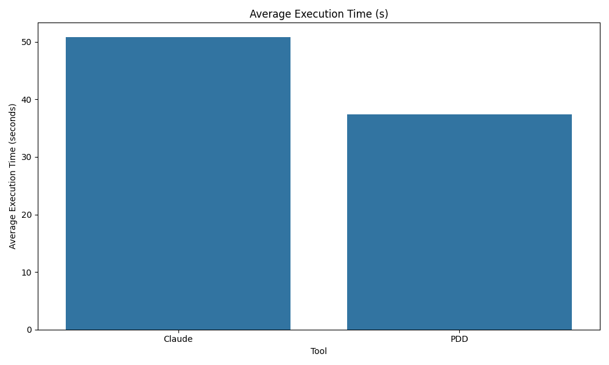

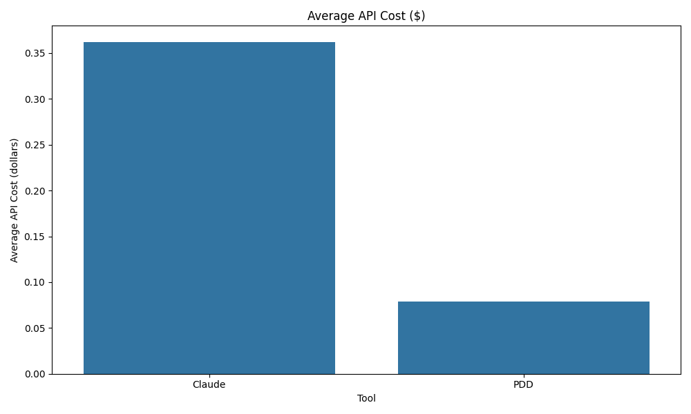

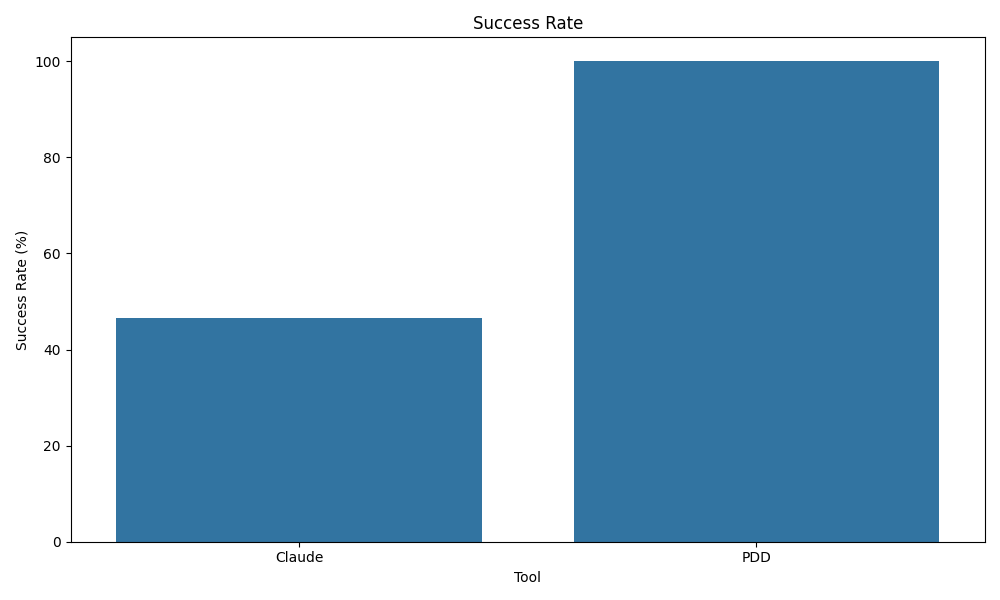

### Weighted Scoring for Best Overall Tool

The best overall tool is determined using a weighted scoring system. The formula is: 
`Overall Score = 0.3 * norm_time + 0.3 * norm_cost + 0.4 * norm_success_rate`

Time and cost are normalized using min-max scaling (lower is better, hence `norm_time` and `norm_cost` are already inverted if needed). Success rate is already a [0, 1] metric (higher is better).

#### Calculated Scores:

| tool   |   norm_time |   norm_cost |   norm_success_rate |   overall_score |
|:-------|------------:|------------:|--------------------:|----------------:|
| Claude |           0 |           0 |            0.466667 |        0.186667 |
| PDD    |           1 |           1 |            1        |        1        |

**Best Overall Tool (based on weighted score): PDD** with a score of 1.000

## 2. Dimension-Specific Analysis

### Performance by File Size

| tool   | file_size   |   avg_execution_time |   avg_api_cost |   success_rate |
|:-------|:------------|---------------------:|---------------:|---------------:|
| Claude | large       |              62.6577 |      0.485265  |       0.333333 |
| Claude | medium      |              49.3907 |      0.357514  |       0.333333 |
| Claude | small       |              40.2812 |      0.242396  |       0.733333 |
| PDD    | large       |              39.5837 |      0.082682  |       1        |
| PDD    | medium      |              44.15   |      0.0933454 |       1        |
| PDD    | small       |              28.3477 |      0.0607322 |       1        |

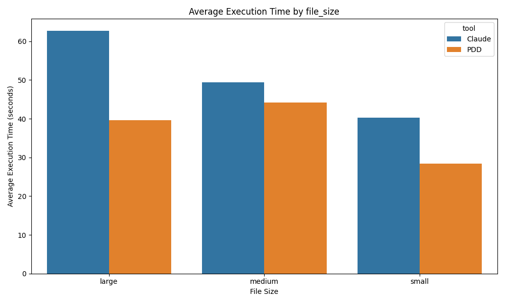

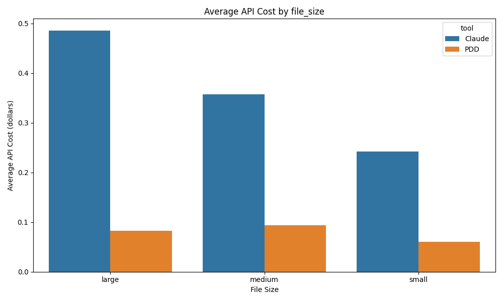

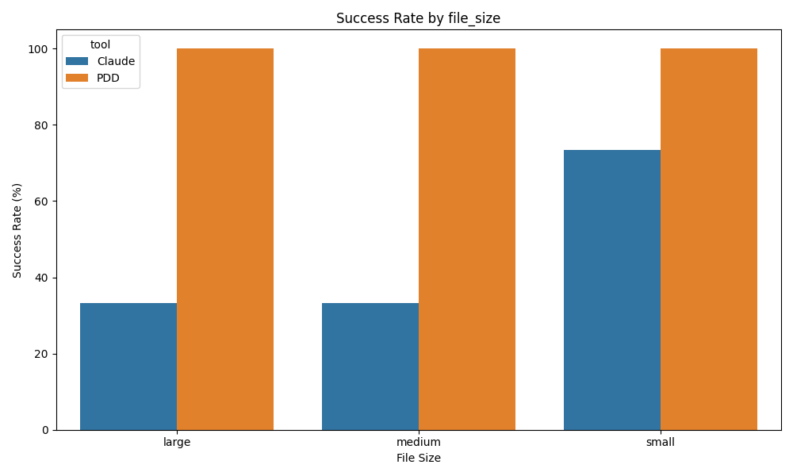

### Performance by Language

| tool   | language   |   avg_execution_time |   avg_api_cost |   success_rate |
|:-------|:-----------|---------------------:|---------------:|---------------:|
| Claude | javascript |              53.9672 |      0.333394  |       0.533333 |
| Claude | python     |              44.5162 |      0.39147   |       0.266667 |
| Claude | typescript |              53.8462 |      0.360311  |       0.6      |
| PDD    | javascript |              36.3957 |      0.0753548 |       1        |
| PDD    | python     |              32.851  |      0.0711608 |       1        |
| PDD    | typescript |              42.8347 |      0.090244  |       1        |

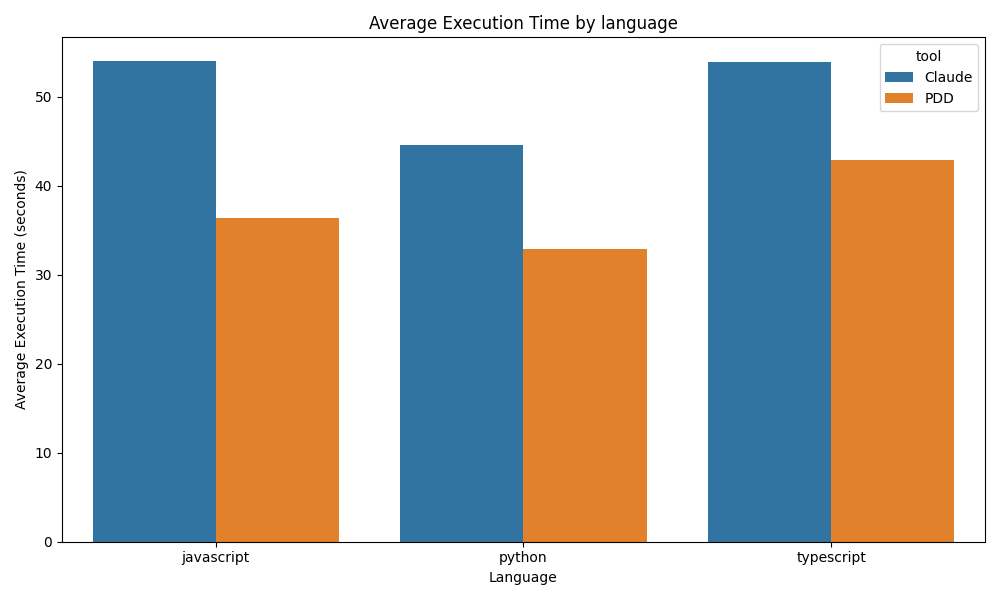

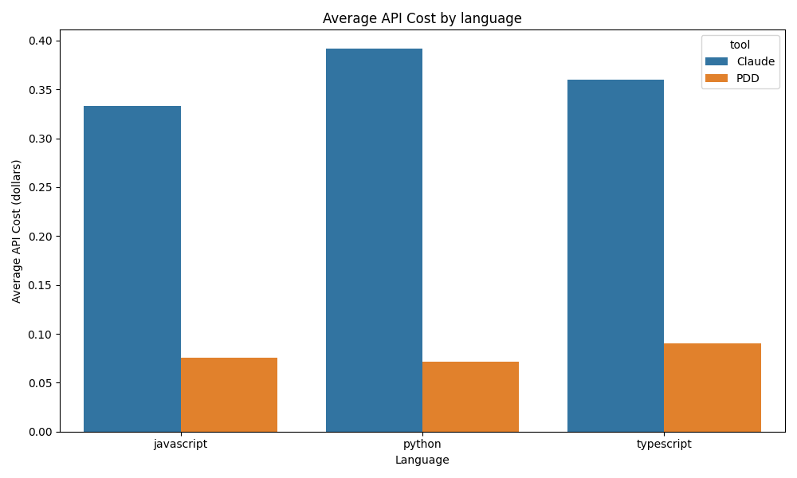

### Performance by Edit Type

| tool   | edit_type   |   avg_execution_time |   avg_api_cost |   success_rate |
|:-------|:------------|---------------------:|---------------:|---------------:|
| Claude | complex     |              61.4166 |      0.433786  |       0.555556 |
| Claude | format      |              61.5093 |      0.455324  |       0        |
| Claude | insert      |              35.7617 |      0.250695  |       0.666667 |
| Claude | multiple    |              47.8228 |      0.343247  |       0.666667 |
| Claude | simple      |              47.3722 |      0.325573  |       0.444444 |
| PDD    | complex     |              44.924  |      0.0902383 |       1        |
| PDD    | format      |              39.004  |      0.0869847 |       1        |
| PDD    | insert      |              34.651  |      0.0699097 |       1        |
| PDD    | multiple    |              33.6445 |      0.0719297 |       1        |
| PDD    | simple      |              34.5788 |      0.075537  |       1        |

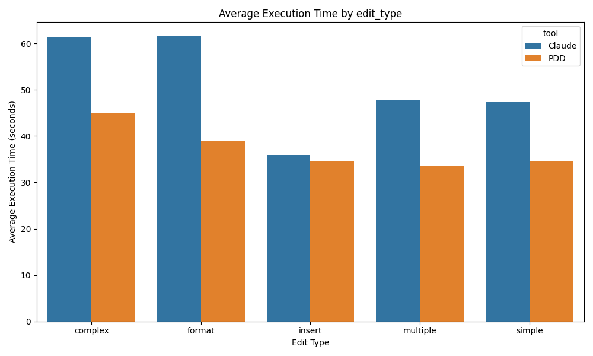

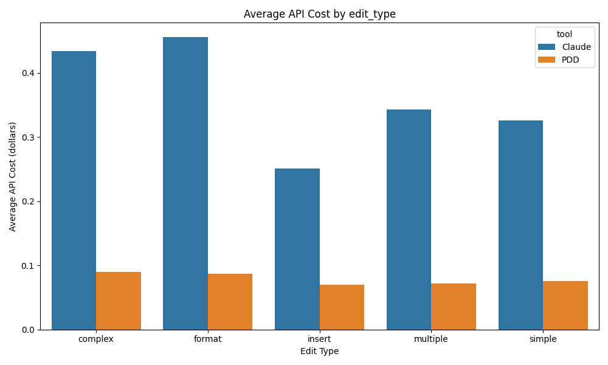

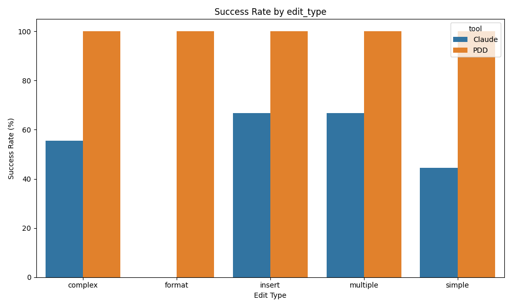

## 3. Cost-Efficiency Analysis

### Cost Per Successful Task

| tool   |   total_api_cost |   num_successful_tasks |   cost_per_successful_task |
|:-------|-----------------:|-----------------------:|---------------------------:|
| Claude |         16.2776  |                     21 |                  0.775125  |
| PDD    |          3.55139 |                     45 |                  0.0789199 |

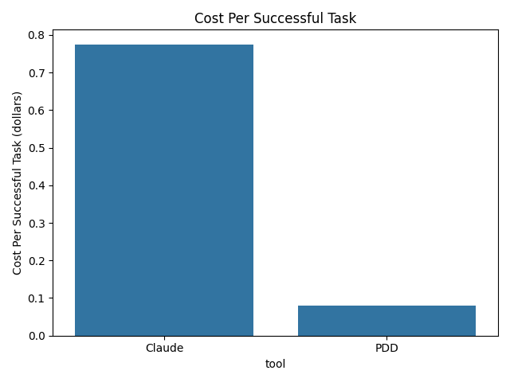

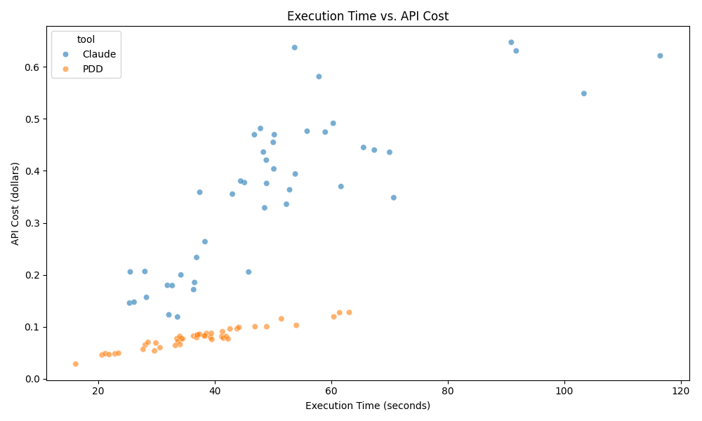

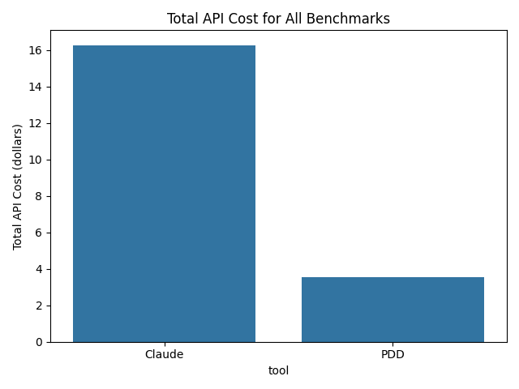

## 4. Success and Error Analysis

Success rates across dimensions are visualized in Section 2.

### Common Error Messages for Failed Tasks

#### Claude:

| error_message                               |   count |
|:--------------------------------------------|--------:|
| Editing process exceeded maximum iterations |      24 |

#### PDD:

No failed tasks recorded for this tool or error messages not available.

### Overall Success Rate Confidence Intervals (95%)

| tool   |   success_rate |   ci_lower |   ci_upper |
|:-------|---------------:|-----------:|-----------:|
| Claude |       0.466667 |   0.329351 |   0.609225 |
| PDD    |       1        |   0.921348 |   1        |

## 5. Statistical Significance Analysis

### Statistical Test Summary

| Metric                 | Test           |   p-value |   Effect Size (RBC) | Significance                                           | Effect Size (Cramér's V)   |
|:-----------------------|:---------------|----------:|--------------------:|:-------------------------------------------------------|:---------------------------|
| execution_time_seconds | Mann-Whitney U |  0.000434 |               0.431 | Yes                                                    | nan                        |
| api_cost               | Mann-Whitney U |  4.43e-16 |               0.995 | Yes                                                    | nan                        |
| success                | Chi-squared    |  1        |             nan     | N/A (contingency table not 2x2 or has zero/low counts) | N/A                        |

## 6. Final Recommendation

Based on this analysis:

- For tasks where **overall balanced performance (time, cost, success)** is critical, **PDD** is recommended due to its higher weighted score.
- If **minimizing API cost** is the absolute priority, analyze the 'Average API Cost' and 'Cost Per Successful Task' metrics. The tool with lower values here might be preferred, even if slightly slower or less successful.
- If **maximizing success rate** is paramount, the tool with the higher overall success rate and better performance on specific critical dimensions (e.g., specific languages or edit types) should be chosen.
- **PDD** shows strengths in [mention specific areas if evident, e.g., specific languages/file_sizes based on dimensional analysis].
- **Claude** shows strengths in [mention specific areas if evident, e.g., specific languages/file_sizes based on dimensional analysis].

Consider the specific context of your tasks (e.g., dominant language, typical file size, importance of speed vs. cost) when making a final decision.
Further investigation into common error patterns for each tool could lead to improved prompt engineering or identify areas where one tool might need more support.
