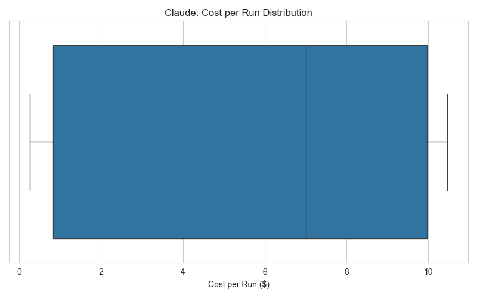
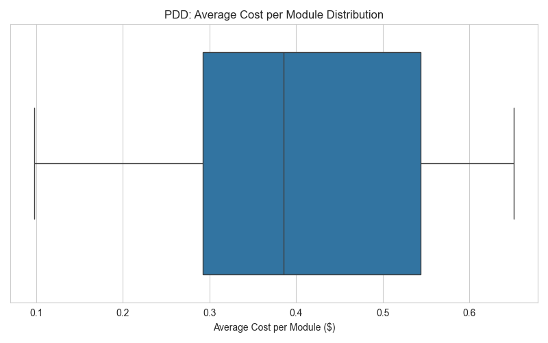
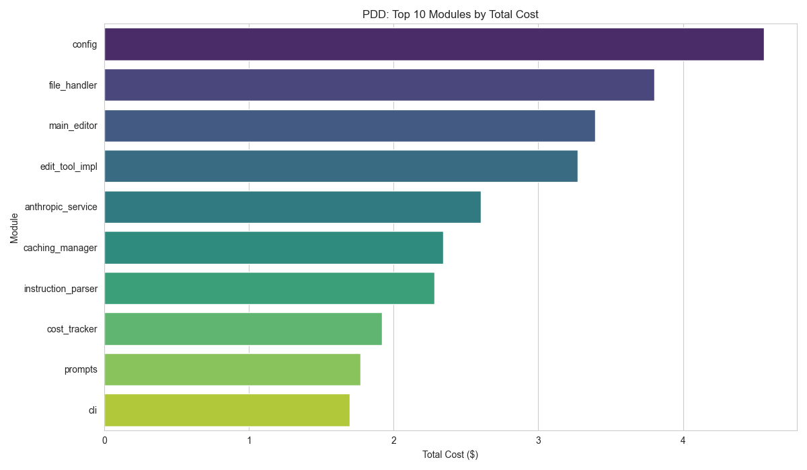
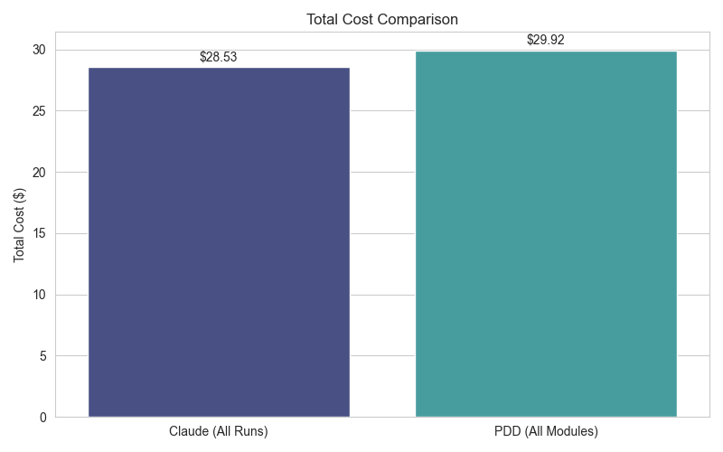
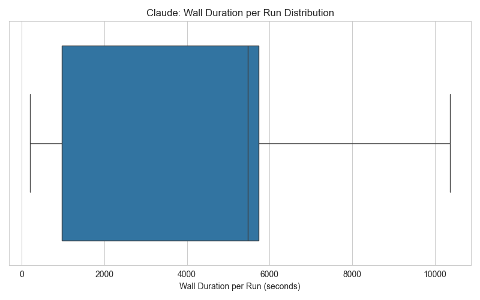
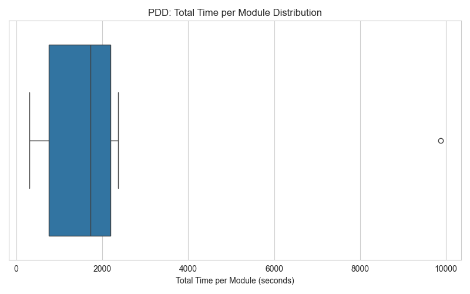
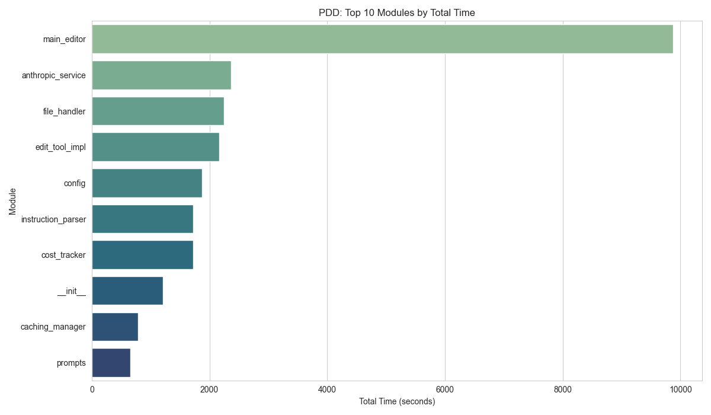
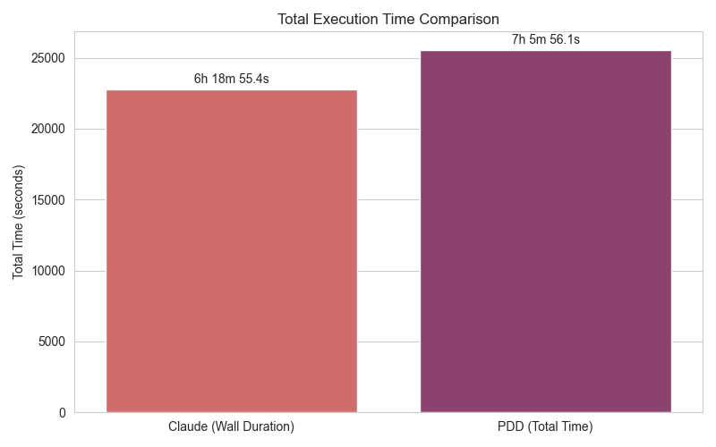
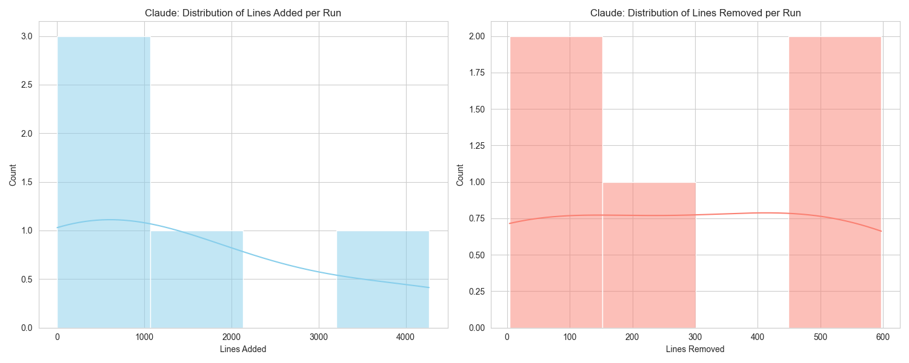

# Comparative Analysis: Claude vs. PDD Creation Task

Analysis based on data from `claude_creation.csv` and `PDD_creation.csv`.

## 1. Cost Analysis

### 1.1. Claude Creation
- Total Cost: $28.53
- Number of Runs: 5
- Average Cost per Run: $5.71
- Cost per Run Statistics:
|       |   total_cost |
|:------|-------------:|
| count |      5       |
| mean  |      5.70662 |
| std   |      4.896   |
| min   |      0.2631  |
| 25%   |      0.83    |
| 50%   |      7.01    |
| 75%   |      9.97    |
| max   |     10.46    |

### 1.2. PDD Creation
- Total Cost (sum of module total_costs): $29.92
- Number of Modules: 12
- Overall Average Cost per Module (mean of 'avg_cost' column): $0.40
- 'avg_cost' per Module Statistics:
|       |   avg_cost |
|:------|-----------:|
| count | 12         |
| mean  |  0.398953  |
| std   |  0.156873  |
| min   |  0.0975594 |
| 25%   |  0.292318  |
| 50%   |  0.385579  |
| 75%   |  0.543714  |
| max   |  0.651388  |

- 'total_cost' per Module Statistics:
|       |   total_cost |
|:------|-------------:|
| count |    12        |
| mean  |     2.49325  |
| std   |     1.09783  |
| min   |     0.585356 |
| 25%   |     1.75391  |
| 50%   |     2.31347  |
| 75%   |     3.30462  |
| max   |     4.55972  |

Top 10 PDD Modules by Total Cost:
| module             |   total_cost |
|:-------------------|-------------:|
| config             |      4.55972 |
| file_handler       |      3.8011  |
| main_editor        |      3.39383 |
| edit_tool_impl     |      3.27488 |
| anthropic_service  |      2.60304 |
| caching_manager    |      2.34523 |
| instruction_parser |      2.28172 |
| cost_tracker       |      1.91976 |
| prompts            |      1.77249 |
| cli                |      1.69817 |

### 1.3. Cost Comparison Summary
| Metric                | Claude          | PDD                    |
|:----------------------|:----------------|:-----------------------|
| Total Cost            | $28.53          | $29.92                 |
| Average Cost per Unit | $5.71 (per run) | $0.40 (avg per module) |

## 2. Time Analysis (Wall Duration / Total Time)

### 2.1. Claude Creation (Wall Duration)
- Total Wall Duration: 6h 18m 55.4s (22735.40 seconds)
- Wall Duration per Run Statistics (seconds):
|       |   wall_duration_seconds |
|:------|------------------------:|
| count |                    5    |
| mean  |                 4547.08 |
| std   |                 4119.79 |
| min   |                  198.2  |
| 25%   |                  963.8  |
| 50%   |                 5473.2  |
| 75%   |                 5733    |
| max   |                10367.2  |

Claude API Duration (for context):
- Total API Duration: 2h 3m 22.5s (7402.50 seconds)
- API Duration per Run Statistics (seconds):
|       |   api_duration_seconds |
|:------|-----------------------:|
| count |                    5   |
| mean  |                 1480.5 |
| std   |                 1168.4 |
| min   |                   72.2 |
| 25%   |                  352.4 |
| 50%   |                 2128.3 |
| 75%   |                 2396   |
| max   |                 2453.6 |

### 2.2. PDD Creation (Total Time per Module)
- Total Time (sum of module `total_time`): 7h 5m 56.1s (25556.13 seconds)
- `total_time` per Module Statistics (seconds):
|       |   total_time |
|:------|-------------:|
| count |       12     |
| mean  |     2129.68  |
| std   |     2538.08  |
| min   |      306.025 |
| 25%   |      756.367 |
| 50%   |     1720.92  |
| 75%   |     2187.15  |
| max   |     9874.37  |

Top 10 PDD Modules by Total Time:
| module             |   total_time |
|:-------------------|-------------:|
| main_editor        |     9874.37  |
| anthropic_service  |     2364.78  |
| file_handler       |     2247.93  |
| edit_tool_impl     |     2166.89  |
| config             |     1877.87  |
| instruction_parser |     1722     |
| cost_tracker       |     1719.84  |
| __init__           |     1206.88  |
| caching_manager    |      788.739 |
| prompts            |      659.25  |

### 2.3. Time Comparison Summary
| Metric                | Claude                                | PDD                               |
|:----------------------|:--------------------------------------|:----------------------------------|
| Total Execution Time  | 6h 18m 55.4s                          | 7h 5m 56.1s                       |
| Average Time per Unit | 1h 15m 47.1s (per run, wall duration) | 35m 29.7s (avg module total_time) |

## 3. Lines Added/Removed Analysis (Claude Only)

- Total Lines Added: 7159
- Total Lines Removed: 1400
- Net Lines Added (Total): 5759
- Lines Added per Run Statistics:
|       |   lines_added |
|:------|--------------:|
| count |           5   |
| mean  |        1431.8 |
| std   |        1778.2 |
| min   |           4   |
| 25%   |          67   |
| 50%   |         812   |
| 75%   |        2011   |
| max   |        4265   |

- Lines Removed per Run Statistics:
|       |   lines_removed |
|:------|----------------:|
| count |           5     |
| mean  |         280     |
| std   |         273.628 |
| min   |           4     |
| 25%   |           6     |
| 50%   |         295     |
| 75%   |         498     |
| max   |         597     |

- Net Lines Added per Run Statistics:
|       |   net_lines_added |
|:------|------------------:|
| count |              5    |
| mean  |           1151.8  |
| std   |           1531.44 |
| min   |              0    |
| 25%   |             61    |
| 50%   |            517    |
| 75%   |           1513    |
| max   |           3668    |

## 4. Summary and Insights

This analysis compared file creation tasks using two approaches, reflected in `claude_creation.csv` (multiple runs) and `PDD_creation.csv` (single process, module breakdown).

**Key Cost Observations:**
- The total cost for all Claude runs was $28.53 over 5 runs, averaging $5.71 per run.
- The PDD process had a total cost of $29.92, distributed across 12 modules. The overall average cost per module (from 'avg_cost') was $0.40.
- Claude (sum of runs) appears more cost-effective in total for the tasks represented.
- Note: Claude data represents multiple, possibly distinct, creation tasks, while PDD data is a breakdown of one larger process. Direct cost-per-task comparison is nuanced.

**Key Time Observations (Wall/Total Time):**
- Claude runs had a total wall duration of 6h 18m 55.4s, with an average of 1h 15m 47.1s per run.
- The PDD process had a total execution time of 7h 5m 56.1s (sum of module `total_time`).
- Claude (sum of wall durations) was faster in total execution time compared to PDD.
- PDD's `main_editor` module was a significant contributor to its total time and cost. Optimizing such modules could yield substantial improvements.

**Nature of Data:**
- It's crucial to remember that Claude's data represents multiple independent runs, potentially for different specific creation tasks. PDD's data is a breakdown of a single, possibly more complex, integrated process.
- This difference means that 'total' figures for Claude are aggregates of separate events, while for PDD, they represent components of one event.

**Potential Insights & Recommendations:**
- **PDD Efficiency:** For PDD, analyzing modules with high `total_time` and `total_cost` (e.g., `main_editor`, `file_handler`, `edit_tool_impl`) can identify bottlenecks for optimization.
- **Claude Variability:** The distribution of costs and times for Claude runs (if tasks were similar) can indicate variability in performance. If tasks were diverse, it reflects the cost/time for different types of creation jobs.
- **Cost vs. Time Trade-off:** The data can be used to explore cost vs. time trade-offs. For example, PDD's `anthropic_service` has a relatively high average cost but its total time contribution might be justified if it performs critical, complex tasks efficiently.
- **Further Analysis:** If the Claude runs correspond to specific types of files or tasks, segmenting the Claude data by these types could provide more granular insights into its performance characteristics.

