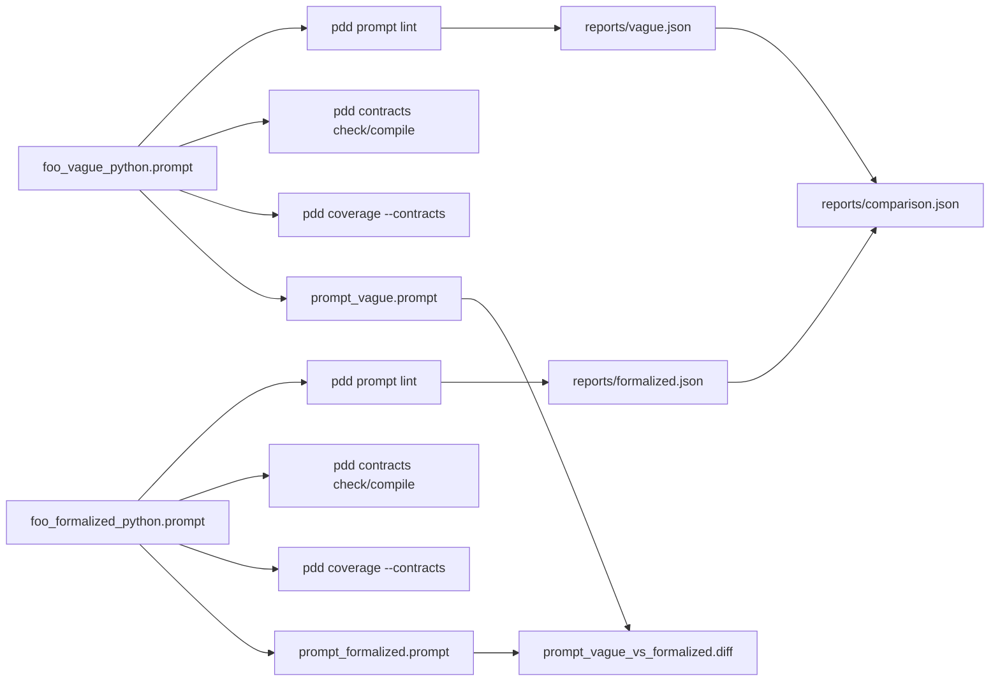
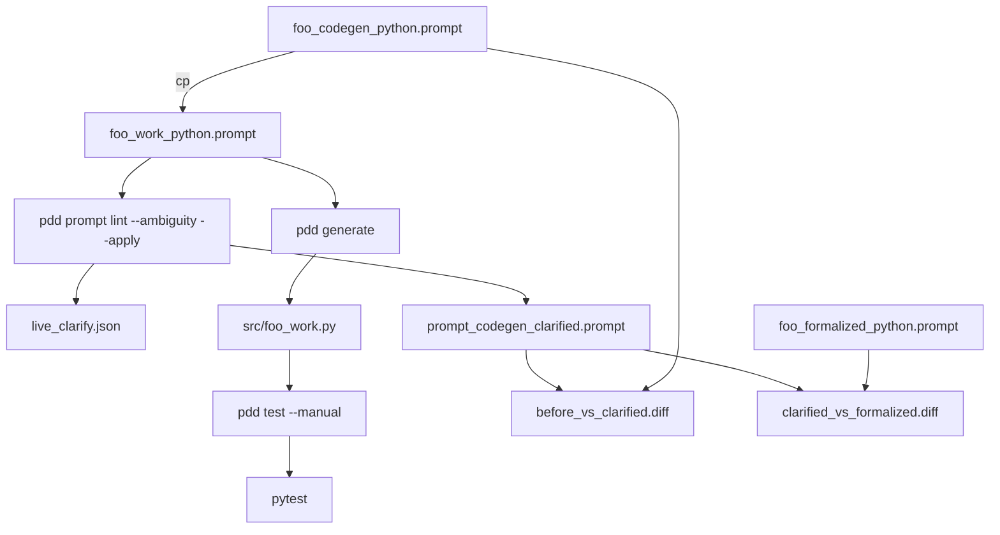

# Prompt lint + contracts E2E demo

End-to-end walkthrough of **prompt authoring quality** (`pdd prompt lint`), **contracts**
(`pdd contracts check` / `compile`), **coverage** (`pdd coverage --contracts`),
and (in live mode) **code + tests** (`pdd generate`, `pdd test --manual`, `pytest`).

The demo uses one problem domain (idempotent HTTP handler with JWT, active-user check,
and a 24-hour idempotency store) written in **three prompt shapes** so you can compare
vague vs formalized vs codegen-ready inputs.

Everything under `reports/`, `src/`, `tests/`, `prompts/foo_work_python.prompt`, and
`.pdd/` is **generated or ephemeral** and listed in [`.gitignore`](.gitignore).
Only the files in [Hand-authored inputs](#hand-authored-inputs-original) are meant to
live in git.

---

## Directory map

```
examples/prompt_lint_contract_e2e_demo/
├── README.md                 # this file
├── demo.sh                   # entry: deterministic | --live | --cleanup
├── .pddrc                    # PDD project config for this example
├── .gitignore                # ignores reports/, ephemeral paths, .venv/
│
├── prompts/                  # HAND-AUTHORED prompts (see table below)
│   ├── foo_vague_python.prompt
│   ├── foo_formalized_python.prompt
│   └── foo_codegen_python.prompt
│
├── user_stories/             # HAND-AUTHORED stories
│   ├── story__foo_vague.md
│   ├── story__foo_formalized.md
│   └── story__foo_codegen.md
│
├── lib/
│   ├── run_e2e.py            # deterministic orchestration (Python / CliRunner)
│   ├── live_pipeline.sh      # live orchestration (bash + real `pdd` CLI)
│   └── artifacts.sh          # cp snapshots + diff -u helpers
│
├── prompts/foo_work_python.prompt   # EPHEMERAL (gitignored) — copy of codegen for live runs
├── src/foo_work.py                  # EPHEMERAL — `pdd generate` output (live)
├── tests/test_foo_work.py           # EPHEMERAL — `pdd test --manual` output (live)
│
└── reports/                  # GENERATED (gitignored) — recreated by demo.sh
    ├── vague.json
    ├── formalized.json
    ├── comparison.json
    ├── live.json
    ├── live_clarify.json
    ├── live_compile.json
    ├── live_coverage.json
    ├── artifacts/            # frozen copies of prompts / code / tests
    └── diffs/                # unified diffs between snapshots
```

Optional local-only (not part of the demo contract): `.venv/` (created by `demo.sh` if
needed), `.pdd/` (PDD run metadata and core dumps when you invoke `pdd` from this folder).

---

## Hand-authored inputs (original)

These files are **written by humans** for the example. They are the only inputs the
deterministic CI test suite requires.

| File | Purpose |
|------|---------|
| [`prompts/foo_vague_python.prompt`](prompts/foo_vague_python.prompt) | **Negative** fixture: deliberately vague contract language (valid, gracefully, safely, …). Used to show lint noise, compile errors, and coverage gaps **without an LLM**. |
| [`prompts/foo_formalized_python.prompt`](prompts/foo_formalized_python.prompt) | **Positive** fixture: same domain with `<vocabulary>`, compilable `When … MUST …` rules, `- R#:` acceptance lines, and `<formalization target="smt">` blocks. Target “source of truth” shape. |
| [`prompts/foo_codegen_python.prompt`](prompts/foo_codegen_python.prompt) | **Codegen + lint** fixture: complex handler + vague rules, but includes a generate lead and `<deliverables>` so `pdd generate` works. Used for **live** clarify → generate → test; **not** run in the deterministic A/B loop. |
| [`user_stories/story__foo_vague.md`](user_stories/story__foo_vague.md) | Minimal story; covers R1–R2 only. |
| [`user_stories/story__foo_formalized.md`](user_stories/story__foo_formalized.md) | Full story with `## Glossary` and `## Covers` for R1–R4. |
| [`user_stories/story__foo_codegen.md`](user_stories/story__foo_codegen.md) | Story aligned with the codegen prompt (R1–R4). |
| [`demo.sh`](demo.sh), [`lib/run_e2e.py`](lib/run_e2e.py), [`lib/live_pipeline.sh`](lib/live_pipeline.sh), [`lib/artifacts.sh`](lib/artifacts.sh) | Orchestration (committed). |
| [`.pddrc`](.pddrc) | Example PDD config. |

### Three prompts, three roles

| Prompt | Deterministic demo? | Live demo? | Typical warning level |
|--------|---------------------|------------|------------------------|
| `foo_vague` | Yes (negative) | Snapshot only | High (10+ vague / outcome issues) |
| `foo_formalized` | Yes (positive) | Snapshot + distance target | Low (0 formal issues expected) |
| `foo_codegen` | No | **Workhorse** (clarify / generate / test) | Medium before clarify; drops after `--apply` |

**Important:** For live clarify, the pipeline copies `foo_codegen` → `foo_work_python.prompt`
and runs `--apply` on the **copy**. Do not run `pdd prompt lint --ambiguity --apply` on
`foo_codegen_python.prompt` directly unless you intend to **overwrite** the hand-authored
codegen fixture (restore from `reports/artifacts/prompt_codegen_before.prompt` if you did).

---

## Generated outputs (by `pdd` / demo scripts)

All paths below are under `reports/` unless noted. Re-create them with `bash demo.sh` or
`bash demo.sh --live`. Remove ephemeral paths with `bash demo.sh --cleanup` (work copy,
`src/`, `tests/` only) or delete `reports/` manually.

### JSON reports

| File | Created by | Purpose |
|------|------------|---------|
| `reports/vague.json` | `lib/run_e2e.py` (deterministic) | Full command snapshot for `foo_vague`: lint, contracts check/compile, coverage, formalization report. |
| `reports/formalized.json` | `lib/run_e2e.py` (deterministic) | Same snapshot for `foo_formalized`. |
| `reports/comparison.json` | `lib/run_e2e.py` (deterministic) | Side-by-side summary row per fixture (warn counts, compile stats, coverage, formal issues). |
| `reports/live_clarify.json` | `pdd prompt lint --ambiguity --apply --contracts --json` (live) | Raw CLI JSON: ambiguities, coach `guidance`, `formalization_rejected`, post-apply lint. |
| `reports/live_compile.json` | `pdd contracts compile --json` (live, on clarified work copy) | Obligation IR for clarified prompt. |
| `reports/live_coverage.json` | `pdd coverage --contracts --json` (live) | Rule ↔ story/test matrix for clarified prompt. |
| `reports/live.json` | `lib/live_pipeline.sh` | Short summary: warn before/after, ambiguity count, generate/test sizes, pytest pass, diff hunk counts. |

### Artifact snapshots (`reports/artifacts/`)

Copies made with `cp` ([`lib/artifacts.sh`](lib/artifacts.sh)), not by mutating originals.

| Artifact | Source file | When | Purpose |
|----------|-------------|------|---------|
| `prompt_vague.prompt` | `prompts/foo_vague_python.prompt` | Deterministic + live | Frozen negative fixture for diffs and inspection. |
| `prompt_formalized.prompt` | `prompts/foo_formalized_python.prompt` | Deterministic + live | Frozen positive fixture. |
| `prompt_codegen_before.prompt` | `prompts/foo_codegen_python.prompt` | Live only | **Before** LLM clarify (preserve original codegen text). |
| `prompt_codegen_clarified.prompt` | `prompts/foo_work_python.prompt` after `--apply` | Live only | **After** clarify (vocabulary, rules, acceptance, formalization merged in). |
| `prompt_formalized_target.prompt` | `prompts/foo_formalized_python.prompt` | Live only | Reference target for “how far is clarified codegen from gold formalized?” |
| `src/foo_work.py` | `src/foo_work.py` (ephemeral) | Live only | Snapshot of `pdd --force generate` output. |
| `tests/test_foo_work.py` | `tests/test_foo_work.py` (ephemeral) | Live only | Snapshot of `pdd test --manual` output. |

### Ephemeral working files (repo root of demo, gitignored)

| File | Created by | Purpose |
|------|------------|---------|
| `prompts/foo_work_python.prompt` | `cp foo_codegen …` at start of live pipeline | **Mutable work copy** for in-place `--apply`, generate, and test. Deleted on live end unless `--keep-artifacts`. |
| `src/foo_work.py` | `pdd --force generate … --output src/foo_work.py` | Generated implementation (stdlib handler). |
| `tests/test_foo_work.py` | `pdd test --manual <prompt> <code> --output tests/…` | LLM-generated pytest (behavioral; not Z3). |

### PDD run cache (optional, gitignored if present)

| Path | Created by | Purpose |
|------|------------|---------|
| `.pdd/last_run.json` | Any `pdd` command from this directory | Last run metadata. |
| `.pdd/meta/*.json` | Sync / lint on prompts | Per-prompt run records. |
| `.pdd/core_dumps/*.json` | Failed or verbose LLM paths | Debug dumps; safe to delete. |

---

## Pipelines and steps

### Mode A — Deterministic (no LLM, CI-safe)

**Command:** `bash demo.sh` or `python lib/run_e2e.py`

**Inputs:** only `foo_vague` and `foo_formalized` (not codegen).



| Step | Command (per fixture) | What it produces |
|------|------------------------|------------------|
| 1 | `pdd prompt lint <prompt>` | Human-readable warn/error counts. |
| 2 | `pdd prompt lint --json <prompt>` | Issue list by `code` and `section` → part of `vague.json` / `formalized.json`. |
| 3 | `pdd contracts check --json --stories user_stories <prompt>` | Story ↔ prompt consistency. |
| 4 | `pdd contracts compile --json <prompt>` | Rules → obligations; **vague** usually has compile errors, **formalized** has none. |
| 5 | `pdd coverage --contracts --json --stories-dir user_stories --tests-dir tests <prompt>` | Per-rule status: checked / story-only / unchecked / formal-only. |
| 6 | `pdd prompt lint --contracts --json --stories user_stories --tests-dir tests <prompt>` | Aggregate readiness view. |
| 7 | `pdd prompt lint --report formalization --json <prompt>` | Per-rule SMT readiness rows. |
| 8 | (script) | Writes `comparison.json`, copies artifacts, builds `prompt_vague_vs_formalized.diff`. |

**Expected contrast** (asserted by `tests/test_prompt_lint_contract_e2e_demo.py`):

| Fixture | Lint warns | Compile errors | Coverage unchecked | Formal issues |
|---------|------------|----------------|------------------|---------------|
| vague | many (≥10) | ≥1 | ≥1 | many |
| formalized | 0 | 0 | 0 | 0 |

(`foo_codegen` is not part of this table; it is exercised only in live mode.)

---

### Mode B — Live (real LLM + full product path)

**Command:** `bash demo.sh --live` or `bash demo.sh --live --keep-artifacts`

**Requires:** `pdd auth login` or local API keys; uses cloud LLM for `--ambiguity` unless
`pdd --local` / `PDD_FORCE_LOCAL=1`.



| Step | What happens | Outputs |
|------|----------------|---------|
| 0 | LLM preflight (`llm_invoke` “ok”) | Exit 77 if no model (pytest skips). |
| 1 | `cp foo_codegen → foo_work` | Ephemeral work copy. |
| 2 | Save artifacts: `prompt_codegen_before`, `prompt_formalized_target`, vague/formalized snapshots; write `prompt_vague_vs_formalized.diff`. | `reports/artifacts/*`, `reports/diffs/*` |
| 3 | `pdd prompt lint` on work copy (before) | Warn count baseline. |
| 4 | `pdd prompt lint --ambiguity --non-interactive --apply --contracts --json` on **work copy** | Mutates `foo_work`; writes `live_clarify.json` (guidance, ambiguities, `formalization_rejected`). |
| 5 | Save `prompt_codegen_clarified.prompt` | After snapshot. |
| 6 | `pdd prompt lint` on work copy (after) | Warn count should drop. |
| 7 | `pdd contracts compile --json` | `live_compile.json`. |
| 8 | `pdd coverage --contracts --json` | `live_coverage.json`. |
| 9 | `pdd --force generate` → `src/foo_work.py` | Implementation; copy to `reports/artifacts/src/`. |
| 10 | `pdd test --manual` → `tests/test_foo_work.py` | Pytest module; copy to `reports/artifacts/tests/`. |
| 11 | `pytest tests/test_foo_work.py` | Pass/fail recorded in `live.json`. |
| 12 | Build diffs (see below); `live.json` summary. | `reports/diffs/*` |
| 13 | `cleanup_ephemeral` unless `--keep-artifacts` | Removes work copy, `src/`, `tests/` under demo root. |

**What `--apply` writes into the work copy (via coach, not by hand):**

- `<vocabulary>` definitions for flagged terms
- `<contract_rules>` rewrites (R1–R6)
- Extra `<acceptance_tests>` bullets (prefer `- R#:` prefixes)
- `<formalization>` blocks that pass the strict gate (coach candidates filtered before append)

Formalize bundle rejection appears in JSON as `formalization_rejected: []` when bounds
and linking rules pass (see [`docs/prompt_lint.md`](../../docs/prompt_lint.md)).

---

## Diffs explained

All diffs are **unified** format (`diff -u`), under `reports/diffs/`.

| Diff file | Left-hand label | Right-hand label | Meaning |
|-----------|-----------------|------------------|---------|
| **`prompt_vague_vs_formalized.diff`** | `foo_vague_python.prompt` | `foo_formalized_python.prompt` | **Authoring gold path**: what changes when you move from intentionally vague contracts to a formalized, compilable prompt (vocabulary, rule shape, acceptance, formalization). Produced in **deterministic** and **live** runs. |
| **`prompt_codegen_before_vs_clarified.diff`** | `foo_codegen` (before) | `foo_work` (after clarify) | **LLM migration on the codegen fixture**: effect of one `pdd prompt lint --ambiguity --apply` run. Shows vocabulary/rules/acceptance/formalization added while keeping generate/deliverables intent. **Live only.** |
| **`prompt_codegen_clarified_vs_formalized.diff`** | Clarified codegen snapshot | `foo_formalized` (target) | **Distance to target**: how close the LLM-clarified codegen prompt is to the hand-written formalized gold prompt. **Live only.** |

### Legacy names (do not use for new runs)

Older experiments may have left files such as `prompt_before_vs_after.diff`,
`prompt_before_vs_clarified.diff`, or `prompt_clarified_vs_after.diff`. Those mixed
**vague↔formalized** with **codegen clarify** naming. The current pipeline uses only the
three diff names in the table above.

---

## Three verification layers (not one executable proof)

| Layer | Tooling | Executes? |
|-------|---------|-----------|
| **Behavioral** | `pdd test --manual` + `pytest` | Yes — runs Python against generated `foo_work` |
| **Contracts** | `pdd contracts compile`, `pdd coverage --contracts` | Yes — parses prompt IR, no code execution |
| **Formalization metadata** | `<formalization target="smt">` + `pdd prompt lint` | **Lint only** — no Z3 solver in this repo yet |

SMT blocks document intent for a future `pdd contracts prove`; they do not replace pytest.

---

## How to run

```bash
cd examples/prompt_lint_contract_e2e_demo
export PDD_SKIP_UPDATE_CHECK=1

# Deterministic (no API) — recreates reports/vague.json, formalized.json, comparison.json, artifacts, vague↔formalized diff
bash demo.sh

# Live LLM pipeline — needs auth; recreates live_*.json, codegen before/after artifacts, code, tests, three diffs
bash demo.sh --live --keep-artifacts

# Remove ephemeral work copy + src/ + tests/ (keeps reports/)
bash demo.sh --cleanup

# Delete all generated reports (manual)
rm -rf reports .pdd
```

**Manual clarify (same as live step 4):**

```bash
cp prompts/foo_codegen_python.prompt prompts/foo_work_python.prompt
pdd auth status   # cloud
pdd prompt lint --ambiguity --non-interactive --apply --contracts --json \
  --stories user_stories --tests-dir tests \
  prompts/foo_work_python.prompt | tee reports/live_clarify.json
```

**Codegen / test only:**

```bash
pdd --force generate prompts/foo_work_python.prompt --output src/foo_work.py
pdd test --manual prompts/foo_work_python.prompt src/foo_work.py --output tests/test_foo_work.py
pytest tests/test_foo_work.py -q
```

Install editable CLI from repo root (so `pdd prompt` and latest lint fixes are available):

```bash
cd /path/to/pdd && pip install -e .
```

---

## Tests

```bash
# CI — deterministic demo only
pytest tests/test_prompt_lint_contract_e2e_demo.py -q

# Opt-in live (costs money; needs API)
PDD_RUN_REAL_LLM_TESTS=1 pytest tests/test_prompt_lint_contract_e2e_demo.py -q -m real
```

---

## What this demo does not do

- No `pdd contracts prove` / Z3 execution on `<formalization>` predicates
- No automatic proof that generated code refines back to SMT obligations
- `pdd test` does not emit Z3; it emits pytest from [`generate_test_LLM.prompt`](../../pdd/prompts/generate_test_LLM.prompt)

The formalized fixture is shaped so a future prove command could consume its
`<formalization>` blocks.

---

## See also

- [`docs/prompt_lint.md`](../../docs/prompt_lint.md) — lint layers, `FORMAL_*` codes, `--ambiguity` pipeline
- [`docs/contract_check.md`](../../docs/contract_check.md) — contract rules and check
- [`docs/coverage_contracts.md`](../../docs/coverage_contracts.md) — rule ↔ story ↔ test matrix
