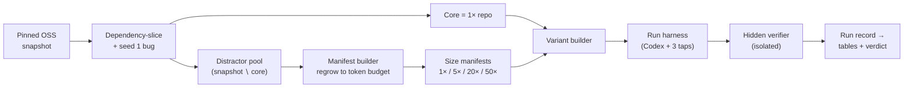

<!--
This file is a slide deck for the talk on the benchmark DESIGN.
It renders top-to-bottom on GitHub (each "---" is a slide break) and exports to
PDF or PowerPoint with Marp:
    npx @marp-team/marp-cli@latest presentation.md --pdf
    npx @marp-team/marp-cli@latest presentation.md --pptx
Speaker notes live in HTML comments under each slide.
Companion: research-context/presentation.md (the proposal + literature-review deck).
Full spec: design.md.
-->

# Does irrelevant code break AI coding agents?

### Designing a *controlled* benchmark for repository bloat

Hold the bug fixed. Grow the repo with real-but-irrelevant code. Measure how much
harder the agent works — and whether it still passes a hidden test.

*Design talk · issue [#1209](https://github.com/promptdriven/pdd/issues/1209) · full spec: [`design.md`](design.md)*

<!--
Speaker: This talk is about the EXPERIMENT DESIGN, not results yet. Five beats:
(1) the question, (2) why it should matter, (3) how we build the repos,
(4) how we watch the agent honestly, (5) the verdict we fixed in advance.
-->

---

## The question, in one sentence

> Give an agent the **same bug**, the **same model**, the **same hidden test** —
> then quietly pad the repo with more and more **plausible-but-irrelevant files**.
>
> **Does it still fix the bug, and how much harder must it work to find the code?**

We change **one thing only**: the volume of irrelevant code around the bug.
Everything else is byte-for-byte identical across sizes.

<!--
Speaker: Emphasize "one thing only." This is a controlled experiment, not a
leaderboard. The whole design exists to protect that single-variable claim.
-->

---

## Why it matters

A model's **usable** memory is smaller than its **advertised** memory — a
"128K-token" model is not equally sharp across all 128K tokens.

If that holds for code, then **a big, messy repository quietly degrades every
coding agent** — even when nothing about the actual task got harder.

The industry is betting on ever-larger context windows. **This is the clean test
of whether the bet survives a messy repo.**

<!--
Speaker: "context window" = the model's working memory; "tokens" = the units that
fill it. We test whether bigger-window-is-better holds when the space fills with
real-but-irrelevant code.
-->

---

## The design, at a glance — five things we locked first

Frozen **before any model run** (pre-registration). Changing any one is a *new*
experiment, not an edit.

| # | Decision | Locked choice |
|---|----------|---------------|
| 1 | Agent + model | **Codex CLI (GPT)**, frozen environment, held constant |
| 2 | Filesystem tap | **Linux container · OverlayFS** (edits) **· FUSE** byte-extent reads |
| 3 | Repos + distractors | **Real OSS, sliced to a core + 1 seeded bug; regrown with its own files** |
| 4 | Replicates | **N = 5** per (scenario, size) → **60 runs** |
| 5 | Per-run timeout | **30 min** (so 50× isn't penalized on wall-clock alone) |

<!--
Speaker: Pre-registration is the credibility spine. We wrote the knobs down before
a single token was spent. The rest of the talk is how each choice protects the
single-variable claim.
-->

---

## The core idea: *subset-and-regrow*

How do you make junk an agent **can't trivially ignore**? Don't invent fake files —
**reuse the project's own.**

1. Take a **real open-source repo**, pinned to a commit.
2. **Dependency-slice** it to the minimal **core** that runs the tests.
3. **Seed one controlled bug** into that core → this is the **1× base repo**.
4. **Regrow** the repo using the project's *own out-of-core files* as distractors.

Distractors are **genuine same-project code** — real names, style, imports. Nothing
labels them as junk; only honest reasoning reveals they're irrelevant.

<!--
Speaker: This kills the "synthetic filler" objection BY CONSTRUCTION — the
distractors ARE the project's real code. The trade is contamination, handled later
by a seed-novelty audit.
-->

---

## The pipeline



Pure functions in, content-hashed out: same inputs → byte-identical repo, re-hashed
to prove it.

<!--
Speaker: Walk left to right. One bug enters; four repo sizes come out; one agent,
three taps, one hidden judge. The manifest + full snapshot never enter the sandbox.
-->

---

## One bug, four sizes — measured in tokens

`S` multiplies the **added distractor tokens** relative to the core:

| Size | Added distractor tokens | Total repo (≈) |
|------|-------------------------|----------------|
| **1×** | 0 (control) | `core` |
| **5×** | `4 × core` | `5 × core` |
| **20×** | `19 × core` | `20 × core` |
| **50×** | `49 × core` | `50 × core` |

> **Two "token" notions, never conflated:** the **on-disk dose** we *provision*
> vs. the **in-context dose** that actually reaches the model window. The pilot
> reports against *both*.

<!--
Speaker: Bloat is dosed by tokens, not file count. And provisioning bytes on disk
is not the same as those bytes entering the model's window — that gap is the whole
mechanism, and slide 12 makes it precise.
-->

---

## Distractors come in tiers — near vs. far

Tier falls out of the repo's **real layout** relative to the bug (assigned by the
slicer, never hand-placed):

| Tier | What it is | Intended pull |
|------|------------|---------------|
| `same-package` | out-of-core files in the bug's own module | **strongest** lure |
| `same-layer` | sibling services / handlers, one hop away | plausible |
| `cross-cutting` | utilities linked only by vocabulary | weak, volume filler |

So we can later ask: **do near distractors do more damage than far ones?**

<!--
Speaker: Tier lets us test the "how close is the distractor" hypothesis — junk from
the bug's own package should mislead more than distant junk. Verdict fixed in
advance, same as the others.
-->

---

## No benchmark tell

Nothing the agent sees may reveal which files are junk.

- Distractors sit at their **original upstream paths** — on disk, indistinguishable
  from core code. **No** `_distractors/` folder, **no** naming prefix, **no** label.
- The **answer key** (which paths are out-of-core) lives only in an **out-of-tree
  manifest** — never mounted into the sandbox.
- A file is knowable as irrelevant **only by genuine reasoning** (reachability,
  imports, test references).

Distractor-vs-target is classified **post-hoc**, by the scorer, on the logs —
*after* the agent has finished. Knowing the key cannot influence the run.

<!--
Speaker: This is the integrity backbone. If the agent could ever filter junk by a
benchmark artifact, the result would be meaningless. The label key is applied only
during analysis.
-->

---

## How we watch the agent — three independent taps

We do **not** trust the agent's self-report. Ground truth comes from the OS:

- 📂 **Filesystem tap** — `OverlayFS` upper-dir *is* the edit set; `FUSE` logs
  **every** `open`/`read` at byte-extent granularity (catches `ripgrep`, subprocs).
- 📝 **Transcript tap** — every search/read/edit + **provider-reported token usage**,
  split at the **first-edit** boundary.
- 🔀 **Diff tap** — `git diff` vs. the pre-run baseline, an independent edit check.

> **Read volume ≠ tokens.** Bytes-read (FS tap) is never converted to tokens;
> token counts come *only* from the provider's `usage`. Reported side by side.

<!--
Speaker: Defense in depth. The FS tap is at the kernel boundary precisely because
Codex shells out to tools a process-shim would miss. Three taps, reconciled in
analysis.
-->

---

## The key insight: three nested layers

On-disk *dose* ⊇ *visited* on disk ⊇ *in-context* in the model window. Each
inclusion can leak — and **where** it leaks changes the finding.

```
provisioned (§5)  ⊇  visited (FS tap)  ⊇  in-context (transcript)
distractor_tokens     irrelevant_file      distractor_pool_coverage
  _on_disk              _read_ratio          distractor_context_share
```

- The agent can **provision-but-not-read**, **read-but-not-surface**, or
  **surface-into-context**.
- A *flat* result is only meaningful if we know **which layer** it stalled at —
  e.g. did search **shield** the window, or did bloat enter and *still* not hurt?

<!--
Speaker: This is the slide that distinguishes our design. Prior work measures repo
size on disk; the effective-context claim is about the WINDOW. We attribute every
surfaced span to core / distractor / hidden and reconcile against provider usage.
-->

---

## What every run records

**Localization cost** *(before the first edit)* — files read, tool calls, bytes,
input tokens to *find* the code.

**Targeting quality** — `irrelevant_file_read_ratio`, `wrong_file_edit_rate`.

**Context-window penetration** — how much distractor bulk actually **entered the
window** vs. was visited and dropped (`distractor_pool_coverage`, `_context_share`).

**Outcome** — a **hidden test the agent never sees** is the *sole* judge. Passing
the visible tests but failing the hidden one is a **failure**.

<!--
Speaker: Localization cost — "what did it cost to find the fix" — is the novel
headline prior coding benchmarks ignore. Hidden-only success is the anti-gaming
guard.
-->

---

## Guards that run before any model does

Four gates stand between "looks right" and "we trust the numbers":

| Gate | Guarantees |
|------|------------|
| 🧪 **Calibration gate** | the taps see known reads/edits correctly — *no model tokens spent on a broken trace* |
| ⚖️ **Oracle-equivalence gate** | every size variant has the *same* baseline + the oracle fix passes visible **and** hidden |
| 🔒 **Freeze enforcement** | a run aborts unless its manifest hash is in a committed lockfile |
| 🔍 **Seed-novelty audit** | the oracle fix isn't a byte/semantic restoration of memorized upstream code |

<!--
Speaker: Each gate closes a way the experiment could silently lie to us — a broken
tap, a size that changed behavior, an un-frozen manifest, or a "fix" that's really
training-data recall.
-->

---

## The verdict — fixed in advance

Common-sense cutoffs, **not** p-values on a 60-run pilot. Decided *before* any model ran:

| Signal (1× → 50×) | "Bloat hurts" threshold |
|---|---|
| 💸 Localization cost rises | **≥ 2×** input tokens **or** files read, monotone |
| 🎯 Wasted reading rises | **+0.20** irrelevant-read ratio |
| 🪟 Bulk reaches the window | **+0.20** context share **and** coverage ≥ 0.10 at 50× |
| 📉 Fix rate drops | **−20 pts** hidden-pass (vs. size *or* in-context dose) |

Result reads out as **supports / weakens / inconclusive** — no moving the goalposts.

<!--
Speaker: Pre-registration is the credibility move. "Flat" (weakening evidence) is
defined too: everything stays within half its threshold. We report effect sizes and
let the thresholds, not a p-value on N=5, drive the call.
-->

---

## Honest about limits

- **It's a pilot.** 3 bugs × 4 sizes × 5 repeats = **60 runs** — built to estimate
  *effect sizes and variance* and size a powered study, not to declare significance.
- **Contamination is real.** The model may have seen the OSS repo. We guard with a
  **seed-novelty audit** and report residual risk rather than wish it away.
- **One agent first** (Codex CLI), network-isolated and frozen. Other agents
  (e.g. Claude Code) are a **pre-registered cross-agent extension** — the retrieval
  mechanism should predict bloat sensitivity.

<!--
Speaker: Stating limits up front is a strength. The cross-agent extension is the
real prize: does an agent's SEARCH STRATEGY predict how much bloat hurts it?
-->

---

## Takeaway

> The field keeps betting on bigger context windows.
> We built the **clean test** of whether that bet survives a **messy repository** —
> holding the bug fixed, growing only real-but-irrelevant code, and watching
> **exactly** how hard the agent works to find the fix.

**One bug · four repo sizes · three honest taps · a verdict fixed in advance.**

📄 Full spec: [`design.md`](design.md) · background: [`agentic_cli_search.md`](agentic_cli_search.md) · proposal + lit review: [`research-context/presentation.md`](research-context/presentation.md)

<!--
Speaker: End here; invite questions. The two slides to revisit on demand are the
pipeline (slide 6) and the three-nested-layers insight (slide 12).
-->
