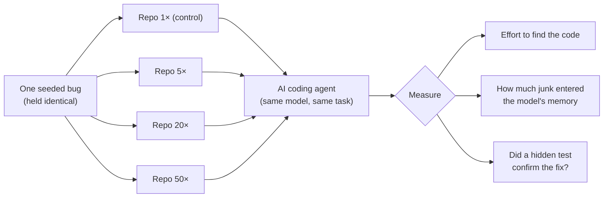

<!--
This file is a slide deck. It renders top-to-bottom on GitHub (each "---" is a
slide break) and can be exported to PDF or PowerPoint with Marp:
    npx @marp-team/marp-cli@latest presentation.md --pdf
    npx @marp-team/marp-cli@latest presentation.md --pptx
Speaker notes are in HTML comments under each slide.
-->

# Does irrelevant code break AI coding agents?

### A controlled benchmark for repository bloat

Keep the bug fixed. Grow the repo with junk. See if the agent still finds and
fixes it.

*Research proposal + literature review · Epic [#1429](https://github.com/promptdriven/pdd/issues/1429) · design [#1209](https://github.com/promptdriven/pdd/issues/1209)*

<!--
Speaker: One-line framing. Today: (1) the question, (2) why the field says it
should matter, (3) why nobody has measured it cleanly, (4) our experiment, (5)
what would count as proof.
-->

---

## The question, in one sentence

> Give an AI coding agent the **same bug**, the **same model**, and the **same
> test** that decides success — then quietly pad the repository with more and more
> **plausible-but-irrelevant files**.
>
> **Does it still fix the bug — and how much harder does it have to work to find
> the right code?**

We change **one thing only**: the volume of irrelevant code around the bug.

<!--
Speaker: Emphasize "one thing only." This is a controlled experiment, not a
leaderboard. Everything except the surrounding junk is byte-for-byte identical.
-->

---

## Why you should care

A model's **usable** memory is smaller than its **advertised** memory.

A "128K-token" model does **not** stay equally sharp across all 128K tokens.

If that is true for code, then **a big, messy repository quietly degrades every
coding agent** — even when nothing about the actual task got harder.

That is a claim worth testing directly, because the whole industry is betting on
ever-larger context windows.

<!--
Speaker: "context window" = the model's working memory; "tokens" = the units that
fill it. The bet is: bigger window = better. We're testing whether that holds up
when the extra space fills with noise.
-->

---

## The evidence says it *should* hurt

| Finding | Source |
|---|---|
| GPT-4o's retrieval accuracy falls **99.3% → 69.7%** as text grows | NoLiMa (2025) |
| A top agent falls **96% → 15%** as its working memory fills (8K→256K) | LOCA-bench (2026) |
| Code-translation success collapses **91% → 15%** from small to large repos | RepoMod-Bench (2026) |
| AI-written context files **lower** success and **raise** cost ~20% | AGENTS.md study (2026) |
| Convincing distractors cut accuracy by **up to ~80%** | Lost in the Noise (2026) |

Every direction points the same way: **more surrounding material → worse, costlier
work.**

<!--
Speaker: These are five different research communities, five different setups, all
pointing the same direction. But none of them is our exact experiment — next slide.
-->

---

## ...but nobody has measured it the right way

The evidence is split across **three communities that rarely cite each other**:

- 🪟 **Long-context** — *does accuracy survive a full working memory?*
- 🎯 **Distractor-robustness** — *does irrelevant text mislead reasoning?*
- 🛠️ **Coding agents** — *can an agent fix a real bug in a real repo?*

**No single study sits where all three meet** — controlled noise, *in real source
code*, measuring *the effort to find the fix*.

<!--
Speaker: This is the literature-review punchline. Each community has half the
puzzle. Our contribution is the intersection.
-->

---

## The gap, on two axes

|  | Noise is ordinary text | Noise is **source code in a repo** |
|---|---|---|
| **Amount controlled** | NoLiMa · LOCA-bench · Lost in the Noise | **⬅ THIS BENCHMARK** *(empty until now)* |
| **Amount only observed** | — | SWE-bench · FeatBench · RepoMod-Bench |

The code studies never *control* size; the controlled studies are never about
*code*. We fill the empty cell.

<!--
Speaker: The single most important slide. Code benchmarks compare different repos
(size tangled with difficulty). Controlled studies use prose. We control size, in
code, holding the bug fixed.
-->

---

## Our experiment in one picture

Sizes are measured in **tokens of added junk**: 5× / 20× / 50× the size of the
real code.

<!--
Speaker: Walk left to right. Same bug, four repo sizes, same agent. Three
measurements. The repo is the only thing that changes across the row.
-->

---

## The clever trick: *subset-and-regrow*

How do you make junk that an agent can't trivially ignore?

**Don't invent fake files — reuse the project's own.**

1. Take a **real open-source project**, pin it to a commit.
2. Slice it down to the **minimal core** needed to run the bug.
3. **Seed one controlled bug** into that core.
4. **Regrow** the repo using the project's *own other files* as distractors.

The distractors are **genuine, same-project code** — real names, real style, real
imports. Nothing labels them as junk; only honest reasoning reveals they're
irrelevant.

<!--
Speaker: This kills the "synthetic filler" objection by construction — the
distractors ARE the project's real code. Trade-off (contamination) covered later.
-->

---

## What we measure

**1. Effort to find the code** *(before the first edit)*
How many files it opens, how much it reads, how many searches it runs, how many
tokens it spends.

**2. How much junk reaches the model's memory**
Of all the irrelevant files, how much actually entered the working memory — versus
was glanced at on disk and dropped.

**3. Did it actually fix the bug?**
A **hidden test the agent never sees** is the sole judge. Passing the visible
tests but failing the hidden one counts as a **failure**.

<!--
Speaker: Measurement 1 is the novel headline — "cost to localize," which prior
benchmarks ignore. Measurement 3 is the integrity guard: no gaming.
-->

---

## How we watch the agent, honestly

We don't trust the agent's self-report. Three independent observers:

- 📂 **Filesystem tap** — logs **every file the agent opens or edits**, at the
  byte level, from outside the agent.
- 📝 **Transcript tap** — records every search/read/edit and the exact token cost.
- 🔀 **Diff tap** — compares before/after to see exactly what changed.

The "answer key" (which files are junk) lives **outside** the agent's sandbox and
is applied **only afterward**, when scoring. The agent can never see it.

<!--
Speaker: The point is rigor — ground truth comes from the operating system, not
from asking the model what it did. This is what makes "cost to localize"
trustworthy.
-->

---

## What would count as "yes, bloat hurts"

We **fix the verdict in advance** — common-sense cutoffs, not statistical
p-values on a small pilot:

| Signal | Threshold (1× → 50×) |
|---|---|
| 💸 Cost to find the code rises | **≥ 2×** more tokens or files read |
| 🎯 Wasted reading rises | **+0.20** share of reads that are irrelevant |
| 📉 Fix rate drops | **−20 points** in hidden-test success |

Pre-committing means we **can't move the goalposts** after seeing results.

<!--
Speaker: Pre-registration is the credibility move. We wrote these down before any
model ran. "Supports," "weakens," or "inconclusive" is decided against these, not
cherry-picked.
-->

---

## Three contributions

1. **First controlled repo-bloat experiment** — irrelevant code is the *only*
   variable; the bug is held identical across all sizes.

2. **"Cost to find the code" as a first-class result** — the read-before-you-edit
   effort that every prior coding benchmark ignores.

3. **A "how close is the distractor" analysis** — junk from the *same package* as
   the bug should mislead more than distant junk, with a verdict fixed in advance.

<!--
Speaker: If you remember one thing: we measure the *cost of searching*, under
*controlled* bloat, in *real* code — the cell no one has filled.
-->

---

## Being honest about limits

- **It's a pilot.** 3 bugs × 4 sizes × 5 repeats = **60 runs**. Built to *measure
  effect sizes and variance*, then size a bigger study — not to declare statistical
  significance.
- **Contamination is real.** The model may have seen the open-source project. We
  guard against it with an **answer-novelty check** and report any residual risk
  rather than pretend it away.
- **One agent first** (Codex CLI), in a frozen, network-isolated environment.
  Other agents are a planned extension.

<!--
Speaker: Stating limits up front is a strength — pre-registered, descriptive,
honest about contamination. Reviewers respect this.
-->

---

## Where this goes next

- **Validate the pilot signal**, then run a properly powered study.
- **Add more agents** (e.g. Claude Code) to test whether the *search strategy*
  predicts bloat sensitivity.
- **Natural collaborators** already working on neighboring pieces: the LOCA-bench
  team (controlled context growth), the *Lost in the Noise* team (distractors),
  and the RepoMod-Bench team (size-versus-success in code).

📄 Full detail: [`design.md`](../design.md) · [`literature-review.md`](literature-review.md) · [`integration-with-existing-studies.md`](integration-with-existing-studies.md) · [`possible-collaborators.md`](possible-collaborators.md)

<!--
Speaker: Close on the open door — this pilot is step one, and there's a community
already half-building the pieces we'd combine.
-->

---

## Takeaway

> The field keeps betting on bigger context windows.
> We're running the **clean test** of whether that bet survives a **messy
> repository** — holding the bug fixed, growing only the junk, and watching
> **exactly** how hard the agent works to find the fix.

**One bug. Four repo sizes. Three honest observers. A verdict fixed in advance.**

<!--
Speaker: End here. Invite questions. The 2×2-gap slide and the experiment diagram
are the two to revisit if asked.
-->
